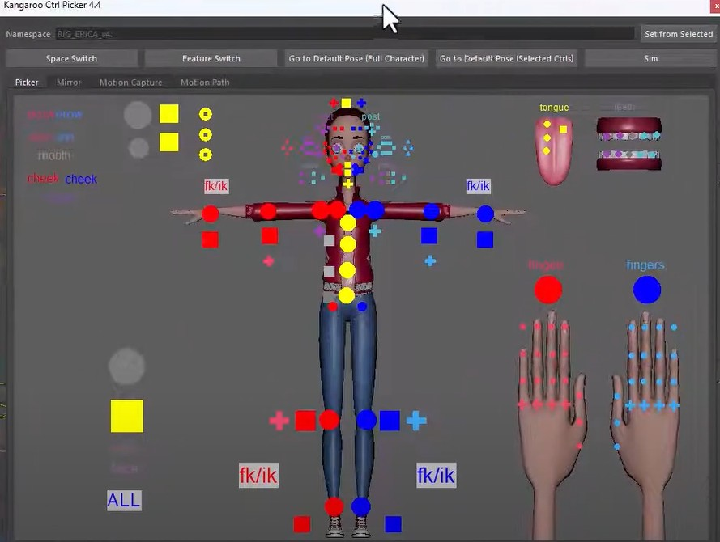
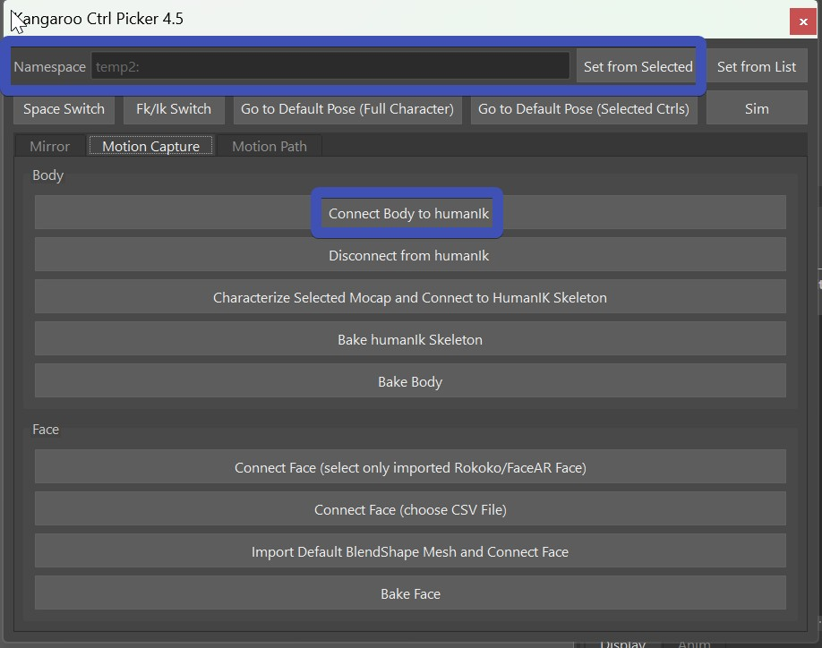
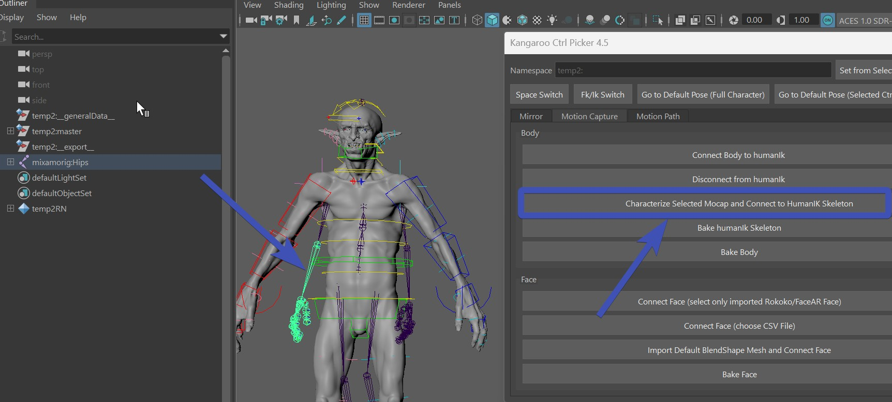
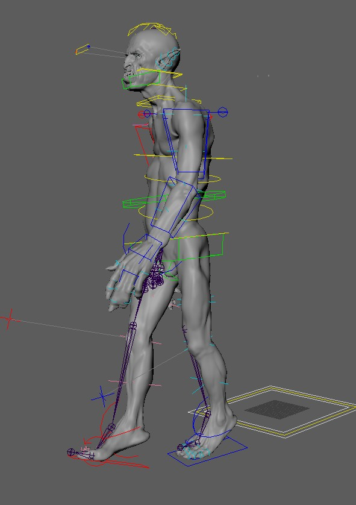
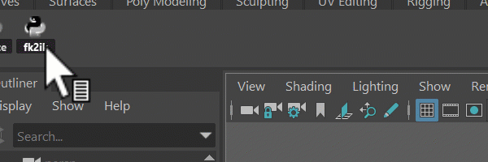
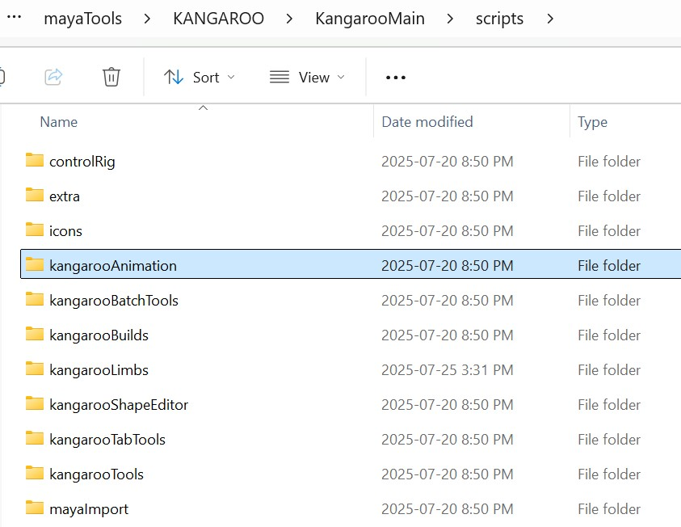
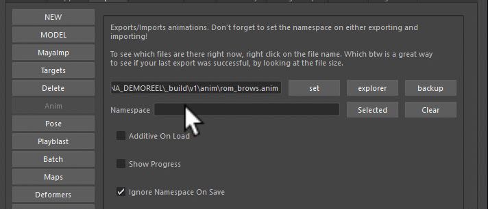
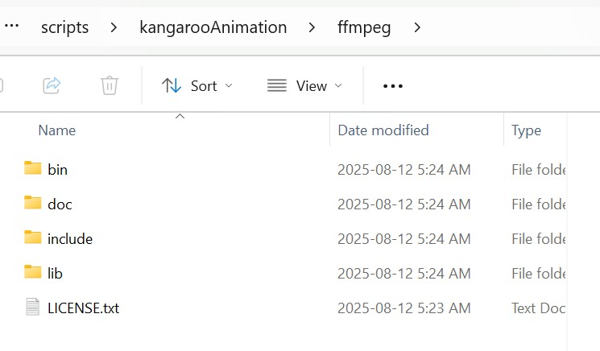

This is an animation tool that can do stuff like:

- select ctrls
- fk2ik switch
- space switch
- mirror ctrl poses/animations
- Biped Motion Capture
- Motion Path (experimental)

## Picker - For Animators..

  

!!! video
    The best way to see how it works is watching the first 1min 45seconds from this [video](https://www.youtube.com/watch?v=5W2JQYoyohQ)
    from the start.


### Fk2Ik Switch
!!! video
    Whatch it in the video from [here](https://www.youtube.com/watch?v=5W2JQYoyohQ&t=1m14s)
!!! note "Isolated Menu"
    If you just want this switch without the whole UI, that's possible and you can see [here](#isolated-menus) how it looks.


### Space Switch
The space switch button can help animators to switch between spaces. 
!!! video
    Whatch it in the video from [here](https://www.youtube.com/watch?v=5W2JQYoyohQ&t=1m18s)
!!! note "Isolated Menu"
    If you just want this switch without the whole UI, that's possible and you can see [here](#isolated-menus) how it looks.


### Mirror 
!!! video
    Watch how to mirror ctrl poses or animation [here](https://www.youtube.com/watch?v=5W2JQYoyohQ&t=1m32s)


### Motion Capture
On Bipeds you can connect the rig directly to a Motion Capture Rig for example from Mixamo, Rokoko, ..  

To be able to use that you need to have the *humanIk:Reference* hierarchy in your rig. If it's not there,
tell your rigger to set it up as shown in [here](body/motionCapture.md)
  

If you've got it in there, select any node of the character rig, and make sure it's in the top of the UI at Namespace.
And then click *Connect Body to Human Ik*.
   
Now load in your Motion Capture Cache into Maya, select any node of it and click
*Characterize Selected Mocap and connect to HumanIk Skeleton*:  
     

Now you get this message:  
  
You can click yes IF by setting all the rotations of the Skeleton Cache the rig is in its T-Pose.  
If you have a Skeleton Cache where setting all the joints rotations to 0 does not result in a T-Pose, you have to 
put the rig into T-Pose first (some skeleton cache animations have the T-Pose on frame 0), and in this case you would
say No to that message.
And now the rig should be nicely following the Skeleton Cache.
  


## Picker - For Riggers..
Riggers mainly need to create the *elements* and *jpg* files.
Watch the video from [here](https://www.youtube.com/watch?v=5W2JQYoyohQ&t=1m47s) to see how to do that.


### Custom Picker File Location
In the video we are just putting the picker files into the tool directory. While that's totally valid, sometimes you might
want to put them into a different location.  
Use the Environment Variable **KANGAROO_PICKER_PATH** to specify a different path.


### More picker tabs per character
This feature was added recently, that's why it's not shown in the video yet.  
By default (as shown in the video) you just have 1 pair of files, such as:  
```
mainCharacter.elements
mainCharacter.jpg
```
But you can add an extra one, for example like this:
```
mainCharacter.elements
mainCharacter.jpg
mainCharacter_face.elements
mainCharacter_face.jpg
```
And then you'll have 2 picker tabs for that character.


### Isolated Menus
Sometimes animators don't want the whole UI, but they just want some menus. Below are some python codes that you can 
for example add to a shelf button. I'll then open small switch menus from those buttons.

**Switching Spaces:**   
To get this menu, run the python lines below:  

```python 
import kangarooAnimation.KangarooMatchTools as KangarooMatchTools; 
KangarooMatchTools.spaceSwitchMenu()
``` 

**Switching between Fk and Ik:**  
  
Run those lines to get that menu:  
```python 
import kangarooAnimation.KangarooMatchTools as KangarooMatchTools; 
KangarooMatchTools.humanLimbsSwitchMenu()
```

### Tool Installation
The tool is installed by default if you've installed Kangaroo-Builder as shown in the [Getting Started](gettingStarted.md) page
(The first part is enough - no need to setup things like assetsLocal or servers).
Animators can just open it from the same install that you have.  

But in case they don't have access to it, all you need to give them is the **kangarooAnimation** folder.  

This folder is isolated and is not linking to any other libraries.

If animators have that folder sourced, they can open the UI with those Python lines:
```python
import kangarooAnimation.KangarooAnimTool as KangarooAnimTool; 
KangarooAnimTool.showUI(False)
```
Or they can run the lines shown in [Isolated Menus](#isolated-menus) 

If you are struggling with getting it sourced, and it keeps telling you something like *kangarooAnimation* is not found,
you can also do the brute force *sys.path.append* trick. Just take the following code and replace the path in the first line
to the parent path of *kangarooAnimation* folder. 
``` python
sParentPath = r'C:\mayaTools\KANGAROO\sandbox'
import sys
if sParentPath not in sys.path:
    print ('appending to sys: %s' % sParentPath)
    sys.path.append(sParentPath)
```


## Save/Load Animation
Kangaroo has a tool for import/export animation keys. We mainly use it for test animations and ROMs.  
While for animators there are better suited solutions such as *Studio Library*, the Kangaroo Animation Export
is more convenient for riggers since it saves and manages animation inside the character level.  
   
For navigating through the files just do a right click on the file field:  
  


## MP4 Playblast
When you create a playblast in Maya, it doesn't give you any good codex options. This means the file you get is usually either
huge or has horrible quality. So Kangaroo is here to help.

When you click the shelf button  (aMP4), or click the **Playplast** button in **Export -> Playblast**, 
it creates a playblast and then uses ffmpeg to do the standard mp4 code that most computers can play by default.

But for this to work you have to download [**ffmpeg**](https://github.com/BtbN/FFmpeg-Builds/releases/download/latest/ffmpeg-master-latest-win64-gpl-shared.zip).
Once you downloaded it, extract the content and put it into a folder called *ffmpeg* inside your tool directory's *kangarooAnimation* folder.  
It should look like this:  
  

