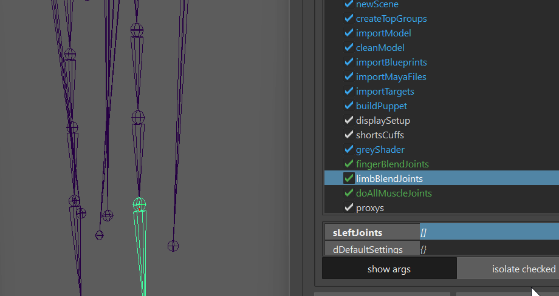
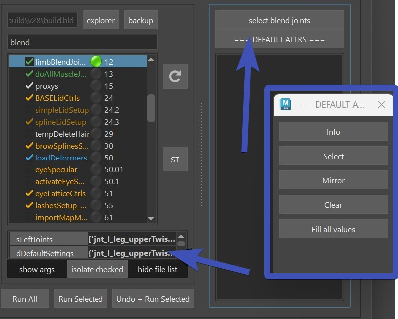
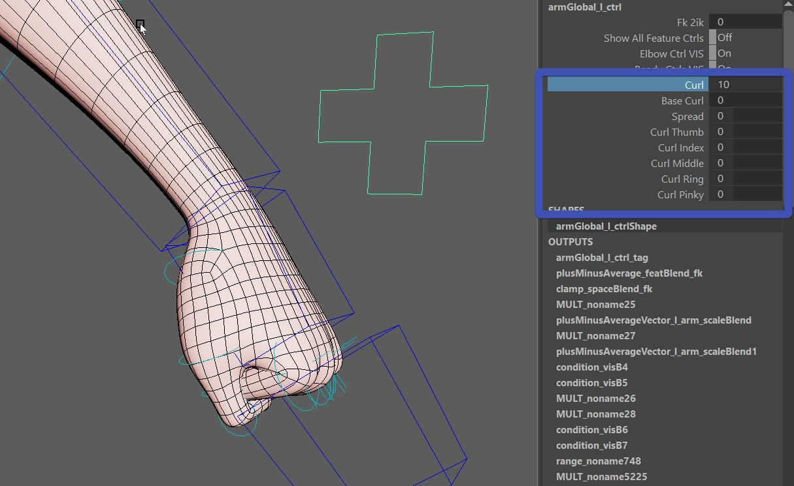
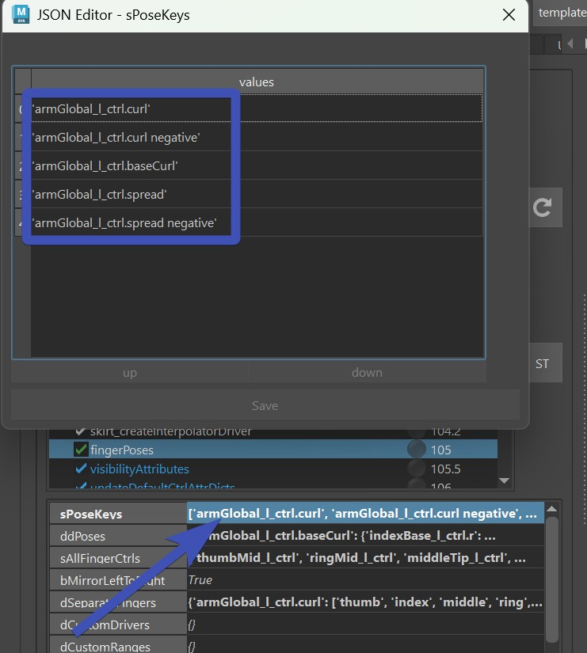
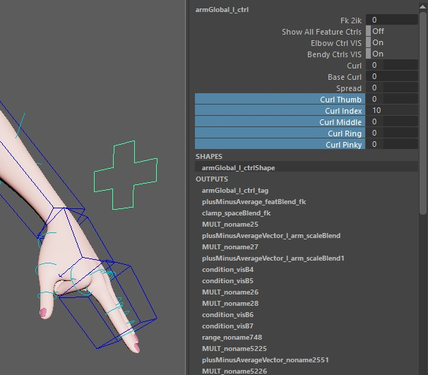
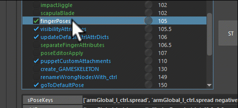

## Muscle Joints
Muscle joints are simple lightweight joints that can be great for preserving volume,
or some piston type parts
<iframe width="560" height="315"
src="https://www.youtube.com/embed/7A5NZNeP8vg"
title="YouTube video player" frameborder="0"
allow="accelerometer; autoplay; clipboard-write; encrypted-media; gyroscope; picture-in-picture"
allowfullscreen></iframe>


## Blend Joints
Those are simple joints that rotate a percentage of the main joints. And they have a lot of
attributes to make them translate or scale based on their parents' rotation

To add one, just specify the joint in the list.


Then after running that function you'll get that joint. And you can adjust its values:


Mirroring and Saving those values can be done with the DEFAULTATTRS options.  

!!! note 
    the DEFAULTATTRS thing is a common workflow throughout all the kangaroo tools. Especially when
    we come to the face


## Finger Poses
The *fingerPoses()* function creates those attributes that poses fingers:   


This function is very flexible. With the **sPoseKeys** you can specify which pose attributes you'd like.
  
Some of them have the word *negative* in it, such as *armGlobal_l_ctrl.curl negative*. In this example it's just
the *armGlobal_l_ctrl.curl* attribute going negative.

After adjusting the *sPoseKeys* attribute and clicking the  (reload) button,
you'll get those buttons on the side:   
  
Now for each pose:  
1. rotate/translate the animation ctrls to put the hands into the pose   
2. click the fill button

Inbetween poses you can click the **reset** button at the top to go back to default. And if you want to see where the fill buttons
saved the poses, it's the **ddPoses** attribute, which you can inspect in the [JSON Editor](../builder/jsonEditor.md).

Animators usually want the *curl* additionally for each finger separate:  
  
This happens with the **dSeparateFingers** attribute.

*What about the toes??*  
For the toes you can just duplicate the function, we'll do that a lot on quadrupeds. Actually the BASEDOG in the templates
has that setup-ed:  
    


## Default Pose
Whenever you click the shelf button  (default), the selected rig jumps into
default pose. 

*But how does the button know what's the default?*  
The ctrls have an attribute called *dDefaultAttrs*. This is created in the function *updateDefaultCtrlAttrDicts()*. 
It is very important to be aware of this, because when you add python code to set some default attributes, it will only 
register those as default values if you put that function before the *updateDefaultCtrlAttrDicts()* function, which 
has priority 106.

!!! note "Works with Namespaces" 
    The default button also works with namespaces! This is very useful when you have a rig referenced.

!!! note "Python"
    You can also call the function to put the rig into default pose:
    ``` python
    import kangarooAnimation.KangarooMatchTools as KangarooMatchTools;
    KangarooMatchTools.goToDefaultPoseSelected(bSkipFk2IkAttrs=False)    
    ```

## ZV Groups
The function *addZVGroups()* is for the tool [ZV Parent Master](https://apps.autodesk.com/MAYA/en/Detail/Index?id=3374365102069298437&appLang=en&os=Win64).
You can adjust the *sCtrls* parameter for which ctrls you would like to have groups for. 
By default it does these:
``` bash
armIk_r_ctrl
armIk_l_ctrl
legIk_l_ctrl
legIk_r_ctrl
armWrist_l_ctrl
armWrist_r_ctrl
legAnkle_l_ctrl
legAnkle_r_ctrl
```
