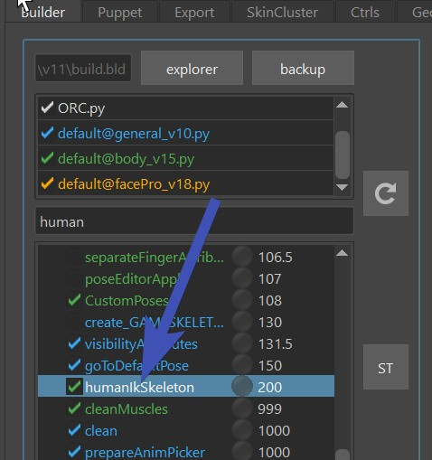
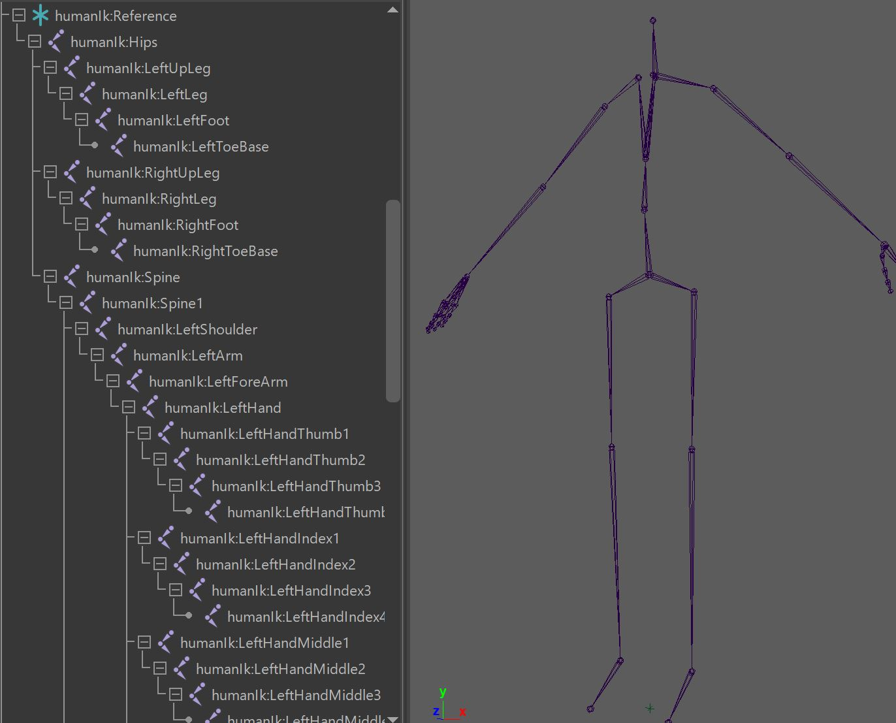
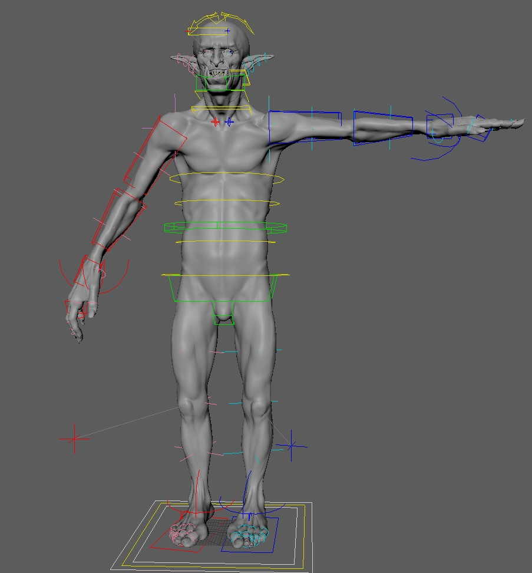
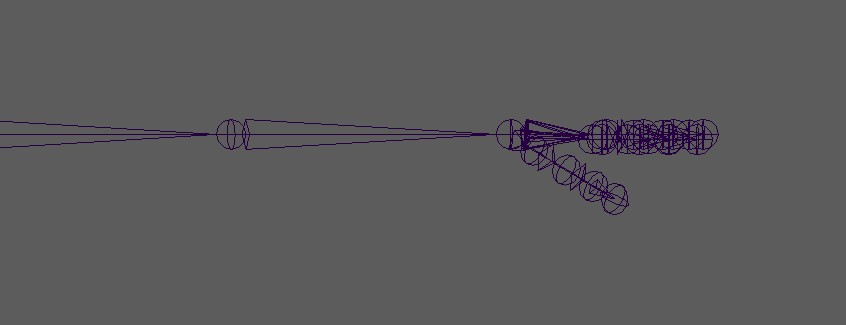
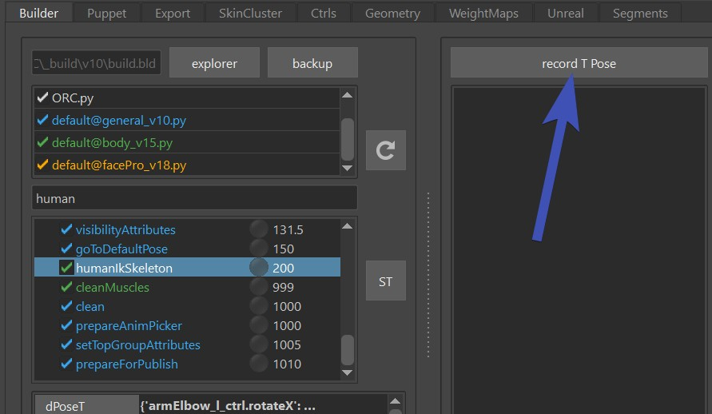
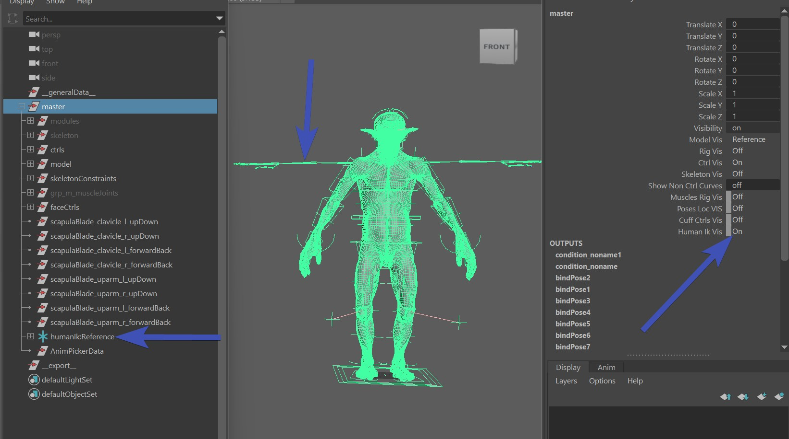

# Motion Capture
Maya has a great tool for Motion Capture retargeting, which is called *humanIK*. Kangaroo is simplifying this for you.

If just turn on the function *humanIkSkeleton()*  
    
it'll create this skeleton:  
  

This function also needs the T Pose. So just pose your character into TPose - just left side is enough:  

!!! question "Unclear about the thumbs?"
    To see what rotations the thumbs need to have, just open your motion capture and set it to T Pose (either by going to 
    first frame if it's got a t pose, or by zero-ing all rotation values).   
    On a Skeleton Cache from Mixamo it looks like this:  
    
    But in some other examples you might find them oriented more straight to the palms.

And click the button *Record T Pose*:  
   

Then build again. To verify that it works, turn on the HumanIkVis, and check that it's in TPose:  
   

From here you can use the [Motion Capture Tool](../animationTools.md#motion-capture) to connect it to a Skeleton Cache.
