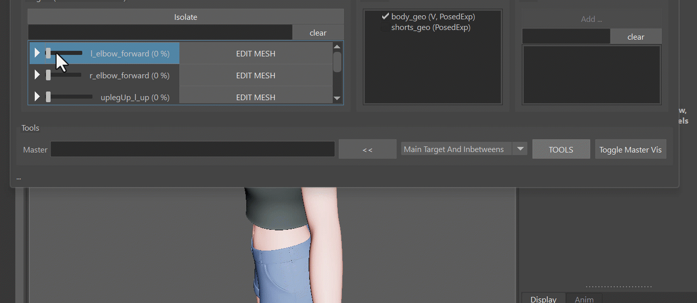

## Model Change
Whenever the model changed, open the *poseEditorExports.ma* file from the *Export -> MayaImp* tool,
and import the new model. Then select the new model + the corresponding Blendshape Mesh you have in scene:    
  

And then you have 2 buttons: **Warp** or **BlendShape**  
You can do *blendShape* when the topology is the same and you used the default *invertExport* option. For all other
cases do *Warp*  
  
!!! note
    The selection order doesn't matter here. But it's important that the model you select has the same name! 


## Sharing Interpolators between Rigs
It can be very helpful to share Interpolators between characters.
And there are 2 ways:  
### In the PoseEditor UI
Right click on the interpolator -> *Copy*. Then go to your other character, and right click -> *Paste*  
  

!!! warning "Known bug"
    Currently the *Paste* option doesn't show up unless you click on an existing interpolator. So if you want to paste
    an interpolator to a new character that doesn't have any interpolators yet, just create a dummy one that you delete
    again after.

### With the JSON Editor
Once you exported the setup with the *Fill and Export from Scene* button, you can open the *JSON Editor* by right click 
on **ddInterpolators** attribute:  
  

Then having the interpolators you want to transfer selected, right click -> **Copy**. 
And then right click -> **paste** on the same location in the other character.

Check [JSON Editor](../builder/jsonEditor.md) for more information.

!!! note
    While you could also share Target Infos using the JSON Editor, we don't do that as often as sharing interpolators.


## Useful tools
It's a lot of tools under the **TOOLS** button.
!!! bug "Known Bug"
    There's one little gotcha - these buttons will only work if there's already a blendShape target on the actual blendShape
    node.  
    But it's an easy fix, just click the *EDIT* button and click it again to deactivate it. This will create an empty
    target on the blendShape node, and the tools under the *TOOLS* button will be happy.

### Multiply
The multiply tool just multiplies by a certain value. In this gif we just multiplied things by 0.0 to fix some artefacts:  
  
But it doesn't stop there! You can also use the multiply tool to improve your shapes by using vertex soft selection and maybe even 
multiply by something higher than 0, such as 0.3. 
!!! note
    You see a similar tool under the right click menu of the targets called *Erase*. That's pretty much the same as 
    multiply by 0.0.

### Warp
The warp tool can warp secondary meshes. Most of the time we sculpt things on the main mesh such as the skin. And then
we just warp to secondary meshes such as costume. To do that, put the skin mesh (*body_geo*) into the **Master** field,
select all the targets, select the mesh in the scene, and then **TOOLS -> Warp ..**.
  
!!! note
    Don't forget to have the mesh that you want to warp selected in scene. You can also do vertex and soft selection
    for that, and it'll only warp the vertices you have selected.


### Blend IDs
If you have another mesh that has the pose sculpted already, the *Blend IDs* tool can help you with that, also under 
the **TOOLS** button.

Keep in mind that like all other tools this will just blend the pose of the specified target in an isolated way. So
if you have any other shapes that are activated at the same time, using the *blend IDs* the vertices might not be exactly 
snapped to the master mesh.  
If you want it to be fully snapped, it's better to instead do it through the *EDIT* button and use the 
[Match Tool](../tools/toolsGeometry.md#match-vertex-positions).


## Use Pose Editor on Custom Rigs
From Kangaroo version 5.16 you can also use the Pose Editor on rigs that are *not* built with Kangaroo Builder.
You just have to start the Pose Editor a bit different.  
First run those lines in python:
``` python
from kangarooTools import poseEditorStandalone
poseEditorStandalone.showUI() 
```

