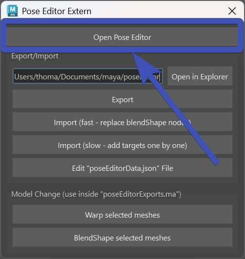
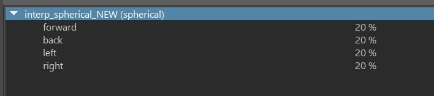
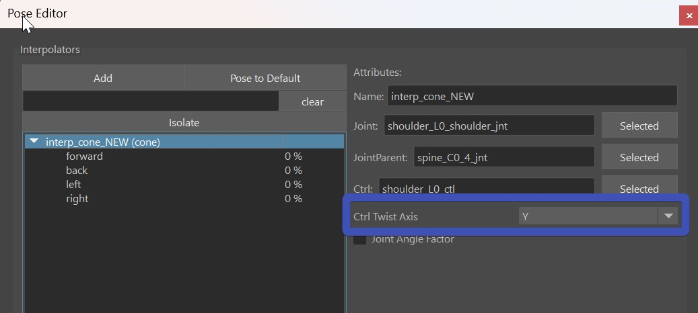

From Kangaroo Builder Version **5.16** you can also use the Pose Editor on rigs that are *not* built with Kangaroo Builder.
You just have to start the Pose Editor a bit different.  
First run those lines in python:
``` python
from kangarooTools import poseEditorIsolated
poseEditorIsolated.showUI() 
```
And in there open the Pose Editor with this button:  
  


## Create the Interpolators
Creating interpolators requires a bit more attention, because in many cases the axes of the ctrls are different than the default.  
To learn about interpolators in general, check [interpolators](poseEditor1.md#creatinginterpolators) first.

For all poses, the PoseEditor assumes that the twist axis is **Y**. But in many rigs it's **X**. So first on *all* 
newly created interpolators you may have to spend more time to adjust the pose rotation values:   
  

### Spherical
Likely you'll have all the values at 25 % at first (which is bad):  
  
But once you adjust the pose rotation value for each pose, it should work right away (if you have set the correct joints and ctrls).


### Cone
For the cone - apart from adjusting the Pose Rotations, make sure to check the **Ctrl Twist Axis**:  
  


### SignedAngle
Special Attention is needed on the **CtrlAttr**, **Angle Axis (Joint)** and **Up Axis (Joint)**:  
  


### Upleg
Don't use the Upleg one, it's too specific to kangaroo rigs


## Export/Import
With the **Export** and **Import** buttons you can export/import the setup.
!!! warning
    Do **NOT** import it twice! Importing it is only meant to do on a clean rig that you've rebuilt. If you are not rebuilding 
    rigs, import/export wouldn't help you much at this point.


## Reusing Interpolators from another character {#reuseinterpolators}
Reusing Interpolator from another character easily works with the [Export/Import](#exportimport) options.  
But you can also copy/paste a few interpolators, using the [JSONEditor](../builder/jsonEditor.md). For more info, check further below at [Making adjustments on exported data](#making-adjustments-on-exported-data)


## Model Update
If you have a model update, and you can rebuild your rig - open the **poseEditorExports.ma** file, and use the model change
buttons - all at the bottom of the starter UI:  
  
Basically you just select the new model (drag it into your scene first), and the corresponding *_poseEditorBlendShapes* mesh,
and click those buttons. 
For more information check [Model Change](poseEditor2.md#model-change)


### Making adjustments on exported data
One big advantage of exporting and importing again ist that you can adjust the data outside your rig scene.  
When you click **Edit "poseEditorData.json" File**, it opens the [JSONEditor](../builder/jsonEditor.md) on the data file.
In there you can delete, duplicate, copy/paste things from another character, ... 

