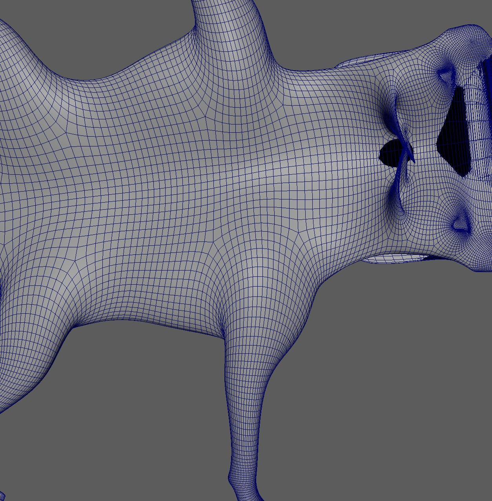

# Sliding Deformer

From version 5.21 in Windows you have a sliding deformer. It works by just defining a direction, and the vertices are sliding 
towards that direction along the mesh. It's basically just finding a path on the mesh. 
    

With a bit of setup, you can create something like this:

<video autoplay muted loop controls width="1000">
    <source src="../../images/sliding_deformer_wolf.mp4" type="video/mp4">
    Your browser does not support the video tag.
</video>

## How to use it
Here's a minimalistic python code to get it to work. When you run that, you should have a locator that when you move it around, 
it makes a sphere slide on its own. Before running the script, make sure you have the plugin **kt_tbslide.mll** active.
```python

skin_mesh = cmds.polySphere(n="skin_mesh")[0]
ref_skin_mesh = cmds.polySphere(n="ref_skin_mesh")[0]
cmds.setAttr('%s.v' % ref_skin_mesh, False)

sLoc = cmds.spaceLocator()[0]

sDeformer = cmds.deformer('skin_mesh', type='tbslide', name='test')[0]
cmds.connectAttr('%s.worldMesh[0]' % ref_skin_mesh, '%s.refMesh' % sDeformer)
cmds.connectAttr('%s.t' % sLoc, '%s.target' % sDeformer)
cmds.setAttr('%s.multipl' % sDeformer, 1.0)

```

## Reference Mesh
The reference mesh is where it will compute the path finding, so it has to be in the same topology as the main mesh.
It should also stay at default, and most likely you'll have to adjust the shape.  
For the wolf scapula video you see at the top, in the image below you can see the reference mesh. The reason for this strangely 
looking upside down mesh is that you define the direction of the sliding just by a linear direction. And since the scapula skin has to slide up and
down again, we'll have to define those different directions with the reference mesh.  
      
