---
title: Builder General
---

# Builder General

The **Builder** is the first most important tool that you need to get familiar with for creating characters.

The builder is basically a central tool that manages a ton of Python functions from different files, and lets
you run them. Either just selected functions or all at once for the final creation using the **Run All** button.

Go to that character you created from the previous section and click **Run All**  
Now sit back and enjoy watching him build the character for you:  

Take a moment to get familiar with the UI:
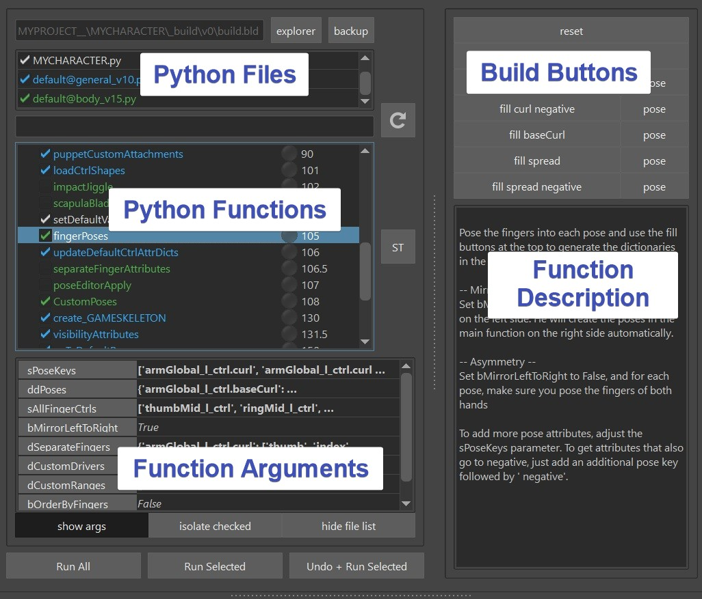

At the top you have Python Files. You can add files, remove files or you can even uncheck them and then all their functions will disappear.
Below are the actual functions. Even further below you can set function arguments for the function that you have selected.
And on the right side you can see buttons and a description for 
whatever function you have selected.
!!! note
    If you don't see the right section, you might have to drag the splitter a bit:  
    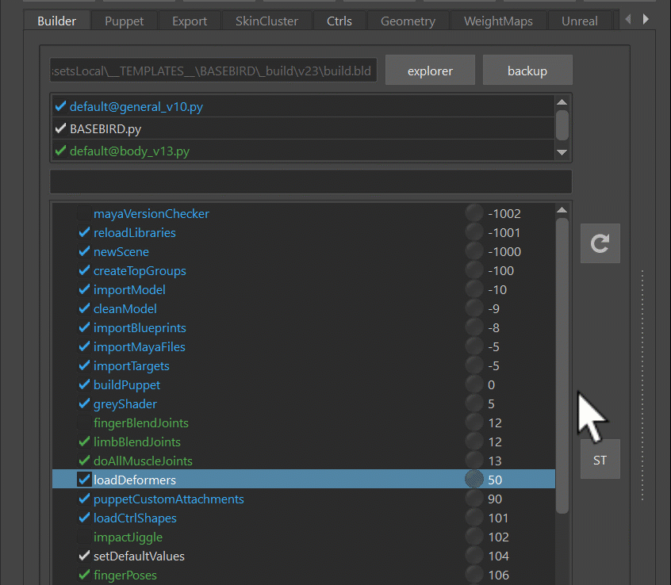

You can also create your own python functions and specify arguments and build buttons. But more to that
in [Python - Simple way of adding a function](../python/python1.md#simple-way-of-adding-a-function) section.
For now let's check out some of the more important functions that we automatically.  

## The Functions

###*importModel()*

The *importModel()* function imports the model.  
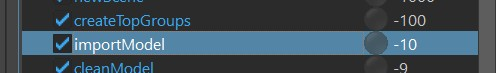  
If you copied from BASEHUMAN, it's just that boring grey guy. 
If you already have a model, go to export -> MODEL, and with the Explorer New Model button
you get a folder that let's you copy a character in it
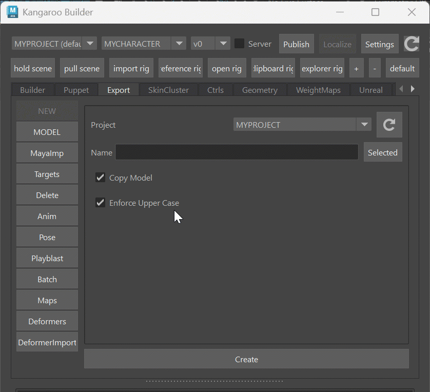  

!!! note
    If you work in a company that has their own studio pipeline for handling assets, you might want to grab
    the model automatically from the studio pipeline. To see how to do that, go to
    [Python - Connecting to a Studio Pipeline](../python/python2.md#connecting-to-studio-pipeline).  
    Basically you'd create a script that looks for the corresponding character model file in your studio pipeline.

### *importBlueprints()*, *buildPuppet()*
*importBlueprints()* and *buildPuppet()* are the functions for grabbing the work you do in the [**Puppet Tool**](../puppet/puppetGeneral.md).  
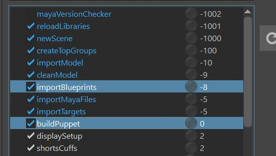  
It's for creating the main controls and rigging logic like Iks, Fks, Auto Clavicle, ...  
Check [**Puppet**](../puppet/puppetGeneral.md) for more detail. 

### *loadCtrlShapes()*
This loads the ctrl shapes. To export the ctrls shapes that he should load - go to **Ctrls** -> **Export** -> **Export All Ctrls**:   
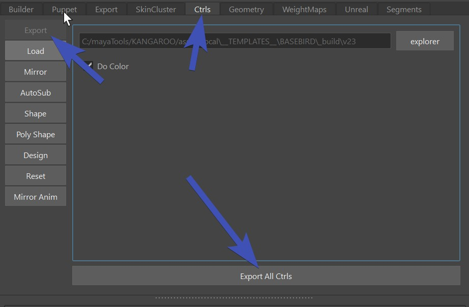  
This just exports the shape of *all* ctrls in scene.  

!!! note "Colors"
    The function has an attribute *bDoColor*. It's best to leave that at *False*, so you can entirely let the puppet
    tool handle the colors. But if you ever need to get specific about colors and need to change the colors of the ctrl directly,
    you can set that attribute to *True*.
    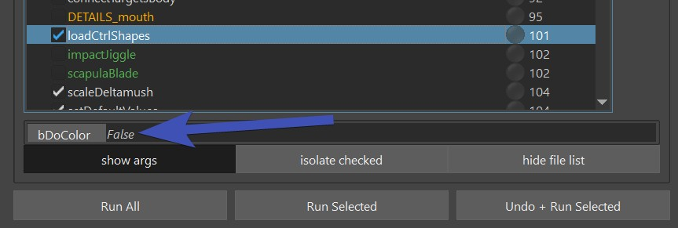  
    

### *loadDeformers()*
This loads all the deformers (mainly skinCluster weights) from the *deformers* folder.   
You can export the deformers in **Export** -> **Deformers**  
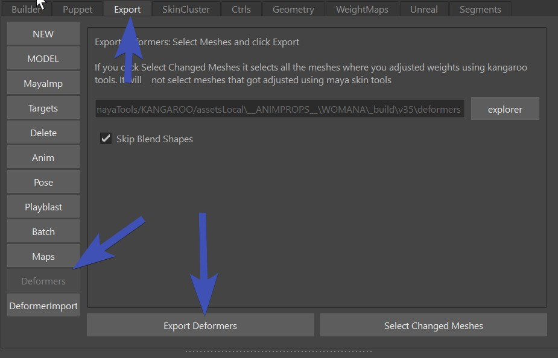

!!! tip "Kangaroo Tool Tip"
    To use this function most efficiently it's best to get familiar with everything on [Deformer Import Tool](../tools/toolsDeformerImport.md)

!!! note "Limitation"
    This only saves/loads **weights**, **attribute values** and **deformer orders**.  
    It does NOT load deformer structures such as blendShape targets, or full wrap deformer setups.
    Because there are more optimized tools (see 
    [Pose Editor](../body/poseEditor1.md), [Shape Editor](../face/shapeEditor1.md),
    [Python - adding function](../python/python1.md#simple-way-of-adding-a-function) and
    [Python Library - Create Deformers](../python/pythonLibrary.md#create-deformers))
    But easy deformers like *deltaMush* that mainly just need weights and attribute values can be handled
    just in the *loadDeformers()* function.

!!! note "Joints at the Origin"
    When you are loading the skinCluster weights, many times you'll see that some of the joints are just simple joints 
    on the origin.  
    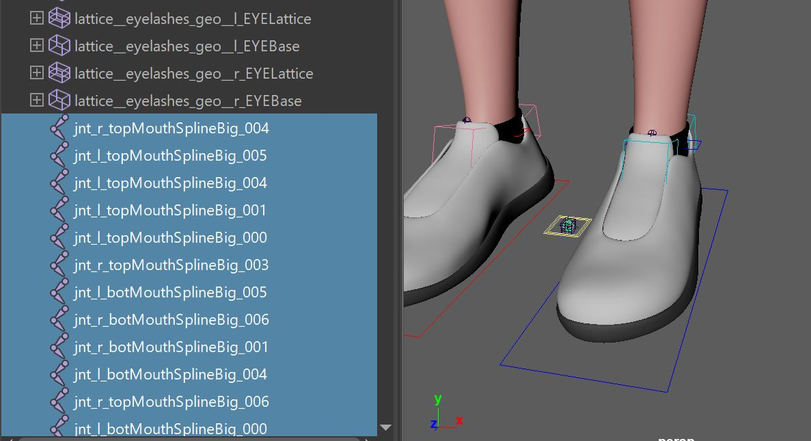  

    This is not always bad, it could mean one of two things:

    1. when you exported, there was a joint weighted which due to new changes you did, the joint doesn't exist anymore.
    In that case the skincluster *Move* tool can help you to move the weights to where they should be
    2. Many setup functions especially in the face are happening **after** the *loadDeformers()* function. In those cases
    the *loadDeformers()* function will just create the simple joints since they don't exist yet. And then 
    the function later is smart enough to recognize them and put them into the proper place

### *importMayaFiles()*
This just imports simple maya files:  
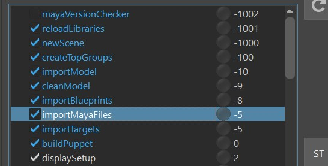    

To add files that he should import - go to  **Export** -> **MayaImp**,

If you want to quickly check what files are there, you can do that with *right click*:  
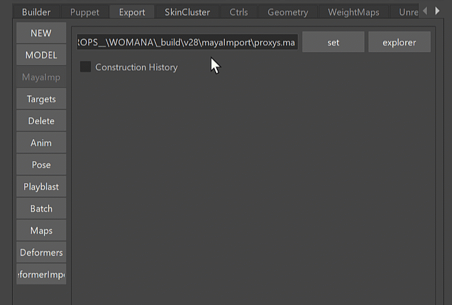   

### *importTargets()*
Very similar to importMayaFiles(). But Targets are just simple Polygon Meshes. Those are saved with a Numpy file format
that keeps the files smaller. Obvously the file might be even smaller if you save it as a dummy blendShape and add a builder function that extracts it (and some kangaroo tools do exactly that),
but there are many situations where you have some simple meshes and you don't want to go through that hassle.
If you go to **Export** -> **Targets**, you can export the selected meshes.  
By default it creates a file for each mesh and the mesh name is defined in the file name. 
This makes it very easy to manage later

### There's more...
Now you've just seen the important basic functions. But there's a looooot more, like all the green ones.
And later for the Face we'll add lots of orange functions.

### Custom Functions
You can create your own functions in Python and declare your own arguments and builder buttons. 
See [Python - simple way of adding functions](../python/python1.md#simple-way-of-adding-a-function) and 
[Python - Create Extra Builds](../python/python2.md#extra-builds).

## build.bld file
Everything you do in the builder like adding files, check/uncheck functions, setting function variables, or even
just selecting stuff - gets saved in the *build.bld* file.  

The *build.bld* file is a JSON file, so with a text editor you could theoretically adjust it. But we do that
mainly just for debugging purposes.

Whenever you do a wrong click such badly setting some variables that you'd like to undo - *Don't Panic!*
Just click on the **Backup** button at the top right and choose an older one to switch to. You might even need to use
that button if your build file gets corrupted from a crash.
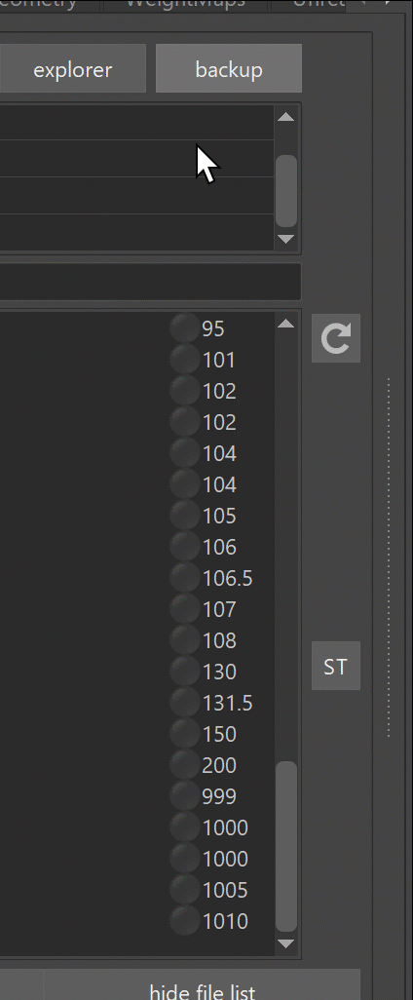

