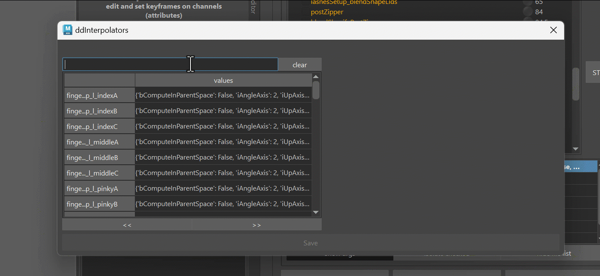

The JSON Editor is a tool inside the builder that lets you edit complex attributes. By complex attributes
we are talking about dictionaries or lists that can have other lists/dictionaries embedded - all defined as a single string value.  

Imagine you have a very long string that defines this python dictionary:

```
{'fingerInterp_l_indexA': {'bComputeInParentSpace': False, 'iAngleAxis': 2, 'iUpAxis': 0, 'sCtrlAttr': 'indexBase_l_ctrl.rx', 'sInterpType': 'signedAngle', 'sParent': 'jnt_l_indexMeta', 'sTwist': 'jnt_l_indexBase', 'xPoses': [['down', [20.0, 90.0], 1], ['up', [0.0, -80.0], 1]]}, 'fingerInterp_l_indexB': {'bComputeInParentSpace': False, 'iAngleAxis': 2, 'iUpAxis': 0, 'sCtrlAttr': 'indexMid_l_ctrl.rx', 'sInterpType': 'signedAngle', 'sParent': 'jnt_l_indexBase', 'sTwist': 'jnt_l_indexMid', 'xPoses': [['down', [20.0, 90.0], 1], ['up', [0.0, -45.0], 1]]}, 'fingerInterp_l_indexC': {'bComputeInParentSpace': False, 'iAngleAxis': 2, 'iUpAxis': 0, 'sCtrlAttr': 'indexTip_l_ctrl.rx', 'sInterpType': 'signedAngle', 'sParent': 'jnt_l_indexMid', 'sTwist': 'jnt_l_indexTip', 'xPoses': [['down', [20.0, 90.0], 1], ['up', [0.0, -45.0], 1]]}, 'fingerInterp_l_middleA': {'bComputeInParentSpace': False, 'iAngleAxis': 2, 'iUpAxis': 0, 'sCtrlAttr': 'middleBase_l_ctrl.rx', 'sInterpType': 'signedAngle', 'sParent': 'jnt_l_middleMeta', 'sTwist': 'jnt_l_middleBase', 'xPoses': [['down', [20.0, 90.0], 1], ['up', [0.0, -80.0], 1]]}, 'fingerInterp_l_middleB': {'bComputeInParentSpace': False, 'iAngleAxis': 2, 'iUpAxis': 0, 'sCtrlAttr': 'middleMid_l_ctrl.rx', 'sInterpType': 'signedAngle', 'sParent': 'jnt_l_middleBase', 'sTwist': 'jnt_l_middleMid', 'xPoses': [['down', [20.0, 90.0], 1], ['up', [0.0, -45.0], 1]]}, 'fingerInterp_l_middleC': {'bComputeInParentSpace': False, 'iAngleAxis': 2, 'iUpAxis': 0, 'sCtrlAttr': 'middleTip_l_ctrl.rx', 'sInterpType': 'signedAngle', 'sParent': 'jnt_l_middleMid', 'sTwist': 'jnt_l_middleTip', 'xPoses': [['down', [20.0, 90.0], 1], ['up', [0.0, -45.0], 1]]}, 'fingerInterp_l_pinkyA': {'bComputeInParentSpace': False, 'iAngleAxis': 2, 'iUpAxis': 0, 'sCtrlAttr': 'pinkyBase_l_ctrl.rx', 'sInterpType': 'signedAngle', 'sParent': 'jnt_l_pinkyMeta', 'sTwist': 'jnt_l_pinkyBase', 'xPoses': [['down', [20.0, 90.0], 1], ['up', [0.0, -80.0], 1]]}, 'fingerInterp_l_pinkyB': {'bComputeInParentSpace': False, 'iAngleAxis': 2, 'iUpAxis': 0, 'sCtrlAttr': 'pinkyMid_l_ctrl.rx', 'sInterpType': 'signedAngle', 'sParent': 'jnt_l_pinkyBase', 'sTwist': 'jnt_l_pinkyMid', 'xPoses': [['down', [20.0, 90.0], 1], ['up', [0.0, -45.0], 1]]}, 'fingerInterp_l_pinkyC': {'bComputeInParentSpace': False, 'iAngleAxis': 2, 'iUpAxis': 0, 'sCtrlAttr': 'pinkyTip_l_ctrl.rx', 'sInterpType': 'signedAngle', 'sParent': 'jnt_l_pinkyMid', 'sTwist': 'jnt_l_pinkyTip', 'xPoses': [['down', [20.0, 90.0], 1], ['up', [0.0, -45.0], 1]]}, 'fingerInterp_l_thumbA': {'bComputeInParentSpace': False, 'iAngleAxis': 2, 'iUpAxis': 0, 'sCtrlAttr': 'thumbMeta_l_ctrl.rx', 'sInterpType': 'signedAngle', 'sParent': 'jnt_l_armWrist', 'sTwist': 'jnt_l_thumbMeta', 'xPoses': [['down', [0.0, 50.0], 1], ['up', [0.0, -50.0], 1]]}, 'fingerInterp_l_thumbB': {'bComputeInParentSpace': False, 'iAngleAxis': 2, 'iUpAxis': 0, 'sCtrlAttr': 'thumbBase_l_ctrl.rx', 'sInterpType': 'signedAngle', 'sParent': 'jnt_l_thumbMeta', 'sTwist': 'jnt_l_thumbBase', 'xPoses': [['down', [20.0, 90.0], 1], ['up', [0.0, -60.0], 1]]}, 'fingerInterp_l_thumbC': {'bComputeInParentSpace': False, 'iAngleAxis': 2, 'iUpAxis': 0, 'sCtrlAttr': 'thumbMid_l_ctrl.rx', 'sInterpType': 'signedAngle', 'sParent': 'jnt_l_thumbBase', 'sTwist': 'jnt_l_thumbMid', 'xPoses': [['down', [20.0, 60.0], 1], ['up', [0.0, -60.0], 1]]}, 'fingerInterp_r_indexA': {'bComputeInParentSpace': False, 'iAngleAxis': 2, 'iUpAxis': 0, 'sCtrlAttr': 'indexBase_r_ctrl.rx', 'sInterpType': 'signedAngle', 'sParent': 'jnt_r_indexMeta', 'sTwist': 'jnt_r_indexBase', 'xPoses': [['down', [20.0, 90.0], 1], ['up', [0.0, -80.0], 1]]}, 'fingerInterp_r_indexB': {'bComputeInParentSpace': False, 'iAngleAxis': 2, 'iUpAxis': 0, 'sCtrlAttr': 'indexMid_r_ctrl.rx', 'sInterpType': 'signedAngle', 'sParent': 'jnt_r_indexBase', 'sTwist': 'jnt_r_indexMid', 'xPoses': [['down', [20.0, 90.0], 1], ['up', [0.0, -45.0], 1]]}, 'fingerInterp_r_indexC': {'bComputeInParentSpace': False, 'iAngleAxis': 2, 'iUpAxis': 0, 'sCtrlAttr': 'indexTip_r_ctrl.rx', 'sInterpType': 'signedAngle', 'sParent': 'jnt_r_indexMid', 'sTwist': 'jnt_r_indexTip', 'xPoses': [['down', [20.0, 90.0], 1], ['up', [0.0, -45.0], 1]]}, 'fingerInterp_r_middleA': {'bComputeInParentSpace': False, 'iAngleAxis': 2, 'iUpAxis': 0, 'sCtrlAttr': 'middleBase_r_ctrl.rx', 'sInterpType': 'signedAngle', 'sParent': 'jnt_r_middleMeta', 'sTwist': 'jnt_r_middleBase', 'xPoses': [['down', [20.0, 90.0], 1], ['up', [0.0, -80.0], 1]]}, 'fingerInterp_r_middleB': {'bComputeInParentSpace': False, 'iAngleAxis': 2, 'iUpAxis': 0, 'sCtrlAttr': 'middleMid_r_ctrl.rx', 'sInterpType': 'signedAngle', 'sParent': 'jnt_r_middleBase', 'sTwist': 'jnt_r_middleMid', 'xPoses': [['down', [20.0, 90.0], 1], ['up', [0.0, -45.0], 1]]}, 'fingerInterp_r_middleC': {'bComputeInParentSpace': False, 'iAngleAxis': 2, 'iUpAxis': 0, 'sCtrlAttr': 'middleTip_r_ctrl.rx', 'sInterpType': 'signedAngle', 'sParent': 'jnt_r_middleMid', 'sTwist': 'jnt_r_middleTip', 'xPoses': [['down', [20.0, 90.0], 1], ['up', [0.0, -45.0], 1]]}, 'fingerInterp_r_pinkyA': {'bComputeInParentSpace': False, 'iAngleAxis': 2, 'iUpAxis': 0, 'sCtrlAttr': 'pinkyBase_r_ctrl.rx', 'sInterpType': 'signedAngle', 'sParent': 'jnt_r_pinkyMeta', 'sTwist': 'jnt_r_pinkyBase', 'xPoses': [['down', [20.0, 90.0], 1], ['up', [0.0, -80.0], 1]]}, 'fingerInterp_r_pinkyB': {'bComputeInParentSpace': False, 'iAngleAxis': 2, 'iUpAxis': 0, 'sCtrlAttr': 'pinkyMid_r_ctrl.rx', 'sInterpType': 'signedAngle', 'sParent': 'jnt_r_pinkyBase', 'sTwist': 'jnt_r_pinkyMid', 'xPoses': [['down', [20.0, 90.0], 1], ['up', [0.0, -45.0], 1]]}, 'fingerInterp_r_pinkyC': {'bComputeInParentSpace': False, 'iAngleAxis': 2, 'iUpAxis': 0, 'sCtrlAttr': 'pinkyTip_r_ctrl.rx', 'sInterpType': 'signedAngle', 'sParent': 'jnt_r_pinkyMid', 'sTwist': 'jnt_r_pinkyTip', 'xPoses': [['down', [20.0, 90.0], 1], ['up', [0.0, -45.0], 1]]}, 'fingerInterp_r_thumbA': {'bComputeInParentSpace': False, 'iAngleAxis': 2, 'iUpAxis': 0, 'sCtrlAttr': 'thumbMeta_r_ctrl.rx', 'sInterpType': 'signedAngle', 'sParent': 'jnt_r_armWrist', 'sTwist': 'jnt_r_thumbMeta', 'xPoses': [['down', [0.0, 50.0], 1], ['up', [0.0, -50.0], 1]]}, 'fingerInterp_r_thumbB': {'bComputeInParentSpace': False, 'iAngleAxis': 2, 'iUpAxis': 0, 'sCtrlAttr': 'thumbBase_r_ctrl.rx', 'sInterpType': 'signedAngle', 'sParent': 'jnt_r_thumbMeta', 'sTwist': 'jnt_r_thumbBase', 'xPoses': [['down', [20.0, 90.0], 1], ['up', [0.0, -60.0], 1]]}, 'fingerInterp_r_thumbC': {'bComputeInParentSpace': False, 'iAngleAxis': 2, 'iUpAxis': 0, 'sCtrlAttr': 'thumbMid_r_ctrl.rx', 'sInterpType': 'signedAngle', 'sParent': 'jnt_r_thumbBase', 'sTwist': 'jnt_r_thumbMid', 'xPoses': [['down', [20.0, 60.0], 1], ['up', [0.0, -60.0], 1]]}, 'interp_l_clavicle': {'bJointAngleFactor': 0.0, 'iCtrlTwistAxis': 1.0, 'sCtrl': 'clavicle_l_ctrl', 'sInterpType': 'cone', 'sJoint': 'jnt_l_clavicleMain', 'sJointParent': 'jnt_m_spineSpine_end', 'xPoses': [['up', [0.0, 0.0, -35.0], [35.0, 0.0], 1, 0.0], ['upLater', [0.0, 0.0, -35.0], [20.0, 0.0], 0, 0.0], ['forward', [-59.99999999999999, 0.0, 0.0], [60.0, 30.0], 0, 0.0]]}, 'interp_l_clavicleMayaPose': {'sCtrl': 'clavicle_l_ctrl', 'sInterpType': 'mayaPose', 'sJoint': 'jnt_l_clavicleMain', 'sJointParent': 'jnt_m_spineSpine_end', 'xPoses': [['up', 0.0, 0.0, -35.0], ['forward', -30.0, 0.0, 0.0], ['down', 0.0, 0.0, 29.999999999999996], ['back', 29.999999999999996, 0.0, 0.0], ['upForward', -25.0, 0.0, -25.0]]}, 'interp_l_elbow': {'bComputeInParentSpace': False, 'iAngleAxis': 2, 'iUpAxis': 0, 'sCtrlAttr': 'armElbow_l_ctrl.rx', 'sInterpType': 'signedAngle', 'sParent': 'jnt_l_arm_upperTwist_003', 'sTwist': 'jnt_l_arm_lowerTwist_000', 'xPoses': [['back', [0, 90], 1], ['forward', [0, -90], 1], ['forward2', [0.0, -130.0], 1]]}, 'interp_l_foot': {'bJointAngleFactor': 0.0, 'iCtrlTwistAxis': 1.0, 'sCtrl': 'legAnkle_l_ctrl', 'sInterpType': 'cone', 'sJoint': 'jnt_l_legWrist', 'sJointParent': 'jnt_l_leg_lowerTwist_003', 'xPoses': [['forward', [90.0, 0.0, 0.0], [89.0, 45.0], 1, 0.0], ['back', [-90.0, 0.0, 0.0], [89.0, 25.0], 1, 0.0], ['left', [0.0, 0.0, 80.0], [89.0, 0.0], 1, 0.0], ['right', [0.0, 0.0, -80.0], [89.0, 0.0], 1, 0.0]]}, 'interp_l_knee': {'bComputeInParentSpace': False, 'iAngleAxis': 2, 'iUpAxis': 0, 'sCtrlAttr': 'legKnee_l_ctrl.rx', 'sInterpType': 'signedAngle', 'sParent': 'jnt_l_leg_upperTwist_003', 'sTwist': 'jnt_l_leg_lowerTwist_000', 'xPoses': [['forward', [0.0, 20.0], 1], ['back', [0, -90], 1]]}, 'interp_l_toes': {'bComputeInParentSpace': False, 'iAngleAxis': 2, 'iUpAxis': 0, 'sCtrlAttr': 'legToesFK_l_ctrl.rx', 'sInterpType': 'signedAngle', 'sParent': 'jnt_l_legWrist', 'sTwist': 'jnt_l_legFingers', 'xPoses': [['forward', [0.0, 60.0], 1], ['back', [0, -90], 1]]}, 'interp_l_upleg_cone': {'bJointAngleFactor': 0.0, 'iCtrlTwistAxis': 1.0, 'sCtrl': 'legUpper_l_ctrl', 'sInterpType': 'cone', 'sJoint': 'jnt_l_leg_upperTwist_000', 'sJointParent': 'jnt_l_hip', 'xPoses': [['smallBack', [-20.0, 0.0, 0.0], [20.0, 0.0], 1, 0.0], ['smallForward', [27.0, 6.074551084330768e-15, -5.55281883123711e-07], [15.0, 0.0], 3, 0.0], ['smallDiagonal', [85.0, 0.0, 20.0], [35.0, 0.0], 0, 0.0]]}, 'interp_l_upleg_upIn': {'sCtrlAttrs': ['legUpper_l_ctrl.rx', 'legUpper_l_ctrl.rz', ''], 'sDriverAttr': 'jnt_l_leg_lowerTwist_000.inHipsHorizontal', 'sInterpType': 'custom', 'xPoses': [['on', [90.0, -10.0, 0.0], 1]]}, 'interp_l_upperArm': {'bJointAngleFactor': 0.0, 'iCtrlTwistAxis': 1.0, 'sCtrl': 'armUpper_l_ctrl', 'sInterpType': 'cone', 'sJoint': 'jnt_l_arm_upperTwist_000', 'sJointParent': 'jnt_m_spineSpine_end', 'xPoses': [['down', [0.0, 0.0, 115.0], [45.0, 35.0], 1, 0.0], ['forward', [-100.0, 0.0, 0.0], [89.0, 0.0], 0, 0.0], ['up', [0.0, 0.0, -80.0], [60.0, 30.0], 0, 0.0], ['upStartImmediately', [0.0, 0.0, -50.0], [50.0, 0.0], 0, 0.0], ['fixCuffsOnForward', [-55.0, -25.0, -25.0], [25.0, 0.0], 0, 0.0]]}, 'interp_l_upperArmUpDown': {'bComputeInParentSpace': False, 'iAngleAxis': 1, 'iUpAxis': 0, 'sCtrlAttr': 'armUpper_l_ctrl.rz', 'sInterpType': 'signedAngle', 'sParent': 'jnt_m_spineSpine_end', 'sTwist': 'jnt_l_arm_upperTwist_000', 'xPoses': [['down', [0.0, 80.0], 1], ['up', [0.0, -45.0], 1], ['downEnd', [65.0, 80.0], 1]]}, 'interp_l_wrist': {'bJointAngleFactor': 0.0, 'iCtrlTwistAxis': 1.0, 'sCtrl': 'armWrist_l_ctrl', 'sInterpType': 'cone', 'sJoint': 'jnt_l_armWrist', 'sJointParent': 'jnt_l_arm_lowerTwist_003', 'xPoses': [['down', [0.0, 0.0, 80.0], [80.0, 0.0], 1, 0.0], ['up', [0.0, 0.0, -80.0], [80.0, 0.0], 1, 0.0]]}, 'interp_m_head': {'sCtrl': 'head_ctrl', 'sInterpType': 'mayaPose', 'sJoint': 'jnt_m_headMain', 'sJointParent': 'jnt_m_neckSpine_001', 'xPoses': [['forward', 35.0, 0.0, 0.0], ['back', -45.0, 0.0, 0.0], ['right', 0.0, 0.0, 35.0], ['left', 0.0, 0.0, -35.0]]}, 'interp_neckBase': {'bJointAngleFactor': 0.0, 'iCtrlTwistAxis': 1.0, 'sCtrl': 'neckA_ctrl', 'sInterpType': 'cone', 'sJoint': 'jnt_m_neckSpine_000', 'sJointParent': 'jnt_m_spineSpine_end', 'xPoses': [['back', [-55.0, 0.0, 0.0], [55.0, 35.0], 1, 0.0]]}, 'interp_r_clavicle': {'bJointAngleFactor': 0.0, 'iCtrlTwistAxis': 1.0, 'sCtrl': 'clavicle_r_ctrl', 'sInterpType': 'cone', 'sJoint': 'jnt_r_clavicleMain', 'sJointParent': 'jnt_m_spineSpine_end', 'xPoses': [['up', [0.0, 0.0, -35.0], [35.0, 0.0], 1, 0.0], ['upLater', [0.0, 0.0, -35.0], [20.0, 0.0], 0, 0.0], ['forward', [-59.99999999999999, 0.0, 0.0], [60.0, 30.0], 0, 0.0]]}, 'interp_r_clavicleMayaPose': {'sCtrl': 'clavicle_r_ctrl', 'sInterpType': 'mayaPose', 'sJoint': 'jnt_r_clavicleMain', 'sJointParent': 'jnt_m_spineSpine_end', 'xPoses': [['up', 0.0, 0.0, -35.0], ['forward', -30.0, 0.0, 0.0], ['down', 0.0, 0.0, 29.999999999999996], ['back', 29.999999999999996, 0.0, 0.0], ['upForward', -25.0, 0.0, -25.0]]}, 'interp_r_elbow': {'bComputeInParentSpace': False, 'iAngleAxis': 2, 'iUpAxis': 0, 'sCtrlAttr': 'armElbow_r_ctrl.rx', 'sInterpType': 'signedAngle', 'sParent': 'jnt_r_arm_upperTwist_003', 'sTwist': 'jnt_r_arm_lowerTwist_000', 'xPoses': [['back', [0, 90], 1], ['forward', [0, -90], 1], ['forward2', [0.0, -130.0], 1]]}, 'interp_r_foot': {'bJointAngleFactor': 0.0, 'iCtrlTwistAxis': 1.0, 'sCtrl': 'legAnkle_r_ctrl', 'sInterpType': 'cone', 'sJoint': 'jnt_r_legWrist', 'sJointParent': 'jnt_r_leg_lowerTwist_003', 'xPoses': [['forward', [90.0, 0.0, 0.0], [89.0, 45.0], 1, 0.0], ['back', [-90.0, 0.0, 0.0], [89.0, 25.0], 1, 0.0], ['left', [0.0, 0.0, 80.0], [89.0, 0.0], 1, 0.0], ['right', [0.0, 0.0, -80.0], [89.0, 0.0], 1, 0.0]]}, 'interp_r_knee': {'bComputeInParentSpace': False, 'iAngleAxis': 2, 'iUpAxis': 0, 'sCtrlAttr': 'legKnee_r_ctrl.rx', 'sInterpType': 'signedAngle', 'sParent': 'jnt_r_leg_upperTwist_003', 'sTwist': 'jnt_r_leg_lowerTwist_000', 'xPoses': [['forward', [0.0, 20.0], 1], ['back', [0, -90], 1]]}, 'interp_r_toes': {'bComputeInParentSpace': False, 'iAngleAxis': 2, 'iUpAxis': 0, 'sCtrlAttr': 'legToesFK_r_ctrl.rx', 'sInterpType': 'signedAngle', 'sParent': 'jnt_r_legWrist', 'sTwist': 'jnt_r_legFingers', 'xPoses': [['forward', [0.0, 60.0], 1], ['back', [0, -90], 1]]}, 'interp_r_upleg_cone': {'bJointAngleFactor': 0.0, 'iCtrlTwistAxis': 1.0, 'sCtrl': 'legUpper_r_ctrl', 'sInterpType': 'cone', 'sJoint': 'jnt_r_leg_upperTwist_000', 'sJointParent': 'jnt_r_hip', 'xPoses': [['smallBack', [-20.0, 0.0, 0.0], [20.0, 0.0], 1, 0.0], ['smallForward', [27.0, 6.074551084330768e-15, -5.55281883123711e-07], [15.0, 0.0], 3, 0.0], ['smallDiagonal', [85.0, 0.0, 20.0], [35.0, 0.0], 0, 0.0]]}, 'interp_r_upleg_upIn': {'sCtrlAttrs': ['legUpper_r_ctrl.rx', 'legUpper_r_ctrl.rz', ''], 'sDriverAttr': 'jnt_r_leg_lowerTwist_000.inHipsHorizontal', 'sInterpType': 'custom', 'xPoses': [['on', [90.0, -10.0, 0.0], 1]]}, 'interp_r_upperArm': {'bJointAngleFactor': 0.0, 'iCtrlTwistAxis': 1.0, 'sCtrl': 'armUpper_r_ctrl', 'sInterpType': 'cone', 'sJoint': 'jnt_r_arm_upperTwist_000', 'sJointParent': 'jnt_m_spineSpine_end', 'xPoses': [['down', [0.0, 0.0, 115.0], [45.0, 35.0], 1, 0.0], ['forward', [-100.0, 0.0, 0.0], [89.0, 0.0], 0, 0.0], ['up', [0.0, 0.0, -80.0], [60.0, 30.0], 0, 0.0], ['upStartImmediately', [0.0, 0.0, -50.0], [50.0, 0.0], 0, 0.0], ['fixCuffsOnForward', [-55.0, -25.0, -25.0], [25.0, 0.0], 0, 0.0]]}, 'interp_r_upperArmUpDown': {'bComputeInParentSpace': False, 'iAngleAxis': 1, 'iUpAxis': 0, 'sCtrlAttr': 'armUpper_r_ctrl.rz', 'sInterpType': 'signedAngle', 'sParent': 'jnt_m_spineSpine_end', 'sTwist': 'jnt_r_arm_upperTwist_000', 'xPoses': [['down', [0.0, 80.0], 1], ['up', [0.0, -45.0], 1], ['downEnd', [65.0, 80.0], 1]]}, 'interp_r_wrist': {'bJointAngleFactor': 0.0, 'iCtrlTwistAxis': 1.0, 'sCtrl': 'armWrist_r_ctrl', 'sInterpType': 'cone', 'sJoint': 'jnt_r_armWrist', 'sJointParent': 'jnt_r_arm_lowerTwist_003', 'xPoses': [['down', [0.0, 0.0, 80.0], [80.0, 0.0], 1, 0.0], ['up', [0.0, 0.0, -80.0], [80.0, 0.0], 1, 0.0]]}, 'interp_spineA': {'bJointAngleFactor': 1.0, 'iCtrlTwistAxis': 1.0, 'sCtrl': 'spineSplineFk_A_ctrl', 'sInterpType': 'cone', 'sJoint': 'jnt_m_spineSpine_001', 'sJointParent': 'jnt_m_spineSpine_000', 'xPoses': [['forward', [75.0, 0.0, 0.0], [75.0, 45.0], 1, 0.0], ['back', [-75.0, 0.0, 0.0], [75.0, 45.0], 1, 0.0]]}, 'interp_spineB': {'bJointAngleFactor': 1.0, 'iCtrlTwistAxis': 1.0, 'sCtrl': 'spineSplineFk_B_ctrl', 'sInterpType': 'cone', 'sJoint': 'jnt_m_spineSpine_003', 'sJointParent': 'jnt_m_spineSpine_002', 'xPoses': [['forward', [90.0, 0.0, 0.0], [80.0, 45.0], 1, 0.0], ['back', [-90.0, 0.0, 0.0], [80.0, 0.0], 1, 0.0]]}, 'interp_spineC': {'bJointAngleFactor': 1.0, 'iCtrlTwistAxis': 1.0, 'sCtrl': 'spineSplineFk_C_ctrl', 'sInterpType': 'cone', 'sJoint': 'jnt_m_spineSpine_005', 'sJointParent': 'jnt_m_spineSpine_004', 'xPoses': [['back', [-90.0, 0.0, 0.0], [89.0, 55.0], 1, 0.0], ['forward', [90.0, 0.0, 0.0], [89.0, 65.0], 0, 0.0]]}, 'interp_spineC_twist': {'bComputeInParentSpace': False, 'iAngleAxis': 0, 'iUpAxis': 1, 'sCtrlAttr': 'spineSplineFk_C_ctrl.ry', 'sInterpType': 'signedAngle', 'sParent': 'jnt_m_spineSpine_004', 'sTwist': 'jnt_m_spineSpine_005', 'xPoses': [['left', [0.0, 45.0], 1], ['right', [0.0, -45.0], 1]]}, 'interp_uplegUp_l': {'bReverses': [False, False, True], 'fKneeStarts': [0.25, 0.0, 0.25], 'fTurnOffOnIns': [0.0, 0.0, 0.0], 'fUpRotations': [90.0, 30.0, 90.0], 'sInterpType': 'upleg', 'sPoseNames': ['up', 'upEarlier', 'upRev']}, 'interp_uplegUp_r': {'bReverses': [False, False, True], 'fKneeStarts': [0.25, 0.0, 0.25], 'fTurnOffOnIns': [0.0, 0.0, 0.0], 'fUpRotations': [90.0, 30.0, 90.0], 'sInterpType': 'upleg', 'sPoseNames': ['up', 'upEarlier', 'upRev']}}
```

It would be a nightmare to adjust that directly. But with the JSON Editor it's a charm:  
  

And it's very straight forward to use. You have all those tools, which for the most part you can find in the right click menu:

- duplicate
- copy/paste
- rename
- remove
- filter items fields at the top of each column
- ordering items with *up/down* buttons (only appear on *lists*)

Look at how few clicks are needed to remove all *pinky* items:    
    

