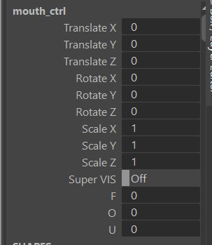
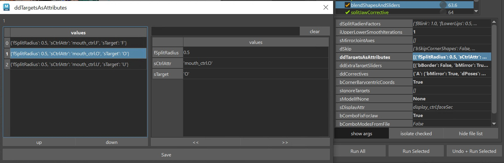
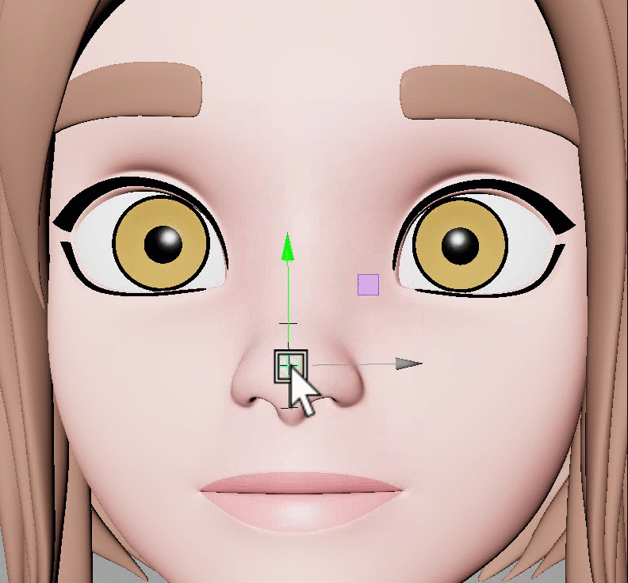
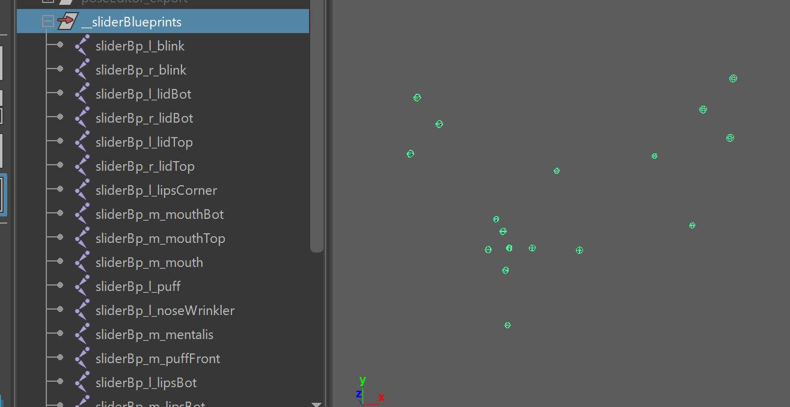
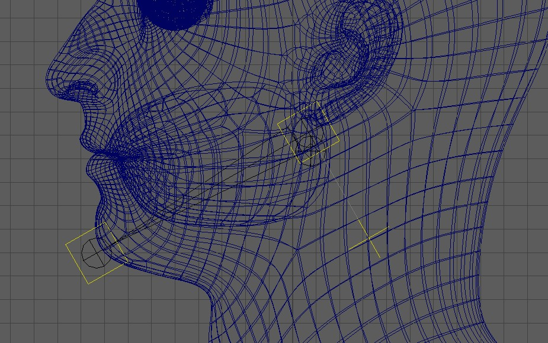
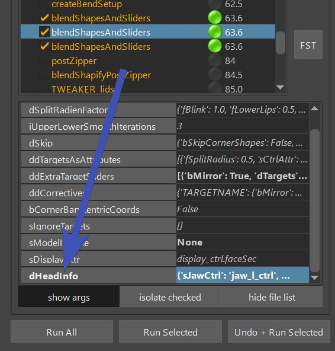

#

Face Rigging in Kangaroo has gotten very powerful in version 5. It's got many different setups to choose
from for each part - mouth, brows, eyelids, etc - and it's got some general squash/stretch ctrls.

Most of the time you have the option of doing spline setups or blendShapes. You can also mix.

The first thing to do when you do Face Rig is add the python file **facePro_v18.py** (right click on the Python Files
in the builder -> **Add File** -> **+default** -> **facePro** -> **facePro_v18.py**:  


## Puppet Limbs`
For things like Tongue (*Spine*), teeth (*SingleTransform* or *Belt*) we can use the puppet limbs that we also use for the body.
You can even do [Tweaker Ctrls](../puppet/tweakerCtrls.md) if you want to give animators some extra modifiers. But make sure
to first read through [Face Tweaker Ctrls](faceTweakerCtrls.md) in here, since those might already give you better options for many cases.  


## BlendShapes vs Splines`
Most parts of the face (mouth, eyes, ..) come with two options - *BlendShapes* and *Splines*.  
There are pros and cons to both approaches.
Which one you choose depends on a lot of factors, not only the type of character.

But generally, **use blendShapes if..**

- you are doing a realistic character, or
- you have a model team that has the capacity to sculpt blendShapes (not every modeler can model blendShapes!)

**Use Spline rigs, if..**

- you have talented riggers (setting up splines requires technical **and** artistic skills)
- you feel that blendShapes would appear a bit to static

Keep in mind that you can always use the blendShapes on top of the splines as correctives! 


## *blendShapesAndSliders()*

*blendShapesAndSliders()* is a very complex function that applies all the blendShapes. But obviously you have to
sculpt the blendShapes first and put them at the proper place. 
All that happens with the [Shape Editor](shapeEditor1.md).   
And make sure
that the blendShape file you create with the *Shape Editor* gets imported and baked in the *importBlendShapeFile()* function.  
*blendShapesAndSliders()* is the function that takes all those baked target meshes and assigns them as blendShapes.  

Basically *blendShapesAndSliders()* knows about a huge list of shapes, and can even do some additional shapes defined in the 
attributes *ddTargetsAsAttributes*, *ddExtraTargetSliders* and *ddCorrectives*.   
It does all this: 

- inverts some against the skinCluster
- splits the targets (mostly left/right, but also others like lip ctrls, brow spline ctrls and upper/lower eyelids)
- creates and connects all the Combo Targets   
- creates many slider ctrls  

Below you can find an overview of what Targets it accepts.   
### Eyes
[Eyelid Target Lists](eyes.md#eyelid-blendshapes)  
For eyelids the ctrls are pretty much the same when you use the blendShape setup or spline setup. Therefore you can
use the same blendShapes targets. The only difference is that for the spline rig those blendShape targets act more like correctives.  
If you are using the spline rig, you have a few extra ones for correctives:  
[Eyelid Spline Correctives](eyes.md#eyelidsplinecorrectives)  

### Mouth
[Mouth Target Lists](mouth.md#blendshapes)    
Similar for the Eyelids - For the mouth ctrls are pretty much the same when you use the blendShape setup or spline setup. Therefore you can
use the same blendShapes targets. The only difference is that for the spline rig those blendShape targets act more like correctives.  


### Brows
[Brows (BlendShape Setup)](brows.md#blendshapes)  
[Brows (Splines Setup)](brows.md#browsplinescorrectives)  
For the brows the ctrls are different between the blendShape setup and spline setup. That's why we have different sets of targets:

### Some more..
```
squint
cheekRaiser
cheekIn
cheekOut
puffFront
mentalis
chinRaiser
lipStretch
neckStretch
```


### Create blendShapes as Correctives
Most of those target shapes mentioned above can be used as base shapes, where you just entirely sculpt them.  
But some of those shapes can also be used for correctives, especially all the mouth targets. Let's say you are creating the 
mouth rig with splines - technically you wouldn't need to create any blendShape targets for the mouth then.   
BUT you can still use those targets as correctives.  
*So how does it work?*  
In the **Shape Editor** you need to connect the rig, so you can sculpt the blendShape on top. This is explained in 
[Shape Editor - Connecting the Rig](shapeEditor2.md#connecting-the-rig).


### Define your own Targets
But likely you'll hit a point where you want to add a target that you can't find in any of the list. For that case
we have 3 extra attributes on the *blendShapesAndSliders()* function: *ddTargetsAsAttributes*, *ddExtraTargetSliders* and *ddCorrectives*.
!!! note "JSON Editor" 
    Before reading those, make sure you know about the [JSON Editor](../builder/jsonEditor.md), since adjusting those
    attributes directly would be a nightmare!

!!! note "Shape Editor"
    This section doesn't explain how to sculpt the targets, it only shows how to specify them in the builder function. To see
    how to actually sculpt them, check [Shape Editor - Adding more Main Targets](shapeEditor2.md#adding-more-main-targets)


#### ddTargetsAsAttributes
See how we have some extra phoneme attributes *F*, *O* and *U* on an already existing ctrl?  
   
You can create as many as you like, and put them on pretty much any ctrls that is there. And if you define a left ctrl, it automatically
splits the shape and puts it onto the left/right ctrls using the *fSplitRadius*. 


Under *sTarget* you specify be the name that you define in the *Shape Editor* (*"O"* in the picture above). 
As the attribute goes to 1.0, the target will be activated.
You can also add *sTargetNeg*, which then would get activated as the attribute goes to -1.0.

#### ddExtraTargetSliders
With the *ddExtraTargetSliders* attribute you can create new slider ctrls, like this one:  
   
We've specified it as bMirror=False, and only added the sTargetUp and sTargetDown shapes:
  

Here's another one, where we've set bMirror=True, and also assigned the sTargetIn:  
  

!!! info
    You'll see that the *blendShapesAndSliders()* function creates all the ctrl positions, orientations and scale by guessing based
    on the direction and distance of the targets. But very often you'll want to adjust that. And it's easy - all explained in [SliderBlueprints](#sliderblueprints). 

#### ddCorrectives

The *ddCorrectives* attribute lets you specify some corrective targets. Here the target names are the keys on the left of
the JSON Editor (*CornerDownRotateUp*, *upperLipUp*, *upperLipIn*):  
    
In the picture above we just specified some ctrls that are already coming from the face. But it doesn't have to be from the face functions.
It can also be a ctrl from the puppet.  

Another example with *ddCorrectives*: The elephant in the picture below was modelled and rigged with a straight trunk. 
But then we created a corrective for when the trunk was down (created rig attribute that poses the trunk down, and specified that attribute in *ddCorrectives*). 
We actually left the main target (*trunkDown*) as the default, but added Combos for the *funnel* and *noseWrinkler*.  
    


## SliderBlueprints
Slider Blueprints are NOT the *blueprints* in the puppet tool. Instead they
are just some simple joints for the Face Setups. There's no centralized place where you manage them. Instead every 
function just creates them and puts them into the *__sliderBlueprints* group. and when you export them, you export them all together.


### Placing them
When creating the initial ones, *Kangaroo* tries to estimate the position/orientation/scale according to the actual blendShapes. This doesn't always
look good by default, so you have the option to adjust them manually.  
Most of the time it's best to build until before *parallelAttachTransforms()*, and then adjust their locations and scale.
This way you can test right away if they work well with the blendShape they are driving.  

<video autoplay muted loop controls width="640">
    <source src="../../images/face_placeSliderBlueprints.mp4" type="video/mp4">
    Your browser does not support the video tag.
</video>


Unfortunately whenever they are driving spline rigs such as the lips spline rig, the live connection from the sliderBlueprints already gets broken
in the function where they are created. In those cases you just have to guess when giving them good scale values, and rebuild.

### Mirror
While you could theoretically mirror them with the *mirror* shelf button, usually we mirror them by just not exporting the 
right side ones, and then the functions create the missing right ones using the left side ones.
To specify which ones get exported and which ones not you can switch the **doExport** attribute on each sliderBlueprint joint

### Export 
Exporting works with the button **-Export \*Slider\* BPs-**. You'll find this button on many functions such as *BASELidCtrls()*,
*blendShapesAndSliders()* and *parallelAttachTransforms()*. And it'll do the same thing on each function, it exports
ALL the sliderBlueprints, not just the ones of the current function.  


## DEFAULT ATTRS {#defaultattrs}
On many functions you'll see that **=== DEFAULT ATTRS ===** button. It deals with attributes that are usually on the passers of the 
ctrls that can be used to finetune the setup. Sometimes it also handles pose locators.  
  

The button lets you **Mirror** and **Fill** the attributes. Filling means putting their values into the function attribute. 

!!! tip "Kangaroo Tool Tip"
    If you want to update values after you've filled them, the [JSON Editor](../builder/jsonEditor.md) can help you with this. 

!!! tip "Kangaroo Tool Tip"
    Since most attributes are on passer groups, there's the shelf button  (*selPssr*),
    that selects the passers on all selected ctrls.

!!! warning "Watch Out"
    While it often does pose locators, it's not always the case. Check if that function has an extra button for filling 
    the Pose Locator. If unclear, you can also click the *Info* or *Select* option in the *Default Attrs* menu.


## Deformer Order
The order how deformers are applied to the meshes is very important. If you are clicking the function buttons to add 
influences, it usually takes care of the proper order. But there's many things that can reshuffle the order in a bad way.  
So you'll have to check here and there if the order is still correct:  
```
skinCluster__head_geo__BENDTOP
skinCluster__head_geo__BEND
lattice__head_geo__r_EYE
lattice__head_geo__l_EYE
skinCluster__head_geo__TWEAKER
skinCluster__head_geo
blendShape__head_geo
```
Basically blendShape first, then the main skincluster (the one without a suffix), __TWEAKERS, eye lattices, __BEND and in the end __BENDTOP.
This is assuming the head geo is called head_geo, so in your case those deformers might be called different.
You might also not have all of them, or you might have some extra ones.  
  


## Jaw

In the simplest form, the jaw ctrl is just a *singleBone* limb. Make sure that the blueprints look like this, basically the polevector is pointing 
downwards, and don't use any *Adjust Axis Orient* values.  


### Auto Translate
#### From Shape Editor
If you use the *Shape Editor*, make sure to keep *fOverwriteRotation* and *fOverwriteTranslation* in the 
*jawAutoTranslate()* function as *None*, since those values should be coming from the shape Editor.  
And then see [Shape Editor - Getting Jaw from the Rig](shapeEditor2.md#getting-jaw-from-the-rig) to see how to setup that
in the Shape Editor.  
The extra rotations (X, Y) and all translations are fully activated on the Z rotation that you've specified in the **\*** button.

#### Without Shape Editor
If you don't use the Shape Editor, you can set the jaw with the attributes in the image below. Similar to the 
*Shape Editor* setup - The extra rotations (X, Y) and all translations are fully activated on the Z rotation 
(3rd number in *OverwriteRotation*)
  
  

!!! Warning
    Don't forget to set those values to *None* if you are getting the jawOpen values from the *Shape Editor*! If you
    have some values in there and they are different than what's in the *Shape Editor*, things can get messy.

### jawOpen blendShape Pose

By default the *jawOpen* blendShape target is NOT getting activated at the same timing of the *Auto Translate*.    

Check in this table to see at which value the jawOpen is getting activated:  

| Current Functions/Attributes                             | rotateZ value he's using for jawOpen
|----------------------------------------------------------|---------------
| **BASEMouthCtrls()** active with **bSPLINES** as *True*  |  *jawOpen* entry in the *dPoseCtrlValues*          |
| **BASEMouthCtrls()** active with **bSPLINES** as *False* |  *Auto Translate* (either *Shape Editor* or override values)   |
| **BASEMouthCtrls()** NOT active                          |  *Auto Translate* (either *Shape Editor* or override values)          |

So in short - when you doing Mouth splines, it's taking from the *dPoseCtrlValues*, and it can be an issue that it's 
different timing than the *Auto Translate*!  
Therefore when you are doing splines, it's recommended to set the *jawOpen* in *dPoseCtrlValues* to the same as the rotateZ that you have in the *Shape Editor* * button or override value.
!!! question "Why does it not just take the jawOpen rotateZ for mouth splines from the ShapeEditor or override values?"    
    That's because when doing mouth splines, the *BASEMouthCtrls()* function is also creating locator setup. And it's more important that the
    jawOpen is following the locator setup than following the RotateZ value

### Troubleshooting: Why is the **Pose Rig** Button in the Shape Editor not going to the correct pose?  
**Mouth splines:**  
There's a little gotcha: If you change the *jawOpen* in the *dPoseCtrlValues*, you need to rebuild and reference the rig again.   
This is some sort of exception, since for most other targets the *Pose Rig* buttons will take the values directly from the builder.

**No Mouth Splines:**  
You also need to rebuild/rereference the rig, **even if you change the values in the * button of the Shape Editor!**

### Troubleshooting: Why does the jaw rotate sideways if I rotate it upwards?
It's most likely happening because it’s getting the motion from the joints in the blendShape file, and in there the jaw joint
is at the origin. Either delete the joints in the blendShape file, or set them properly by getting Skin Setup from the rig.  
Or you just disable the jawAutoTranslate function, you may not always need it.


## Multiple Heads
You can also build assets that have more than one head, like the Cerberus here:  
  

For the puppet limbs, make sure to name them properly. And if the heads are not on the symmetry line, 
follow [Puppet - Blueprint Rig Mirror Planes](../puppet/puppetGeneral.md#blueprint-rig-mirror-planes),
so you can mirror them easier.

For the functions in the **facePro_v??**, you can duplicate many of them with right click -> **set function instance count**,
and set that value to something bigger than 1.  
And then watch out for attributes called **dHeadInfo** or **sSuffix**, and set them accordingly:  
  

!!! note
    Not all functions are supported at this point. If you have a very complex face rig with joint splines etc, at this
    point it might be easier to build a separate asset, and import it through the *mayaImport* folder in the main asset. 

Also keep an eye out for the **sMirrorPlane** attribute. You sometimes find it in the **dHeadInfo** attribute. If you leave
it empty, it mirrors along the world symmetry axis.   
But you can give it a joint and an axis, for example **headJoint_1.4**, which would assume there's a node called *headJoint_1*
in scene. The **4** after the dot means negative X (0=X, 1=Y, 2=Z, 3=-X, 4=-Y, 5=-Z).
  
!!! note 
    In the puppet tool ([Puppet - Blueprint Rig Mirror Planes](../puppet/puppetGeneral.md#blueprint-rig-mirror-planes)) that convention is slightly different, instead of the number
    you would give it the axis name (e.g. **bp_l_head.Z**). This is because the puppet tool doesn't care about positive or negative. 


