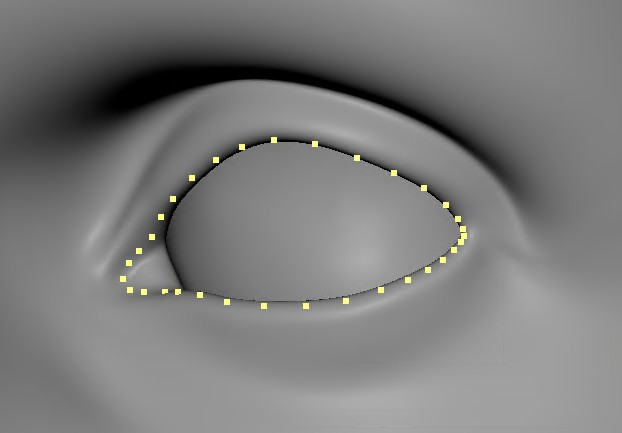
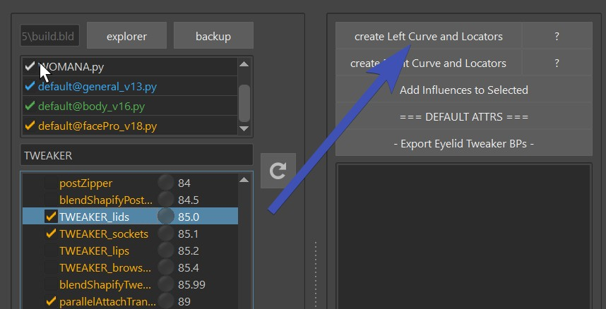
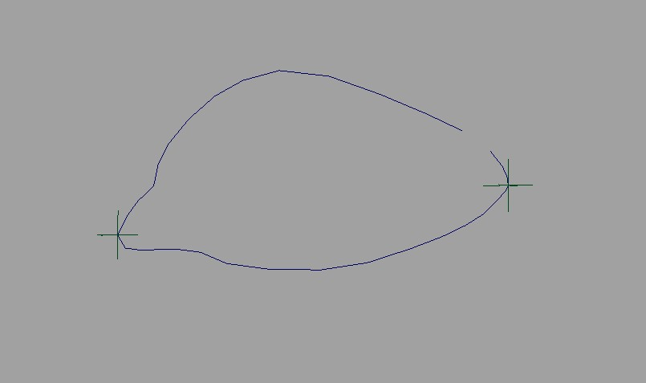
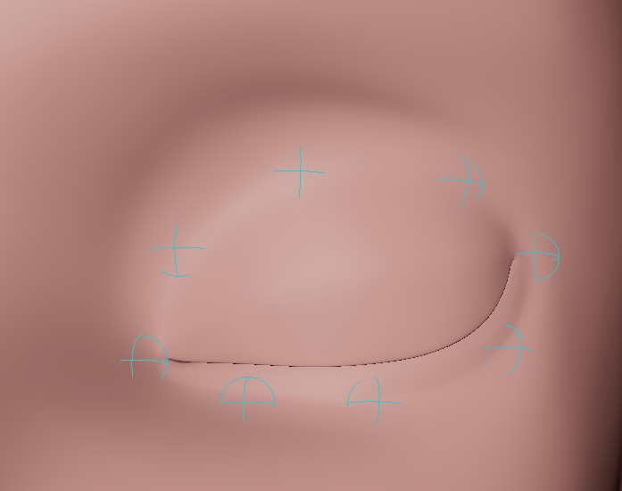
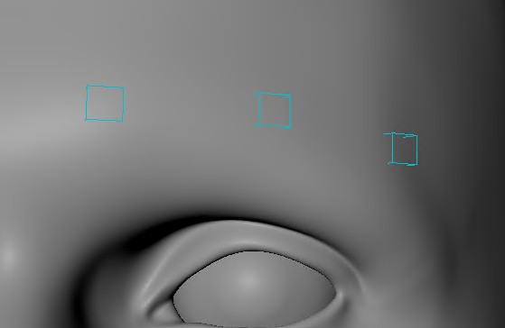
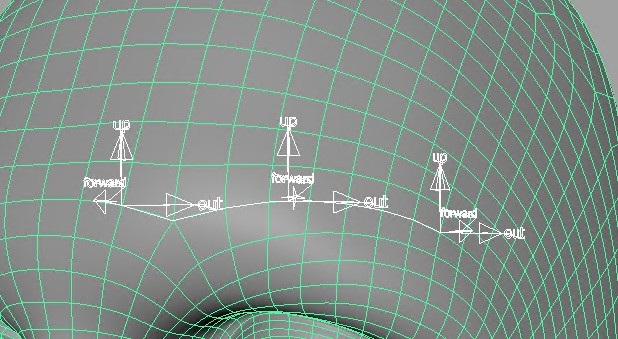
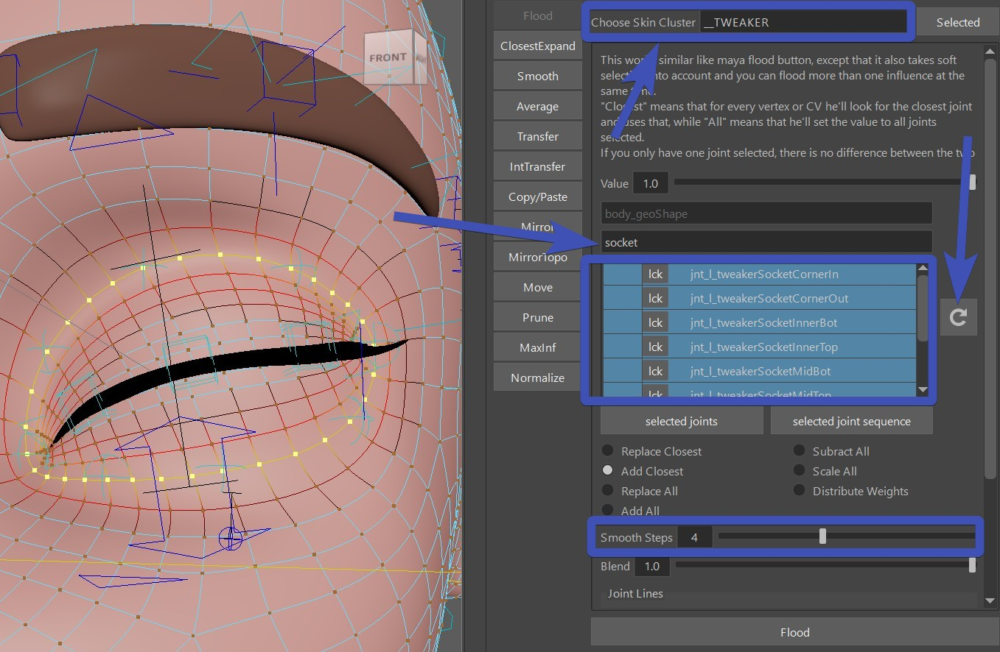

Tweaker Ctrls are some extra ctrls on top of the main setup that animators can use to add some secondary behavior.  


!!! info "They are NOT the puppet tweakers"
    Remember [Tweaker Ctrls in Puppet](../puppet/tweakerCtrls.md)? The Tweaker ctrls we are talking about here work with the same logic, and most
    things here you could theoretically recreate with what you've learned in Tweaker Ctrls before. But the functions
    here are  engineered a bit more specific for facial rigging purposes.

Most tweaker setups we just use on blendShape driven setups. If you are already using
spline setups such as *splineLidSetup()*, *browSplinesSurface()* or the *bSPLINE* mode of *BASEMouthCtrls()*, 
those tweaker setups won't be that useful since the spline setups already come with a lot of ctrls.  

An exception is the **sockets**. Even if you are doing eyelid splines, animators might still want to have the 
socket tweakers.

## The Functions...

### *TWEAKER_lids()*
Those are for eyelids. Great for when you have blendShape driven Eyelids, and you just want to give animators some
extra control on top of those.  
  
First specify the skin mesh under **sAttachmesh**. This is so later the *parallelAttachFunction()* knows where to
attach the passers to.

To create the blueprints - select the vertex loop selected:   
  
Click the button **Create Left Curve and Locators**:    
    

That gives you this curve with locators.   
    
Make sure the locators are at the corners, since those are what separates bottom and top lids.  

And then click **-Export Eyelid Tweaker BPs -** 

### *TWEAKER_sockets()*
  
That's the eye sockets. On cartoony characters animators almost always expect them to have some extra control when
brows move down.  
Creating the blueprints and exporting works the same as in [*TWEAKER_lids()*](#tweaker_lids)

### *TWEAKER_browsSimple()*
Nothing fancy, just 3 controls per side:    

Creating the blueprints and exporting works the same as in [*TWEAKER_lids()*](#tweaker_lids)  
You do have some extra BPs for the brows to specify the orientations with **Create Left Brow Orientation Locators**:  
     


### *TWEAKER_lips()*
  
Creating the blueprints starts (!) the same as in [*TWEAKER_lids()*](#tweaker_lids),  
But then you need to specify the **bFlipInnerBpCurves** attribute. Set it to *True* if in the center cvs the upper 
one is below the lower one.  
!!! tip "If you realize too late that the bFlipInnerBpCurves is wrong.."
    If you made a mistake with the **bFlipInnerBpCurves** and you need to swich that attributes after you've already skinned it, you can fix
    the weights with **distribute** option on either the *Flood* or the *ClosestExpand* tool. For both select the whole
    mesh. For the *ClosestExpand* tool also set the loop attributes very high, so you let the fade out be handled by the
    mask of the previous weights.

And the lips come with another option - the **bSplines** attribute. If you leave it to False, 
it works just as the other functions.  
But setting it to *True* means he's running a joint spline through the vertices/ctrls. The result is much nicer in
90 % of the cases. But it is somewhat heavier because the spline is following the previous deformers etc.


## SkinCluster
### Easy ones first..
All of these *TWEAKER_..()* functions come with a button called **Add Influences to Selected**.  
And then you can use the **Flood** tool to bind those vertices.  
Just set the **Choose Skin Cluster** to *__TWEAKER*, reload the list with the  (reload) button, 
enter the type of tweakers in the search field (*lids*, *lips*, etc), select the joints, put in a nice vertex selection -> **Flood**   
On characters with lower resolution, also put the **Smooth Steps** to 1.
   

!!! tip 
    For painting the sockets, close the eyelids and maybe even set the blink line to 0.5, (and reactivate the soft selection),
    so the flood tool grabs a nicer area.  
    Similar goes for the lips - open the mouth, this will give make the 
    *flood* tool assign the weights better.

!!! warning
    Do not use the maya tools or any other external tools for creating the skinClusters! That's because
    for the tweakers the skinCluster needs extra settings under the hood. Those would not happen with any tool
    that is not from Kangaroo.

!!! tip "Distribute"
    The **Flood** tool can also be very useful with the *Distribute* option activated.  
    For example if you already flooded the weights, but it's too smooth - run it with distribute 
    but in the same tool also set the *Smooth Steps* lower.

    

### Skinning Tweaker Lips Splines
If you've set the **bSplines** attribute to *False*, most of it is the same as in the other setups tools. 

But if you have **bSplines** as *True*, then instead of the *Flood* tool, you should use the 
[ClosestExpand tool](../tools/toolsSkinCluster.md#closestexpand) for binding them.  
*Why?*   
Because we have a joint for each vertex on the loop.   


## Ctrl Attachments
### *parallelAttachTransforms()*
Same as for Custom Attachers, the *parallAttachTransforms()* function is making the ctrl passers follow the mesh.  
  
It's called *parallel* because it only seems like it's getting attached by the mesh, while in fact
it's looking at which joints the closest vertex of each ctrl is bound to, and then recreates the
skincluster behavior of that vertex with matrix nodes. It works for more than one skinCluster, but
does NOT include the actual *__TWEAKER* skinCluster that those ctrls are influencing. Otherwise you'd
get a cycle.
It also takes blendShapes, except instead of matrix nodes it's creating range nodes.  

### What if a ctrl doesn't follow nicely?
In some rare cases it doesn't find a good vertex. You'll see that when for example on open mouth or closing eyelids 
one or two ctrls are following a bit too slow or too fast.

Whenever that happens, the first thing is check if your function has the **bSnapToBlueprintCvs** attribute. 
If it does, try setting that to *True*. Keep in mind that this changes the positions of the ctrls! So use it with caution.

If that doesn't help - we can fix it with a python function
that's moving the passer groups closer to the actual vertex you'd like to bind to:

``` python
@builderTools.addToBuild(iOrder=85.5, dButtons={})
def adjustmentsForParallelTransforms():
    cmds.setAttr('grp_l_tweakerLipsTopPasser_003.t', 3.356, 49.845, 8.152)
    for s,sSide in enumerate('lr'):

        cmds.setAttr(f'grp_m_tweakerLipsBotPasser_000.t', 0.0, 49.769, 12.009)
        cmds.setAttr(f'grp_m_tweakerLipsTopPasser_000.t', 0.0, 49.747, 12.267)

        fSideMultipl = -1.0 if sSide == 'r' else 1.0
        cmds.setAttr(f'grp_{sSide}_tweakerLipsBotPasser_002.t', fSideMultipl*2.72, 49.79, 9.59)
        cmds.setAttr(f'grp_{sSide}_tweakerLipsTopPasser_002.t', fSideMultipl*2.653, 49.817, 9.665)
```

!!! note
    See the *iOrder=85.5* flag in *addToBuild* decorator? This is to make sure the function runs between
    the *TWEAKER_\*()* functions and *parallAttachTransforms()*


## Using the Lips Tweakers more than once
The *TWEAKER_lips()* function can be added more than once on the same character. It works in a way that the second one follows the first one with an additional skinCluster.  
Setting it up is a bit more advanced:

- right click on *TWEAKER_lips()* -> *set function instance count* -> 2 (or more)
- on the second function that just appeared: set the **sSuffix** attribute to something like 'A', otherwise you'd end up having clashing names 
- And for the second function you also have to add the first skincluster (.._TWEAKER) into the *sAdditionalAttachDeformers()* list, so it also follows the first one

