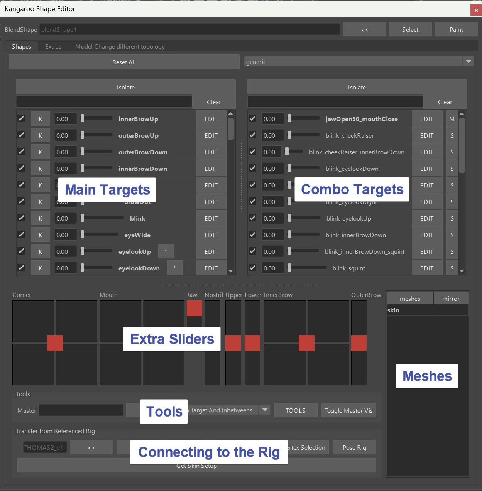
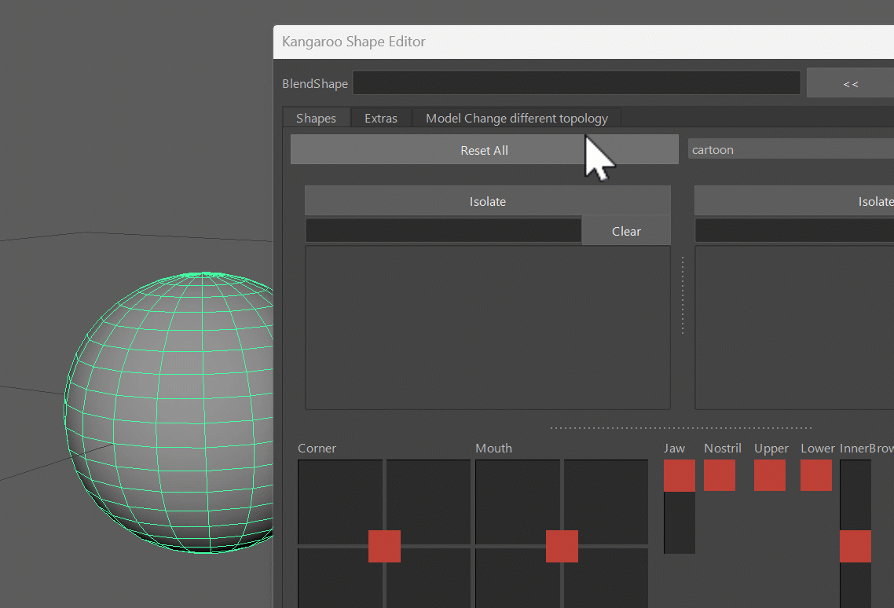
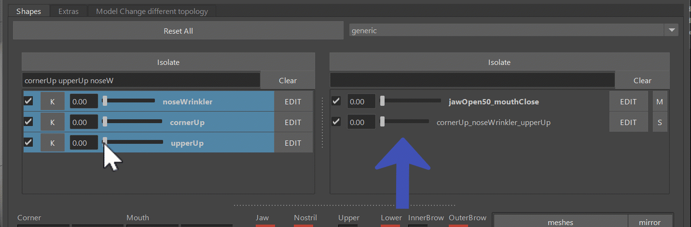
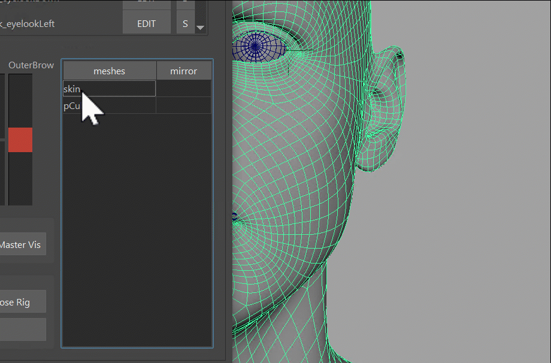
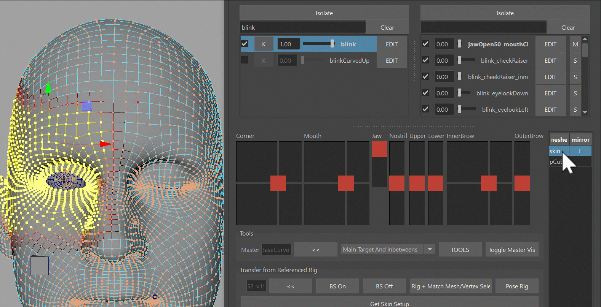
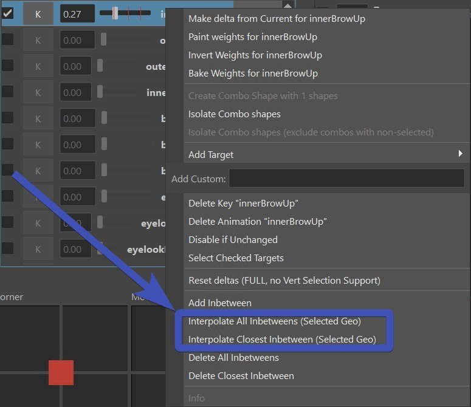
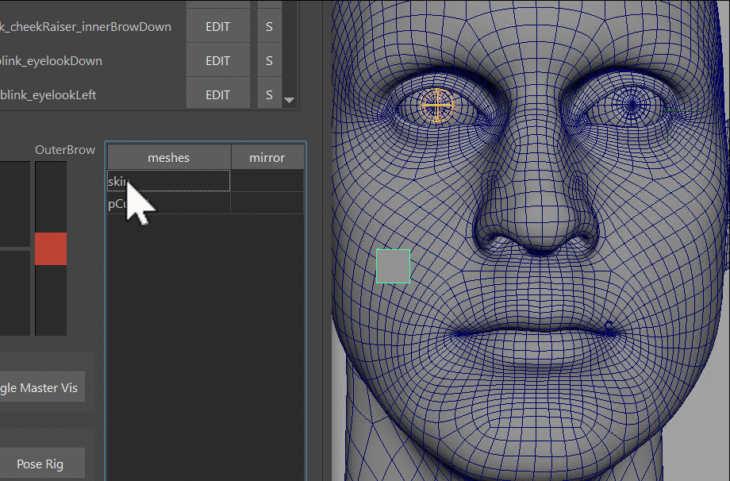
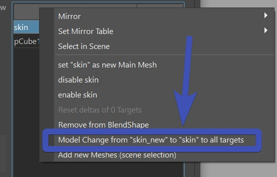

The Shape Editor is a tool for modeling Facial Shapes (targets).  

!!! info "Video" 
    To see how the Shape Editor looks in action, you can also watch this [Video](https://www.youtube.com/embed/cEBJ-tPLMuU).  
    But keep in mind that some menu options changed since the time of making that video.
    
    

You can open the *Shape Editor* with the shelf button  

     

## It's NOT the Pose Editor!
You might find a few similarities to the [Pose Editor](../body/poseEditor1.md), but the architecture and how we
use it is different:   

| Shape Editor                                                                                                    | Pose Editor                                                                    |
|-----------------------------------------------------------------------------------------------------------------|--------------------------------------------------------------------------------
| Runs in a separate file that gets imported in *importBlendShapeFile()*                                          | Runs on the actual rig                                                         |
| Focuses on sculpting and managing main/combo targets                                                            | Focuses on evaluations with interpolators, but also does sculpting             |
| Creates one blendShape node for the whole setup                                                                 | Creates many blendShape nodes. One for each mesh                               |
| The EDIT button handles *ALL* the meshes inside the blendShape                                                  | The EDIT button only does the meshes that you have selected before clicking it |
| Mirroring works with right click on the mesh in the meshes table. And meshes need to get selected in scene, too | Mirroring works with right click on the Target, having the meshes selected     |

## Getting Started
You can select any polygon mesh, and click the **<<** button:    
  
If that polygon mesh wasn't used with the *Shape Editor* yet, it'll ask you to choose a *Target List*.   
By default you just have *cartoon* and *general*. If you are creating a blendShape rig where you want to do most 
shapes including mouth, eyes, etc with blendShapes - choose *general*. But if you are doing a rig where you want
do do most targets with splines, then *cartoon* is a better start, because it only lists the targets that doesn't 
have spline rigs.  

*What did he do under the hood?*  
He created a new blendShape node. And all the Targets that you see in the UI are basically targets on 
the blendShape, just like what you've probably already created before:    
  

!!! note
    You are not limited to just *general* or *cartoon*! Later in [Adding More Main Targets](shapeEditor2.md#adding-more-main-targets)
    you'll see how to either create your own custom lists or just add targets to your existing collection. 

Now to sculpt some main targets by clicking the *Edit* button and sculpt:
  

!!! note "Comparing with Pose Editor"
    Here we have a similarity to the *Pose Editor* but also a difference. While in the *Pose Editor* you also have those
    *EDIT* buttons that you use to sculpt the Targets, in the *Pose Editor* you have to select the meshes, while in the
    *Shape Editor* it just does it on all the meshes that are in the collection. 

!!! info "Kangaroo Tool Tip"
    While in the gif above I just selected vertices and moved them, you can do a lot more. For example you can use
    the sculpting tools (**Mesh Tools -> Sculpting Tools**) or use some Kangaroo Geometry Tools such as the [**Match**](../tools/toolsGeometry.md#match-vertex-positions)
    or [**Smooth Vertices**](../tools/toolsGeometry.md#smooth-vertices) tools.

## Combos
### Combos - Create Them
Combo targets is the Table on the right side. You can create any combination between 2, 3, 4, ... Main Targets. Most of the
time we create combination of just 2 targets. Sometimes 3, and very rarely 4.   
For a combination of 2 targets the combo would be called for example *cornerUp_upperUp*. A combination of 3 would be
*cornerUp_noseWrinkler_upperUp*. It's basically the main targets' names ordered alphabetically and separated by a single \_.
!!! note 
    You will never have to name them yourself, the tool takes care of it. You just need to be aware that whenever you create a *Main Target*
    yourself, it **cannot** have the \_ sign in there.

Creating them is easy, just select the main targets, right click -> **create combo Targets**:  

### Combos - Multiply/Minimum
In the gif above you can see that in the end we switch between the evaluation modes *Muliply* and *Minimum*.  
*Multiply* means that the main targets are just multiplied. So if *cornerUp* is activated 0.8 and *upperUp* is activated 0.5,
the combination will be 0.4 (0.8 * 0.5).  
And in *Minimum* in the same example it would be 0.5, because 0.5 is the smaller one between 0.8 and 0.5.  

Both modes have pros and cons. If you use *Multiply*, the result will be smoother but the issue is that the shape will not 
be driven linearly when all main targets are being activated the same time. For example if you have 2 main targets that are both 
activated as 0.5, the combo target will be 0.25. But ideally it should also be 0.5. Look at this example where we have
a combination of 3 Main Targets. See how it moves slower at smaller values, and then speeds up at higher values?
  

If you need it to run linearly, you can switch to *Minimum*. If all main targets are 0.5, the combo target would be 0.5, too. But *Minimum* has
the ugly disadvantage that it's not as smooth as *Multiply*. In certain situations you'll find that as one main target is being 
activated slowly, the combo might suddenly change from getting activated to not reacting.  
Look at this example. See how it moves more linear, but if I move one alone it starts activating at one point? Animators hate that!
  

!!! warning
    The disadvantages of both modes (*Multiply* and *Minimum*) are only getting worse the more Main Targets you use for the 
    combo. So keep it to a minimum! Any combination of more than 3 targets can get very nasty.

### Combos - add Percentage {#combos-add-percentage}
When you open the blendShapes.ma on the *THOMAS* asset, you'll see a combo called jawOpen50_mouthClose. This just means
that the jawOpen will only go to 0.5 (50 %):  

<video controls width="1570">
    <source src="../../images/shapeEditor_comboWithPercantage.mp4" type="video/mp4">
    Your browser does not support the video tag.
</video>
 
Changing and adding percentages happens through the marking menu:  
   

Try it out, but don't overuse it! The art of sculpting shapes is making this work with the simplest logics. But if you
do need the extra complexity, it's there.  

## Extra Sliders
At the bottom you see a lot of sliders. Those are just representations of how the rig will later set them up. So they are basically
a great way to get a feeling of how they will work later.   
On each slider you could also isolate the targets with the right click menu, so you can see what targets are driven by them.   
Open the Shape Editor File from the templates asset *THOMAS*, and play around with the sliders:  
<video autoplay muted loop controls width="1500">
    <source src="../../images/shapeEditor_sliders.mp4" type="video/mp4">
    Your browser does not support the video tag.
</video>

## Mirror
Mirroring contains 2 parts. *Creating Mirror* Table, and actually *Mirroring*
### Mirror Table 
Right click on the mesh in the *Mesh Table* at the bottom right:   
   
Here's a list of the options: 

| Table                         | Description                                                       |
|-------------------------------|-------------------------------------------------------------------
| middle mesh, edgeflow         | maping vertices through the middle edge (edgeflow) algorithm      |
| middle mesh, vertex positions | mapping through vertex positions                                  |
| middle mesh, face points      | finds point on face, and does barycentric mapping                 |
| side meshes, ids              | needs 2 meshes with same vertex orders                            |
| side meshes, vertex positions | needs 2 meshes, maps by vertex positions                          |
| side meshes, face points      | needs 2 meshes, maps by point on face and barycentric coordinates |

### Actually Mirroring
Mirroring also works on vertex selection. But you do need to right click on the actual mesh for the mirror.
    
!!! warning "Don't Forget"
    Do not forget to select the mesh in scene! Sometimes we assume that when we right click on the actual mesh in the UI it
    would do the mesh. But from the power of being able to select vertices comes the responsibility to also select the mesh in scene.

## Inbetweens
You can add inbetweens to any Target.
 

### Interpolate
Inbetweens are basically another shape stored in the node. It may not appear like this at first because when you apply the 
inbetween, it gives it a default shape which is the interpolated shape at the position of where you apply it.  
BUT if you change the Full Target, the inbetween will NOT change.  
But there's a solution to it - you can re-interpolate the inbetweens. You'll loose the shape that you sculpted on the inbetween, but
it'll follow again that the full shape does. You'll see the options on the right click menu:    
   

!!! note
    You'll see the words *All Inbetweens* and *Closest Inbetwween* a lot in the *Shape Editor*. It's relevant when you 
    have more than one inbetween. So in the picture above where there are 3 inbetweens (red marks) the current weight
    is closer to the first one, so the *Closest Inbetween* would only touch the first one. 

!!! warning "Watch Out"
    When the *blendShapesAndSliders()* adds the blendShapes, the logic of inbetweens is a bit complicated because of a few
    mathematical challenges on how inbetweens work in general. This means in certain situations you might find things behaving a bit strange.   
    It's recommended to keep inbetweens to minimum. And if you do use them, watch out for the results carefully.

## Meshes
### Meshes - Add Secondary Meshes {#addsecondarymeshes}
Easy, just select them and add them with the right click menu:
   
!!! info "Kangaroo Tool Tip"
    By default they are just sitting there and not following the main skin. But you can make it follow the skin with
    the [Tools explained in Shape Editor 2](shapeEditor2.md#makemeshesfollow).

### Meshes - Main Mesh {#meshesmainmesh}
It's important to keep the Main Mesh (*skin* in this example) as the main mesh. It's usually always the case, unless
you start replacing a few meshes. But it's easily fixed with right click menu:  
   

### Meshes - Model Change {#meshesmodelchange}
#### same topology
If the model changed in topology, it's easy. Just select the new mesh, and then with right click on the mesh that
you want to change -> **Model Change from "xxx" to "xxx"**
   
#### different topology
If the overall shape is still the same and modeling just changed the topology a bit, it's a bit of a manual process,
but it's not difficult:  
1. rename the old mesh  
2. restart the shape editor  
3. [add the new mesh](#addsecondarymeshes) (with correct name!)  
4. [warp](shapeEditor2.md#warp) the new mesh to the old mesh   
5. if the old mesh was the main mesh: set it as [Main Mesh](#meshesmainmesh)     
6. check the lips on open targets! Targets like *jawOpen*. *upperUp* or *lowerDown* can get screwed on warp. If they 
are screwed, either fix them manually or try the [Warp UVs](shapeEditor2.md#warp-uvs)

#### different topology and different shape
If the topology is different AND the shape is entirely different, we are basically talking about making a new character.
Check [Shape Editor 2 - Transfer to New Character](shapeEditor2.md#transfertonewcharacter).

