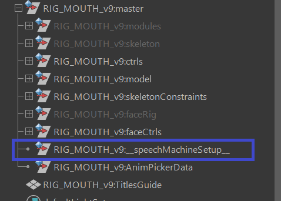
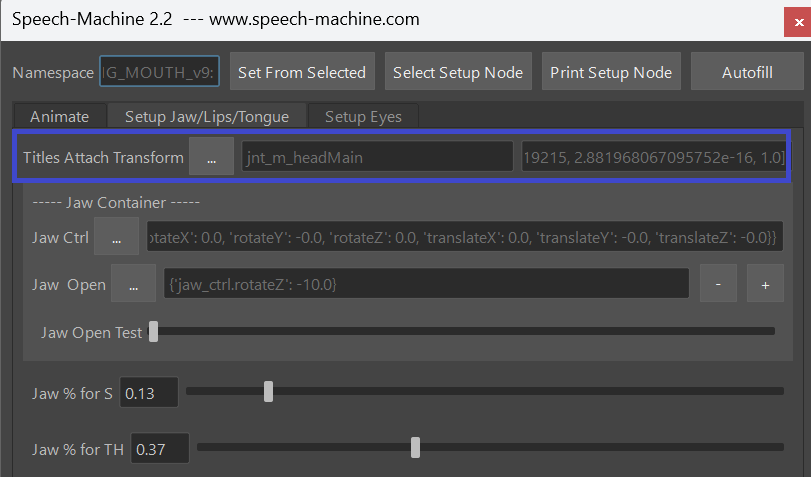
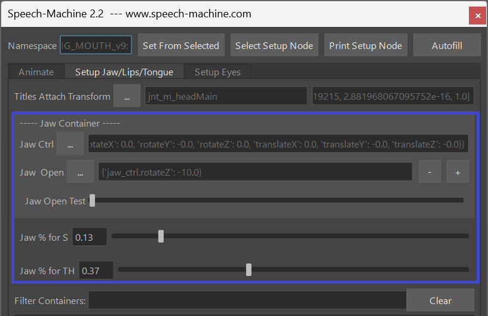

# Speech Machine

Speech Machine is a tool that gives you clean Lip Sync Animation from an Audio File.
The keys are *not* baked as in other lip sync solutions. Instead those keys are animator friendly, so animators
can adjust them, delete them, add more, ...

Watch this video to get an idea of how animators use this tool

<iframe width="560" height="315"
src="https://www.youtube.com/embed/9SmJqNh1j0A"
title="YouTube video player" frameborder="0"
allow="accelerometer; autoplay; clipboard-write; encrypted-media; gyroscope; picture-in-picture"
allowfullscreen></iframe>


## Requirements

You can make the Speech Machine work with any rig, but to get the best results possible it’s recommended to have all the controls listed below.
The speech machine only animates your controls. While the responsibility to get good shapes is still in the hands of the rigger, the speech machine only helps the animator.

For each of those points listed below you don’t need just one single attribute. If more than one attributes are required to achieve those, it’ll work. 
Just keep in mind you might get issues if you use one control attribute for more than one point. More details about 
under [Multiple Control usage](#multiple-control-usage).

- Jaw Open
- Mouth Corners In and Out 
- Upperlip Raiser
- Lowerlip Depressor
- Funnel
- Lippress, Cheek Puff
- MouthClose – lips closing when jaw is open
- lower F – bottom lips touching the teeth
- Zipper
- Tongue Controls

## How it works for Animators

!!! info "video"
    This video [Speech Machine for Animators](https://www.youtube.com/watch?v=9SmJqNh1j0A){target="_blank"} shows how to 
    add audio file, type down the text, and let it create the animation keys.

You can use the *Nora_Lipsync* Rig to test it:  
After you've installed Kangaroo and downloaded the speechMachine files as shown [here](#download),
you should have this rig in your Kangaroo installation folder:
`scripts/speechMachine/external_tools/RIG_NORA_LIPSYNC_v1.ma`.  
Drag it into Maya, ideally with a namespace.
And then you can test everything shown in the video above.  

## How to setup your Character

This section tells you how to setup your character to work with the SpeechMachine.

It's all about mapping the controls in your rig to the Containers. During this process you are working with the tool similar to how animators are working with it – the character rig needs to be referenced in scene, and at the top of the UI the namespace needs to be specified by selecting any control and clicking Set from Selected at the top of the UI.

This has the advantage that later even animators can make adjustments to the settings on the Setup Node and send back to rigging to update it in the rig.

!!! info "video"
    If you prefer videos instead of Tutorials, 
    [Speech Machine for Riggers](https://www.youtube.com/watch?v=IoappUgHWbQ){target="_blank"} shows it all .


### Setup Node
First we need to understand how the Setup Node works. The Setup Node is called __speechMachineSetup__ and it’s a simple transform node with tons of float and string attributes.

Never adjust those attributes directly, unless you are absolutely sure of what you are doing. The way to adjust those attributes is by going to the Setup Jaw/Lips/Tongue tab and from top to bottom fill and calibrate the fields.

      


### Titles Attach Transform
In the Setup Jaw/Lips/Tongue tab at the top you can find Titles Attach Transform.


Here you specify the transform where the subtitles are being attached to and where they are located. This won’t have any impact to the end result, but I recommend to specify it properly, so the titles are appearing nicely above the head.

Simply select the head control for example, click the 3 dots button next to Titles Attach Transform and click Set Transform from Selected.

This will create and select a plane called NAMESPACE::TitlesGuide. Move it so it’s located above the head.

You might notice that in the UI the field on the right side has some some confusing looking numbers and it’s changing as you move the planes.
This is just a mirror to an attribute in the Setup Node which is storing the offset matrix of the plane relative to the transform that you specified.

Later, if the Subtitles appear too big or too small, simply adjust the plane.
      

### Jaw Container
The first 3 lines are the most important


Select your jaw control attribute while it is in default pose (should be closed), click the 3 dots button next to Jaw Ctrl and in the dropdown menu that appears click Set From Selected.

Now we need to specify the jaw in the open pose. Simply pose the jaw, click the 3 dots button next to Jaw Pose and in the appearing drop down menu click Set Current Pose.

Then play with the Jaw Open Test slider below. If the jaw opens and closes correctly, it worked.

And then set the jaw percentages of where the jaw should be on the S (Jaw % for S) and TH (Jaw % for TH) sounds.
For the S, just make sure the tip of the teeth are meeting. In most rigs that would be 0 %. And for TH, just make sure the gap between the teeth is wide enough so the tip of the tongue has space to go inbetween.

      


### Other Containers
Before moving further, let’s make sure we know what exactly a Container is. The speech machine has those containers:

- **Jaw** – we’ve done this already above
- **CornerInOut** – In the UI they are split into CornerIn, CornerOut
- **UpperUp** – Upperlip Raiser
- **LowerDown** – Lowerlip Depressor
- **Funnel** – SH, RR – Lips going forward
- **Puff** - for longer and harder P – lips pressing and cheeks puffing slightly
- **MouthClose** – lips closing, also when jaw is open
- **lower FFF** – bottom lips touching the teeth
- **Zipper**
- **Tongue Up** – N, L, T, D
- **Tongue TH** – The typical English sound TH
- **Tongue Back** – K, G

- Internally the Speech Machine is calculating an animation for each container. What we have to do with the UI is mapping our controls to the containers. And we already did one – the jaw.

While the simple containers (like the Jaw, UpperUp, LowerDown) just have a Ctrls field and a Pose field, some have 2 Pose fields (MouthClose, lower FFF, all the Tongue Containers). One for when Jaw is at default, and one for when jaw is open. They all need to be set properly.

### Multiple Control usage
In most cases, each control attribute in the rig should not be used more than once.

For example if you have a control attribute upper_ctrl.translateY that you specify for the upperUp container and for the mouthClosed container at the same time, you will immediately get a warning.

But the tool will still work, except that the result will be baked keys instead of clean keys. If you are ok with this, then don’t worry and feel free to use controls more than once.

Actually for the tongue this could be acceptable in many cases since animators are more likely not going to need to adjust the tongue animation.

One exception is the cornerIn and cornerOut containers. You can have a control that will get negative values from the cornerIn container, and positive values from the cornerOut container. Because those containers under the hood are actually combined into one container.

Another exception is the Puff Container. Since internally this is more like a post effect, it can handle it if there are already extisting control attributes defined here.

### Finish the Setup
Now that you know what containers are and how they work – go from top to bottom and map the Ctrls and Poses for each container.

Always remember to use the test sliders to see if things are set correctly!

### Bringing the setup node into the rig
When you are done mapping and calibrating your controls, simply duplicate the setup node, so it’s just named speechMachineSetup without namespace, and import that into your rig.

So next time you reference your rig, this node gets reference with the correct namespace

Also make sure you only have that node in the rig only once to avoid clashing names.


## Download
First you need to download and install Kangaroo-Builder v5.21 or later [here](../download.md).

That doesn't give you everything though, you also need to download [external_tools](https://github.com/ThomasBittner1/SpeechMachine_external_tools/releases/download/untagged-2d9df526e7c1f46aa2b7/speechMachine_external_tools_v1.zip),
extract it and put the contents inside `scripts/speechMachine/external_tools`.  

So your external_tools folder should look like this:  
```text
└── external_tools
    ├── bin
    ├── ffmpeg
    ├── licenses
    ├── montreal-forced-aligner
    ├── montreal-forced-aligner-lexicons
    └── RIG_NORA_LIPSYNC_v1.ma
```
