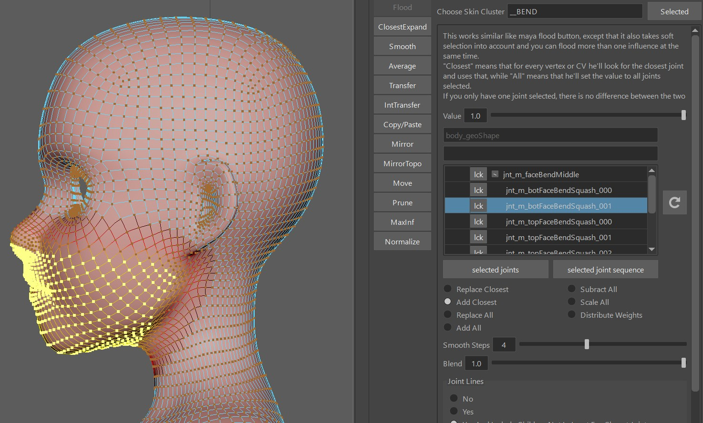

The *createBendSetup()* function is creating some general squash/stretch setup. They are two additional skinClusters, suffixed with *__BEND* and *__BENDTOP*.

  

## Blueprints
When you click *Create BPs*,  
   
he just creates some colored joints that you need to lay out to the shape of the head:  

## Ctrl Shapes
After running the *createBendSetup()* function, move those ctrl shapes to the right place, just be dragging their cvs:
  
And of course after that export the ctrls shapes.

## Weights
It's very important to create the weights using the *Kangaroo* tools, because those are setting some important things
that other skinning tools won't.  
These are the joints:

But don't worry you don't actually have to look for them or select them in the scene or outliner. just follow the instructions
how to do that with the [Flood tool](../tools/toolsSkinCluster.md#flood) , and you'll be done with this in no time.

### Using the Flood tool
To create the skinClusters, having the main mesh selected start by clicking the buttons **connect Influences (selectded Meshes)** and 
**connectInfluences TOP (selected meshes)**:  
  

Then apply the rom animation by clicking the button **create rom anim**

In the **Choose Skin Cluster** field, specify **__BEND**, and click the  (reload) button.

Bind everything above the neck to the **jnt_m_faceBendMiddle**. This is the main cube ctrl - frame 0 - 30 in the ROM.

Then in the flood tool select the **jnt_m_botFaceBendSquash_001** joint and bind the bottom part of the face to it.  
  
!!! note 
    Even though there's more bottom joints, the bottom part *usually* works better with painted to just one joint.

Next, the **Choose Skin Cluster** field, specify **__BENDTOP**, and click the  (reload) button.
And bind the whole head to all the top influence joints

### Transfer from main mesh to others
This can be easily done with the **SkinCluster -> Transfer** tool:
Set the *From* to the name of the skinCluster that you created before, and turn  **Auto Create New SkinCluster** on 
  
!!! warning
    Do not forget the **Auto Create New SkinCluster**! Running it without it would damage your existing weights.

!!! note
    The **auto create new skinCluster** option doesn't *always* create new skinCluster. If the skinCluster with
    the proper suffix (*__BEND* or *__BENDTOP*) is already present, he'll use that instead of creating new one

### Smooth
Especially the eyeballs will likely get some sharp corners from the weight transfer.  
But those are easily fixed with the **Smooth** tool. Just make sure to enter *__BENDTOP* (or  *__BEND*), and click smooth

## Tweak it
When you look at the Rom or play around with the ctrls, it's probably not looking perfect yet.  

You can adjust the squash/stretch values with the attributes on the passers of the ctrls:  
  
Those get saved with the [** === DEFAULT ATTRS === **](faceGeneral.md#defaultattrs) button.

And apart from that you might still need to spend some time tweaking the weights with the **Smooth**, **Flood** or **Move** tool.

## Only one skinCluster option
You probably saw that the **connect Influences (..)** button added all the bottom *AND* top joints into the *__BEND* skinCluster.  
You could theoretically skip the *__BENDTOP* skinCluster and solve it all with *__BEND*. You'd just have to adjust the blueprints
so the lower and upper blueprints are not overlapping each other.

## Ctrls Following
*Kangaroo* tries to have most ctrls follow the squash/stretch setup. This won't change the deformations, but animators still
appreciate it if ctrls are always staying with the face geo.  
For all the facial setups this should happen automatically in the function *parallelAttachCtrls()*.    
But if you have some extra puppet limbs, you'll have to set this with the **FaceExtraMove** flag:   

Limbs that have this attribute are *spine*, *singleTransform*, *singleBone* and *belt*
!!! note
    on some limbs that attribute might be a further below under the *FK* feature:   
    