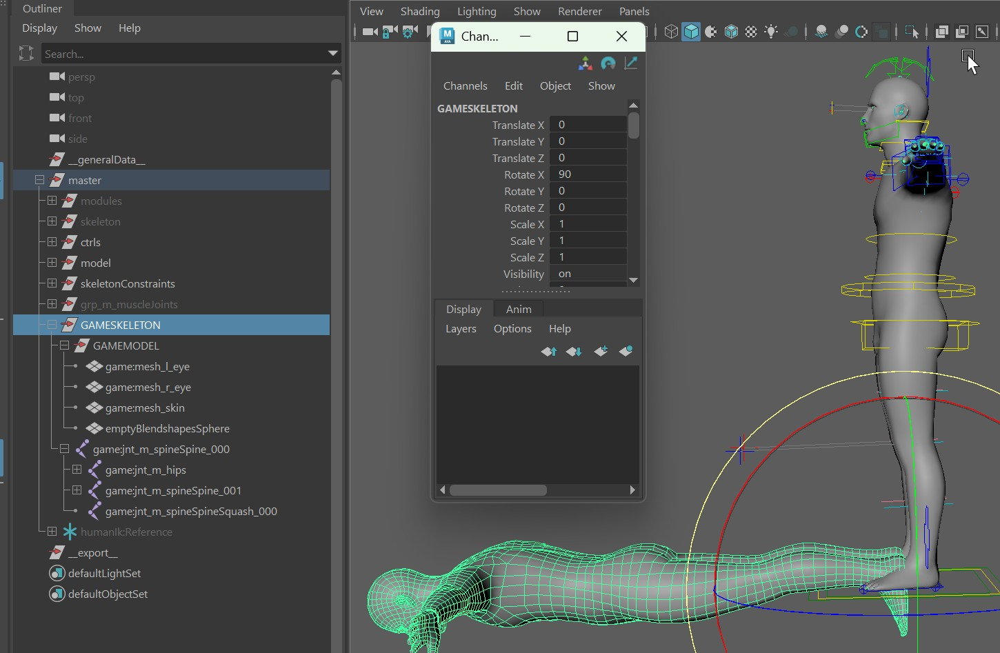
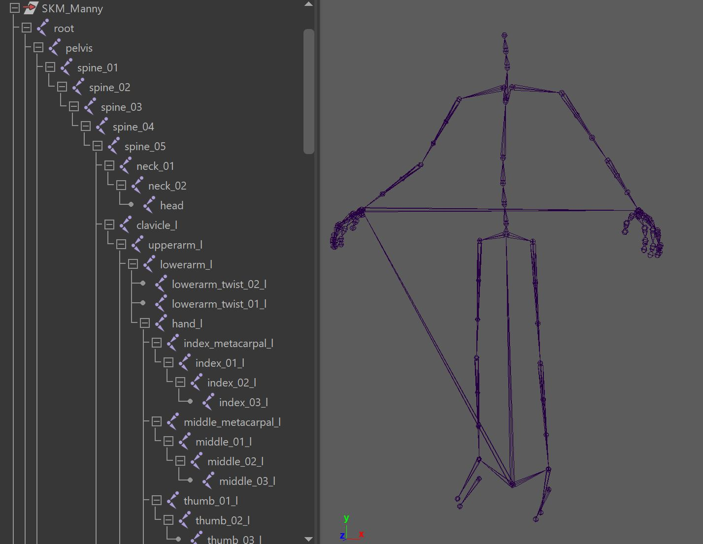

## GAMESKELETON
Game Engines usually just want a very simple rig that has only joints and skinCluster.  
To get that, turn on the function *create_GAMESKELETON()*  
  

This function creates a GAMESKELETON group that you can export as an FBX.  
Here you can see how the hierarchy looks like. It's basically the model and joint hierarchy duplicated, with the namespace
"*game:*". Make sure you unhide it if you want to see it in scene, as it's hidden by default:   
  

You can even use the function button export FBX to do that for you.

!!! note "Different Coordinate Systems"
    Some Game Engines such as Unreal Engine have a different coordinate system, for example Z being up instead of Y.  
    You should be able to handle that in the FBX export, or import in the Game Engine.  
    But if those things don't work - another way to solve this is rotate the GAMESKELETON group (rotateX = 90). While all the
    joint transform values are still connected, they are connected locally, so an animation will work.  
      

While you can export the *GAMESKELETON* yourself with *File -> Export Selection*, there's a shortcut - the *Export FBX* button. This 
exports it into the *fbx* folder in your build/version folder. 
  

## UnrealEngine Biped
For Bipeds you can make it create the joints as from UnrealEngine. This will give
you a lot of things for free, for example you could just create the Biped Control Rig without much effort.
  

To do that, apart from having the *create_GAMESKELETON()* function active, also turn on 
*bMetahumanJoints* in the *buildPuppet()* function:  

!!! warning "Use the correct Limbs"
    It's important to use the actual biped limbs. If you have something else like a Quadruped, he won't know what to do.
    If unclear, just restart the asset by copying from BASEHUMAN in the template and disable the *doAllMuscleJoints()* function.

## Limitations
In the usual case Game Engines just want simple blendShapes and skinCluster. That means most of the face tools 
don't work in the Game Engine the same way as in Maya.  
So when you setup the face, best only stick with blendShapes.

There's a few setups that can get converted to blendShapes. It's still lower quality and can end up with a ton
of blendShapes. But in situations where you are creating cinematics or movies and you are using UnrealEngine just
as a Render Tool, those blendShape convertions might just be the right thing.   
### Zipper
If you create *postZipper()*, you can run the function *blendShapifyPostZipper()*, and that'll bake the setup into 
a lot of blendShapes.

### Tweakers
If you used the *TWEAKER_lips()* (without bSpline), *TWEAKER_lids()* or *TWEAKER_simpleBrows()*, you can get
those baked with the *blendShapifyTweakers()* function 

## Building Control Rigs
In older versions of Kangaroo there was a Control Rig Builder.  
Unfortunately that is no more in Kangaroo Version 5 due to lack of funding.    
If you are curious about what was there and might (!) come back in future, here's a few videos:  

[Youtube video that shows the Process of Converting Maya Rig to Control Rig](https://www.youtube.com/embed/2Y8xjbg475o)

<a href="https://www.linkedin.com/posts/thomas-bittner-6bb6302_ue-activity-7231568115124342784-P3rN?utm_source=share&utm_medium=member_desktop&rcm=ACoAAABy3u8BK03tH_Bovh-T4-W99NGXldU3f_g" 
target="_blank">LinkedIn Post: Control Rig Update </a>

<a href="https://www.linkedin.com/posts/thomas-bittner-6bb6302_ue-activity-7229037316470657024-LXod?utm_source=share&utm_medium=member_desktop&rcm=ACoAAABy3u8BK03tH_Bovh-T4-W99NGXldU3f_g" 
target="_blank">LinkedIn Post: Horse Leg </a>

<a href="https://www.linkedin.com/posts/thomas-bittner-6bb6302_ue-activity-7226516206852141056-OksB?utm_source=share&utm_medium=member_desktop&rcm=ACoAAABy3u8BK03tH_Bovh-T4-W99NGXldU3f_g" 
target="_blank">LinkedIn Post: Spring </a>

<a href="https://www.linkedin.com/posts/thomas-bittner-6bb6302_auto-scapula-for-quadrupeds-its-to-help-activity-7208769710300012545-sprD?utm_source=share&utm_medium=member_desktop&rcm=ACoAAABy3u8BK03tH_Bovh-T4-W99NGXldU3f_g" 
target="_blank">LinkedIn Post: Auto Scapula</a>

<a href="https://www.linkedin.com/posts/thomas-bittner-6bb6302_maya-ue-activity-7243889297345417216--agx?utm_source=share&utm_medium=member_desktop&rcm=ACoAAABy3u8BK03tH_Bovh-T4-W99NGXldU3f_g" 
target="_blank">LinkedIn Post: Normal Maps</a>

