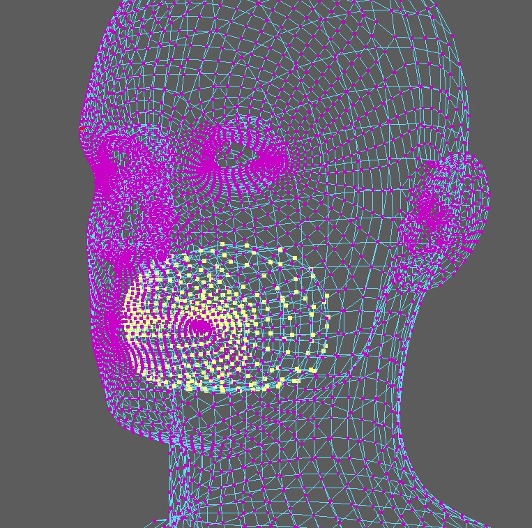

From *v5.19* there's now the **Landmark Warp** tool.

## Markers 

First you create thoes markers that look like in this image:  

To create a numbered marker, just select a vertex of the source mesh, a vertex of the target mesh, and click **Create Landmark pair selected verts**.

## Mirror
If you have the checkbox **Mirror Landmarks on Create** activated, he'll create the mirrored one.   
But it only works if you have the mirror table set. To do that, select the whole mesh and click either 
**Set Mirrortable Edgeflow** or **Set Mirrortable Positions**.

## Inner Mouth Issues 
This tool generally has trouble with inner mouth geometry, but there's an easy way to fix.

On the target mesh, delete the inner mouth faces!  
And then before you Match, select the inner mouth vertices of the Source mesh. Basically that tool
checks if there's a vertex selection on the Source mesh. And if there is, it will only match the un-selected vertices, and 
smoothly move the selected vertices:  

