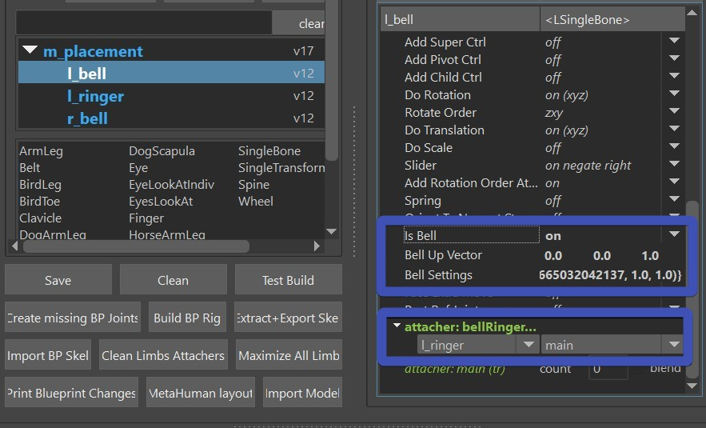
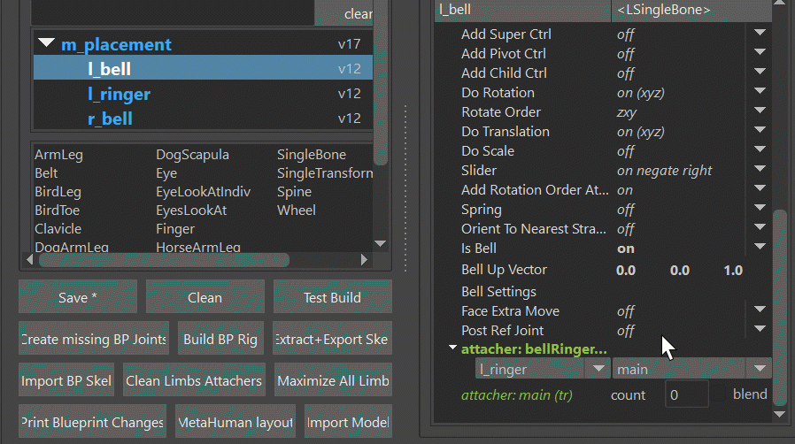

The **singleBone** limb comes with a Bell Collider. Bell Collider looks like dynamics but it's really just
interactive angle calculations. It works great for short pants. 
  
While it looks great in the video, it does
come with the disadvantage that he can only handle cylinders. But those can be scaled non-uniformly, translated and rotated.
And with some multiply attributes you can specify it to be weaker in either front, back or on the sides.

## Setting it up
Add a singleBone limb, declare it as a bell with the **IsBell** attribute, and
define the **ringer** in the attacher below. The ringer in this case is another *singleBone* limb that is 
located close to the bell. The ringer itself doesn't need any extra settings. Actually it doesn't even know that 
it's a ringer. We just named it ringer.  
  

## Shaping the Cylinders
Then you need to fine tune the cylinders. Show them with setting **master.rigVis** to **True**. Ringer is easy to see, but for the bell,
even though you'll see a bell in the scene - the one that you need to adjust is the hidden one right next to it in the outliner.  
And then translate/rotate/scale the bell and the ringer.  
Multiply values can be useful, too - but don't overuse them! They are only here to limit the bell in a certain direction.  
When you are happy with how it works, save the settings in the puppet limb's right click menu **Custom: Store Bell Settings**   

## Trouble shooting
Here's a few common issues and how to solve them:

### The bell is flipping as I rotate it to 90 degrees
Switch the **Bell Up Vector** from default of (0,1,0) to (0,0,1)

### The bell *jumps* very unnatural as it touches the ringer
Give the bell a blended attacher, so that it already moves like the ringer 50 % without the bell setup 

