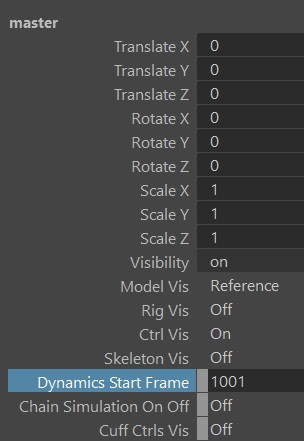
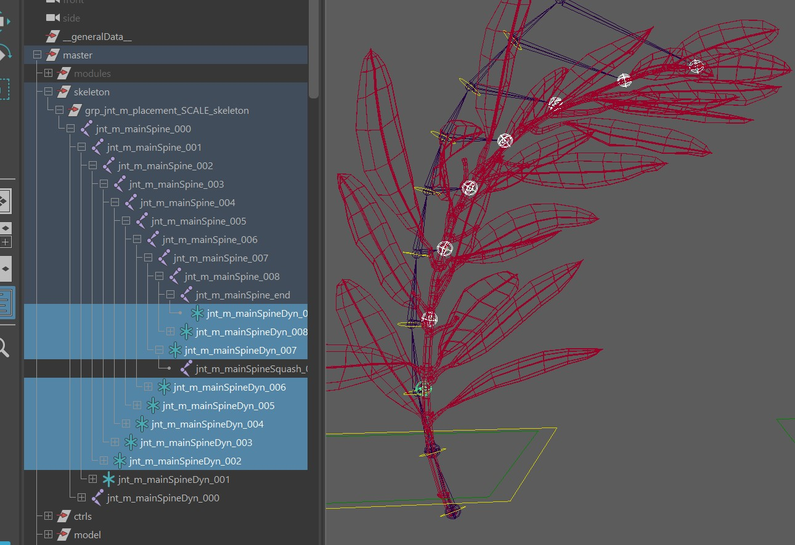
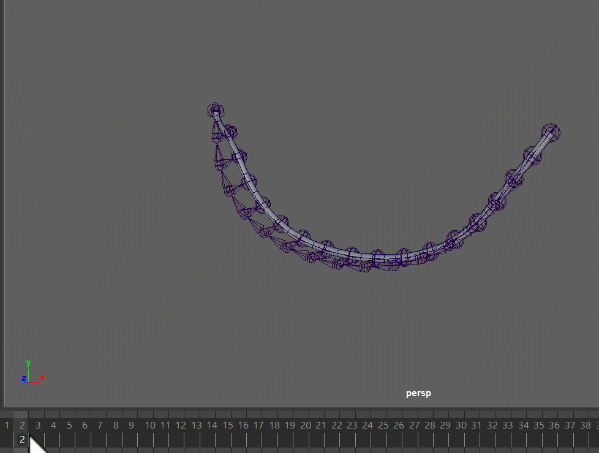
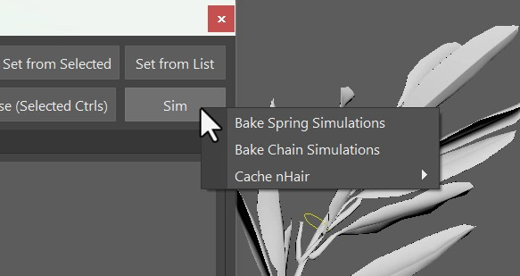

# <!-- dummy title to prevent auto-generated one-->

There's 2 options - **Springs** and **Dynamics**.

| Springs                                              | Dynamics                                                                             |
|------------------------------------------------------|--------------------------------------------------------------------------------------
| We use that in 90 % of the cases                     | Used rarely, but can pay off when you have many of them                              |
| Easier to tweak with stiffness and damping           | Has a ton of attributes that are tricky to tweak for specific behaviors              |
| Expressions                                          | hairSystem                                                                           |
| Can be slower if you have many of them               | Better speed if you have many, as long as they get calculated in one hairSystem node |
| SingleBone, SingleTransform and Spine (fk, fkSpline) | only Spine (Advanced section)                                                        |
| Controls top groups of the Ctrls                     | Is running at the end, before the Squash Joints                                      |
| Only FKs or Single Points                            | Can do Spine FK and IK, can even have the end point locked                           |


## Start Frame
Regardless if you create Springs or Dynamics, do not forget to set the start frame on the master node:  



## Springs
The following limbs come with a **Spring** attribute:

 * singleBone    
 * singleTransform    
 * spine (fk, fkSpline)

Here we used it with spines:  
<video autoplay muted loop controls width="1820">
    <source src="../../images/dynamics_branchSprings.mp4" type="video/mp4">
    Your browser does not support the video tag.
</video>


They work with a very basic spring equation done with Expressions:
```
Acceleration = (Target - Position) * STIFFNESS - Velocity * DAMPING
Velocity += Acceleration
```
*STIFFNESS* and *DAMPING* are the attributes that are exposed and can be tweaked, even by animators.   
For tweaking those values, it's best to keep them the same value at first, and then try small deviations between 0.05 and 0.2.   
*STIFFNESS* is how fast it comes back (stronger values = coming back quicker)  
*DAMPING* is how loose it is or how far they travel (weaker values = looser)  
Keep in mind the expression above is just pseudo code - the real expression is in MEL syntax.


## Dynamics {#spine-dynamics}
The Spine limb also has **Dynamics** attribute in the **Advanced** section. It's using **hairSystem** under the hood.
Just switch *Dynamics* to *lock start*.  
This creates those extra dyn joints between the main joints and the squash joints:  
  

So as you can see here, this is some sort of post simulate, which means you wouldn't be able to do something like in the springs
video above where we have a main branch and a lot of extra things parented under it.
So for skinning, paint it to the squash joints, and not the dynamics joints!

To turn on the dynamics, switch the **Chain Simulation On Off** attribute on the master to **On**.

You can tweak the results with the *hairSystem* node. You'll find the *hairSystem* node for example by right click on the spine
limb in the puppet tool, and click *Select Hair System*. 
You can see that it's named after what you specified in *Dynamics Master Ctrl*. All the spines with the same *Dynamics Master Ctrl*
are grouped into the same hairSystem node.

The main advantage that comes with Dynamics instead of Springs is evaluation speed. If we have a ton of strands, they 
are likely evaluating faster when we set them up as dynamics instead of springs.

Another place where we'd use it instead of springs is when we want to attach the start *and* the end. For that we can just switch 
the *Dynamics* attribute to **lock start and end**:  
  


## Baking Simulation
For baking you can just click the **Sim** button in the [picker](../animationTools.md):  
   
This bakes the simulations to the ctrls. 
For Springs this is very accurate. But for Dynamics (hairSystem), since that's a post thing, the keys baked to the ctrls are more like an appreviation. 
Another option you have with the dynamics is to cache nHair, which is also in the same marking menu.


## Collisions
Collisions with both systems have been done before, but it gets very technical.

For the Springs, you can do some post collision setup. Create a group between the ctrl and the spring offset 
(e.g. *mainActrlSpring000*), and with a aimConstraint or aimMatrix node make sure this group doesn't rotate into for example
a sphere. 

For Dynamics, you have the hairSystem node, and you can create collisions to that using anything from the dynamics tools in Maya.


