This document gives you an overview about all the limbs that are there.

## SingleTransform/SingleBone
The most simple limbs are the **SingleTransform** and **SingleBone**. They are really just simple one ctrl limbs. Here's a few examples we use them for:  

- placement_ctrl (*SingleTransform*)
- cog_ctrl (*SingleTransform*)
- head_ctrl (*SingleBone*)
- jaw_ctrl (*SingleBone*)

They give you a lot of options about how much translation, rotation and scale values you want to expose. And also if you want pivot ctrls or super ctrls.

#### adjustAxisOrientation
The *singleBone* has the option of specifying another orientation, in case you want to change the orientation without adjusting the blueprints:  
First build the rig with *adjustAxisOrientation* as 0,0,0. Then manually rotate the slider group of the ctrl to how you 
want it, and store those values into the *adjustAxisOrientation*. And then rebuild the rig.

!!! warning "Careful with Scale"
    Be careful with the Scale options. If this limb has child limbs, it's not good to expose all or some scale axes, since 
    scaling things non-uniformely will not pass well onto the other child limbs.  
    So whenever you have child limbs, either switch between **off** or **uniform**. And if you do need to expose all
    or some scale axes, make sure that limb doesn't have any child limbs.

They also have some more advanced features of *singleTransform/singleBone*, but those are discussed in other documents: 
[Bell Collider](bellCollider.md), [Springs](dynamics.md#springs), [Feature Ctrls](tweakerCtrls.md)  

## Spine

The **Spine Limb** is probably the most multifunctional limb.
While we use it for the actual spine (torso), we also use it every time we have a simple FK chain, or cables with ik splines.

!!! info "Dynamics"
    *Fk* and *fkSpline* also come with some dynamic options. But those are discussed in [Dynamics](dynamics.md).

### Blueprint Attributes
There's 2 attributes - **Blueprint Count** and **Spine Joint Count**.   
It's best to start by giving them the same value, so you can control where which joint is.
But there's 2 situations where you'd want to make the blueprint count lower:  

- Your spine joint count is very high (> 8) and you just don't want to take care of so many blueprint joints  
- You want to quickly add more spine joints without having to go into the blueprints

In this example we the *Blueprint Count* is 4, and the *Spine Joint Count* is 12. Blueprints are selected. You can 
see that while on different joint counts we can't precisely change the locations, but it's still trying to project the 
distribution as good as it can:  
  

### Blueprint Curve
For the blueprints we usually do joints. But the *Spine* has the option of doing a curve instead of joints.
Just switch **Blueprints Curve** to **on**. When you create the blueprint skeleton and the curve 
is created, the cv count will be the *Blueprint Count*.  
This will give you 2 curves. One for the joint locations, and the other one for the up vectors.

!!! warning
    Do not neglect the Up Curve! Is this is not laid out around the main curve in a clean way, you'll get twist issues.

!!! tip "Kangaroo Tool Tip"
    If you have long cables, don't lay out the curves manually since it'd take you a long time. Instead, select the edge loops
    on opposite sides (needs to be 2 separate edge loops with same edge count), and with right click -> **CUSTOM: Create Blueprint Curve**
    

!!! note
    If you have a right and left spine, the *Blueprint Curve* settings need to match, and the CV count needs to match, too.
    Otherwise you'd get an error when he's trying to mirror it. 

### fk (feature)
Let's start with the simplest case. Just some completely unfancy fk ctrls.  
Just leave all other features (in orange) unchecked, and only have the *fk (feature)* activated:  
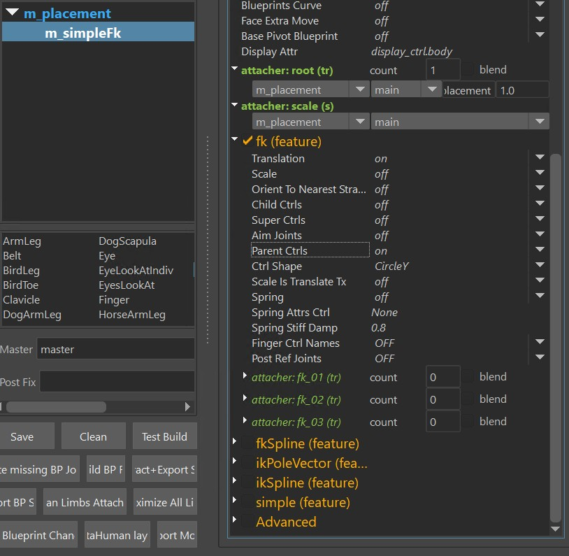  

It gives you those ctrls:  
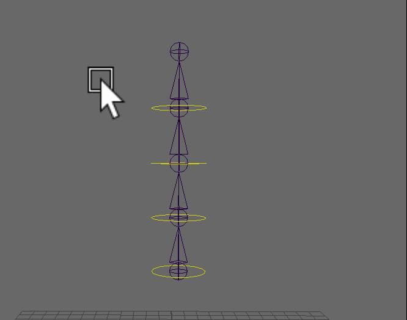  

!!! tip
    For the simple fk it's recommended to keep *Blueprint Count* and *Spine Count* as
    the same number, so you can specify exactly where the joints and ctrls should be. 

### fkSpline (feature)
Many times we want to have more joints for better deformations, but keep the ctrl count low. Then it would 
make sense to switch to *fkSpline*:    
  

#### fkSpline - Add Remove Ctrls {#fksplineaddremovectrls}
Adding/Removing ctrls and changing their locations works with the **ctrl percs** attribute. To add more
you first have to **resize** the attribute. First thing after that you'll notice that it's just adding 0s at
the end. But you can fix that by just right click again and **interpolate**:  
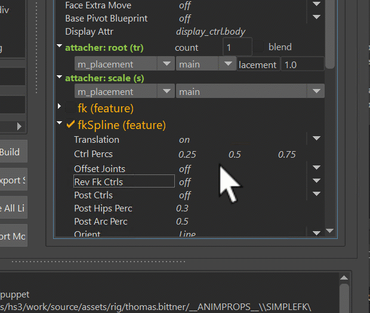  
!!! note
    There's always one ctrl at 0.0, which is not shown in the list. So if the list shows 3 ctrls, it's building
    4 ctrls because of the additional one at the beginning.
!!! tip
    Make sure to also try the **interpolate, more on end (square)** option on the right click menu. 
    This places more ctrls towards the end. Very often animators want more ctrls towards the tip of 
    the tongue or tail for example.    
      

#### fkSpline - Rev Fk Ctrls
Animators sometimes want to control the spine from the upside down:  
  

#### fkSpline - Tweaker Ctrls
!!! note 
    This is NOT related to [Puppet Tweaker Ctrls](tweakerCtrls.md) or [Face Tweaker Ctrls](../face/faceTweakerCtrls.md). The only common
    thing it has with those is that it runs on top of another setup.
It gives you those two green ctrls. They run on top of the main ctrls and rev ctrls:   
  
!!! tip
    The bottom square ctrl can be used as the main hips ctrl - especially in cartoony characters. But not always! 
    In many cases it's better to add the hips as a separate *singleTransform* or *singleBone* limb at the bottom.  
    

#### fkSpline - stretchMode {#fksplinestretchmode}
The *stretchMode* attribute specifies how the joints should be controlled by the curve.  
The options are:  

- **spline ik**
- **curveInfo nodes** (soft twist)
- **curveInfo nodes** (rigid twist)
- **motionPath nodes** (soft twist)
- **motionPath nodes** (rigid twist)

*Spline ik* is using the maya spline ik, which comes with extra *minStretch* and *maxStretch* values. This is very important 
for realistic creatures where you need to have the torsos keep their lengths:  
   
!!! warning
    *Spline Ik* does NOT have stable twist values! If you use that mode, you'll have to turn on the *Ctrl Twist* in the 
    [*Advanced*](#advanced-spine) section

**CurveInfo nodes** is using the *pointOnCurveInfo* nodes, and the **motionPath nodes** are using the *motionPath* nodes. CurveInfo nodes
is faster and should be used in most cases. But motionPath sometimes gives better distribution. So if with *motionPath*
I move only the top ctrl, the whole spine changes, while with *curveInfo* it's more localized:
  

The difference between **soft twist** and **rigid twist** is that for *soft* it's creating a curve for the twisting, while for the rigid twist
it's just finding the upvector points by interpolating some offset vectors.  
Rule of thumb is always use *rigid twist* first. And if it's giving you weird behavior, try *soft twist*.

!!! note
    In 99 % of the cases the twisting should be ok with either soft or rigid. If you hit that one percent where the twist is  
    behaving strangely, try switching the *up axis* from [0,1,0] to [0,0,1]

#### fkSpline - preIk
PreIk is creating some ctrls that are manipulating the FK Ctrls.  
    

This is an alternative to using the **ikSpline** feature shown below, and it's mainly for speed optimizations on Biped Torsos. 
Because if you create *ikSpline* and *fkSpline* at the same time so you get a switch, it results in a heavier setup.
So this preIk is more like a fake Ik, where it's controlling the FK ctrls with some additional IK Ctrls.
And the speed improvement can be huge, because spine in general is a bottle neck in parallel computation since not much
can be evaluated until the spine finished evaluating.

Other bonus you get from the *preIk* is that animators can still utilize the **Rev Fk Ctrls**.
    

### ikSpline
*ikSpline* has some similarities to the *fkSpline*, with the main difference that it's ik   
    

!!! tip
    As mentioned above - if you are creating a torso rig, consider using just fkSpline and *preIk*, since in many cases that would be better for performance. 

#### ikSpline - add/remove ctrls
Adding/removing and positioning of ctrls is happening with the *Ctrl Percs* attribute.    
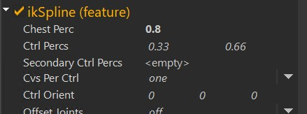  
You can adjust it the same way as the *Ctrl Percs* [fkSpline](#fksplineaddremovectrls)

#### ikSpline - Chest
If *Chest Perc* is at 1.0, there's no chest, and the top ctrl is called *spineTopIk_ctrl*. If you give chest a lower value, 
for example 0.8 - the top ctrl is then called *spineChestIk_ctrl*, and the lower ctrls are compressed between 0 and 0.8:  
     

#### ikSpline - stretchMode
*stretchMode* behaves the same as on [fkSplines](#fksplinestretchmode)

#### iKSpline - cables/straps
Very often we use the Spine limb for cables/straps 
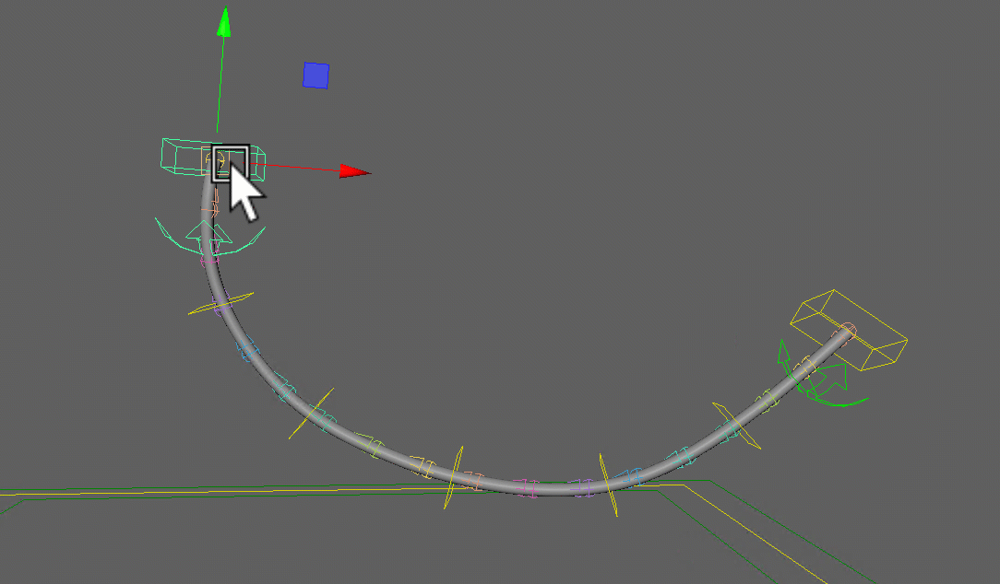  
See the image below for how attributes were set in the gif above:   
   
The green rounded arrow ctrls that you see in the gif above are the Tangent Ctrls. 
They are created automatically and just need to be turned on with the visibility attributes on the end ctrls.

Other tips on cables/straps:

- Very often you'll want to activate the **Remove End Ctrls**, because you can still use the attachers on them without the ctrls.
There's just a small *known bug* that the attacher weights will get ignored *unless* you set the attacher to *Blend*!  
- **Attach Middles To Line** is always activated by default. But often you don't want to have the ctrls follow the outer points.
- If you want the cables/straps extra smooth, try **Auto Tangent** as shown following topic.

#### ikSpline - Auto Tangent
*Auto Tangent* tries to keep the curve smoother by aiming to the neighboring ctrls.
    

!!! warning
    This is doing some aiming with automatic polevectors, so it can get unstable in some cases. 

### Advanced (Spine)
If you turn on the *Advanced* checkbox at the bottom, you'll get those extra squash joints:   
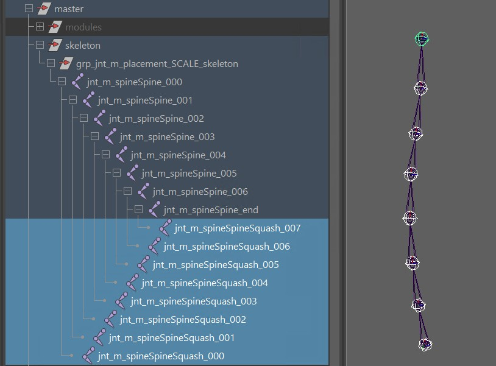    
This give you a few more options:  

- adjust the **orientation mode** (needed if you used *spline Ik* as *stretch mode*)
- give animators the power to **scale the joints with the ctrls**
- add some extra [**Dynamics**](dynamics.md#spine-dynamics) that run after the animation 
- **distribute the orientations** of the joints to behave more stable on fat characters

Most of it should be self explanatory, except **distribute orientations** deserves a bit more attention.

#### distribute rotation for fat characters
See how on the left side the cubes of the spine are crashing with each others? It's because the joints
are just orientating based on the ctrls around them. And the wider the bellies are in relation to their heights,
the stronger the crashing will be.  
The solution is **Distribute Rotation Start To End**, which assigns a new orientation to those joints that is blending between
bottom and top ctrls of the spine:  

!!! tip
    You have two attributes on each squash joint to fine tune that behavior:  
      
    For saving those you'll have to do a [python function](../python/python1.md#simple-way-of-adding-a-function).

#### skinning the squash joints 
If you already skinned the character, and you turned on the *Advanced* checkbox later, you can easily transfer the 
skinning to those squash joints by selecting the meshes and right click option:  

!!! tip "Kangaroo Tool Tip"
    Since the squash joints are simple joints without children, most skinning tools won't skin them nicely.  
    But the Kangaroo Skinning Tools ([*Flood*](../tools/toolsSkinCluster.md#flood) , [*Move*](../tools/toolsSkinCluster.md#move), ..) 
    will treat the squash joints as their parent joints when skinning them, so the weights distribution when flooding
    more than one joints the same time is more stable.

!!! tip
    In the advanced section you can also turn on **Dynamics**. This is explained in the [Dynamics](dynamics.md#spine-dynamics) section.    
    But before activating that, we recommended to try the [Spring](dynamics.md#springs) first!

## ArmLeg
This is the limb we use for arms *and* legs.  
When we use it for the leg, we just switch the **Is Leg** attribute to **on**:  
  
This changes the ctrl names (*elbow* -> *knee*, ..) default blueprints and default rotate orders.
!!! warning
    Setting the limb to *Is Leg* is easy to forget! Because you'll find that it's still working, but just later you might realize that the knee is called elbow.
    And then it might be risky to change at that point.

### ik (feature)
#### World Orient Ik Ctrl {#worldorientctrlarmlegik}
*World Orient Ctrl* makes the ik ctrls as joints, so it can make use of the joint orient values:  
  
Because feet should always translate in worldspace. But if they are oriented outwards in the model 
(and you are forced to have the blueprints oriented outwards, too), a regular ctrl
with a simple *transform* node would not be able to have orientation and translation in different spaces. But the *joint* node 
has a bit of extra power with its joint orient values.  
Here you can see that the translation is still in worldspace, while the foot orientation is not:    
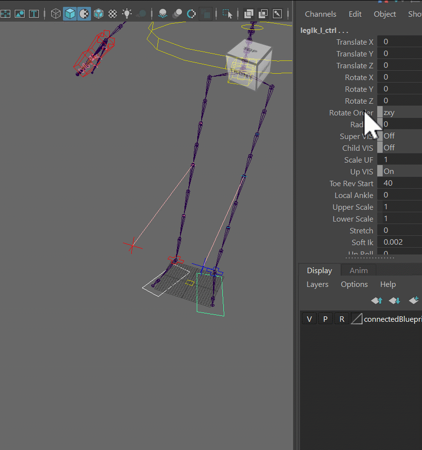  
!!! tip
    If you are using *Studio Library*, make sure to switch to the latest version. Because older versions don't like joint ctrls. 
*Why is it not just on by default??*  
There's one disadvantage: when you draw a rectangle to select all the ctrls, it'll *only*
select the joint ctrls and not the others. This is because Maya is trying to help you by making joints a higher selection priority.
Unfortunately it's not so helpful in this case. So if animators start whining because they can't select all ctrls together with rectangular selection, you'll just have to tell the
modelers to make the feet straight so you can switch that option off.

#### Pivot Ctrls
The **Pivot Ctrls** attribute just defines which control you want to have as actual ctrls and which ones are just attributes 
on the ik ctrl (*legIk_l_ctrl*).
If all animators in the world agreed to one system, we wouldn't need this attribute. But here we are - most animators are very specific
about which control they want to rotate and which control they want to slide as attribute.  
This is what you get when you set it to **all**:
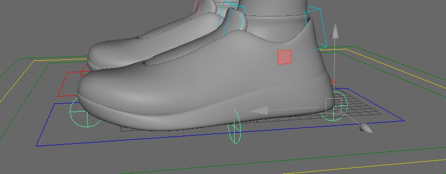
Switch it to different settings - you'll notice some ctrls disappear, and you have attributes on the ik ctrl (*legIk_l_ctrl*) instead:  
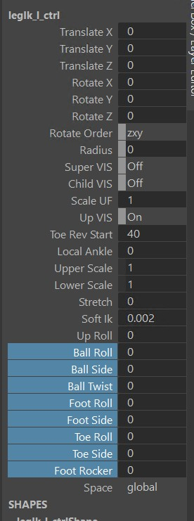

#### Toe Fk Ctrl
The *Toe Fk Ctrl* is the same idea - if it's on, you'll get this ctrl:   

If it's off, you'll get *toeBend* attributes on the IKs (*legIk_l_ctrl.toeBend*)

## Advanced (ArmLeg)
### Twist
The twist joints get created only if you activate the *Advanced*:  
   
Watch out for bad flipping! The twist setup is very stable and flexible in latest kangaroo version, but *only* 
if the three attributes (*Upper Plane*, *Lower Up Axis*, *Arm Twist From PoseT*) are set properly:  

**Upper Plane** defines which should be the stable axes and on which is ok to flip on more extreme motions for the upper arm/leg. 
On a biped arm, leave it as default (**Y**), but for a biped leg or quadruped arm/leg switch it to **Z**.

**Lower Up Axis** defines which should be the stable axes and on which is ok to flip on more extreme motions for the wrist/foot. 
On a biped arm, leave it as default (**Z**), but for a biped leg or quadruped arm/leg switch it to **Y**.

**Arm Twist From PoseT** is important for the upper arm. It should be *on* for biped arms (especially if the character is 
modelled in A-Pose), but should be *off* for biped legs and all quadruped situations.

!!! warning
    Do not forget to switch it off for quadruped arms! If you rig a quadruped mouse or bear with this limb and you leave it as default in the arms,
    the twist will get unstable for sure.

### Bendy Joints
Obviously we have *bendy joints* - activate them on in the *Advanced* section:  
    

### Squash Stretch Joints
This will make the bendy ctrls and knee/elbow stretch ctrls scalable. Make sure to transfer the weights to the new squash joints!
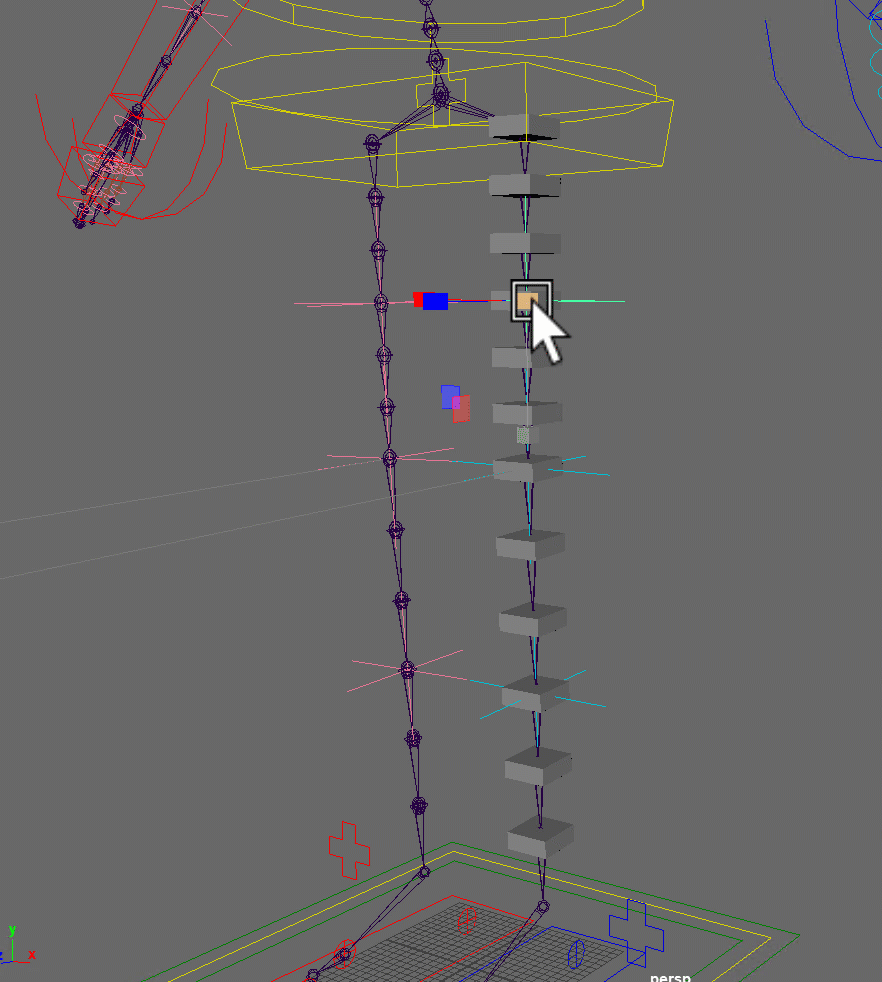      

### Double Knee
The *Double Knee* is here to help you for deformations:  
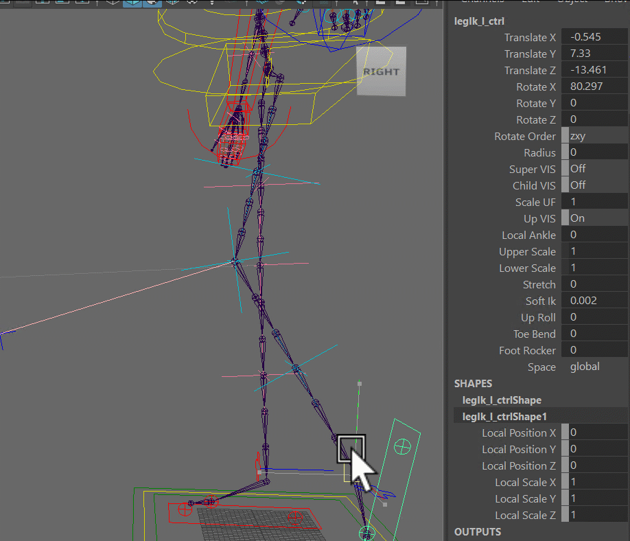   

## DogArmLeg
The DogArmLeg is for any digigrade quadruped such as dogs, cats, ..  
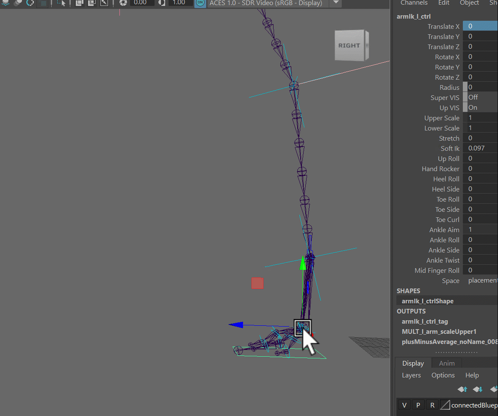      

The tricky thing on the digigrade legs is getting the midfinger roll on the paws behave well. 
One thing that helps is getting the *fingersMid* blueprint joint from the leg placed in the same line as the toes mid joints:   
      
In some cases you might even want to tweak the *Dog Mid Finger* attributes on the finger limbs:  

!!! tip
    Make sure the model is anatomically correct on the toes! If the anatomy is wrong in the model, 
    getting a good looking midFinger roll might be possible but is very difficult.

## HorseArmLeg
Works similar to the *DogArmLeg* in many ways. But it's simpler to setup because it doesn't need toes:   
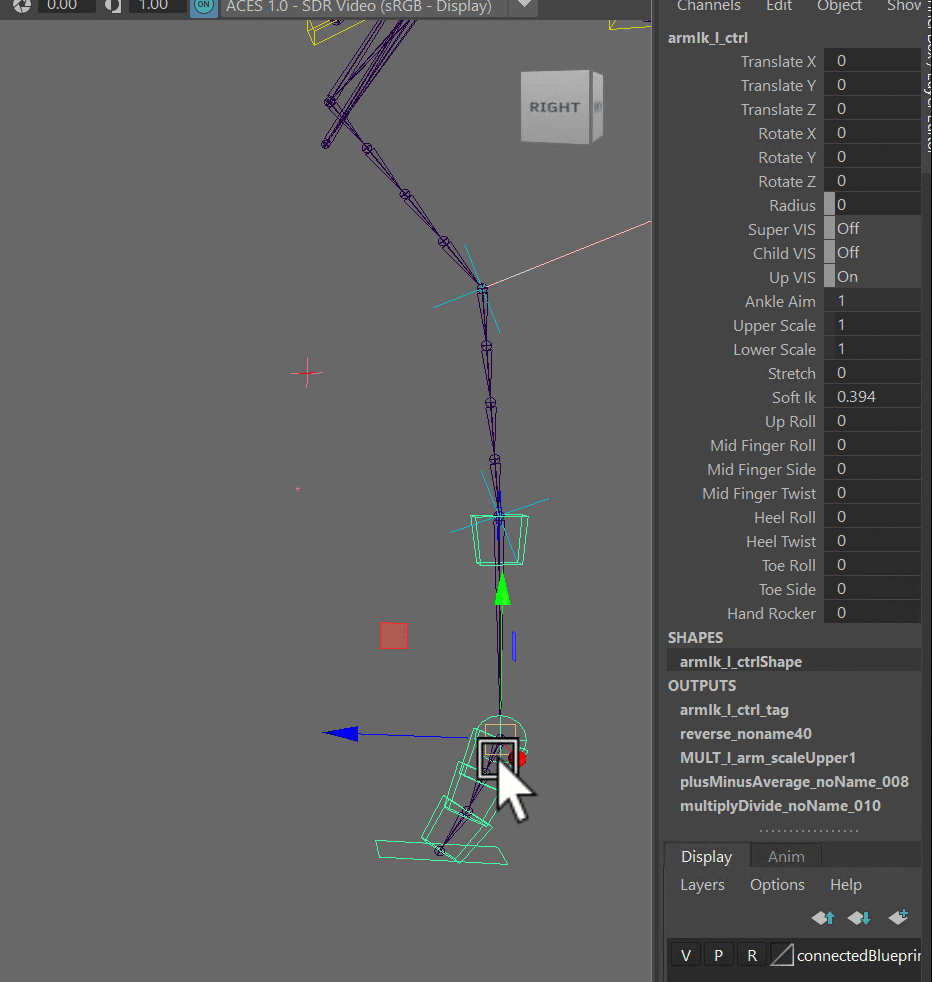      

## BirdLeg
Also similar to the *DogArmLeg*, but it's got the main difference that the first bone is an FK and second and third
bones are the IK, while on *DogArmLeg* the IK is on the first two bones.  
  
Animators might still want the *ankle* ctrl as we have on the dog. For that you can turn on **Tweaker Ankle**

## Clavicle, DogScapula
### Auto Clavicle
The *Auto Clavicle* needs to be activated on the arm limbs:   
     
!!! warning
    Make sure you don't have the clavicle/scapula specified in the attachers! In older kangaroo versions you
    had to - but in latest Kangaroo 5 the next parent should always be the spine. And Kangaroo knows that when 
    *Auto Clavicle* is on, the root of the arm will be attached the clavicle/scapula.

### DogScapula
The *DogScapula* should be used for most quadrupeds, and in the last Kangaroo version 5 it has evolved to something far 
more complex than the *Clavicle*.  
First thing you'll notice on the quadruped template characters it that the scapula blueprints start from the other side
and far outside the character:  
  
This is because the clavicle translates in spherical space, and that blueprint point on the opposite side is the 
pivot point of that spherical motion. When placing it, it helps to snap a sphere on it:  
   
!!! note
    If you are porting from an older version of Kangaroo, please recreate the blueprints. They changed a lot.

*Why is it a spherical motion?*  
Because the scapula translates around the ribcage. And especially for up/down this results in a spherical motion.
But not so much for forward/back, that's why you can tune down that a bit with the attributes **Horiz Linear Front**
and **Horiz Linear Back**.

The **Pivot On End** attribute goes from 0.0 to 1.0 and specifies where the main ctrl should be located. In the following
gif the left one is 1.0 and the right one is 0.0:  
    
For many cases you'll want to keep *Pivot On End* at 1.0, and then let animators use the extra secondary ctrls to
do some fine tuning:  
    

And for automatically following the arm, animators have a few options - they can either have it rotate (aim), or
they can have the position locked to the arms.

     

!!! tip
    While dogs and cats in real world both rotate and translate their scapulas on the walk, dogs rotate them more than 
    translate them, and cats translate them more. You might want to set the default values accordingly.

## Finger
The *finger* is a bit of a special limb. It should only be used with for arms/legs. For any extra special case it's 
best to use the spine.

!!! tip
    If you want to create some more alienated finger setup where you find that the finger limb doesn't help you, you can
    use the spine limb, make it simply *fk* and activate *Finger Ctrl Names*  

## Belt
A lot of characters have belts, so we created a limb specifically for that. But actually the belt
can do more - it can rig anything that's shaped in a circle such as wrist bands, pants cuffs, etc.  
     
The blueprints are very simple. It's just a curve and the ctrl positions are the CVs:    
     

You can specify the ctrl count with the **Ctrl Counts** attribute, and the joint count with the **Curve Joints** attribute.  

### Belt - Simple Joints
You can also set *Curve Joints* to *None*. In that case it won't put the joints on a spline, and instead will
create a joint for each ctrl.  
And in that case the result is the same as if you would put a few singleTransforms in a circle. We use this very often
for simple things such as wrist cuffs or pants cuffs where animators don't need anything fancy, just a few ctrls laid
out in a circle.   
!!! note 
    You may have to revisit the blueprints if you switch to no curve joints - since the ctrls are placed at where the 
    CVs are, the joints will also be on the cvs and NOT on the actual curve!    

And something cool - when you create the blueprints for a left and right belt, it still mirrors the layout live!  
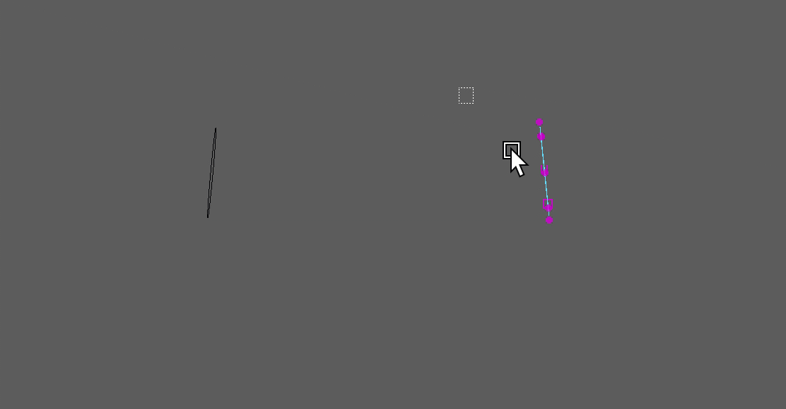     

## Eyes
There's **Eye**, **EyesLookat** and **EyeLookatIndiv**. 
Those are explained in [Eyes](../face/eyes.md#eye-puppet-limbs).

## Wheel 
This is for cars
!!! warning "New Limb" 
    "wheel" is new and hasn't been tested in production yet

## *Custom Limbs*
Yes, you can define Custom Limbs. It's rare that we need to do that since the existing ones have a lot of options,
and additional features might be easier to handle by just adding additional functions.  
But if you do want to go into detail and make your own limb, you can find how to do that [here](../python/python2.md#custom-limbs)

!!! warning "Decent Python level required!"
    A decent Python level is required for creating Custom Limbs! Before writing your own custom limb it's recommended to see if you can 
    solve it with simple [Python Functions](../python/python1.md#simple-way-of-adding-a-function)

