---
title: Puppet General
---

# Puppet General

The Puppet tool defines the main ctrls of the character, such as spine logics, arm/leg FK/IK, Auto Clavicle, etc.  
It generates the blueprints.ma file (guide joints) and the puppet.rig - which then the builder uses to build the rig.

Let's look at all the cool elements in the UI:
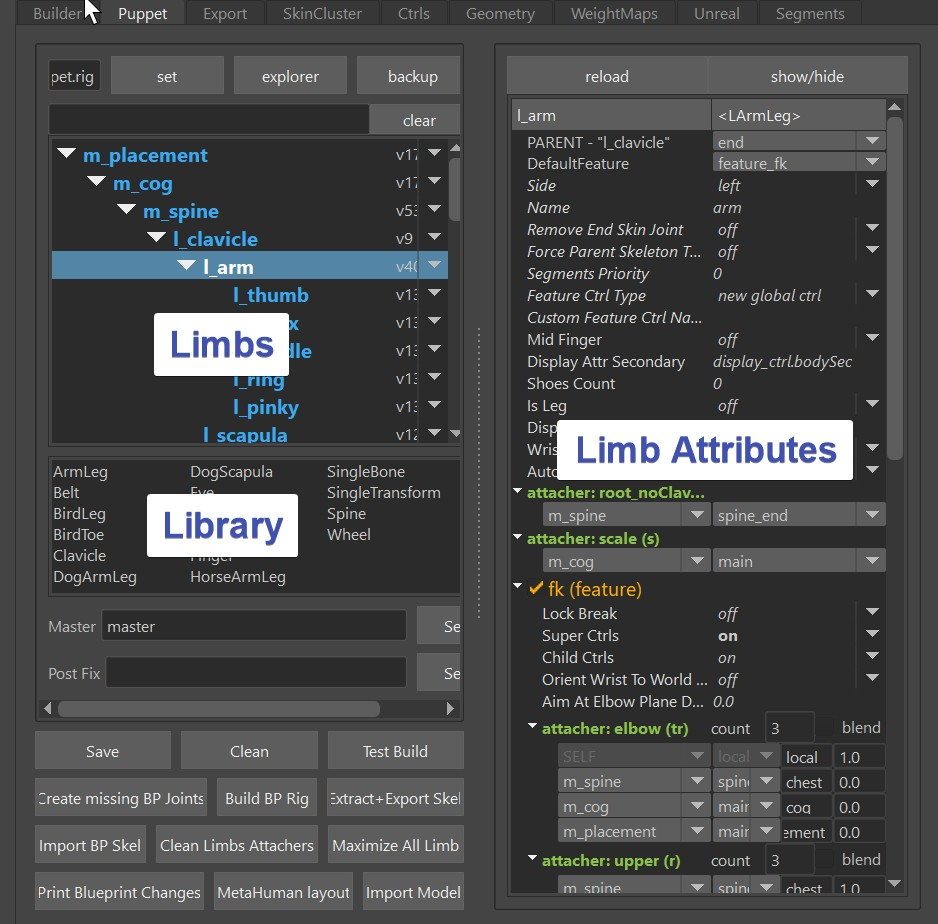

The first table shows the **Limbs**, and below is the **Library**. You can just drag a limb from the 
library into the Limbs. And whatever limb you have selected, you can adjust the **Limb Attributes** on the right side

## Change the Guide Joint Locations
To change the Locations, you need the **BP Rig**. And to get the *BP Rig*, click those buttons in the right order:  
1. **Clean**  
2. **Import BP Skeleton**    
3. **Build BP Rig**

You'll click these 3 buttons together a million times, here's a gif that shows this process:
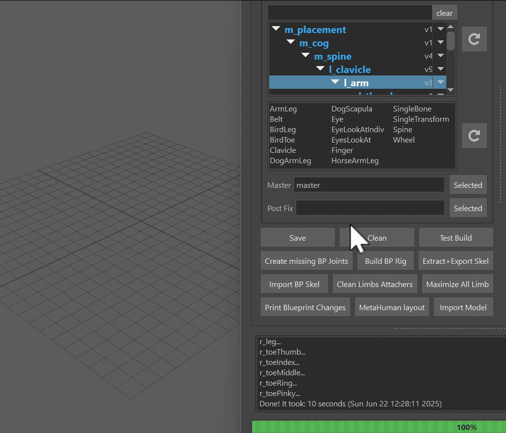

**BP Skeleton** is a file with simple joints that tells the builder where the locations are.
And the **BP Rig** is a small rig with ctrls and some logic build on top of the *BP Skeleton* that helps you place it. 

Once you have the BP Rig built, place its ctrls:  
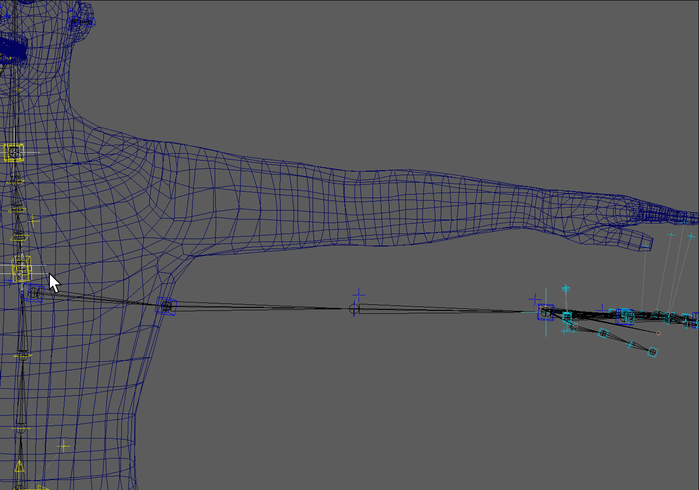  

!!! tip
    A quick way of importing the model is just clicking the button **Import Model**. 
    This runs the importModel() function from the builder.  
    

There's a lot of ctrls that can make the placing process very efficient, as long as you move around the ctrls in the
right order:  
  

The feet might overwhelm you a bit at the first time:  
   
But if you have a character that just has shoes, you might be able to get rid of the toes!   
Then it becomes a little simpler:  
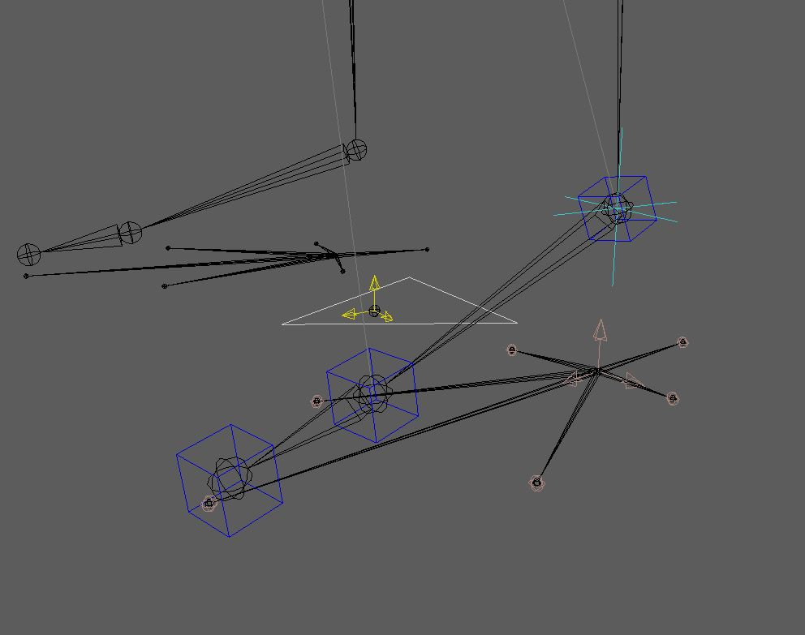    

The big ctrl in the middle with the three arrows  is the one 
that tells the orientation of the foot. 

!!! Note 
    If you want to have the feet translate in worldspace (animators usually hate it if they are not), you don't actually
    have to orient that ctrl to be in worldspace. Check [World Orient Ctrl](limbsReference.md#worldorientctrlarmlegik)

The light red sphere ctrls  are the pivots for things like foot roll and footRocker. 
For the sphere on the inside/outside you might be wondering why there's 2 on each side. That's because they also define the orientation. The pivot point
is basically in the middle and aiming to one of them.

!!! note
    On the hands you have the same complexity with all the pivots. Because hands also have the same rocker/roll setup, 
    except that in most cases it's barely used. 

When you are done placing the blueprints, click the button **Extract+Export Skel**.  
There are 2 very strict rules:

- **Never export without having built the BP Rig!**  
- **Never open the previous BP Rig and export from there!**
  
Always follow the 3 button click workflow (Clean -> Import BP Skeleton -> Build BP Rig) from above. It's just to keep things clean. 
Any unintentional change resulting from some bad shortcuts can get expensive when we
are talking about animation ctrls.

!!! tip 
    You can however move around the joint roots inbetween importing BP Skeleton and building BP Rig. 
    But ONLY joint roots! If you do want to move around child joints, make sure to only translate them in X. And don't
    change the sign (postive <-> negative)  
    Moving around joint roots can be useful when placing them for the first time after creation.  

!!! note
    Theoretically it does let you export without building the BP Rig, but that's not recommended it's only there
    for debugging purposes. 

!!! warning
    Do **NOT** change the *Display Joint Size*! If you've specified 
    a different value than 1.0 in *Display -> Animation -> Joint Size..*, please change it back to 1.0.
    This is because some ctrls will be sized based on the joint radius values. And if you have a different *Display Joint Size*,
    those radius values will be bad.  
    If you find the joints are all too big or too small, click the  
    (allJ) buttons to change all their sizes at once.

## Adding Limbs
You can easily add limbs by dragging one from the libarary table into the limbs table:   
  

And the first thing you do after you created a new limb (and maybe adjusted some attributes) is place the blueprints.
If you've already built the *BP Rig*, you'll have to rebuild it.  
First import the *BP Skeleton*. At this point you could build the *Blueprint Rig*, but often it'll make your
life easier if between building *Blueprint Skeleton* and *Blueprint Rig* you click *Create Missing BP Joints*, 
and move around **just the root** (Careful with child joints in this step!).  
Watch this gif to see how it looks in action:  
  

!!! tip
    For a full reference of what limbs are there, check the [Limbs Reference](limbsReference.md)

## Attachers
Attachers are all about spaces. For example the Hand IK following the COG or the Spine. 
And they need to be fully understood to really use Kangaroo efficiently.  
Look at how many attachers alone the arm limb has:  
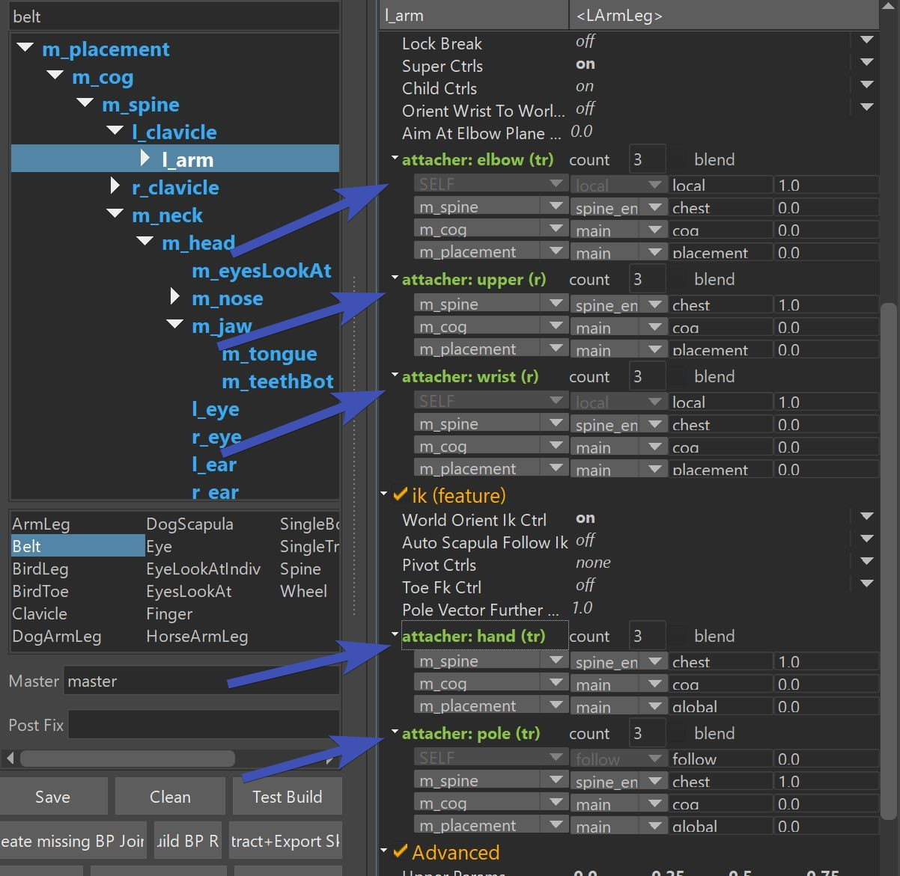 
And this is not even everything, with attachers you can even make things follow some deformers!    

For each of the attachers you can add/remove output points by adjusting the count value:  
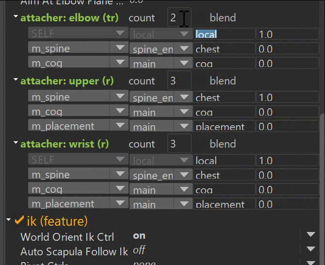 
!!! note
    Not all attachers have that count value! Especially for the root you'll notice on some
    that can only one output point.

### translate/rotate/scale
You see how every attacher has either **(t)**, **(tr)**, **(r)** or **(s)**? Those specify if 
translate, rotate or scale is affected.   
Whereever you see **(tr)**, you can split it into *(t)* and *(r)*.  
In this gif I'm splitting them, and copying from (t) to (r) using the **CTRL+C** and **CTRL+P** 
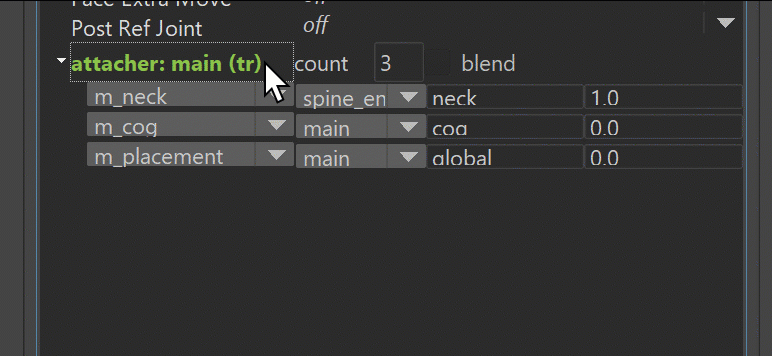  
!!! tip
    This is very useful for head or top neck ctrls. Animators always want to control the 
    position separate to the orientation.
    

### Switch vs Blend
By default it's just a switch. Animators prefer that in most cases since it's the simplest:  
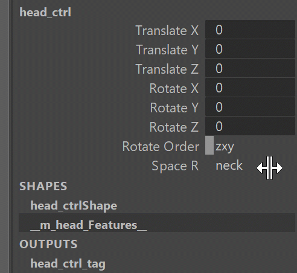  
!!! note "Kangaroo Tool Tip"
    There's this [tool](../animationTools.md#space-switch) for animators to switch between the spaces.

If you activate the **blend** checkbox, you'll get an extra attribute for each output point:  
    
Those attributes *don't* behave the same as constraint weights. Instead it's an additive system
being clamped to stay within 0 and 1.  
Basically from top to bottom they overwrite the previous/upper ones. The first one (in this case *parentA*)
is always 1.0 and locked.  
If you set *parentB* to 0.8, *parentB* has 80 % influence and *parentA* has 20 %.
If then you set *parentC* to 0.5, *parentC* has 50 %, *parentB* has 50 % also, and *parentA* has 0

!!! tip
    Animators usually prefer switch because blend seems very technical. But the blend can be very 
    useful when you setup some special rigs such as props or costumes.  

### Custom Attachers
Custom Attachers are primarily used to have some ctrls follow the geometry or deformers. Most of the time
we make them follow deformers. This looks like the ctrls are following the mesh, but actually they are driven by nodes that replicate the
deformer behavior at the vertex closest to the ctrl.  
To use them, just set the combo box to **<Custom\>** and having the mesh selected, open the **Attach Deformer UI**:  
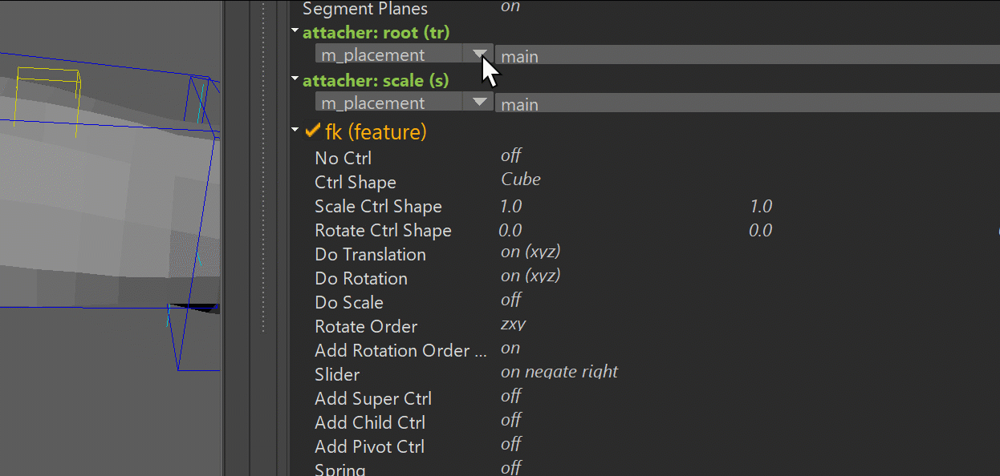  

!!! note
    Custom attachers are heavily used for [Tweaker Ctrls](tweakerCtrls.md)

You can also specify a vertex at the bottom. But *DO NOT* use that unless you have to. Because setting a vertex id means having
geometry data inside the puppet data and that gets messy when the mesh topology changes or you want to reuse the setup
for another character with different topology:  
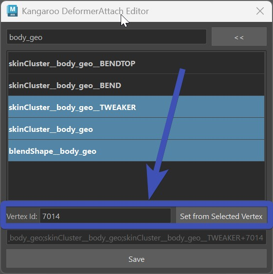  

!!! note
    You won't see the result of the custom attachers after running *Test Build* or the *buildPuppet()* function. Instead 
    the builder needs to run until *puppetCustomAttachments()*, since the real magic of the custom attachers is happening there. 

## Display Attributes
### display_ctrl
In all the template characters there's the *display_ctrl* that has a lot of display attributes:  
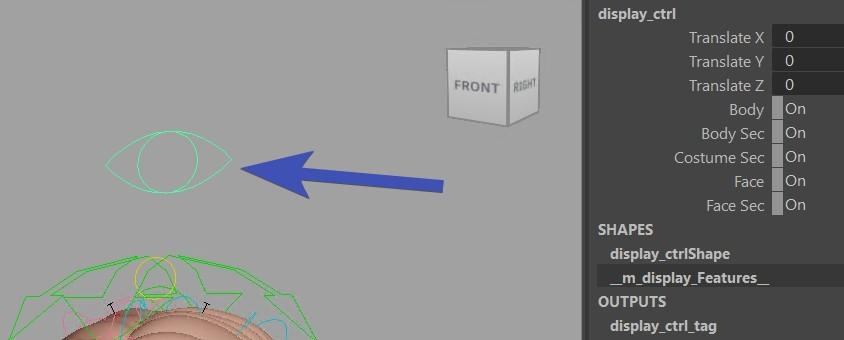  

And that's just a simple *singleTransform* limb with its own blueprint:
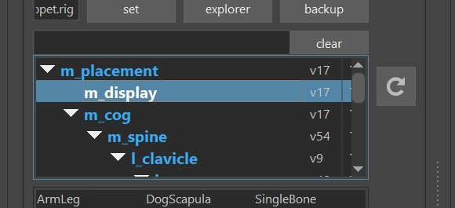  
!!! warning 
    Don't move it around in the hierarchy of the puppet tool! It's important that this is at the top, first limb
    after the master limb (*m_placement* in this case)  
    It even cannot be after the cog, it needs to be before:
    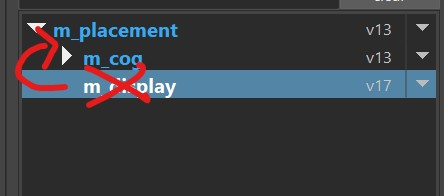     

And all the limbs have display attributes to which tag (attribute) they belong to:  
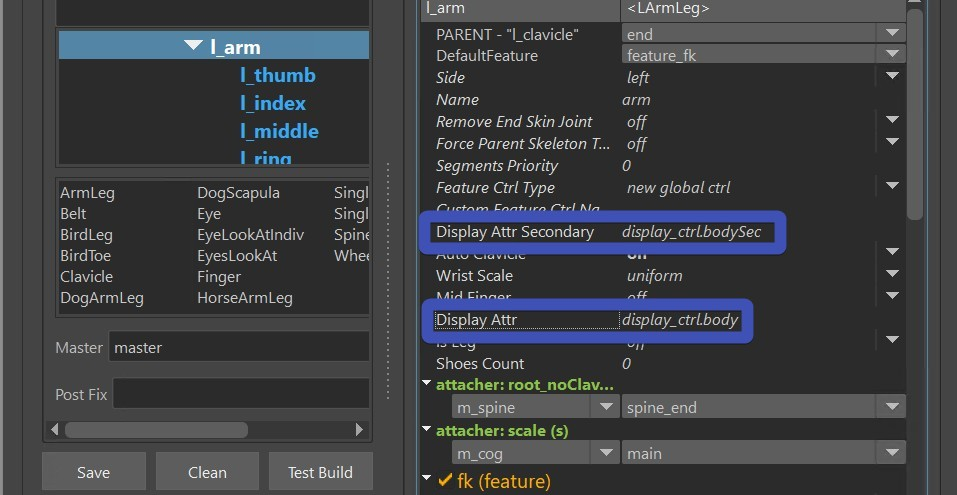     

!!! note "Other Ctrls.."
    *But what about all the ctrls generated in functions outside of the puppet tool?*  
    Usually these functions have an attribute called *sDisplayAttr*:  
         

!!! tip
    If you don't like the order of the attributes on the ctrl, those are easily changed on the
    *buildPuppet()* function. Just open that attribute in the [JSON Editor](../builder/jsonEditor.md), and add
    and/or reorder entries.
         

### visibilityAttributes()
For any ctrls that are not setup-ed for the *displayCtrl*, you can use the *visibilityAttributes()* function.
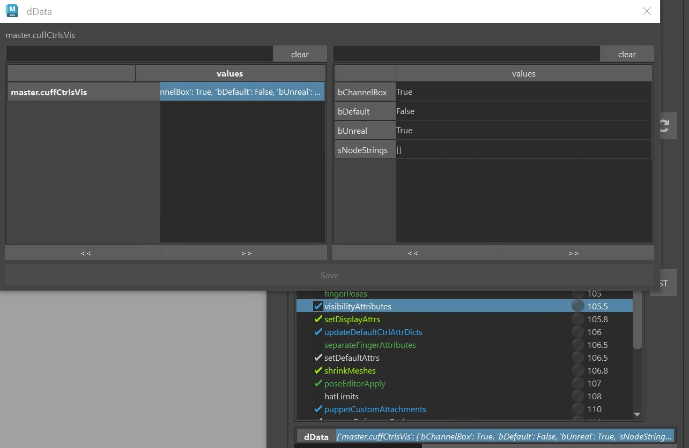     
Just open the [JSONEditor](../builder/jsonEditor.md) on the *dData* attribute, and add/adjust entries. If the attribute (most left label,
*master.cuffCtrlVis* in this image) doesn't exist, he creates one. So you could even specify one that is created 
on the display_ctrl, and just set it up to also switch some geometry visibility.

### Python
In the points above we've seen how to just add simple on/off switches. But if you need anything more fancy than
that, it's best to solve that with a [Python](../python/python1.md) function.

## Updating limbs
Every limb has versions. The is important because when a limb gets improved, you'll ususally want to keep the 
old behavior in existing characters that have already been animated.  
But if you do want to change the versions, on the right side just switch them:  
  
And if you want to just switch all limbs automatically to the latest one, you can do that with the 
button **Maximize All Limbs**:  
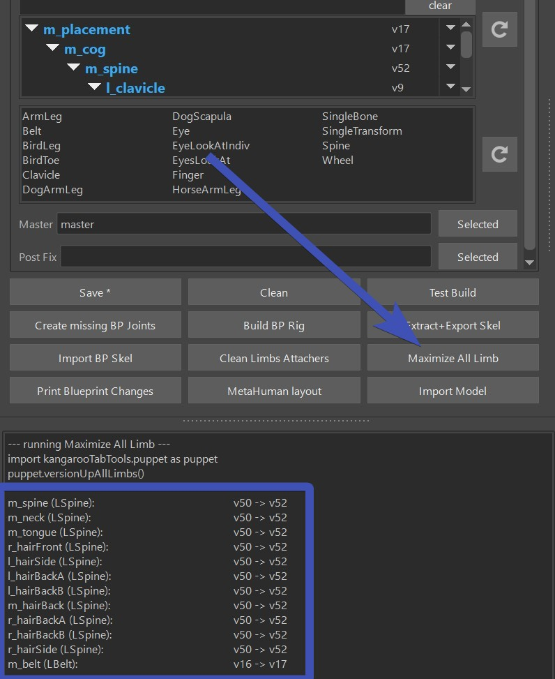

!!! warning "Don't Forget!"
    Don't forget to click the **save** button after updating limb versions!

## Feature Ctrl Type
The *Feature Ctrl* is a ctrl that holds some of the global arguments for this limb, such as FK2IK Switch or some extra visibiltiy switches.  
You set it with the attributes called *Feature Ctrl Type* and *CustomFeatureCtrlName*.   
For the *Feature Ctrl Type* you have 3 options: *Custom Ctrl*, *New Global Ctrl* and *Shape on All Ctrls*  
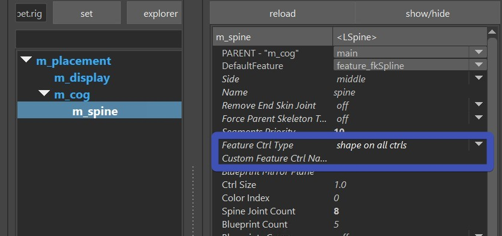
#### Custom Ctrl
It's the simplest one, you just specify the name of an already existing ctrl in the *Custom Feature Ctrl Name* field such as *cog_ctrl*.   
But make sure that in the hierarchy this ctrl is built before the current limb!

#### New Global Ctrl
This is probably the one used most of the time.  
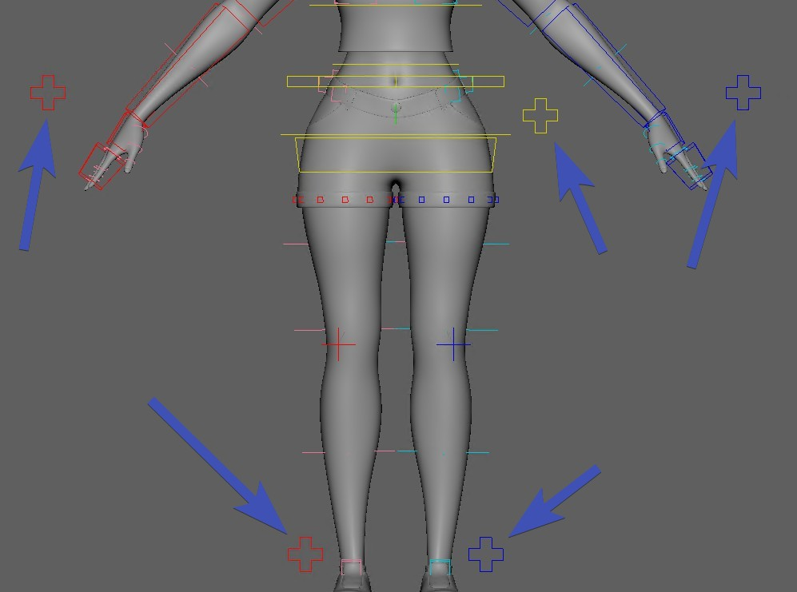  

#### Shape on All Ctrls
Animators often ask for the global attributes to be accessible on each ctrl. But in Maya you cannot add one attribute onto more than
one ctrl, and the closest thing how to solve this is putting the attributes on a shape node. In Maya you can create one shape node and
make it appear on more than one transform (ctrl).  
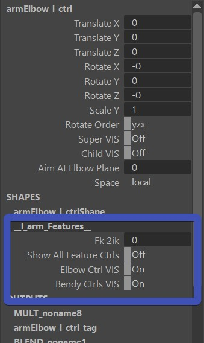   
!!! warning
    Some external tools such as *Studio Library* don't support this. And writing your own animation tools will likely be more complex 
    since you always have to check on the ctrls if there's a shape node.

## Mirror
### Mirror Limbs
Mirroring the limbs is easy. Just right click -> **mirror from selected**. *Recursive* means that he'll also mirror the children:  
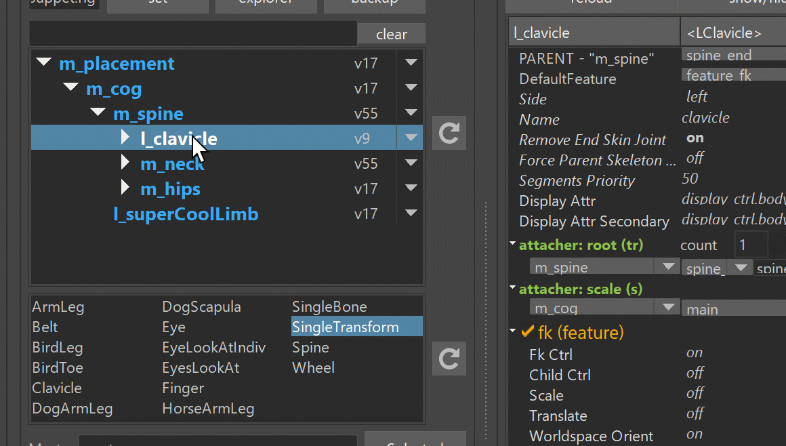   

### Mirror Blueprints
The blueprints will get mirrored automatically. But if you want to have them unsymmetrical, you can specify that with
the triangle ctrl (*bpGlobal_ctrl*):   
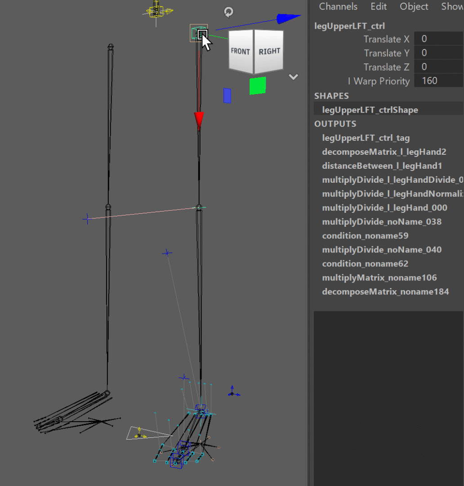   

For Middle Limbs he'll try to keep the joints in the symmetry axis, unless you tell him not to with the triangle ctrl:   
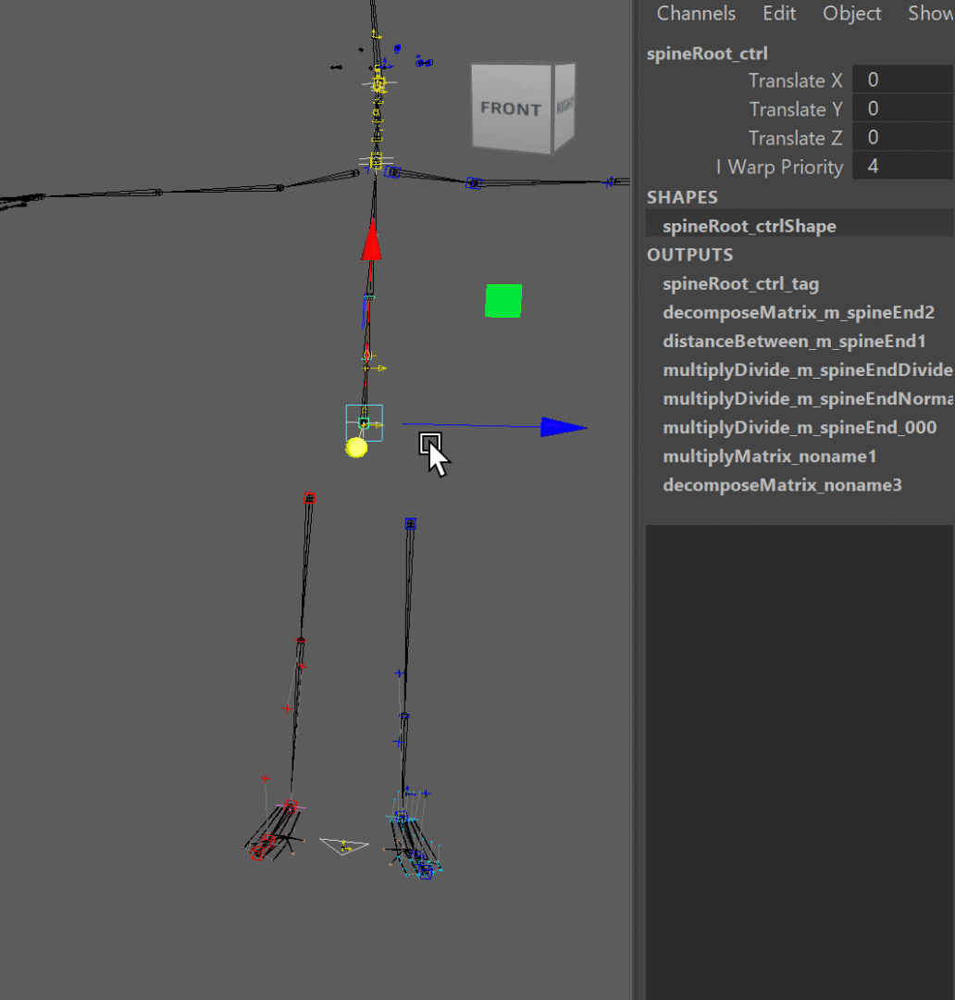   

## Nearest Worldspace Matrix
Animators often want ctrls to be oriented straight in worldspace. 
On some limbs such as *Spine* and *SingleBone* you can find a few attributes starting with **Orient To Nearest Straight Matrix**:  
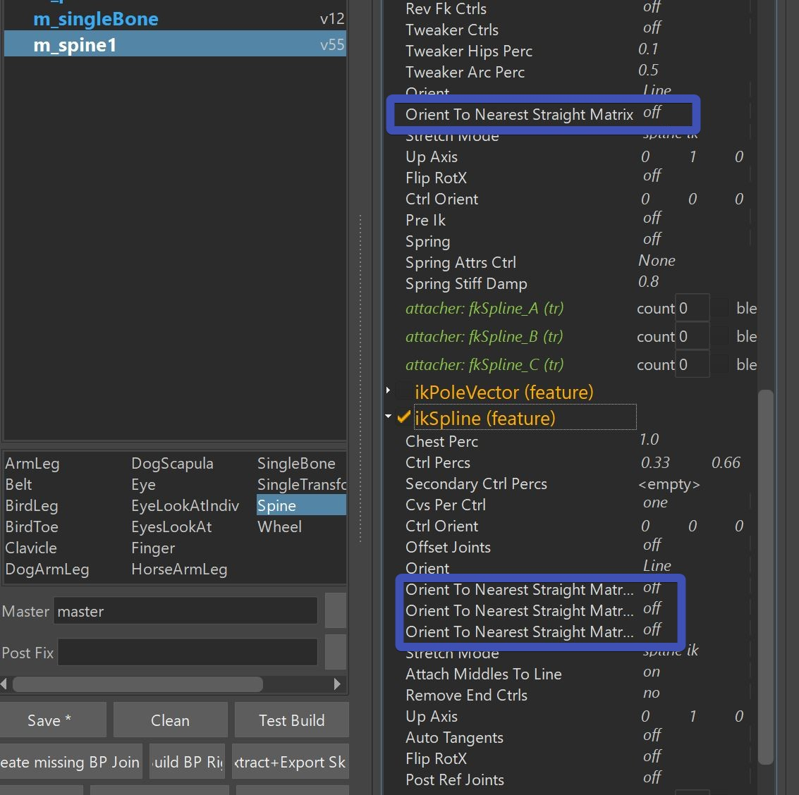   
Those will orient the ctrls to be in world space.  
!!! tip
    Whenever you want some ctrls to be oriented straight, you should always check first if you can solve that with the blueprints.
    Those *Orient To Nearest...* attributes should only be used if orienting the blueprints doesn't work well. 

While most of the time this is easily adjustable with 
blueprints, in some places it's more convenient to not rotate them straight.

## Joint Parents
The very first attribute on the top starts with *PARENT*  
This doesn't really change the rig logic, but it specifies where the joints should be parented to.
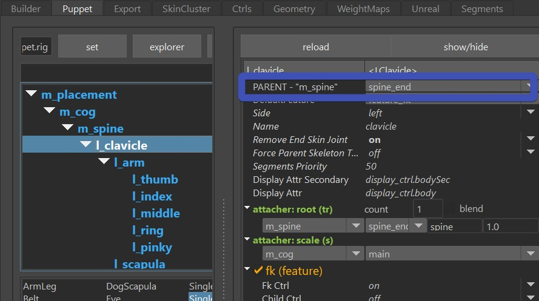  
See how those joints would be better parented under one of the lower spine joints? That's what you can fix with 
the *PARENT* attributee:  
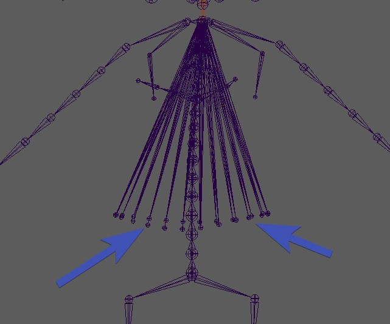  

## Auto Parent and Auto Set
Like mentioned before, the *PARENT* attribute doesn't actually change the rig logic, the real entry that makes
the top nodes of the limb follow another limb is the *root attacher* (**attacher: root**). If you didn't know that, it's
best to go back and read about [Attachers](#attachers).  

Now imagine you have lots of limbs attached to another limb, all those child limbs need to have the **attacher: root** 
set properly, otherwise they'd get the default which is rarely a good thing:  
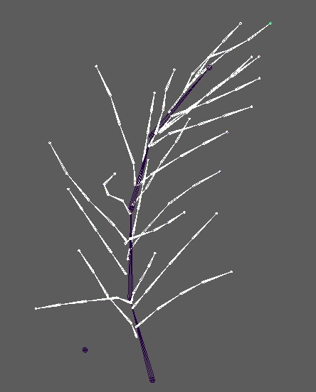  

But there's a trick. **After you built the rig**, with right-click and **set to closest** on the combo box you can make him find the closest 
output (joint) of the current root limb:  
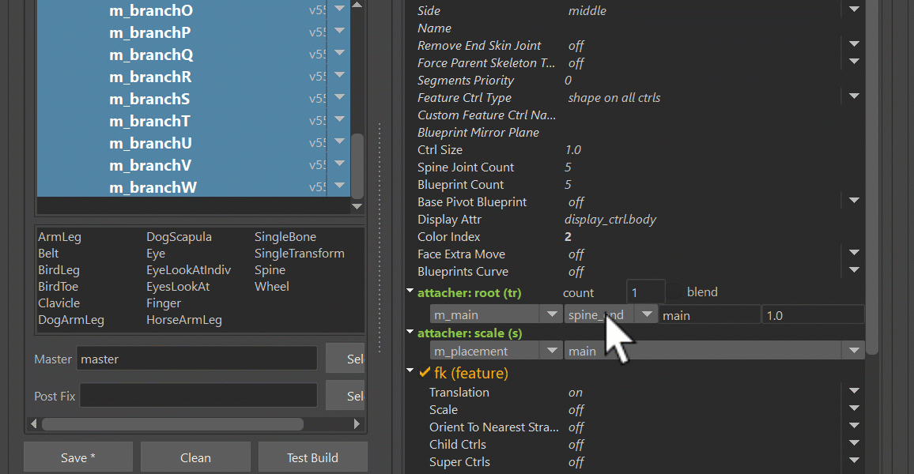  
The reason why it needs the rig built is that it's actually checking inside the rig (maya scene) which are the closest joints.

To have the *PARENT* attribute set automatically from the **attacher: root**, right click on the *PARENT* combo box -> 
**set to root attacher**:  
  

!!! note 
    There's a little known issue at this time - when you click **set to attacher**, the combo box doesn't always update
    right away. But you'll see that it did something when you deselect and select again.  

