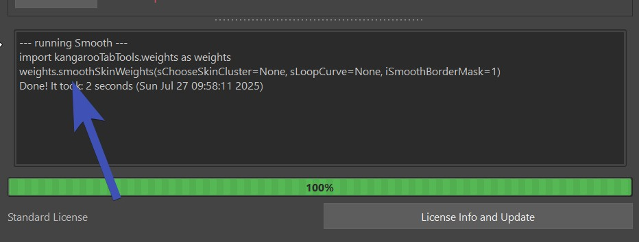
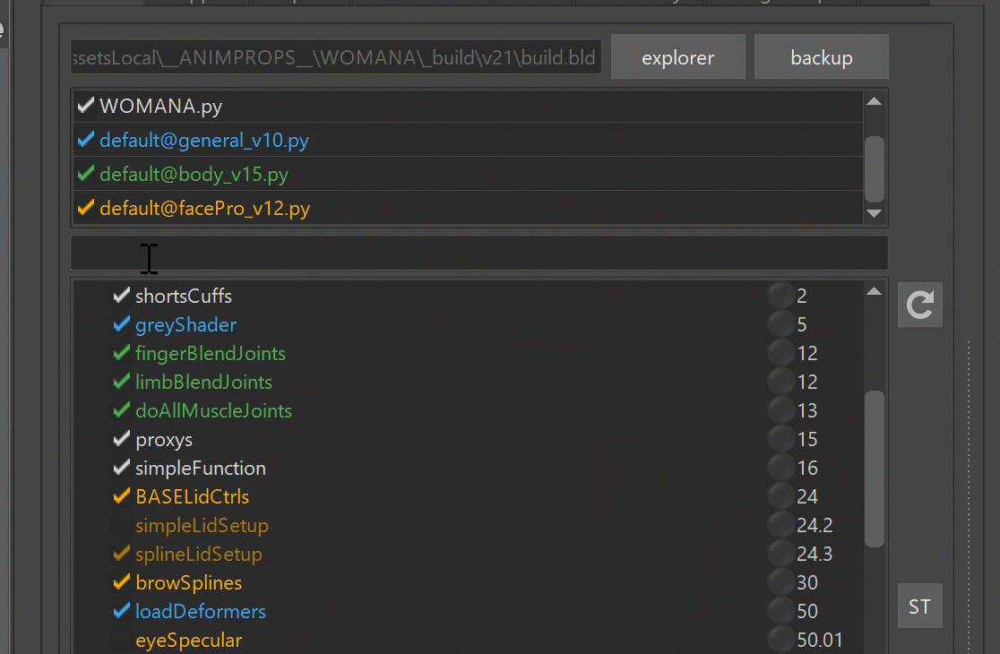
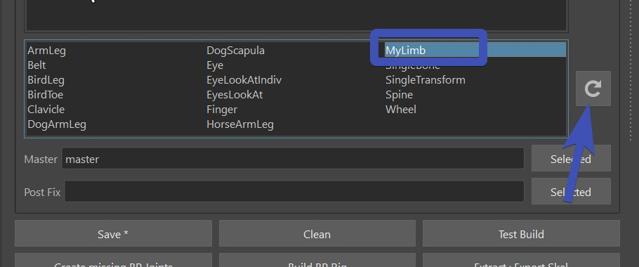

## Running Kangaroo Tools
Many tools in Kangaroo you can run separately in Python. Whenever you click some of the Tool Buttons, check the
output log at the bottom:



## Extra Builds
In [Python I](python1.md) we've learned how to add some fun python stuff to our character file. But what if we want to make a company wide tool
that other people can run, too - so everyone can just add the file at the top as shown in this gif:

This is where extrabuilds come in.

First we'll have to tell kangaroo with the Environment Variable **KANGAROO_EXTRABUILDS_PATH** a location where we have other python files
with some builds.

If you want to do that with the *pathEnv.mel* file just to get started quickly - the entry would look something like this:
```
putenv "KANGAROO_EXTRABUILDS_PATH" "myBuilds@D:/mayaTools/KANGAROO/myExtraBuilds";
```

Btw, for more than one build folder you'd just add them all with the same variable but separated with the **;** sign
```
putenv "KANGAROO_EXTRABUILDS_PATH" "myBuildsA@D:/mayaTools/KANGAROO/myExtraBuildsA; myBuildsB@D:/mayaTools/KANGAROO/myExtraBuildsB";
```

You could start your new build file by just copying an existing one from the *kangarooBuilds* folder and rename.

Or just start with a simple and clean file, and call it *myNewBuild_v0.py*:


```python
import kangarooTabTools.builder as builderTools
import kangarooTools.utilFunctions as utils

kBuilderColor = utils.uiColors.yellow

@builderTools.addToBuild(iOrder=16)
def simpleFunction(iLuckyNumber=20, sObjects=[]):
    print ('Hello, your lucky number is %d' % iLuckyNumber)
    print ('And the objects are: %s' % sObjects)

```

Then you can add it to the builder like shown above.


## Before or After LoadDeformer()
If you are creating a function that generates joints that need to be skinned, you have to be very aware if
the function is before *loadDeformer()* (*iPriority* smaller than 50) or after (*iPriority* bigger than 50).   
The easiest thing is to add it before. Then at the time it loads the deformer, the joints are there and
everybody is happy.  

But sometimes it makes sense to put the function after.  
For those cases, at the time you run the function you have to assume that the joints may or may not already be there, 
since *loadDeformer()* creates an empty joint at the origin if it doesn't exist yet. This means you have to restructure your joint creating
code a bit to make it check first if joint is already there or not.
This example is from the NLF setup:  
``` python
sJ = 'jnt_%s_nlf_%03d' % (sSide,j)
if cmds.objExists(sJ):
    cmds.parent(sJ, jointOrGroup(sParentJoint))
else:
    cmds.createNode('joint', n=sJ, p=jointOrGroup(sParentJoint))
cmds.setAttr('%s.jo' % sJ, 0,0,0)
```


## Connecting to Studio Pipeline
If you've managed to read until here, you are ready to connect kangaroo to your studio pipeline.
### *importModel()* replace
Create a new **Extra Builds** file as shown in previous chapter,
and add a function in there called something like *importModel2()*. And uncheck the old one (*importModel()*).  
In *importModel2()* create some code that looks in the files of your studio pipeline and imports the correct model.
For doing that you'll most likely need the code snippets in [Getting Asset Info](python1.md#getting-asset-info) for getting your current
asset infos.

!!! tip
    For finding the right file, it's best to use the python *os* module. And once you've cut together the file path
    with that, you can use the following function to import the file. The *importMayaFiles()* is good because it 
    can return the nodes he imported.
    ```python
    import kangarooTools.utilFunctions as utils
    utils.importMayaFiles(sFiles, sNamespace=None, bReference=False, bReturnAllNodes=False)
    ```
### *prepareForPublish()* replace

Let's look at the function *prepareForPublish()* in general_v13.py. 

```python 
@builderTools.addToBuild(iOrder=1010)
def prepareForPublish(sRenameMaster='master', bDeleteUnrealModel=True):
    sAsset = assets.assetManager.getCurrentAsset()
    sUnrealModel = utils.data.get('sUnrealModel', None)
    if not sUnrealModel:
        bDeleteUnrealModel = False

    utils.addStringAttr('master', 'sOldMasterName', 'master')
    sMaster = cmds.rename('master', sRenameMaster)
    ddMasters = {sMaster:{'sFilename':'RIG_%s_[v].ma' % sAsset,
                           'sExtraFiles': 'fbx/GAME_%s.fbx' % (sAsset),
                           'sDelete':['GAMEMODEL'] if bDeleteUnrealModel else []}}
    utils.data.store('ddMasters', ddMasters, sNode=utils.kExportNode)
    utils.data.store('bSaveInsteadOfExport', True, sNode=utils.kExportNode)

```

#### Change File name or Delete Nodes
Focus on the dictionary:
``` python
ddMasters = {sMaster:{'sFilename':'RIG_%s_[v].ma' % sAsset,
                       'sExtraFiles': 'fbx/GAME_%s.fbx' % (sAsset),
                       'sDelete':['GAMEMODEL'] if bDeleteUnrealModel else []}}
```
You can see here that you have the power to decide how the filename should look like. And you can specify a few 
maya nodes that should get deleted on publish. It's wise not to overuse the deletion thing, and instead add
a function that deletes it. But in certain situations the *sDelete* key can be useful.


#### Copy Output File to a certain Folder
You can also add **sCopyToOutputFolder*:  
``` python
ddMasters = {'master':{'sFilename':'RIG_%s_[v].ma' % sAsset,
                       'sCopyOutputToFolder': os.path.join(sParentFolder, '[v]'),
                       'sExtraFiles': ['fbx/RIG_%s.fbx' % (sAsset), 'fbx/RIGSIMPLE_%s.fbx' % (sAsset)],
                       'sDelete':['UNREALMODEL'] if bDeleteUnrealModel else []}}
```
The *\[v\]*' gets replaced with the version.


#### Run a function after export
In some cases the *ddMasters* keys are not enough. Sometimes in order to put things into the right place, you'll have to add some python code
that manipulates the other pipeline, even runs some of their functions.
This can be done with:  
``` python
nodes.data.store('sShareFuncPre', 'rig.global.pre_publish', sNode=nodes.kExportNode)
nodes.data.store('sShareFuncPost', 'rig.global.post_publish', sNode=nodes.kExportNode)
```

The more useful one is definitely the **sShareFuncPost** one. You basically pass a function location that gets run
after you've published to kangaroo in the usual way.  
Keep in mind that the function you are passing here (*rig.global.post_publish* in the example above) needs to be importable in python.
So the publish function later will run it as something like:
``` python
import rig.global
rig.global.post_publish(sProject, sToAssetFolder, sComments)
```

Yes, you saw right - it's passing some infos. So the *post_publish()* function in this example needs to be declared in rig.gobal as 
``` publish
def post_publish(sProject, sToAssetFolder, sComments):
    print ('sProject: ', sProject)
    print ('sToAssetFolder: ', sToAssetFolder)
    print ('sComments: ', sComments)
```


## Custom Limbs
Writing your own puppet limbs is where things get very advanced, therefore a decent python level is required.  
Start by creating an empy folder, and declare it with the Environment Variable **KANGAROO_EXTRALIMBS_PATH**.

After setting the Environment Variable restart Maya!

Then copy/paste one of the existing limbs from the *kangarooLimbs* folder of your Kangaroo installation into that new folder.
Simplest one to start with is probably *singleTransform*.  
So in this example copy the highest version of *singleTransform* - at the time of this writing *singleTransform_v18.py* - into that folder, and rename
it to reflect your new limb. It's important to keep the version syntax and make it start at version 0.  
So for example: *myLimb_v0.py* 

If you open the new file, the class name is probably still called LSingleTransform. Rename it - in the example above it would be LMyLimb.
Ideally also change the value of the default attribute *sName* from 'singleTransform' to 'myLimb'.

At this point if you click the  (reload) button next to the *Limbs Library*, 
the new limb should show up. If not, check you restarted maya after you've specified the Environment Variable.  
  

Now you have a good starting point, and you can work on your newly created limb.

The attributes that you see in the Puppet tool on the right side are all either just the function parameters of the
*\_\_init\_\_()* function or the feature functions (*feature_fk()* in this case)

The attachers get declared with extra functions:
``` python
def generateAttachers_init(self):
    return {'root': {'sTrs':'tr', 'bMulti':False},
            'scale': {'sTrs':'s', 'bMulti':False}}
```
And then inside the feature function you can assign the actual transforms like this:
```python
dAttacherBuildData['root'] = (utils.getDagPath(self.cCtrl.sPasser), self.cCtrl)
```

The actual output joints are defined like this in the *\_\_init\_\_()* function:
```python
self.dOutputs['main'] = None
```
Basically in this case you can see that singleTransform limb only has one output.
Then on the return, the first one (*fks* variable in this case) is a list of joints, and needs to be the same length as
how many outputs you declared above
```python
return fks, cReturnCtrls, dAttacherBuildData
```

