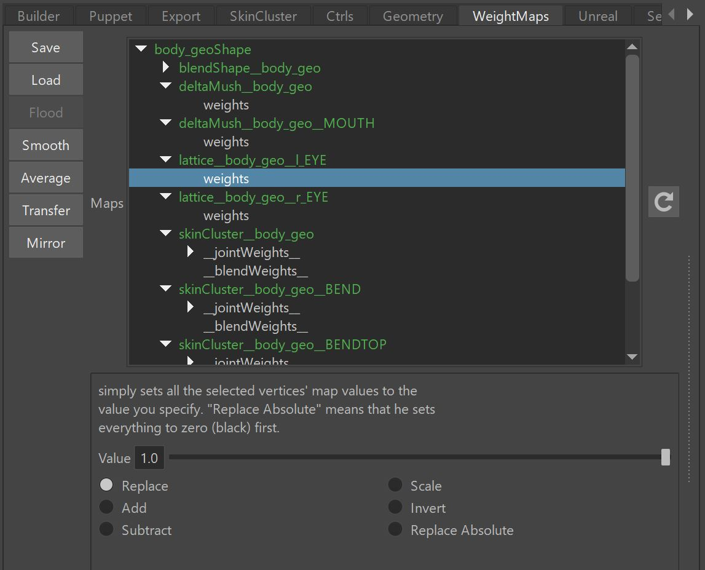

Weightmap tools are for adjusting weightmaps from deformers such as lattice, morph, deltamesh, ... basically almost
all deformers apart from skinCluster. If you need skinClusters, check [SkinCluster Tools](toolsSkinCluster.md)

  
 
The best thing to learn about the weightmap tools is by watching the [Video](https://www.youtube.com/watch?v=N2GJ6WLeMU0){target="_blank"}  

Weightmap have similar features as skinCluster tools. They can do:  

- **Flood** (first section of the [Video](https://www.youtube.com/watch?v=N2GJ6WLeMU0){target="_blank"})
- **Smooth/Average** ([Video](https://www.youtube.com/watch?v=N2GJ6WLeMU0&t=0m55s){target="_blank"})
- **Transfer** ([Video](https://www.youtube.com/watch?v=N2GJ6WLeMU0&t=1m19s){target="_blank"})
- **Mirror** ([Video](https://www.youtube.com/watch?v=N2GJ6WLeMU0&t=1m48s){target="_blank"})

