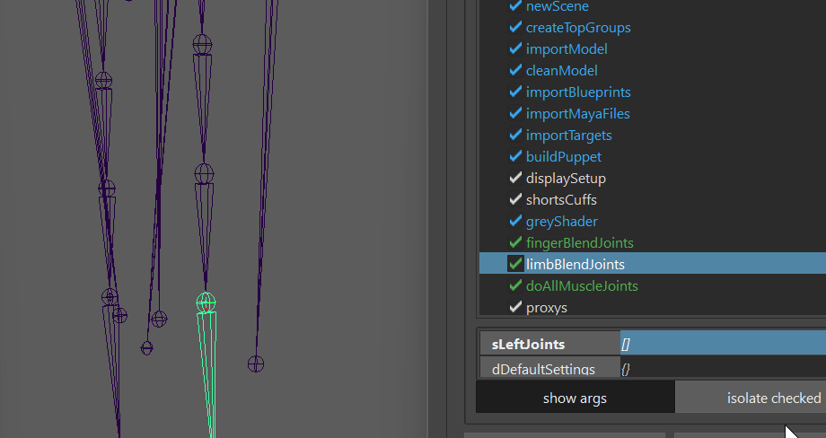
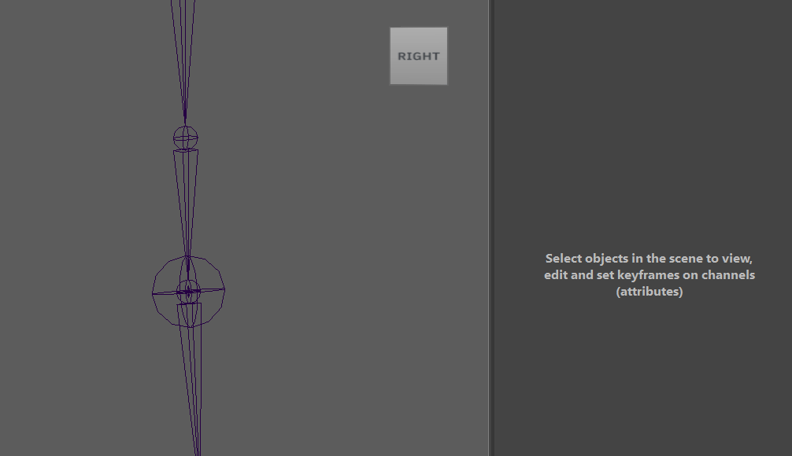
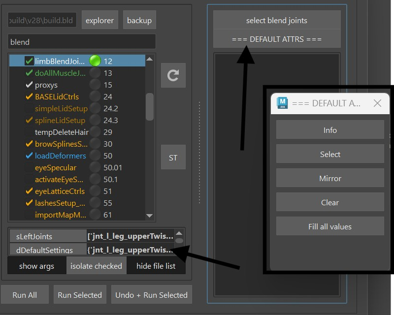

# Body

## Muscle Joints
Muscle joints are simple lightweight joints that can be great for preserving volume,
or some piston type parts
<iframe width="560" height="315"
src="https://www.youtube.com/embed/7A5NZNeP8vg"
title="YouTube video player" frameborder="0"
allow="accelerometer; autoplay; clipboard-write; encrypted-media; gyroscope; picture-in-picture"
allowfullscreen></iframe>

## Blend Joints
Those are simple joints that rotate a percentage of the main joints. And they have a lot of
attributes to make them translate or scale based on their parents' rotation

To add one, just specify the joint in the list.

Then after running that function you'll get that joint. And you can adjust its values:

Mirroring and Saving those values can be done with the DEFAULTATTRS options.  

Btw - the DEFAULTATTRS thing is a common workflow throughout all the kangaroo tools. Especially when
we come to the face

## Pose Editor
Pose Editor is unavoidable especially when we do Cartoony Characters.  
It consists of Interpolators, BlendShape Poses and Ctrl Poses  

### Interpolators
Interpolators are little setups that measure (most of the time) the joints to see if and how strong
we are in a pose.   
There's a few different types: signedAngle, cones, mayaPose, upleg, custom
To add interpolators, just click the Add Button. It tells you what you need to select. And the 
selection order doesn't matter here. 

#### signedAngle
SignedAngle is the simplest one, and great for simple rotations where you can assume that animators
usually just rotate it in one angle.
When it tells you to select Attribute of Ctrl, you just need to select it in the Channel Box like this:  
  
Once you created it, special attention is required on the Angle Axis and Up Axis. It might be a bit  
confusing, because those are the ones on the joints, not the ctrl! 

### mayaPose
This is using the maya native interpolator. It interpolates between all the interpolator's poses at 
once, and normalizes them in some way that whenever you are in one pose, all the other poses are 0.  
That's a great thing and very handy for when you are doing upper arm corrective poses.
But it comes with quite a few disadvantages:  
- you always need to have at least 4 poses (manageable, just add a few extra poses you don't use)  
- you can't adjust the timing   
- inbetween the poses, the timing can get a bit unnatural (For correctives it might be fine, but 
could be an issue for ctrls).  
If you are getting frustrated with one of the disadvantages, try cones
 
  
### Cones
Cones just measure how close the joint's angle is to the cone's angle.

You have more options to adjust the timing. But they can get tricky to setup at first.  
Common issues you have to tackle is that while it looks great when going into the pose, 
if the ctrl moves further the pose fades out again which is unwanted behavior in 90 % of the cases.  
And you have to make sure that there's not a small percentage of the pose turned on when 
the character is in default.  
But the good news is, those are easy to tackle if you are familiar with the **Range**
  
The first thing you notice on the Range is that it starts from the higher value and goes to 
the smaller value, like 60-10 in the example above.
The first value has to be the same or smaller than the *rotation distance* - In the picture above
the rotation is (0,0,-80) so the rotation distance would be 80.
This is where it gets a bit mathematical. Notice I said *rotation distance* and not just rotation?
That means even though the angle of the rotation has a negative value, the rotation distance is still positive.  
Also, the range start cannot be bigger than 89. Otherwise it wouldn't be a cone anymore.    
Now we can also use the range to work around our issue with the pose fading out as the ctrl 
moves further than the pose:  
Overshoot the rotation by maybe 30 degrees (0,0,-80) becomes (0,0,-110), and then set the end 
range to 30, so the range becomes (89-30). When you double click on the pose telling him to jump into 
that pose, he'll jump to (0,0,-80), and not (0,0,-110), because 110-30 = 80

TIP: if unsure, you can jump between cones and mayaPoses when you right click on the interpolator. 

