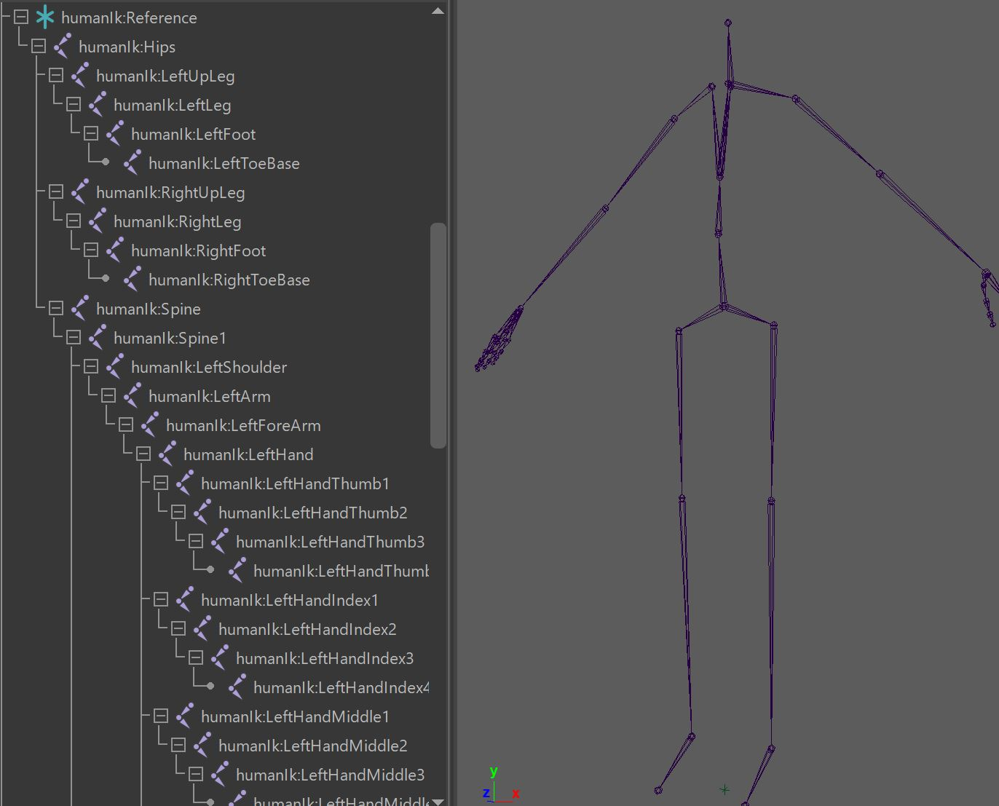

# Motion Capture
Maya has a great tool for Motion Capture retargeting, which is called *humanIK*. Kangaroo is simplifying this for you.
If just turn on the function *humanIkSkeleton()*, it'll create this skeleton:  
  
There's nothing for you to do at this point. Just know that it'll use this later under the hood when Animators apply 
Motion Capture using the Picker.  
For more information check: **Animator Tools**