Pose Editor is new in Kangaroo v5 and it has very quickly become an unavoidable tool for almost every character we work on.

To open it, click the function *poseEditorApply()* and then the button **Open Editor**:  
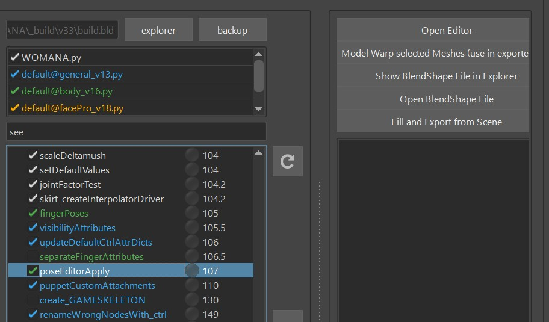  

It consists of Interpolators, BlendShape Poses and Ctrl Poses  

## Interpolators
Interpolators are little setups that measure (most of the time) the joints to see if and how strong
we are in a pose.   
There's a few different types: signedAngle, cones, mayaPose, upleg, custom.  
To add interpolators, just click the *Add* Button. It tells you what you need to select. And the 
selection order doesn't matter here. 

### signedAngle
SignedAngle is the simplest one, and great for simple rotations where you can assume that animators
usually just rotate it in one angle.
When it tells you to select Attribute of Ctrl, you just need to select it in the Channel Box like this:  
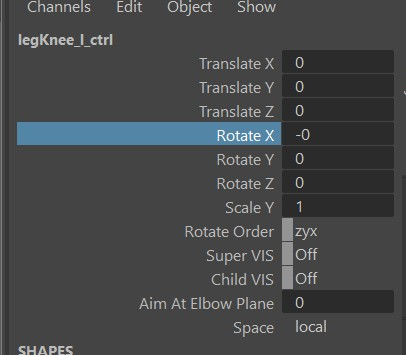  
Once you created it, special attention is required on the Angle Axis and Up Axis. It might be a bit  
confusing, because those are the ones on the joints, not the ctrl! 
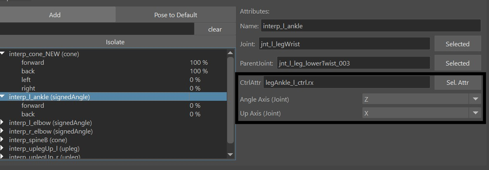

### mayaPose
This is using the maya native interpolator. It interpolates between all the interpolator's poses at 
once, and normalizes them in some way that whenever you are in one pose, all the other poses are 0.  
That's a great thing for when you are doing upper arm or clavicle corrective poses where it's important
that all the poses blend nicely with each others. 
But it comes with quite a few disadvantages:  
- You can't adjust the timing   
- Inbetween the poses, the timing can get a bit unnatural (For correctives it might be fine, but could be an issue for ctrls).   
- You always need to have at least 4 poses (manageable, just add a few extra poses you don't use)  
- The math is very complicated. Sometimes it can happen that some pose output is *INF*, or suddenly all poses having the same output number like 0.25.
Whenever that happens just try to align them a bit nicer and make sure that you not less than 4 poses.
  
### Cones
Cones just measure how close the joint's angle is to the cone's angle.
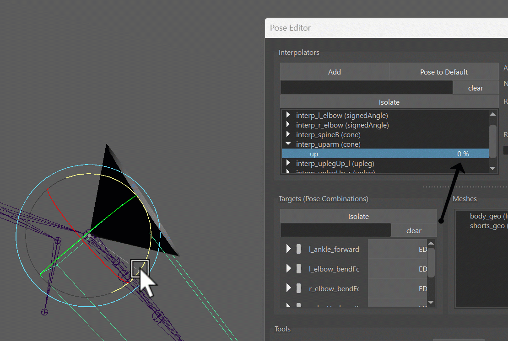
Their main advantage is that you have more options to adjust the timing.   
But they can get tricky to set up at first.  
Common issues you have to tackle is that while it looks great when going into the pose, 
if the ctrl moves further the pose fades out again. This is unwanted behavior in 90 % of the cases.    
Another thing to watch out for is that poses can be activated for some percentage when we are
in another pose, or even when we are in default pose!
!!! warning
    Poses being activated in default or while fully in another pose can have a very bad impact. Therefore
    when dealing with cones this should always be watched out carefully.
But the good news is, it's all *easy* tackle if you are familiar with the **Range**

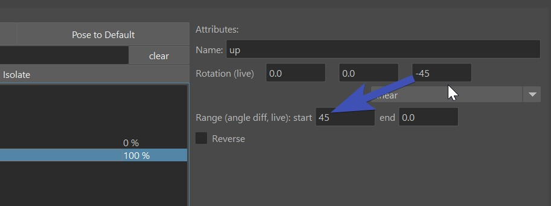  
The first thing you notice on the Range is that it starts from the higher value and goes to 
the smaller value, like 60-10 in the example above.
The first value has to be the same or smaller than the *rotation distance* - In the picture above
the rotation is (0,0,-80) so the rotation distance would be 80.
Notice I said *rotation distance* and not just rotation?
That means even though the angle of the rotation has a negative value, the rotation distance is still positive.    

Also, the range start cannot be bigger than 89. Otherwise it wouldn't be a cone anymore.  

Now we can also use the range to work around our issue with the pose fading out as the ctrl 
moves further than the pose:  
Overshoot the rotation by maybe 30 degrees (0,0,-80) becomes (0,0,-110), and then set the end 
range to 30, so the range becomes (89-30). When you double click on the pose telling him to jump into 
that pose, he'll jump to (0,0,-80), and not (0,0,-110), because 110-30 = 80

!!! tip
    If you are unsure if you should use cone or mayaPose - you can start with one and later convert to the other one with right click on the interpolator.  
    But don't forget the [signedAngle](#signedangle)! Simple rotations like elbows or knees should be handled with *signedAngle*

### Upleg
This is a very specialized one just for upper leg rotating upwards like in a sitting pose. 
While you could also do that with Cones or MayaPose, this one is a more specialized one 
that turns on as the legs rotate upwards,
and stays stable when it rotates further. It also fades out as the legs rotate outwards, and you
can control if and how much it should fade out when the leg rotates inwards.

### Custom 
The custom interpolator is good for 2 things:

1. drive things by a control attribute  
2. create your own interpolator type such as an *Interpolate By Distance Node*

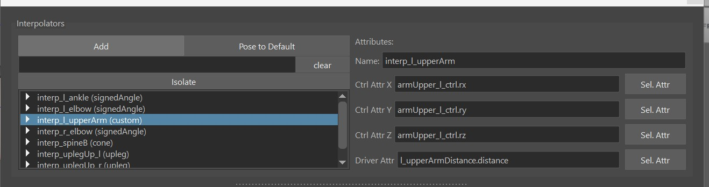  
You can see *CtrlAttrX*, *CtrlAttrY* and *CtrlAttrZ*, but you don't need to use all of them
you can just use *CtrlAttrX* and keep the others empty.  
*DriverAttr* the attribute that actually drives the interpolator. Basically the tool checks what value
the DriverAttr has when the CtrlAttrs reach the pose etc..  
You can also think of the DriverAttr as an inbetween step between the ControlAttr and the actual Pose Output.  
In the example of creating an *Interpolate By Distance* - ControlAttrs would be an Animator Ctrl, and DriverAttr
would be the actual output value of the distance node.  

!!! note
    If you don't want to use DriverAttr, just give it the same as what you have for CtrlAttrX. 
    This would then be the result of *(1) drive things by a control attribute* 
    mentioned above.

## Targets
We can do either **BlendShape Targets** (*Correctives*), or **Ctrl Targets**.
Both of them start in the same way, that you just drag&drop a pose from the *Interpolator Table*
into the *Targets Table*.  
If you drag more than one pose, then the Target is a combination of the poses, and you get that extra
button (**M** or **S**) that lets you specify the blend mode - either *Multiply* or *Smallest*.
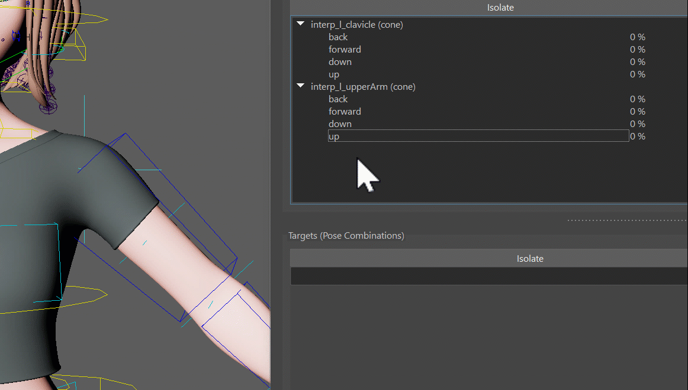  
Ok, until here it was still boring because it's not doing anything yet.
But now we can choose to do either a blendShape, manipulate a Ctrl

### BlendShape Targets
First specify the meshes you want to use for blendShapes by adding them into the *Meshes Table*  
And then select them again and click the **EDIT MESH** button. This tells the tool that whatever you 
sculpt on the mesh will go into that Target.   
Don't forget to deactivate the *EDIT* button when you are done!
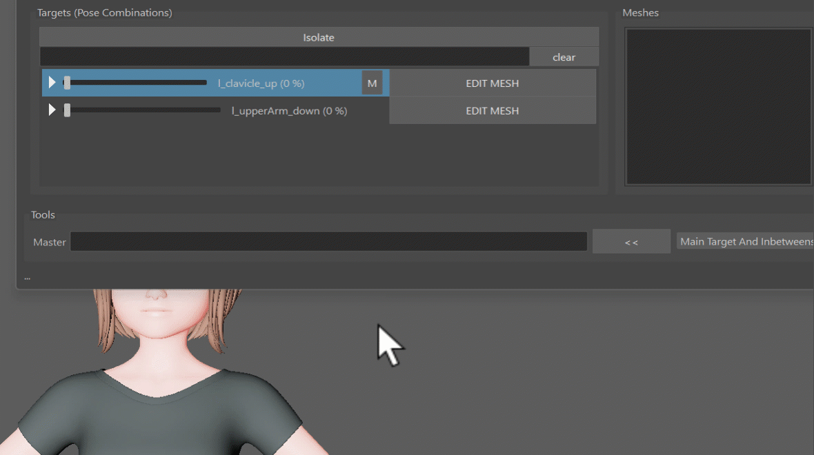  
!!! info
    The tool I used in this gif is **Mesh Tools -> Sculpting Tools -> Grap Tool**. But when you have the *EDIT* button 
    activated, you can also select vertices and move them. Or use some of the *Geometry Tools* like *Smooth Vertices* 
!!! note
    If you haven't tried out the *Smooth Vertices* tool yet, sculpting correctives is where it most useful! Because many
    times we are dealing with vertices that are collapsed and we want to smooth them out again.

### Ctrl Targets
When you create Targets on Ctrls, it just creates a Ctrl Locator for each Pose that you can move around
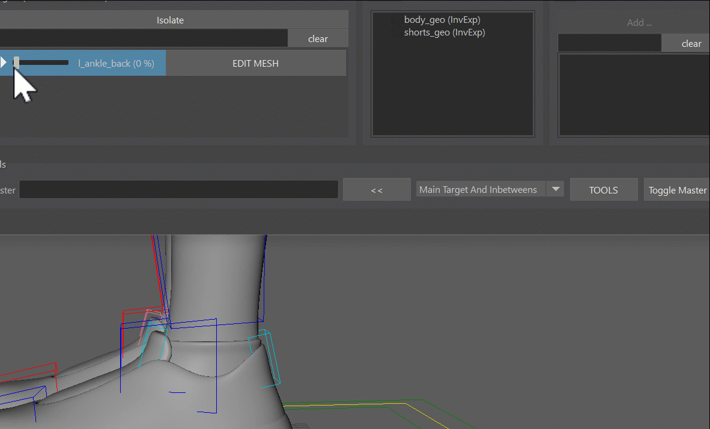  
Whenever you click the **Add/Activate** button, it creates a locator if it doesn't exist yet and selects it. If 
the locator already exists, it'll only select it.   
So in short: that's a multi functional button that you'll be clicking a lot.  

In the ctrl hierarchy (outliner) you can see all the locators, for each target one. And those that are activated are shown
while the others get hidden automatically. This way you could even adjust poses without the UI.
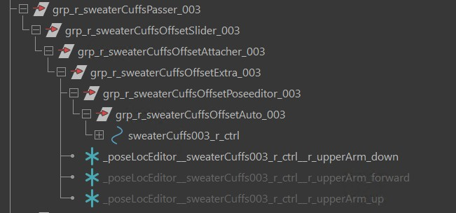  
But most of the time you'll be faster to just select the locator using the *Add/Activate* button

## dResetAttrs
When you have a for example deltaMush or a blendShape target that shrinks the 
skin to avoid collisions, it would constantly get into the way of sculpting. It would also corrupt stuff when you export
or apply the blendShapes.  
For that we can add some attributes into the *dResetAttr* dictionary. Just open it with the JSON Editor
and add things in there. You can see by default it already has all the fk2ik switches that make sure you
are in FK while setting poses  
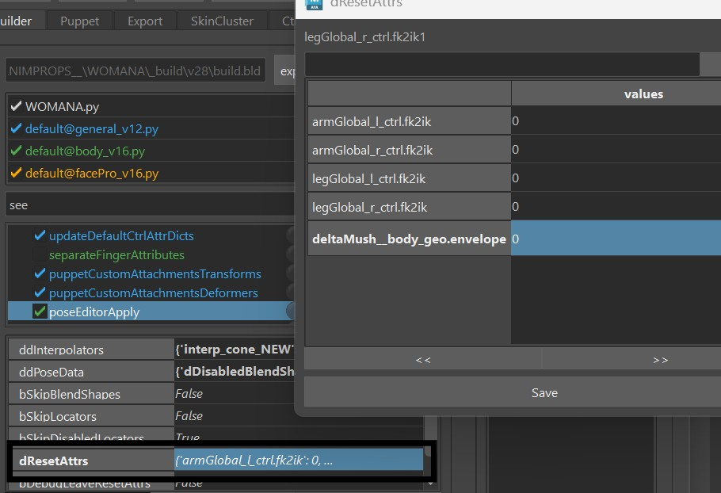  
!!! warning
    Do not neglect the *dResetAttr*! We might be tempted to not bother because we can get things done without touching it,
    but it can get very uncomfortable later when you realize that some deformer quietly corrupted your poses more and more whenever you built or published.

## Mirror

### Mirror Interpolator
For mirroring any target, you first have to mirror the Interpolator. Don't worry if you forget, he'll remind you.
Right click on Interpolator -> Mirror:  

### Flip BlendShape
Right click on Targets -> The *Mirror* menu there gives you a lot of options to mirror just left to right
for Geo, or just    Ctrls, etc.
For BlendShapes most of the time you choose **Side:Pose Combinations and Flip Meshes** which just creates an
opposite target (if it's not there yet) and gives it the flipped pose. 
You'll have to set the mirror table for that first by right click on the mesh in the Meshes Table. And also
here don't worry if you forget, he'll remind you. 

### Split BlendShape Target 
Flipping does not work well in cases where you want to sculpt a little bit into the middle (central line of the character), 
such as on upperLegUp shapes. It'd work great for just one side, but when you have left and right like in a sitting pose, it
won't blend well together. While you could create one for left and one for right and then do a combination
target for both together, in most cases it's nicer to do the *Split Target* option.

To use that - just sculpt everything into the left target (or the right one, wouldn't matter), and then 
in the right click mirror menu click **Side:Pose Combinations and Split Current Combined Shape into Left/Right**

### Mirror Ctrls
For the ctrls you just choose **Side:Pose Combinations and Ctrls**. You can do either the selected
ctrls, or if you don't have any ctrls selected, he'll do all 

## Export
Click the **FillAndExport** button. It fills the *ddInterpolators* and *ddPoseData* attributes, and 
creates the file *poseEditorExports.ma* in the *mayaImport* folder. 
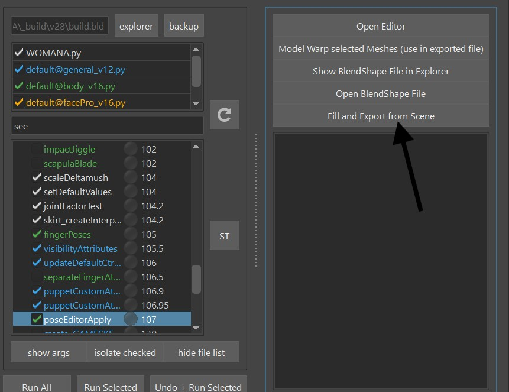  

## Model Change
Whenever the model changes, open the *poseEditorExports.ma* file from the *Export -> MayaImp* tool,
and import the new model. Then select the new model + the corresponding Blendshape Mesh you have in scene:    
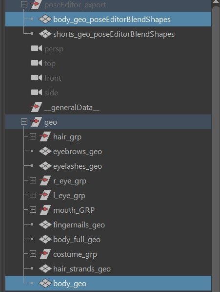  

And then you have 2 buttons: **Warp** or **BlendShape**  
You can do *blendShape* when the topology is the same and you used the default *invertExport* option. For all other
cases do *Warp*  
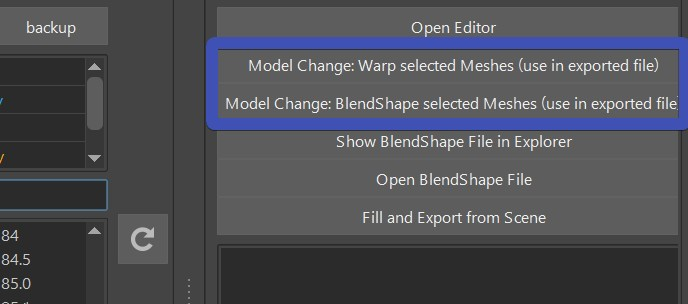  
!!! note
    The selection order doesn't matter here. But it's important that the model you select has the same name! 

## Sharing Interpolators between Rigs
It can be very helpful to share Interpolators between characters.
And there are 2 ways:  
### In the PoseEditor UI
Right click on the interpolator -> Copy. Then go to your other character, and right click -> Paste
### JSON Editor
Once you exported the setup, you can open the [JSON Editor](../builder/jsonEditor.md) by right click 
on **ddInterpolators** attribute. Then having the interpolators you want to transfer selected, right click -> **Copy**. 
And then right click -> **paste** on the same location in the other character.

!!! note
    Currently there's a small bug that you can only *paste* if there are already interpolators there. Just create a 
    dummy one if you run into this situation. You can delete it later. 

!!! info
    While you could also share Target Infos using the JSON Editor, we don't do that as often as sharing interpolators.

## Useful tools
### TOOLS button
The Tools button can warp, blend etc

### Erase
Select a few vertices, right click on the target -> erase. 

## Known Issues
#### Sometimes the Interpolator doesn't update anymore, even though I'm 100 % sure my settings are correct.
This is often an evaluation problem that happens if the rig is either very complex, or if there's a cycle
in there.  
But there's a workaround: select the interpolator, and set **right click -> rebuild**.  
#### When I export using the **Fill and Export** button, he exports the whole rig.
Check if you have some connections going from the meshes inside the *_poseEditorExport* group. Sometimes
it could be a set. You can also try to just delete all your sets in scene

## Video
To see it in action, you can watch the video below. But keep in mind it's a bit outdated!    
Especialy the [model update](#model-change) part has changed a lot.
<iframe width="560" height="315"
src="https://www.youtube.com/embed/oPQHf2HOq5o"
title="YouTube video player" frameborder="0"
allow="accelerometer; autoplay; clipboard-write; encrypted-media; gyroscope; picture-in-picture"
allowfullscreen></iframe>
