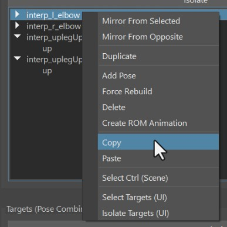
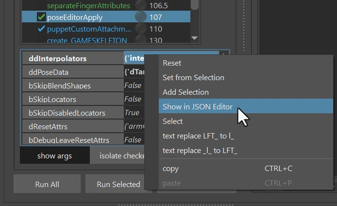

Pose Editor is new in Kangaroo v5 and it has very quickly become an unavoidable tool for almost every character we work on.

To open it, click the function *poseEditorApply()* and then the button **Open Editor**:  
  

It consists of Interpolators, BlendShape Poses and Ctrl Poses  

## Interpolators
Interpolators are little setups that measure (most of the time) the joints to see if and how strong
we are in a pose.   
There's a few different types: *signedAngle, cones, mayaPose, upleg, custom*.  
To add interpolators, just click the *Add* Button at the very top left of the UI. It tells you what you need to select. And the 
selection order doesn't matter here.  
   

### signedAngle
SignedAngle is the simplest one, and great for simple rotations where you can assume that animators
usually just rotate it in one angle.
In the marking menu it says *Select Attribute of Ctrl and Joint*. That means just select the joint, then the ctrl and
it in the Channel Box mark it like this:  
  
Once it created it, special attention is required on the Angle Axis and Up Axis. It might be a bit  
confusing, because those are the ones on the joints, not the ctrl! 

### mayaPose
This is using the maya native interpolator. It interpolates between all the poses of the interpolator at 
once, and normalizes them in some way that whenever you are in one pose, all the other poses are 0.  
That's a great thing for when you are doing upper arm or clavicle corrective poses where it's important
that all the poses blend nicely with each others. 
But it comes with quite a few disadvantages:  

- You can't adjust the timing   
- Inbetween the poses, the timing can get a bit unnatural (For correctives it might be fine, but could be an issue for ctrls).   
- You always need to have at least 4 poses (manageable, just add a few extra poses you don't use)  
- The math is not understandable for the most of us, so output can be somewhat confusing. And sometimes when things are wrong it might even output  *INF*, 
or suddenly all poses having the same output number like 0.25.

- Whenever that happens just try to align them a bit nicer and make sure that you not less than 4 poses.
  
### Cone
Cones just measure how close the joint's angle is to the cone's angle.

Their main advantage is that you have more options to adjust the timing.   
But they can get tricky to set up at first.  
First thing to watch out for is that poses by mistake might be activated for some percentage when we are
in another pose, or even when we are in default pose!
!!! warning
    Poses being activated in default or while fully in another pose can have a very bad impact. Therefore
    when dealing with cones this should always be watched out carefully.

To handle that, make sure you get familiar with the **Range**

  
The first thing you notice on the Range is that it starts from the higher value and goes to 
the smaller value, like 60-10 in the example above. This is because we are talking about the angle *difference*.
So if the angle difference coming from the rig is 0.0, that means we are fully in that pose. 
The first value (60) is the angle difference from where the pose starts interpolating. 
It has to be *the same or smaller* than the *rotation distance* of the pose. 
*What is rotation distance??* 
Well, in the picture above the rotation is (0,0,-80) so the rotation distance would be 80.
So even though the angle of the rotation has a negative value, the rotation distance is still positive.
(if you have a more complex rotation such as (30,0,-80), the rotation difference would be harder to calculate,
so try to avoid that)

The second issue that comes with cones is that they work great as the rig moves into the pose, but when it moves
further, the pose fades out. And that can get very nasty. 
Let's look at this example (which happens *a lot* in production!). In here I have range as 15-0, so it starts at 15, 
and is full when it is at 0. And the issue is as soon as the arm goes just a bit further, the costume (sphere in
this case) jumps back:  

Here's the solution - set the attributes like this:  
  
And it'll look much better!
    

!!! warning "Watch Out"
    When you do a cone pose on the upper arm, make sure to set the spine end joint as the JointParent! Otherwise
    you'll hit issues when the clavicle moves around:  
        
    

!!! tip
    If you are unsure if you should use *cone* or *mayaPose*: Start with one and later convert to the other one with right click on the interpolator.  
    But don't neglect [signedAngle](#signedangle)! Simple rotations like elbows or knees should be handled with *signedAngle*.
    And even complex orientaions like from neck or spine can be handled with *signedAngle* in some cases.

### Upleg
This is a very specialized one just for upper leg rotating upwards like in a sitting pose. 
While you could also do that with *Cone* or *MayaPose*, this one is a more special engineered for the uplegs going up.
It has a few options such as fading out as the legs rotate outwards. And you can even control if and how much it 
should fade out when the leg rotates inwards.

### Custom 
The custom interpolator is good for 2 things:

1. drive things by a control attribute  
2. create your own interpolator type such as an *Interpolate By Distance Node*

  
You can see *CtrlAttrX*, *CtrlAttrY* and *CtrlAttrZ*, but you don't need to use all of them
you can just use *CtrlAttrX* and keep the others empty.  
*DriverAttr* the attribute that actually drives the interpolator. Basically the tool checks what value
the DriverAttr has when the CtrlAttrs reach the pose etc..  
You can also think of the DriverAttr as an inbetween step between the CtrlAttr and the actual Pose Output. 
In the example of creating an *Interpolate By Distance*: CtrlAttr would be from an Animator Ctrl, and DriverAttr
would be the actual output value of the distance node.  

!!! tip
    If you don't want to use DriverAttr, just give it the same as what you have for CtrlAttrX. 
    This would then be a simple driving pose by an attribute. 

!!! limitation "Current Limitation"
    Unfortunately at this time it only works when CtrlAttr starts at 0. If you have an attribute (like scale) where the default is 1.0,
    this won't work. 

## Targets
We can do either **BlendShape Targets** (*Correctives*), or **Ctrl Targets**.
Both of them start in the same way, that you just drag&drop a pose from the *Interpolator Table*
into the *Targets Table*.  
If you drag more than one pose, then the Target is a combination of the poses, and you get that extra
button (**M** or **S**) that lets you specify the blend mode - either *Multiply* or *Smallest*.
  

And next we can choose to do either a blendShape, manipulate a Ctrl.

### BlendShape Targets
First specify the meshes you want to use for blendShapes by adding them into the *Meshes Table*  
And then select them again and click the **EDIT MESH** button. This tells the tool that whatever you 
sculpt on the mesh will go into that Target.   

  
The tool I used in this gif is **Mesh Tools -> Sculpting Tools -> Grap Tool**. But when you have the *EDIT* button 
activated, you can also select vertices and move them. Or use some of the *Geometry Tools* like *Smooth Vertices* 

!!! note "Kangaroo Tool Tip"
    If you haven't tried out the *Smooth Vertices* tool yet, sculpting correctives is where it most useful! Because many
    times we are dealing with vertices that are collapsed and we want to smooth them out again.

!!! warning "Remember"
    Don't forget to deactivate the *EDIT* button when you are done!

### Ctrl Targets
When you create Targets on Ctrls, it just creates a Ctrl Locator for each Pose that you can move around
  
Whenever you click the **Add/Activate** button, it creates a locator if it doesn't exist yet and selects it. If 
the locator already exists, it'll only select it.   
So that's a multi functional button that you'll be clicking a lot.  

In the ctrl hierarchy (outliner) you can see all the locators, for each target one. And those that are activated are shown
while the others get hidden automatically. This way you could even adjust poses without the UI.
  
But most of the time you'll be faster to just select the locator by using the *Add/Activate* button

## dResetAttrs
When you have a for example deltaMush or a blendShape target that shrinks the 
skin to avoid collisions, it would constantly get into the way of sculpting. It would also corrupt stuff when you export
or apply the blendShapes.  
For that we can add some attributes into the *dResetAttr* dictionary. Just open it with the JSON Editor
and add things in there. You can see by default it already has all the fk2ik switches that make sure you
are in FK while setting poses  
  
!!! warning "Don't Forget"
    Do not forget the *dResetAttr*! We might be tempted to not bother because we can get things done without touching it,
    but it can get very uncomfortable later when you realize that some deformer quietly corrupted your poses more and more whenever you built or published.

## Mirror

For mirroring things it's very important that the names of the interpolators and Targets specify if it's a left, right or middle pose.
So if an interpolator is called *interp_signedAngle_NEW*, it's a middle one! Name it properly to something like *interp_l_elbow*. 
The *\_l\_* in there tells that it's a left one.  
Similar for the targets. But if you renamed the interpolator properly before creating the target, the target usually already has
a good name. 

### Mirror Interpolator
For mirroring any target, you first have to mirror the Interpolator. Don't worry if you forget, he'll remind you.
Right click on Interpolator -> Mirror:  
  

### Flip BlendShape
First you have to set the mirror table with the right click menu on the mesh in the Meshes Table. 
  
Your options are:  

- middle mesh (edgeflow)
- middle mesh (vertex positions)
- middle mesh (face points)
- side meshes (ids)
- side meshes (vertex positions)
- side meshes (face points)  

Edgeflow is that mirror algorithm where it takes a middle edge and with that finds all the other vertices by the
edge connection patterns.

Then to do the actual flipping: Right click on Targets -> The **Side:Pose Combinations and Flip Meshes**
  

### Split into Left/Right 
Flipping does not work well in cases where you want to sculpt a little bit in the middle (central line of the character), 
such as on upperLegUp shapes. It'd work great for just each side separately, but when you have left and right combined such as 
in a sitting pose, it won't blend well together. Theoretically you could create one for left and one for right and then do a combination
target for both together. But in most cases it's nicer to do the *Split Target* option.

To do splitting - when sculpting it, have the *EDIT* button activated just on the left target (or the right one, wouldn't matter).
So at first you end up with a situation where when you activate the left target, the right side gets activated the same time.
And all you have to do is click **Side:Pose Combinations and Split Current Combined Shape into Left/Right**
  

### Mirror Ctrls
For the ctrls you just choose **Side:Pose Combinations and Ctrls**. You can do either the selected
ctrls, or if you don't have any ctrls selected, he'll do all 
  

## Export
Click the **FillAndExport** button. It fills the *ddInterpolators* and *ddPoseData* attributes, and 
creates the file *poseEditorExports.ma* in the *mayaImport* folder. 
  

## Model Change
Whenever the model changed, open the *poseEditorExports.ma* file from the *Export -> MayaImp* tool,
and import the new model. Then select the new model + the corresponding Blendshape Mesh you have in scene:    
  

And then you have 2 buttons: **Warp** or **BlendShape**  
You can do *blendShape* when the topology is the same and you used the default *invertExport* option. For all other
cases do *Warp*  
  
!!! note
    The selection order doesn't matter here. But it's important that the model you select has the same name! 

## Sharing Interpolators between Rigs
It can be very helpful to share Interpolators between characters.
And there are 2 ways:  
### In the PoseEditor UI
Right click on the interpolator -> *Copy*. Then go to your other character, and right click -> *Paste*  
  

!!! warning "Known bug"
    Currently the *Paste* option doesn't show up unless you click on an existing interpolator. So if you want to paste
    an interpolator to a new character that doesn't have any interpolators yet, just create a dummy one that you delete
    again after.

### With the JSON Editor
Once you exported the setup with the *Fill and Export from Scene* button, you can open the *JSON Editor* by right click 
on **ddInterpolators** attribute:  
  

Then having the interpolators you want to transfer selected, right click -> **Copy**. 
And then right click -> **paste** on the same location in the other character.

Check [JSON Editor](../builder/jsonEditor.md) for more information.

!!! note
    While you could also share Target Infos using the JSON Editor, we don't do that as often as sharing interpolators.

## Useful tools
### TOOLS button
The Tools button can warp, blend etc

### Erase
Select a few vertices, right click on the target -> erase. 

## Known Issues
#### Sometimes the Interpolator doesn't update anymore, even though I'm 100 % sure my settings are correct.
This is often an evaluation problem that happens if the rig is either very complex, or if there's a cycle
in there.  
But there's a workaround: select the interpolator, and set **right click -> rebuild**.  
#### When I export using the **Fill and Export** button, he exports the whole rig.
Check if you have some connections going from the meshes inside the *_poseEditorExport* group. Sometimes
it could be a set. You can also try to just delete all your sets in scene

## Video
To see it in action, you can watch the video below. But keep in mind it's a bit outdated!    
Especialy the [model update](#model-change) part has changed a lot.
<iframe width="560" height="315"
src="https://www.youtube.com/embed/oPQHf2HOq5o"
title="YouTube video player" frameborder="0"
allow="accelerometer; autoplay; clipboard-write; encrypted-media; gyroscope; picture-in-picture"
allowfullscreen></iframe>
