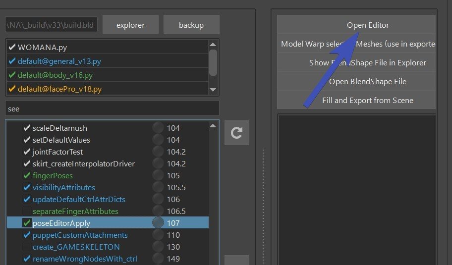
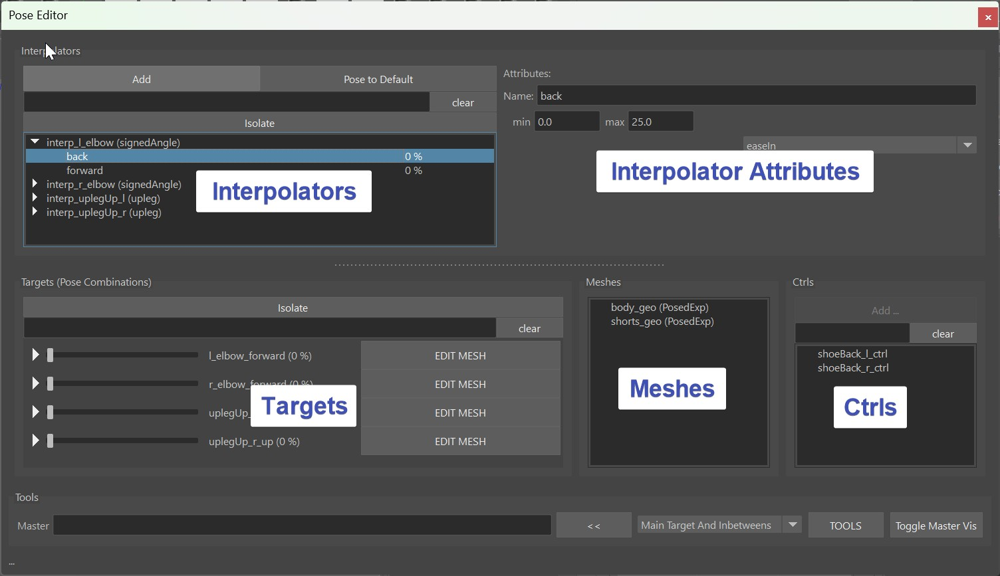
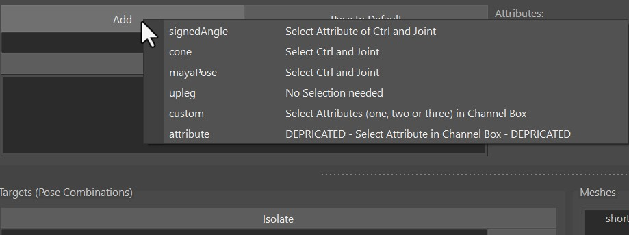
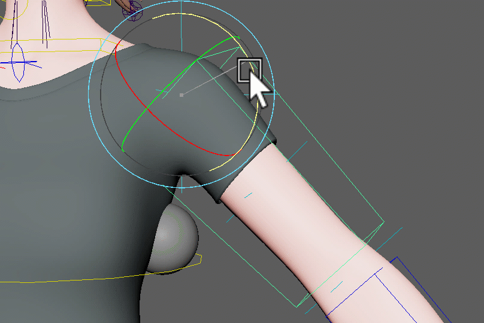
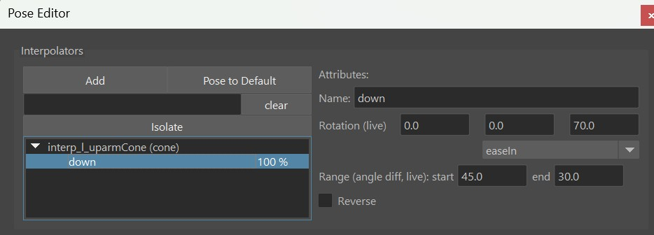
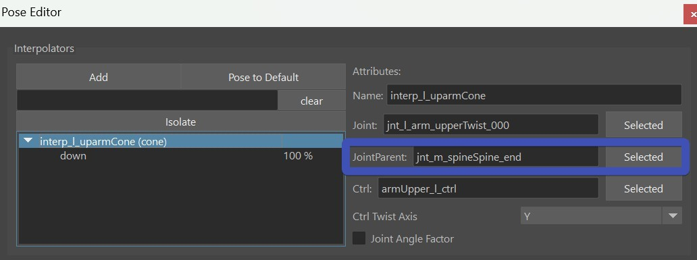
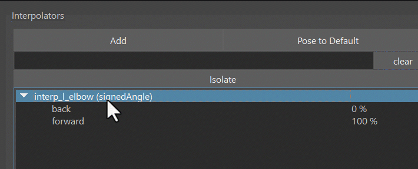
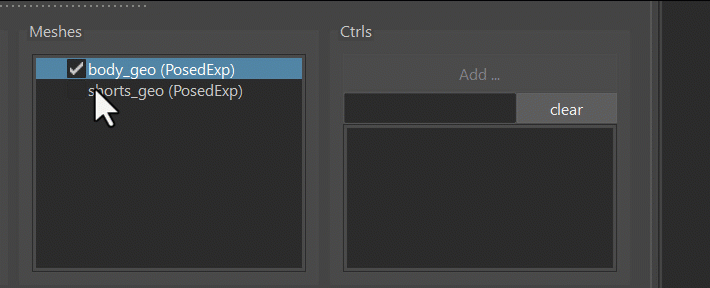
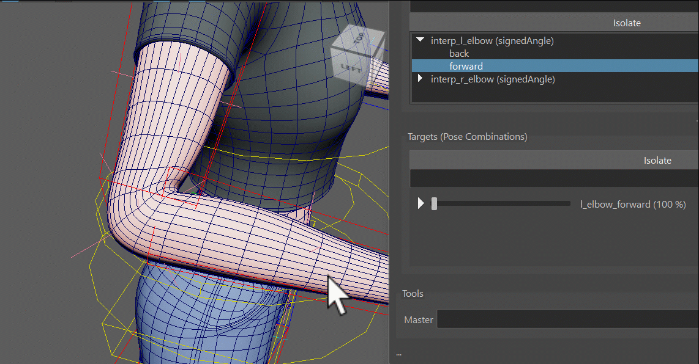
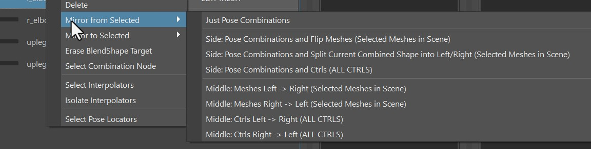

Pose Editor is one of the biggest additions in Kangaroo 5.

To open it, click the function *poseEditorApply()* and then the button **Open Editor**:  
  

It consists of Interpolators, Interpolator Attributes and Targets, Meshes and Ctrl Tables.  
  

!!! info "Video" 
    To see how the Pose Editor works in action, you can also watch this [Video](https://www.youtube.com/embed/oPQHf2HOq5o).    
    But keep in mind it's a bit outdated, especially the [model update (Pose Editor II)](poseEditor2.md#model-change) part has changed.

## It's NOT the Shape Editor!
For differences with the Shape Editor, see [Shape Editor - It's NOT the Pose Editor](../face/shapeEditor1.md#its-not-the-pose-editor)

## Interpolators - Calculating the Pose
Interpolators are little setups that analyze the rig to see if and how strong
we are in a pose.   
There's a few different types: 

- **signedAngle** - simple rotations like elbow, knees
- **cones** - 3 dimensional rotations
- **mayaPose** - 3 dimensional rotations
- **upleg** - specialized for upper leg going up
- **custom** - attributes or for creating your own custom interpolator

To add interpolators, just click the *Add* Button at the very top left of the UI. It tells you what you need to select. And the 
selection order doesn't matter here.  
   

### signedAngle
SignedAngle is the simplest one, and great for simple rotations where you can assume that animators
usually just rotate it in one angle.
As the right side of the menu says - *Select Attribute of Ctrl and Joint*: select the joint, then the ctrl and
it in the Channel Box mark it like this:  
  
Once it created it, special attention is required on the Angle Axis and Up Axis. It might be a bit  
confusing, because those are the ones on the joints, not the ctrl! 

*Angle Axis* is the rotation axis of the joints that we want to measure (usually different to the CtrlAttr because
it's in different space). And the *Up Axis* is one of the other two. 
*Which one?* Just try it out which one is more stable in your case. But never set *Angle Axis* and *Up Axis* to 
be identlical, because this *will* lead to troubles. 

Here's a short video how we create the signedAngle for the knee:
<video autoplay muted loop controls width="1400">
    <source src="../../images/poseEditor_creatingSignedAngle.mp4" type="video/mp4">
    Your browser does not support the video tag.
</video>
In this video we didn't have to set the Angle Axis and Up Axis, becasue on elbows and knees the default is already correct.

### mayaPose
This is using the maya native interpolator. It interpolates between all the poses of the interpolator at 
once, and normalizes them in some way that whenever you are in one pose, all the other poses are 0.  
That's a great thing for when you are doing upper arm or clavicle corrective poses where it's important
that all the poses blend nicely with each others. 
But it comes with a few disadvantages:  

- You can't adjust the timing   
- The timing can get a bit uneven between the poses (for correctives this might be fine, but could be an issue for ctrls).   
- You always need to have at least 4 poses (manageable, just add a few extra poses you don't use)  
- The math is not understandable for the most of us, so the output can sometimes be somewhat unexpected. And in some 
cases when things are wrong it might even output something like *INF* or all poses having the same output number like 0.25. 
Whenever that happens just try to align them a bit nicer and make sure that you not less than 4 poses.

Here's a short video how we create them for the upper arm:
<video autoplay muted loop controls width="1700">
    <source src="../../images/poseEditor_creatingMayaPose.mp4" type="video/mp4">
    Your browser does not support the video tag.
</video>

### Cone
Cones just calculate *how small the angle is* between joint and the cone.

It's also 3-dimensional poses such as the *MayaPose*, and the first part of just creating them is 
almost identical to the MayaPose.
Actually you can even convert between Cones and MayaPose with right-click on the interpolator!

But then the algorithm they use for calculating the poses couldn't be more different - and 
you have more options to *adjust the timing*. And you don't need to have a minimum of 4 poses! Even just one is enough.

There's the attribute called **Range**, which is very important! Neglecting this *will* put you in trouble.

The first thing you notice on the Range is that it starts from the higher value and goes to 
the smaller value. The first important thing you have to pay attention to is that the Start (bigger value)
needs to be **equal or smaller than the positive rotation value, and not bigger than 89**:
  

!!! note "If you love math.."
    Instead of *positive rotation value* the correct explanation is actually the *angle difference*.
    In the picture above the rotation is (0,0,-45) so the angle distance is 45.
    So even though the angle of the rotation has a negative value, the angle distance is still positive.
    If the rotation is (30,0,0), the angle distance would be 30. And If you have a more complex rotation such as (30,0,-80), 
    the rotation difference would be much harder to calculate, so try to avoid that.

Another thing to be aware with cones is that by default they work great as the rig moves into the pose, but when it moves
further, the pose fades out. And that can get very nasty. 
Let's look at this example below (which happens *a lot* in production!). In here I have range as 15-0, so it starts at 15. 
Now the issue is as soon as the arm goes just a bit further, the costume (sphere in this case) jumps back:  

Here's the solution - overshoot the rotation of the pose and set a higher end range:  
  
And immediately it'll look much better!
    

!!! warning "Watch Out"
    When you do a cone pose or mayaPose on the upper arm, make sure to set the spine end joint as the JointParent! Otherwise
    you'll hit issues when the clavicle moves around:  
        
    

### Upleg
This is a very specialized one just for upper leg rotating upwards like in a sitting pose. 
While you could also do that with *Cone* or *MayaPose*, this one is a more special engineered for the uplegs going up.
It has a few options such as fading out as the legs rotate outwards. And you can even control if and how much it 
should fade out when the leg rotates inwards.

### Custom 
The custom interpolator is good for 2 things:

1. drive things by a control attribute  
2. create your own interpolator type such as an *Interpolate By Distance Node*

  
You can see *CtrlAttrX*, *CtrlAttrY* and *CtrlAttrZ*, but you don't need to use all of them
you can just use *CtrlAttrX* and keep the others empty.  
*DriverAttr* is the attribute that actually drives the output. Basically the tool checks what value
the DriverAttr has when the CtrlAttrs is 0, and when it reaches the pose.  
You can also think of the DriverAttr as an inbetween step between the CtrlAttr and the actual Pose Output. 
In the example of creating an *Interpolate By Distance*: CtrlAttr would be from an Animator Ctrl, and DriverAttr
would be the actual output value of the distance node.  

!!! tip
    If you don't want to use DriverAttr, just give it the same as what you have for CtrlAttrX. 
    This would then be a simple driving pose by an attribute. 

!!! limitation "Current Limitation"
    Unfortunately at this time it only works when CtrlAttr starts at 0. If you have an attribute where for example the default is 1.0,
    this won't work.

## Targets - Manipulating the Rig
In the previous chapter we just created Interpolators that calculate the pose - but they didn't do anything yet. Now 
we'll discuss what those Interpolators can actually drive.  
We can do either **BlendShape Targets** (*Correctives*), or **Ctrl Targets**.
Both of them start in the same way, that you just drag&drop a pose from the *Interpolator Table*
into the *Targets Table*.  
If you drag more than one pose, then the Target is a combination of the poses, and you get that extra
button (**M** or **S**) that lets you specify the blend mode - either *Multiply* or *Smallest*.
  

And next we can choose to do either a blendShape, manipulate a Ctrl.

### BlendShape Targets
First specify the meshes you want to use for blendShapes by adding them into the *Meshes Table*  
And then select them again and click the **EDIT MESH** button. This tells the tool that whatever you 
sculpt on the mesh will go into that Target.   

To see it in action check this video:  
<video autoplay muted loop controls width="1180">
    <source src="../../images/PoseEditor_EditButton2.mp4" type="video/mp4">
    Your browser does not support the video tag.
</video>
  
The tool I used in this gif is **Mesh Tools -> Sculpting Tools -> Grap Tool**. But when you have the *EDIT* button 
activated, you can also select vertices and move them. Or use some of the *Geometry Tools* like *Smooth Vertices* 

!!! note "Kangaroo Tool Tip"
    If you haven't tried out the [**Smooth Vertices**](../tools/toolsGeometry.md#smooth-vertices) tool yet, 
    sculpting correctives is where it most useful! Because many times we are dealing with vertices that are 
    collapsed, and we want to smooth them out again.

!!! warning "Remember"
    Don't forget to deactivate the *EDIT* button when you are done!

!!! bug "Known Bug"
    When clicking the *EDIT* button, Maya creates a little bit of a cycle, which in some rare cases might temporarily mess up evaluation
    a bit. If you notice that your interpolator stays at 100 %, you'll have to rebuild the interpolator by right click -> **Force Rebuild**   
    See [here](#known-issues) for more info.

### Ctrl Targets
When you create Targets on Ctrls, it just creates a Ctrl Locator for each Ctrl that you can move around
<video autoplay muted loop controls width="1182">
    <source src="../../images/poseEditor_addCtrl.mp4" type="video/mp4">
    Your browser does not support the video tag.
</video>
 
Whenever you click the **Add/Activate** above the ctrls table button, it creates a locator if it doesn't exist yet and selects it. If 
the locator already exists, it'll just select it.     
So that's a multi functional button that you'll be clicking a lot.  

!!! Note
    It could be that you don't see the Locator right away. And the reason most of the time is that the attribute on the master group called **Poses Loc VIS** is set to *Off*.
    Just switch it to *On* and you should see it see the locator right away:  
      

In the ctrl hierarchy (outliner) you can see all the locators, for each target one. And those that are activated are shown
while the others get hidden automatically. You can even adjust the poses without the UI, just by grabbing the locators
in the outliner.  
  
But most of the time you'll be faster to just select the locator by using the *Add/Activate* button

## dResetAttrs
When you have a for example deltaMush or a blendShape target that shrinks the 
skin to avoid collisions, it would constantly get into the way of sculpting. It could also corrupt stuff when you export
or apply the blendShapes.  
For that we can add some attributes into the *dResetAttr* dictionary. Just open it with the [JSON Editor](../builder/jsonEditor.md)
and add things in there. You can see by default it already has all the fk2ik switches that make sure you
are in FK while setting poses  
  
!!! warning "Don't Forget"
    Do not forget the *dResetAttr*! We might be tempted to not bother because we can get things done without touching it,
    but it can get very uncomfortable later when you realize that some deformer quietly corrupted your poses more and more whenever you built or published.

## Mirror

For mirroring things it's very important that the names of the interpolators and Targets specify if it's a left, right or middle pose.
So if an interpolator is called *interp_signedAngle_NEW*, it's a middle one! Name it properly to something like *interp_l_elbow*. 
The *\_l\_* in there tells that it's a left one.  
Similar for the targets. But if you renamed the interpolator properly before creating the target, the target usually already has
a good name. 

### Mirror Interpolator
For mirroring any target, you first have to mirror the Interpolator. Don't worry if you forget, he'll remind you.
Right click on Interpolator -> Mirror:  
  

### Flip BlendShape
For flipping blendShapes, we need to first tell him how to find and map the opposite vertices.
We do that by setting the mirror table with the right click menu on the mesh in the Meshes Table:   
  
Your options are:  

| Table                         | Description                                                       |
|-------------------------------|-------------------------------------------------------------------
| middle mesh, edgeflow         | maping vertices through the middle edge (edgeflow) algorithm      |
| middle mesh, vertex positions | mapping through vertex positions                                  |
| middle mesh, face points      | finds point on face, and does barycentric mapping                 |
| side meshes, ids              | needs 2 meshes with same vertex orders                            |
| side meshes, vertex positions | needs 2 meshes, maps by vertex positions                          |
| side meshes, face points      | needs 2 meshes, maps by point on face and barycentric coordinates |

Edgeflow is that mirror algorithm where it takes a middle edge and with that finds all the other vertices by the
edge connection patterns.

Then to do the actual flipping: Right click on Target -> **Side:Pose Combinations and Flip Meshes**
  
!!! info "Trouble Shoot"
    Sometimes you'll see that he did something on the opposite side, but it's not fully matching. Whenever that happens,
    check if **the skinCluster is fully mirrored**. If it's not, then the pose editor mirror will also not fully mirror.    
    If you deeply checked the skinCluster, and it's still not mirroring the shapes 100 % correct, another possibility is that
    there's some garbage somewhere in memory, you can fix that by exporting your pose editor setup, and rebuilding all. 
    
It's important that the skinCluster is mirrored also.     

!!! warning "Select Mesh"
    Don't forget to select the mesh! He'll only mirrors what you have selected. This is because you can also
    mirror selected vertices with soft selection.

### Split into Left/Right 
Flipping does not work well in cases where you want to sculpt a little bit in the middle (central line of the character), 
such as on upperLegUp shapes. It'd work great for just each side separately, but when you have left and right combined such as 
in a sitting pose, it won't blend well together. Theoretically you could create one for left and one for right and then do a combination
target for both together. But in most cases it's nicer to do the *Split Target* option.

To do splitting - when sculpting it, have the *EDIT* button activated just on the left target (or the right one, wouldn't matter).
So at first you end up with a situation where when you activate the left target, the right side gets activated the same time.
And all you have to do is click **Side:Pose Combinations and Split Current Combined Shape into Left/Right**
<video autoplay muted loop controls width="1142">
    <source src="../../images/poseEditor_splitTarget.mp4" type="video/mp4">
    Your browser does not support the video tag.
</video>

### Mirror Ctrls
For the ctrls you just choose **Side:Pose Combinations and Ctrls**. You can do either the selected
ctrls, or if you don't have any ctrls selected, he'll do all 
  

## Export
Click the **FillAndExport** button. It fills the *ddInterpolators* and *ddPoseData* attributes, and 
creates the file *poseEditorExports.ma* in the *mayaImport* folder. 
  

## Known Issues
#### Sometimes the Interpolator doesn't update anymore, even though I'm 100 % sure my settings are correct.
This is often an evaluation problem that happens if the rig is either very complex, or if there's a cycle
in there.  
But there's a workaround: select the interpolator, and set **right click -> rebuild**.  
#### When I export using the **Fill and Export** button, he exports the whole rig.
Check if you have some connections going from the meshes inside the *_poseEditorExport* group. Sometimes
it could be a set. You can also try to just delete all your sets in scene

