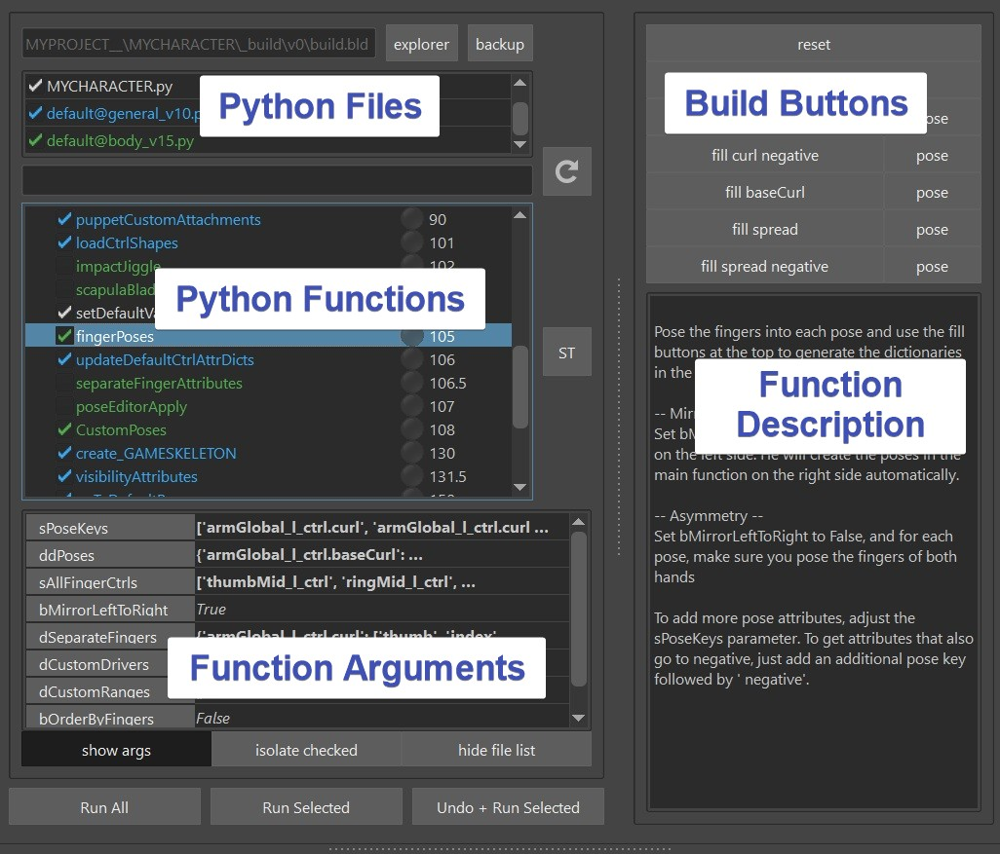
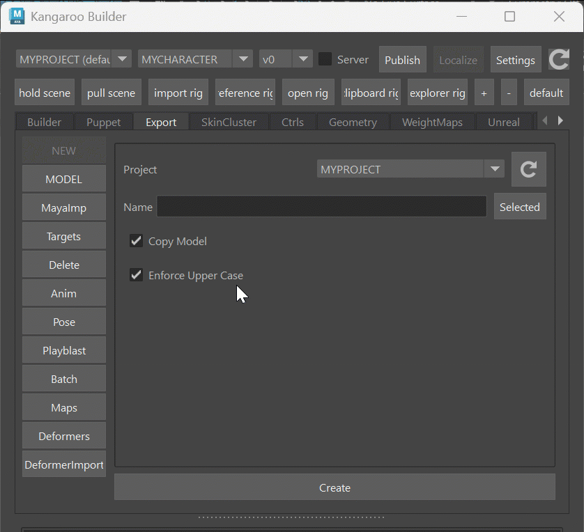
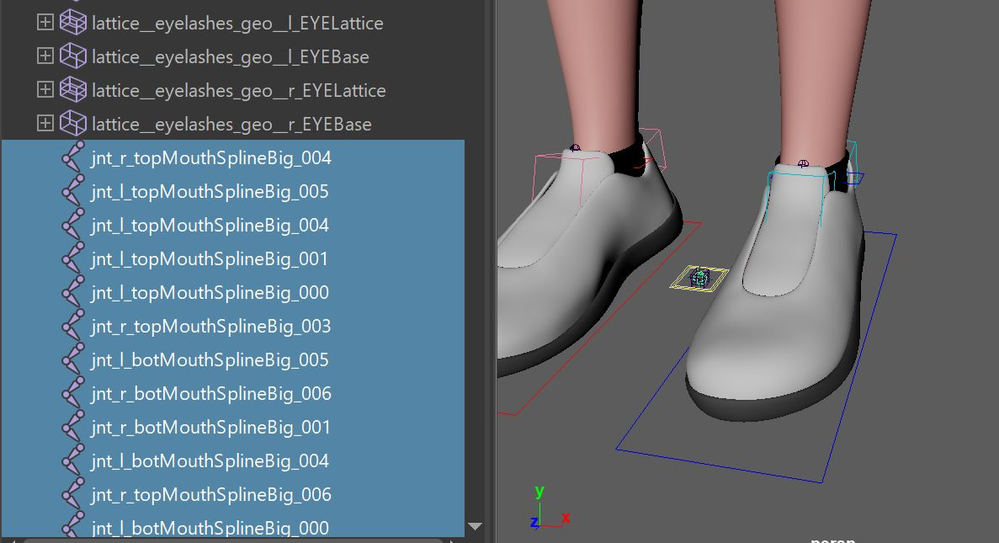
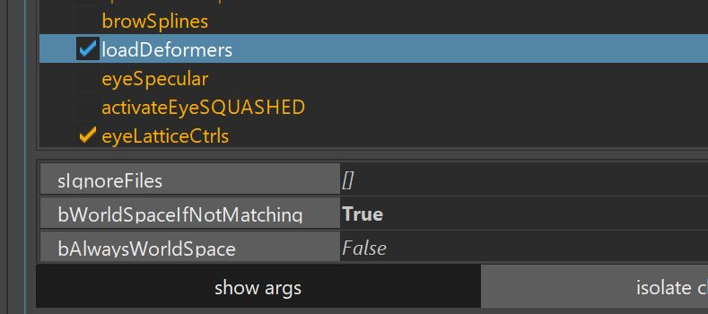
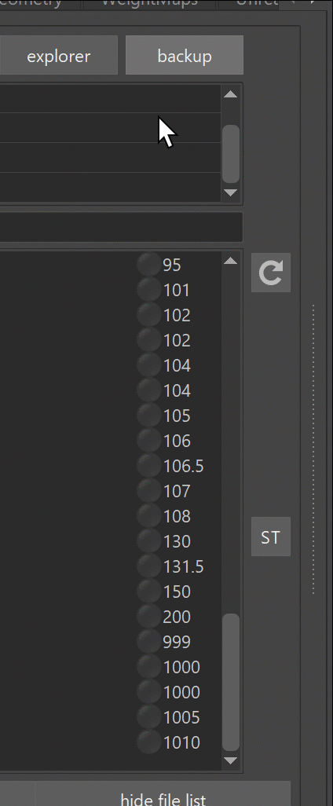

## What is the builder?
The **Builder** is the first most important tool that you need to get familiar with for creating characters.

The builder basically just manages a ton of Python functions from different files, and lets
you run them. Either just selected functions or all at once for the final creation using the **Build All** button

Go to that character you created from the previous section and click *Build All*  
Now sit back and enjoy watching him build the character for you :-)

Now take a moment to get familiar with the UI:

At the top you have Python Files. You can add files, remove files or you can even uncheck them and then all their functions will disappear.
Below are the actual functions. Even further below you can set function arguments for each function that you have selected.
And on the right side (you'll have to drag the splitter a bit) you can see buttons and a description for 
whatever function you have selected.

Looking at the function arguments, you probably just got a headache looking at some of the more complicated looking ones,
like sPoseKeys or ddPoses in the picture above. But don't worry, a lot of them are being generated automatically using the
build buttons. And if not, the [JSON Editor](jsonEditor.md) can help you.  

You can also create your own python functions and specify arguments and build buttons. But more to that
in the Python section.
For now let's check out some of the more important functions that we automatically.  

## The Functions

###*importModel()*

The *importModel()* function imports the model. Currently it's just that boring grey guy. 
If you already have a model, go to export -> MODEL, and with the Explorer New Model button
you get a folder that let's you copy a character in it
  
If you work in a company that has their own studio pipeline, you might want to grab
the model automatically from the studio pipeline. To see how to do that, go [python](../python.md#connecting-to-studio-pipeline)
Bascially you'd create a script that from the character name and some version setups looks for the corresponding character model file
in your studio pipeline.

### *importBlueprints()*, *buildPuppet()*
importBlueprints and buildPuppet are the functions is grabbing the work you do in the puppet tool.
Blueprints is basically just a simple ma file with guide joints, and buildPuppet is generating all the 
controls and rigging logic like Iks, Fks, Auto Clavicle, ...
We'll get to those more in detail in **Puppet**. But for now let's continue checking out the 
other important functions.

### *loadCtrlShapes()*
This loads the ctrl shapes that you export in **Ctrls** -> **Export** -> **Export All Ctrls** 

### *loadDeformers()*
This loads the deformers (mainly skinCluster weights)   
You can export the deformers in **Export** -> **Deformers**  
Keep in mind this only saves **weights**, **attribute values** and **deformer orders**  
It does NOT load deformer structures such as blendShape targets, or full wrap deformer setups.
Because for the blendShapes there are way cooler tools than that (see later in **Pose Editor** and **Shape Editor**).
And if you want to do stuff like Wrap Deformers or Morph, it's much cleaner to do that in a 
python function before the loadDeformers(), and let the *loadDeformers()* just set the weights.  
Easy deformers like *deltaMush* that mainly just need weights and attribute values could be handled
just in the *loadDeformers()* function

When you are loading the skinCluster weights, many times you'll see that some of the joints are just simple joints on the origin.
This could mean one of two things:

1. when you exported, there was a joint weighted which due to new changes you did, the joint doesn't exist anymore.
In that case the skincluster *Move* tool can help you to move the weights to where they should be
2. Many setup functions especially in the face are happening **after** the *loadDeformers()* function. In those cases
the *loadDeformers()* function will just create the simple joints since they don't exist yet. And then 
the function later is smart enough to recognize them and put them into the proper place

Here you can see how those joints look like.  

!!! note
    You'll you see there's also a lot of other *garbage* around, like some lattice boxes.
    All that is just there for debugging purposes, and will get deleted (cleaned) properly in the *clean()* function.

If the model changed in topology, you can set the **bWorldSpaceIfNotMatching** flag to True

Actually this way it'll always just worldspace transfer the weights if the topology changed. And you'll see that he
did that later for example when you rebuild, he'll ask you if you want to export the newly transferred weights.

If you want to be more specific on how to load the deformers, you can do that in the **deformerImport** tool:

The button **Load best fitting skinClusters** for example is a great button for situations where you are dealing with a character that has
many meshes, and modellers decided to just blindly rename a lot of meshes
!!! note
    after using that tool to fix weights, you'll have to reexport them, so the *loadDeformer()* function 
    loads it properly again.

### *importMayaFiles()*
If you go to **Export** -> **MayaImp**, you can export some scene elements. Those get imported on 
the **mayaImport()** function.  
If you want to check what files are there, you can do that with **right click**.  
   

### *importTargets()*
Very similar to importMayaFiles(). But Targets are just simple Polygon Meshes. Those are saved with a Numpy file format
that keeps the files smaller. Obvously the file might be even smaller if you save it as a dummy blendShape and add a builder function that extracts it (and some kangaroo tools do exactly that),
but there are many situations where you have some simple meshes and you don't want to go through that hassle.
If you go to **Export** -> **Targets**, you can export the selected meshes.  
By default it creates a file for each mesh and the mesh name is defined in the file name. 
This makes it very easy to manage later

### Other Functions
Now I've just shown you the important basic functions. But there's a looooot more, like all the green ones.
And later for the Face we'll add lots of orange functions

## Custom Functions
You can create your own functions in Python and declare your own arguments and builder buttons. But that's another topic, shown in [Python](../python.md)  

## BLD file
Everything you do in the builder like adding files, check/uncheck functions, setting function variables, or even
just selecting stuff - gets saved in the *build.bld* file.  
Whenever you do a wrong click such badly setting some variables that you'd like to undo - *Don't Panic!*
Just click on the **Backup** button at the top right and choose an older one to switch to. You might even need to use
it if your build file gets corrupted from a crash.

!!! note
    The *build.bld* file is a
    JSON file, so with a text editor you could theoretically adjust it. But we don't do that very often.

