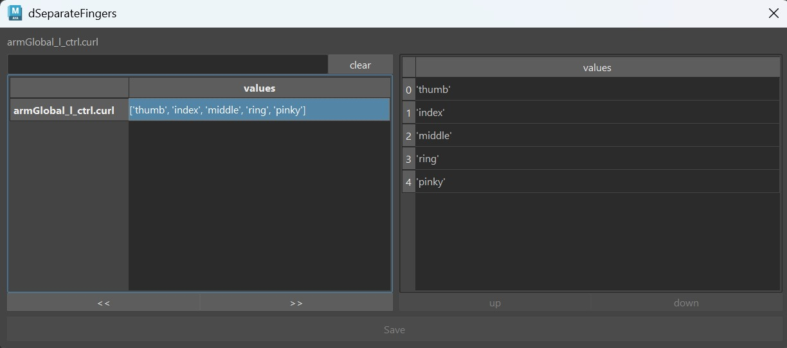

The JSON Editor is a tool inside the builder, that lets you edit complex attributes. By complex attributes
we are talking about dictionaries or lists that can have a lot of other lists/dictionaries embedded.  

Those attributes are saved as strings. By default you can also edit them as strings, but that gets very difficult on 
longer ones.  
So it's easier to do that by right click on the argument -> **Show in JSON Editor**. And you get this cool looking UI:

Many functions have the [=== DEFAULT ATTRS ===](../face/faceGeneral.md#default-attrs)  buttons that fill some dictionary (actually string) attributes
with sometimes huge amounts of data. If you want to edit that filled data, the *JSON Editor* is pretty much unavoidable.

