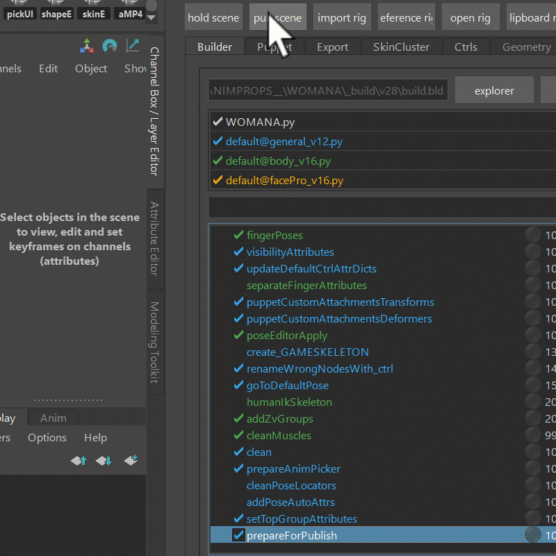
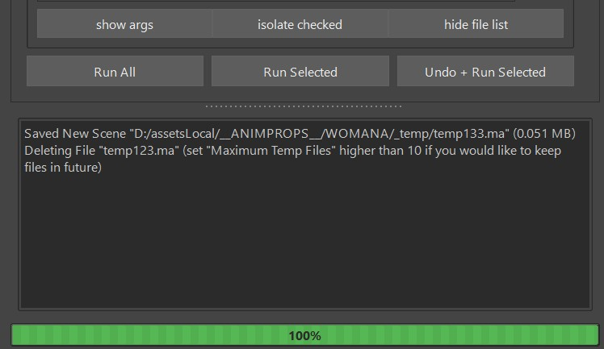
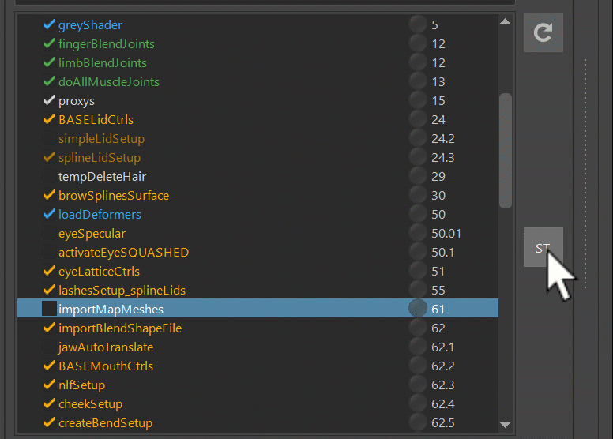

### Hold and Pull
**Hold** just saves a scene into the *_temp* folder of your character with a very simple name. And everytime you 
click *Hold* again, it'll save another version and just increments the number.  
Then when you click **Pull**, it opens whatever you saved last.  
And with a right click on the *Pull* button you can either open an older version or Reference it. Or you can copy it to clipboard so
you can get the path with CTRL+P
  
And he will delete older files automatically when you click *Push*.
He'll basically just keep the current temp file count to a specific number. He'll actually tell you that in the log:   

### Selection Templates
Selection Templates is the **ST** button on the right.  
By default it lets you select all the functions until *LoadDeformers()* or all the functions until *beforeClean()*.  
And with right mouse click you can define your own selection templates.  
  
If you wonder why we build until *clean()*: The clean() functions are basically cleaning the scene.
You'll learn more about it later, but for some things like muscle joints or debugging skinCluster it's
great to just build until before clean.

### Undo + Run Selected
If you building the whole character and it just breaks at once function, you can just fix for example the python code or
attributes, and run *Undo+Run Selected*, without having to run everything from the beginning. Basically the builder
remembers the undo "position" before each function and then later can do lots of undos in a row until he'll get to
wherever it was before the function.  
Unfortunately that doesn't work whenever the function does something that's not undo supported such as importing something.
