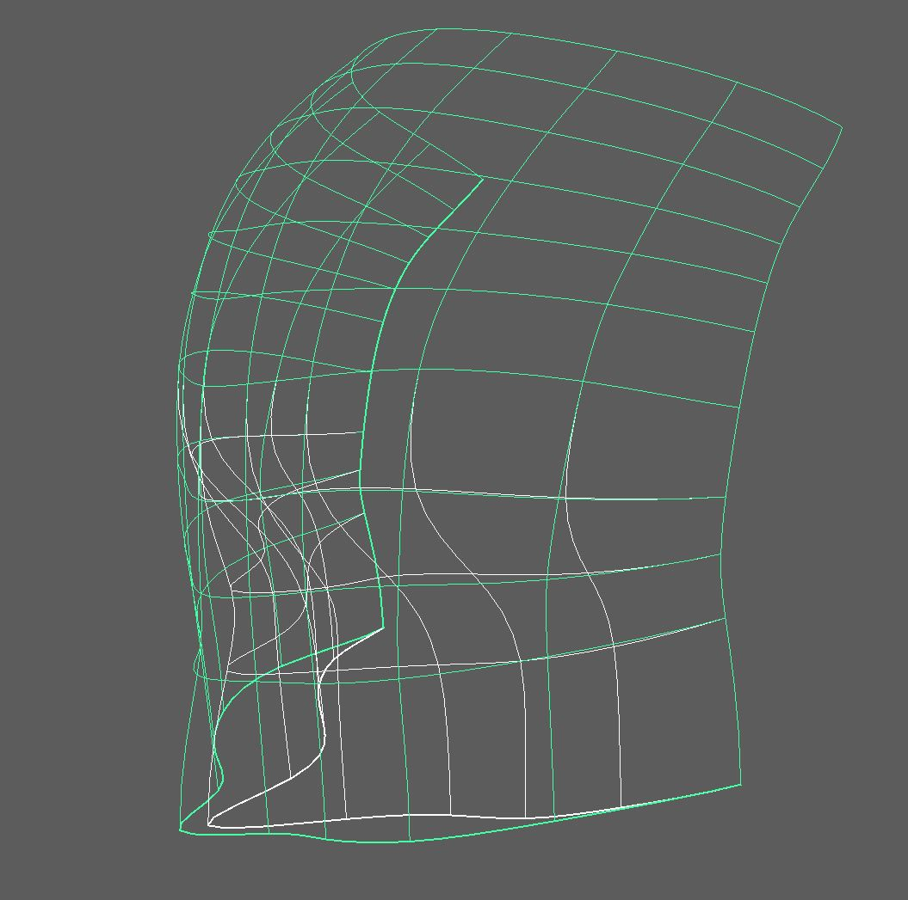
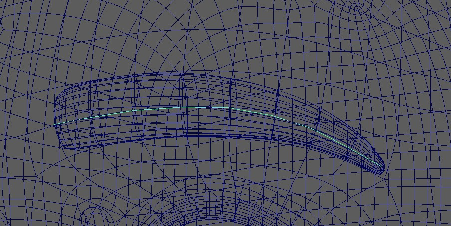
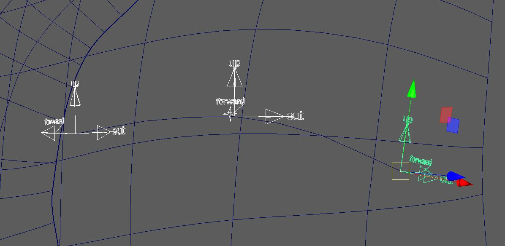
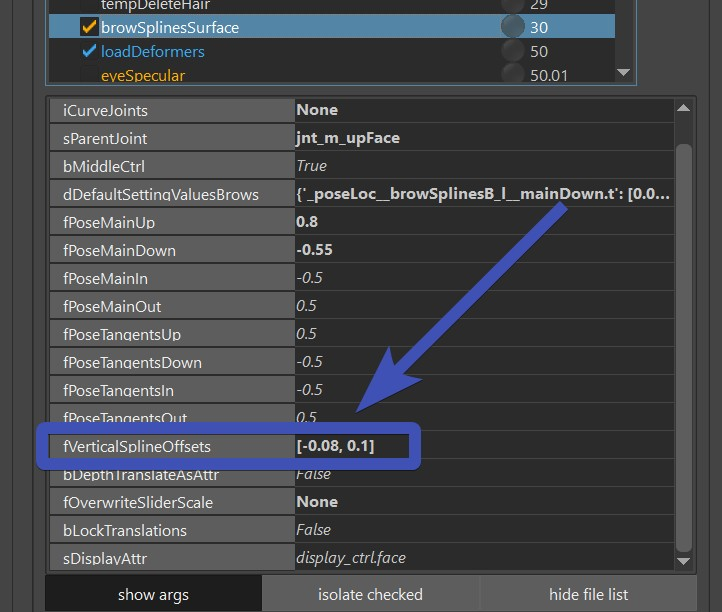
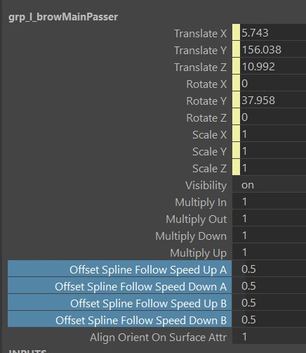
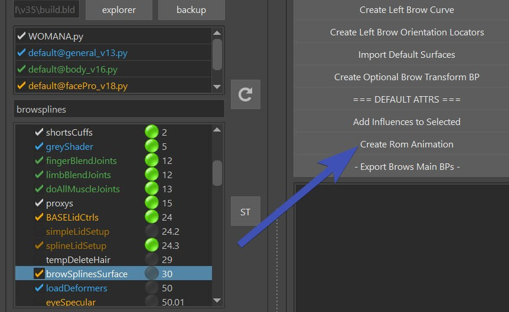
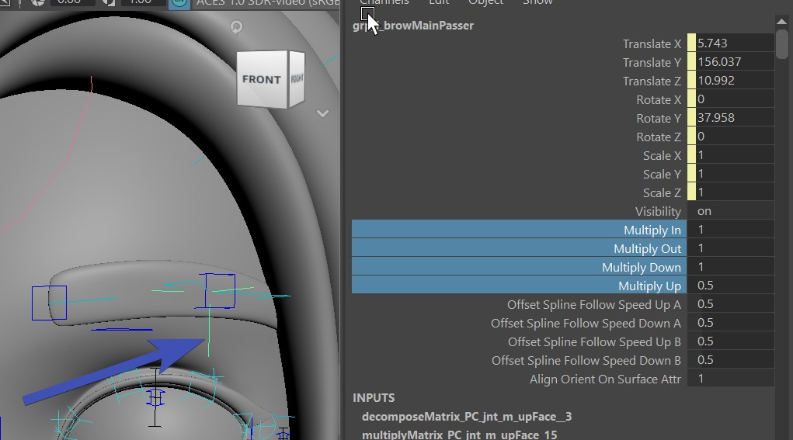
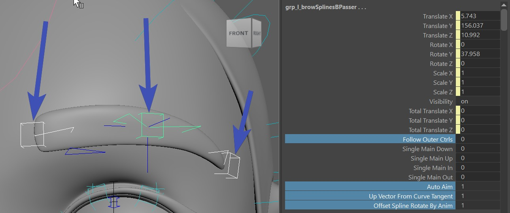
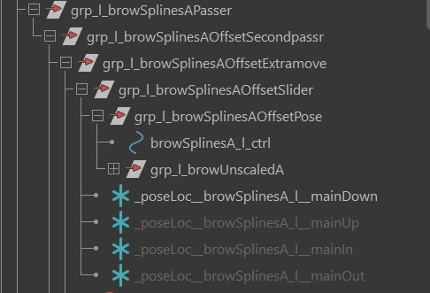
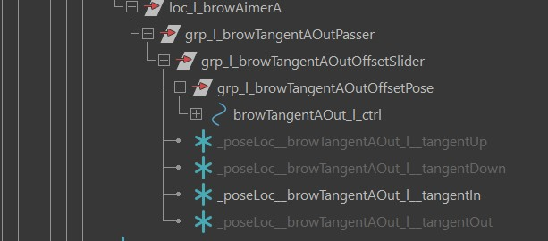

# Brows
## BlendShapes
The blendShape targets that you can sculpt in the ShapeEditor are:
```
    innerBrowDown
    innerBrowUp
    browIn
    browOut
    outerBrowUp
    outerBrowDown
```
In here we used all of them. No inbetweens, but you could add some:  
  

If you need to stick to blendShapes, and you find that those predefined targets are not enough, you should consider 
[Custom Targets](faceGeneral.md#define-your-own-targets).  
Those are very powerful for brows, especially if combined with [Combos](shapeEditor1.md#combos).

!!! Note
    Further below in [Brow Splines - Correctives](#brow-splines---correctives) you'll see some more targets you can sculpt 
    when using doing Splines.

## Brow Splines
If you want a spline rig with a ton of ctrls, use the *browSplinesSurface()* function. On the brows the control set
is different to the control set you get with blendShapes.

<video autoplay muted loop controls width="1378">
    <source src="../../images/face_browSplines.mp4" type="video/mp4">
    Your browser does not support the video tag.
</video>


### Brow Splines - Blueprints
The spline joints are sliding along the two nurbs surfaces **surface_forehead** and **surface_forehead_eyeSocket**
  
*Why are there 2 surfaces?*  
Most joints are sliding along the *surface_forhead* surface but the ones below the main line are sliding along
the *surface_forehead_eyeSocket*    
To create those surfaces, first click the button **Import Default Surfaces** and shape them.    
!!! tip "Tip - Use ShrinkWrap deformer to sculpt the Surfaces"
    To get them shaped as good as possible to the forhead, the easiest thing might be to shape it roughly first
    and then create a shrinkWrap with option *closest* to snap it to the head geo.  

Then select vertices and click the button **Create Left Brow Curve**. You adjust the curve after, the cvs of that
curve don't necessarily need to be on the vertices of the skin mesh:    
  


Then click **Create Left Brow Orientation Locators** and orient those locators. Make sure to have their *up* axis
go along the lines of the surfaces:  
  


### Brow Splines - fVerticalSplineOffsets
*fVerticalSplineOffsets* is the attribute that defines the exra rows. It's a list of all the rows. Negative is below the
main brows, and positive is above. 
  

Adjusting the speed of those is done with passer attributes:     
  
Then saving it works with the [** === DEFAULT ATTRS === **](faceGeneral.md#defaultattrs) button.
 
### Brow Splines - skinCluster
For skinning them, just select the mesh and click the button **Add Influences to Selected**. This just adds the influences,
and you can then paint them with the **SkinCluster -> Flood** tool. Also, you can use the **SkinCluster -> Smooth** tool, but
try to keep the iterations at 1! 
!!! tip
    If later you change the joint count or blueprint positions, you can also fix the skinning with the **Flood** tool, but
    turn on the [**Distribute Weights**](../tools/toolsSkinCluster.md#distributeflood) option.

This did NOT do the middle brow joints yet. Because it's best to just work on the skinning of the main brows first. And only add
the Middle ones if you actually need them.


### Rom Animation
Once you've skinned it, it's very helpful to apply the Rom Animation by clicking the button **Create Rom Animation**:  
  
What you see at this point is probably not great yet, and the next chapters below will help you to fine tune the motion.


### Brow Splines - Extra Attributes
Once you have a rough skinning pass, it's time to adjust the Passer Attributes.  
But first make sure that you are familiar with [** === DEFAULT ATTRS === **](faceGeneral.md#defaultattrs).

On the Passer of *browMain_l_ctrl* you've got **multiplyIn/Out/Down/Up**, those are to fine tune the movements when for example
the brows shouldn't go down as much as they should go up. Even though thoes are on the main ctrl, the 
spline ctrls (blue/red cube ctrls - **browSplines\[ABC\]_l_ctrl**) will also get affected by this.  
   

The passers of the three spline ctrls (**browSplines\[ABC\]_l_ctrl**) have

| Attributes                              | What they are doing                                                                                  |
|-----------------------------------------|------------------------------------------------------------------------------------------------------
| *offsetSplineRotateByAnim*              | When rotating the spline ctrls, should the offset splines also get that rotation?                    |
| *autoAim*                               | should the spline ctrls aim to each others or not)                                                   |
| *upVectorFromCurveTangent*              | if it's 1.0, the joints are aiming along the curve. For the outer ones you might want to set it to 0 |
| *followOuterCtrls* (only on the middle) | This will make the middle ctrl follow the inner and outer ctrl                                       |

   


### Brow Splines - Middle
The middle brow ctrl is on by default - but if not, turn on **bMiddle**.  
And it comes with 2 joints:

- jnt_m_browMiddleDefault: Just follows the side ctrls
- jnt_m_browMiddle: like the first one, but also reacting to the **browMiddle_ctrl**

On the actual *browMiddle_ctrl* you can set how much he should follow the side ctrls. And on the passer you have some extra
attributes that you can use to "sculpt" a crease with skinning when the side brows are coming in. Sometimes you get a nicely
lightweight crease with it. But depending on the model it's sometimes it's easier to just do the crease with corrective blendShapes.

!!! question "How does it get saved?"
    The values on the ctrl at this point would have to get saved using a python function. But the values on the passer 
    are saved with the [** === DEFAULT ATTRS === **](faceGeneral.md#defaultattrs) button.

### Brow Splines - PoseLocs
There are 2 sets of locators.
#### Spline Ctrls
The locators inside the hierarchy of the spline ctrls are posing the spline ctrls based on the **browMain_l_ctrl**:  
  
Very often they are just used for the down motion, to have the brow straighten as the browMain_l_ctrl goes down:   


#### Tangent Ctrls
With those you can pose the Tangent Ctrls, driven by the spline ctrls:  



### Brow Splines - Correctives
If you get stuck not being able to hit a proper shapes with combination of skinning and poseLocators, there's still the 
option of adding correctives.
```
browSplinesSplitCtrlsUp
browSplinesSplitCtrlsDown
browSplinesInA
browSplinesInWrinklesA (same as browSplinesInA, but an additional wrinkle attribute will turn it on)
browSplinesUpA
browSplinesUpB
browSplinesUpC
browSplinesDownA
browSplinesDownB
browSplinesDownC
browSplinesSplitJointsUp (experimental - heavy!)
browSplinesSplitJointsDown (experimental - heavy!)
```
The ones starting with *browSplinesSplitCtrls* are probably the most used ones. Their pose is the **browMain_\[lr\]_ctrl** 
going up or down. And then in the *blendShapesAndSliders()* function they will get split into the three spline ctrls (blue/red cube ctrls).

!!! tip
    Keep in mind you are not limited to those. You can create combo of them, and even combo with others.     
    And if it's still not enough, you can add extra correctives with the [**ddCorrectives**](faceGeneral.md#ddcorrectives) attribute
    in the *blendShapesAndSliders()* function.

## Trouble Shooting

### For BrowsSplinesSurface the brows are moving in a different direction than the ctrls
The brows are moving in straight lines of the surface. At this time the best is to adjust the orientation of the ctrls so 
they are oriented to the lines of the surfaces.   
In future there might be a fix to support ctrls going more diagonal.

