## Eye Puppet Limbs
For the eyeballs you have 3 specific limbs:

* **Eye**
* **EyesLookat**
* **EyeLookatIndiv**

Usually those are already setup-ed when you copied from another character. If you do need to set them up yourself,
make sure to specify the eyes in *attacher: eyes (c)*
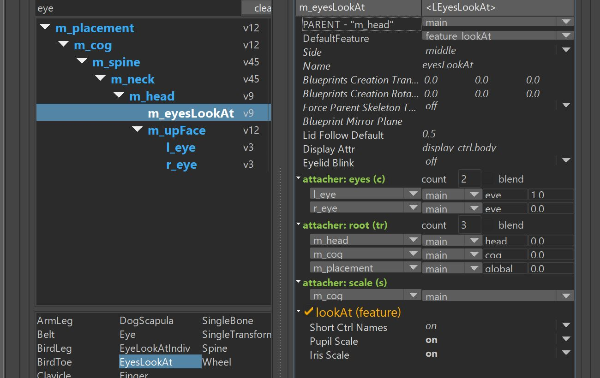
*EyeLookatIndiv* is for when you have a character that has the eyes pointing sideways. In those situations the
*EyesLookAt* is not so great, since the main ctrl is at the front of the character.

Once you've got the right setup in there, all you need to do is place the blueprints.  
And make sure that the polevector in the BP Rig is pointing *downwards*. Otherwise you'll get troubles later with the
eyelid behavior.  
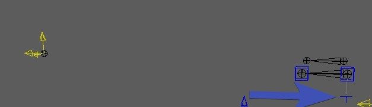  

### Iris and Pupil
The *EyesLookat* limb also comes with **IrisScale** and **PupilScale** attributes.  
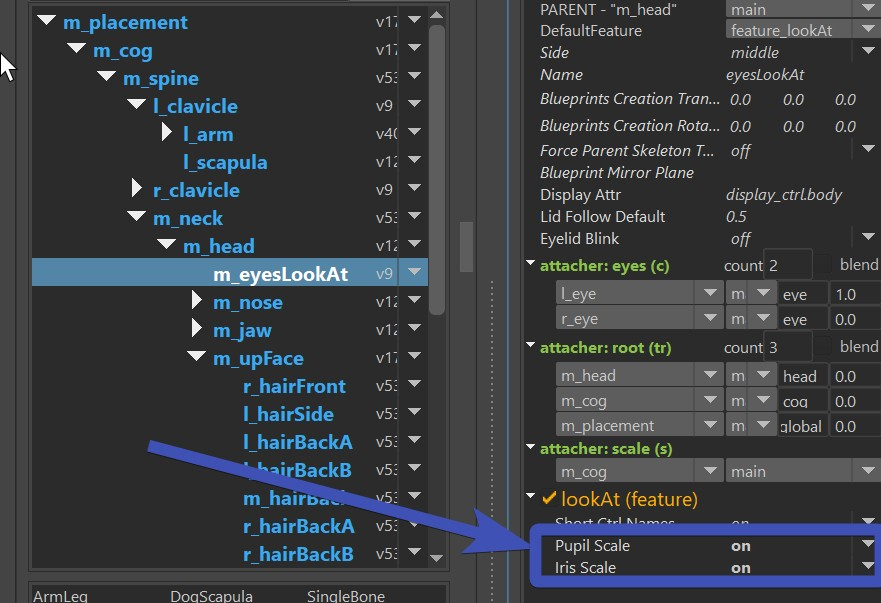
They reason why they are on the *EyesLookat* limb is because those have the ctrls for scaling them: 
*scaleX/scaleY* for Iris, and *scaleZ* for Pupil.  
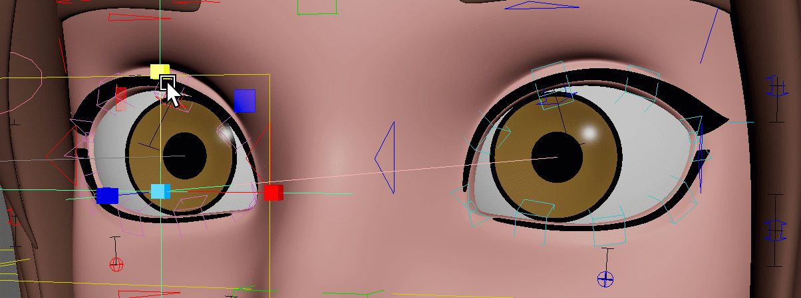
Make sure to skin the **jnt_l_eyeIris** and **jnt_l_eyePupil** joints!
 


# Eyelids
If you didn't add the facePro python file, add it now as shown in [faceGeneral](faceGeneral.md) (facePro_v18.py at the time of this writing). 
## Base Ctrls
The function *baseLidCtrls()* just creates those three arrow ctrls. Those are being used for all setup, no matter
if simple lid joints, blendShapes or splines.  
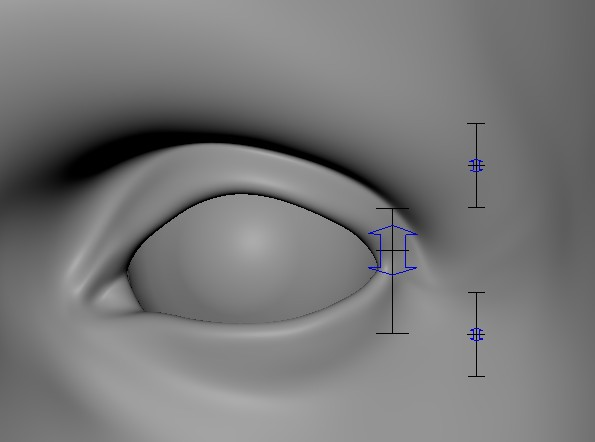

To get a good rom, apply **rom_eyes.anim**, which you'll find in almost every character at **Export -> Anim**.  
But at this point the eyelids are not moving yet. For them to move, you'll hvae to either do *simpleLidSetup()* (Simple Lid Joints) or *splineLidSetup()* (Eyelid Splines)


## Simple Lid Joints
### Create and Skin
If you turn on the function *simpleLidSetup()*, you'll get mainly 2 joints for each eye *jnt_l_eyeBlinkBot* and *jnt_l_eyeBlinkTop*,
and a few pose groups (siblings) that define in which poses the joints should be as you move the arrow ctrls created in [Base Ctrls](#base-ctrls):
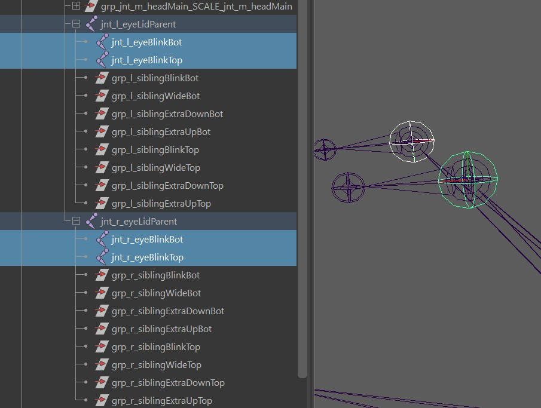  

After you've run that function, skin the joints. 
Don't worry if it doesn't look good yet on the blink, for that you'll need to set the slibling transforms.

!!! warning "Skin Weights"
    When you are skinning the eyelids, be careful with the smooth tool - you don't want upper eyelid to affect the lower one
    or other way around. 

### Sibling Transforms
Those are transforms that you can move around, and they define the poses of the lid joints (*jnt_l_eyeBlinkBot* and *jnt_l_eyeBlinkTop*),
being posed by the arrow ctrls (blink, wide, upperLidUp, upperLidDown, ...).
They work with a similar concept as the  *poseLocators* you see in lots of other functions.   
Locate them by clicking the button **Select Sibling Transforms**:  
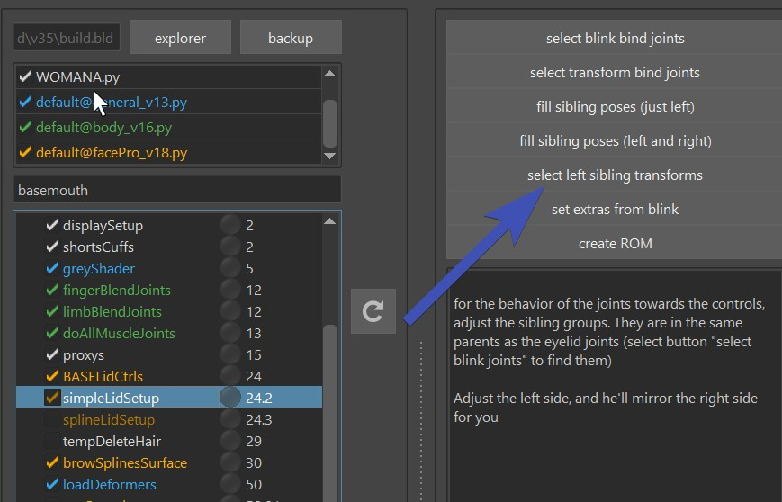  

And then just place them, as you go through the rom that you applied:  
  

Many times you can get perfectly looking blinks using a combination of good skinning and well placed Sibling Transforms.
But it's not always the case. In some cases you'll hit limits where you have to add blendShapes on top.

## Eyelid BlendShapes
The [*blendShapesAndSliders()*](faceGeneral.md#blendshapesandsliders) function is using the blendShapes mentioned below.   

**blink_l_ctrl** is triggering the following blendShapes:  
```
blink
eyeWide
upCurveBlink (for some cartoony characters, creates **upCurveBlink** attribute on the blink_l_ctrl)
```

**lidBot_l_ctrl** and **lidTop_l_ctrl** are triggering the following ones:
```
eyeUpperUp
eyeUpperDown
eyeLowerUp
eyeLowerDown
```

!!! tip
    While those blendShapes could be applied without a joint setup, it's recommended to run at least the [*simpleLidSetup()*](#simple-lid-joints) Joints. 
    Because if you do a blendShape alone, a blink might be too linear and without inbetweens giving intersections with the eyeballs very quickly.


When the eyeballs are looking into different directions, those blendshapes are being triggered:
```
eyelookUp
eyelookDown
eyelookLeft
eyelookRight
```
Those eyelook shapes can also be tweaked by animation with the *eyesLookAt_l_ctrl.lidFollow* attribute.

!!! info "More Correctives..."
    If you are doing Eyelid Splines, there are some more options of correctives. They are explained in
    [Eyelid Splines - BlendShape Correctives](#eyelidsplinecorrectives).

## Eyelid Splines
<video autoplay muted loop controls width="1000">
    <source src="../../images/face_eyelidSplinesCtrls.mp4" type="video/mp4">
    Your browser does not support the video tag.
</video>

The function *splineLidSetup()* is creating splines that take care of a proper blink using some additional joints:  
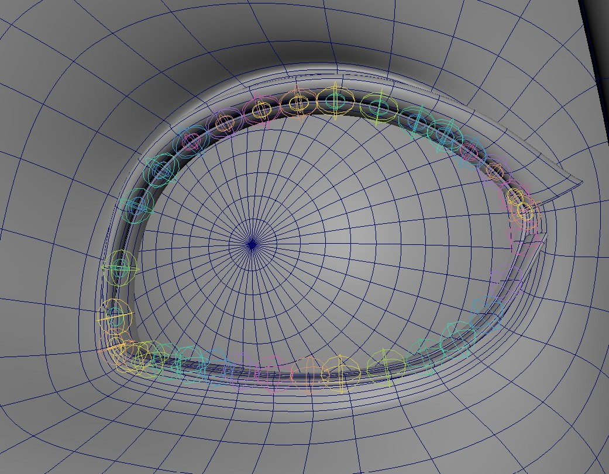  

!!! tip "Too many Joints?"
    If you have a very dense character where a joint for each verterx on the loop is too much, you can set the
    attribute **iSkipSplineJoints** to a higher value. In here I have it at 2, means he always does every 3rd joint:  
    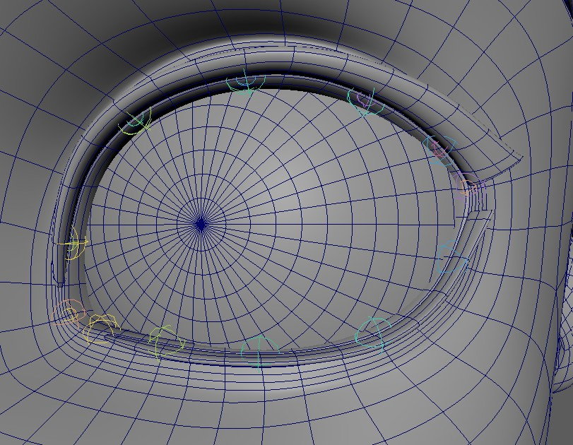  

You'll see there's quite a few chapters just for the *Eyelid Splines*, but 90 % of the time just the first sections 
are required. And actually sometimes it doesn't take more than 5 minutes to get nice Eyelid Spline Setup.    
But in some cases where you need to go more detail, you have the tools for it.

### Eyelid Splines - Creating the Blueprints
This function needs some extra blueprints, but they are easy to create.  
Select a vertex along the edge of the eyelids:  
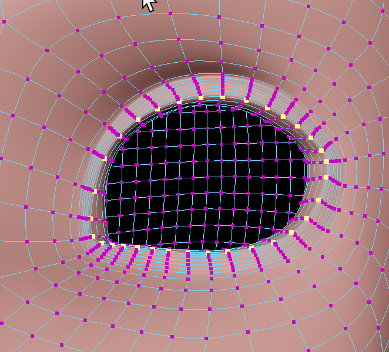  
Then click the button **Create Left Curve and Locators**:  
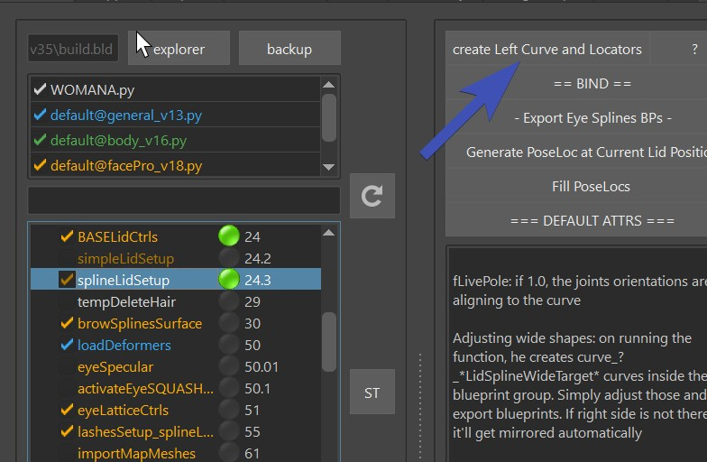  
And you'll get this curve and two locators:  
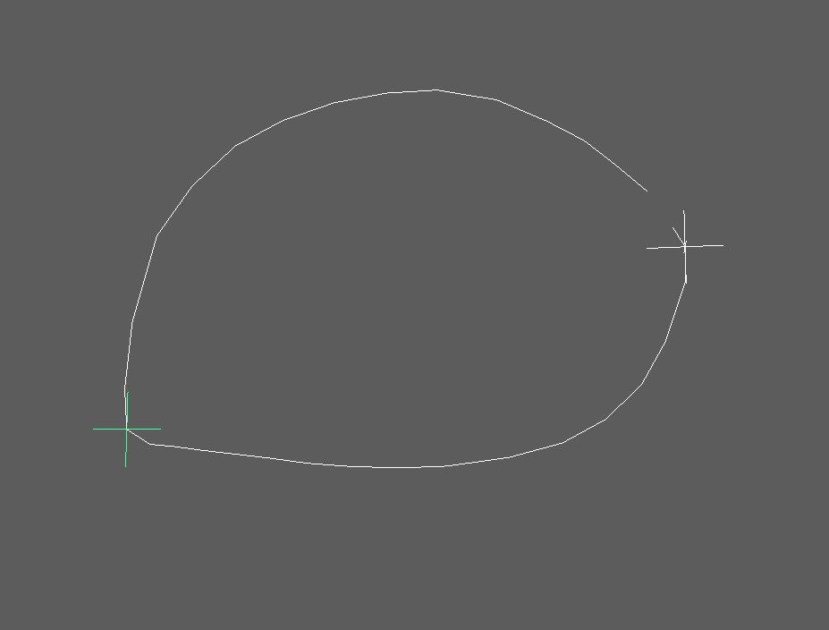  
Those locators need to be at the inner and outer corners. Those are basically what cuts the lid into lower lid 
and upper lid. Always check if the locators are placed properly, the tool doesn't *always* do that correctly.  

!!! note "Ignore the hole in the curve" 
    See how there's a hole in the curve, in this case at the upper right side? That's fine, 
    because this curve is not being used for the setup, it's only to indicate where the actual setup curve should be 
    when building.  

### Eyelid Splines - SkinCluster
Next thing is run  until *loadDeformers()*. Theoretically you could also *Run All*, but it's not needed.  
!!! note
    Remember the [*Selection Templates*](../builder/workflowTricks.md#selection-templates) from the builder? This is where they come in handy.  

Select the mesh, and click **==BIND== -> bind to joints on selected mesh**.   
Under the hood this is running the [Closest Expand SkinCluster Tool](../tools/toolsSkinCluster.md#closestexpand), and the 
values in the **iBindRows** attribute (*[2,3]* by default) are the *Expanded Full Weight Loops* and *Expanded Fade Out Loops*.

And then test it using the Blink Ctrl:  
     
If you find that the skinning needs more or less influence, just adjust the **iBindRows** attribute. Sometimes before running
the tool again, it might be good to move the weights back to the *jnt_m_headMain* first. There's an option for it under the **==BIND==** button.  

!!! success "Maybe you are done now!"
    In many cases if you got until here, you can call it done. But sometimes you need higher fidelity, and there's still
    more things you can do. Just keep reading here.


### Eyelid Splines - Finetune the Cube Ctrls
The light blue ctrls are manipulating the spline directly:  
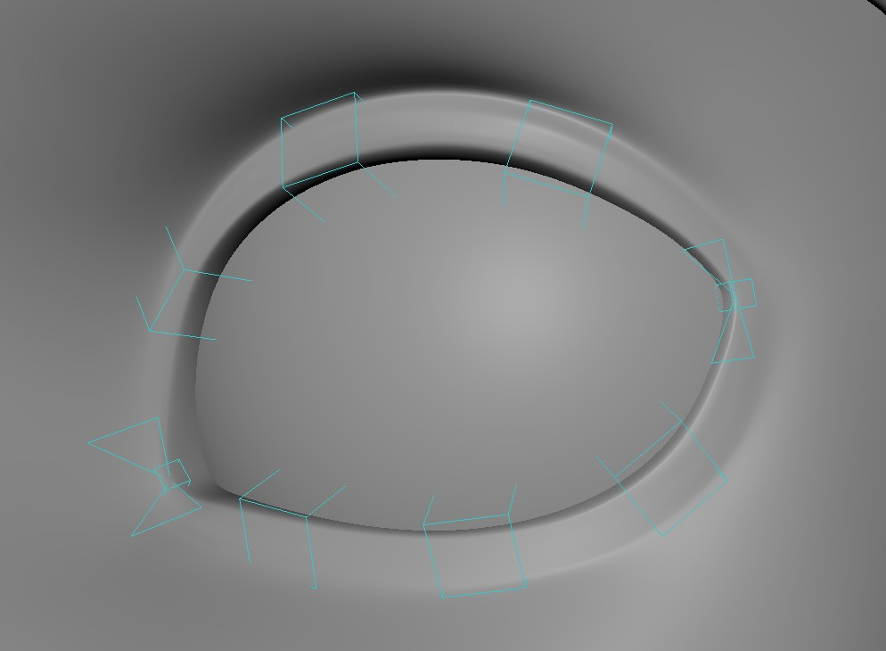
If you don't like the influence, you can play around with
**iCtrlSmoothIterations**. Whenever you modify this value, you'll need to rebuild to see the results.  
For even more precision you can also adjust the weights directly
on the skinCluster **skinCluster__curve_l_topCombined__CTRLS** of the **curve_l_topCombined** curve.  
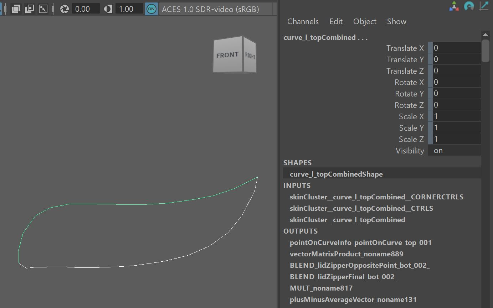  
Make sure you export the weights of those curves! When you click **Export -> Deformers** on those curves, you'll notice he 
exports all three skinClusters. You could theoretically delete the 2 unchanged ones, but they don't cause many issues if you leave them.

### Eyelid Splines - Zipper
The *splineLidSetup()* function also comes with a **bZipper** attribute.
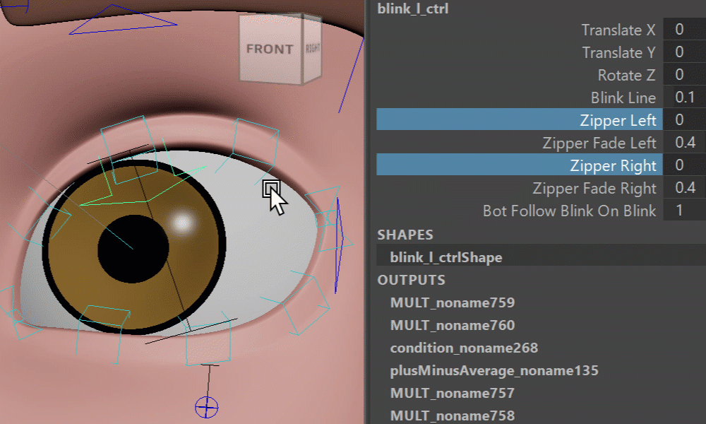  
!!! question "Is it useful??"  
    Animators are very divided on this, feel free to checkout this LinkedIn discussion or even put your opinion out there:
    <a href="https://www.linkedin.com/posts/thomas-bittner-6bb6302_ive-just-added-eyelid-zipper-to-my-face-activity-7239912418816995329-2aJx?utm_source=share&utm_medium=member_desktop&rcm=ACoAAABy3u8BK03tH_Bovh-T4-W99NGXldU3f_g" 
    target="_blank">LinkedIn Post on EyelidZipper</a>
 
### Eyelid Splines - Passer Values
On the passer of the **blink_l_ctrl** you can find those attributes. Close the eyelid and experiment with them.  
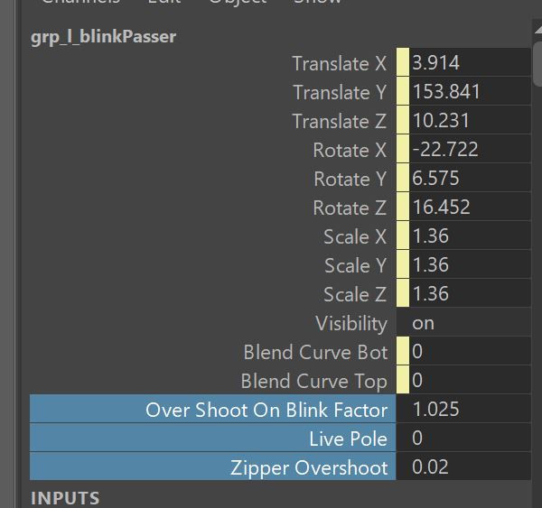   
Mirroring and Saving those values happens with the [** === DEFAULT ATTRS === **](../face/faceGeneral.md#defaultattrs) button.
And the attribute where they get saved to is *dDefaultSettingValuesSplineLids*.

### Eyelid Splines - Poses with Locators
You'll see a locator for each light blue cube ctrl called for example **_poseLoc__eyeSplineBotA_l__blink**
When the eyelid is in a blink state, just move around the locator to adjust the pose a bit.  
   
It's a great way to make sure the lid is fully closed in case the passer attribute *overShootOnBlinkFactor* is not enough.  
Those locators are basically just get activated when *blink_l_ctrl.ty* is -1.0.  

If you want to get more in detail with poseLocators, you can also go to any pose using the blink_l_ctrl or the other 
two arrow ctrls, and click **Generate PoseLoc at Current LidPosition**.     
This creates extra locators that you can modify.   

Saving the PoseLocs works with the **Fill PoseLocs** button. If you want to get rid of some of the extra poseLocs,
don't delete them directly, since this would break the setup. Instead adjust the **ddPoses** attribute (make sure 
to use the [JSON Editor](../builder/jsonEditor.md)) and rebuild.

!!! warning 
    Very often we create the additional pose on the pose where the upper eyelid is fully down, using the lidTop_l_ctrl.
    If you set this ctrl pose to NOT be fully down, in the end it will fade back to default when the ctrl is fully down.
    Which can be unwanted behavior. 


#### extra control on lids open widely
When you run the eyelid spline function, you'll get those extra curves:  
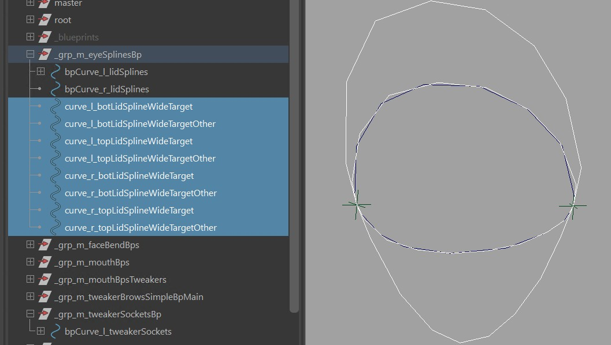   
Those just specify how the lids behave when they get opened wider.   
If you want to finetune those, you'll more likely want to set the **bLipsCanPushOut** value to **True**, otherwise
the lips will always be constraint onto the eyeballs


### Eyelid Splines - BlendShape Correctives {#eyelidsplinecorrectives}
If the PoseLocs are not enough, you can also go more in detail with sculpting shapes. For that the [Shape Editor](shapeEditor1.md)
needs to be understood.  
When you are using the *Shape Editor*, many times doing the usual blendShapes mentioned above like *blink* are already 
enough. But you can go move into detail:  
You could create a **splineLidCorrective\*** target, that works with a similar timing as the PoseLocs mentioned above.     
For that, open the blendShape file, reference the latest rig in the Shape Editor:
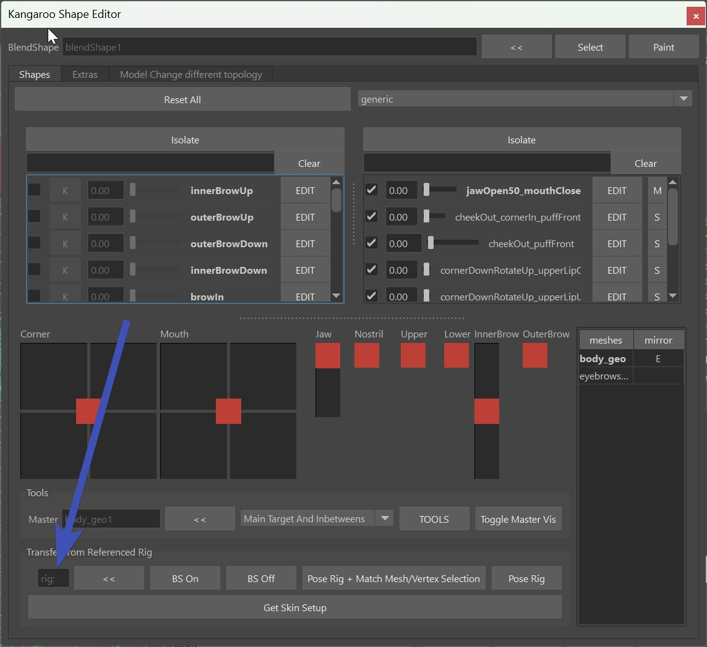     
And add a new Target as shown in this video:  
<video autoplay muted loop controls width="1000">
    <source src="../../images/face_eyelidCorrectiveLowerLid.mp4" type="video/mp4">
    Your browser does not support the video tag.
</video>

The names of the newly generated target might sound a little technical. That's just because it's trying to fit a lot of 
information into the target name. Basically it's having the lowerlid position and upperlid position in 
percentage separated by **X**. And if there's an **n** before a number, it means the number is negative.  
*"splineLidCorrectiveX030X"* = lower lid 30 % up, nothing is after the second X therefore no pose for upper lid  
*"splineLidCorrectiveX010X089"* = lower lid is 10 % up and upperlid is 89 % down.   
If you have 2 poses (lower and upper), then it's spliting those in the *blendShapesAndSliders()* function, using the skinCluster weights.
!!! tip
    The lower lid up as shown in the gif above is actually very common. 
    Often we add that shape but keep it unchanged, just to create a combo with the *squint*.

   

## Eye Lattice Ctrls
  
Just turn on the **eyeLatticeCtrls()** function and specify the eyeBall geos (**sLeftMeshes**, **sRightMeshes**), and the mesh that has
the eyelid geos (**sSkinMeshes**).    
After building, you'll have to fix the eyelid weights. It's best done with **Weightmaps -> Flood** and the *Replace Absolute* option.  
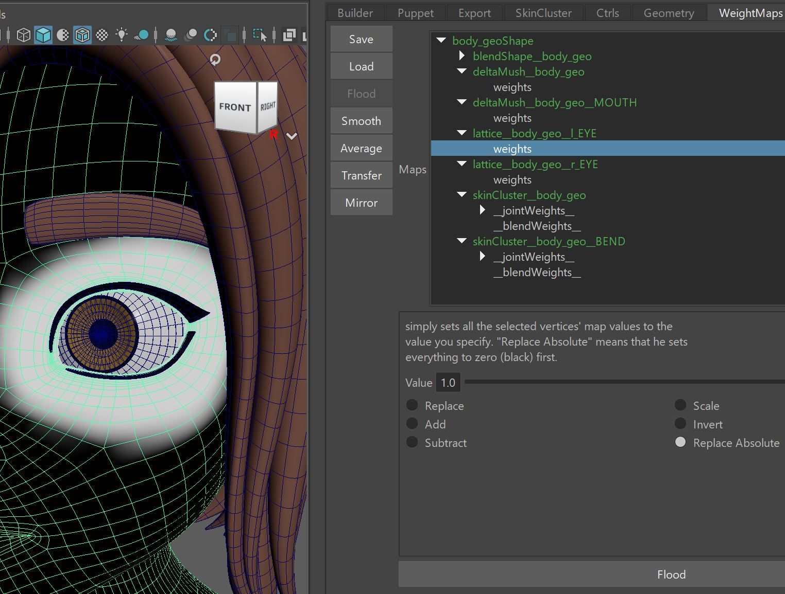  
And you are done. Check if the triangle ctrls are buried inside the mesh, and if they are - shape them and export ctrls.


## Tweakers
If you don't have spline rig for the eyelids, animators might ask for extra ctrls since the blue arrows are not enough.
See [*TWEAKER_lids()*](faceTweakerCtrls.md#tweaker_lids).


## Blink Line
There's an attribute on the **blink_l_ctrl** that can changes the blink when the eyes are closed.  
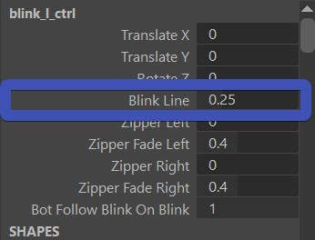  
Sounds simple - but how it really behaves depends on which functions you've used:  

| Situation          | What the clink line does                  
|--------------------|-------------------------------------------
| Just BlendShapes   | Not doing anything                        |
| *simpleLidSetup()* | It post-rotates the eyelid joints up/down |
| *splineLidSetup()* | Best results                              |


## Blink Bottom and Top Separate
Some animators want to be able to achieve a blink by adjusting upperlid and lowerlid separate.  
To do that, set the **bExtrasAreAlsoForBlink** attribute in the *BASELidCtrls()* function.  
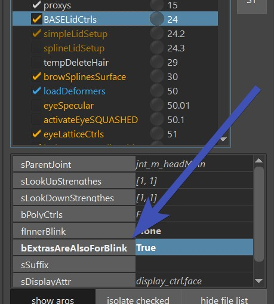  
This means that later the blink shape will get split into bottom and top.

If you have the function *simpleLidSetup()*, you can use the **set extras from blink** button, which will assign the values from the sibling transforms
of the blink onto the lower and upper ones:  


When doing the spline rig (*splineLidSetup()*), moving *lidTop_l_ctrl* fully down, and *lidBot_l_ctrl* fully up will close the eye. 
And with the blinkLine you can control at which point they close. 