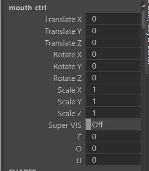
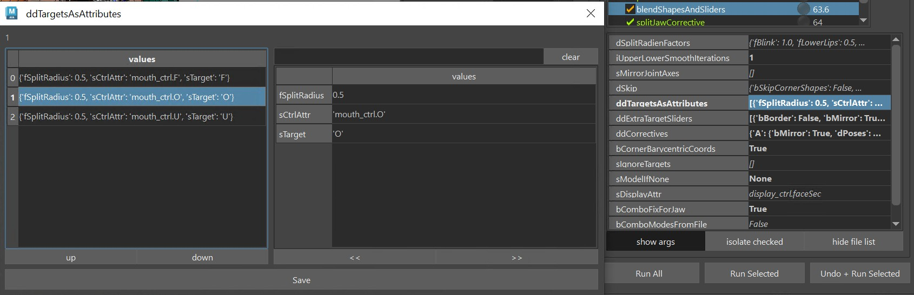
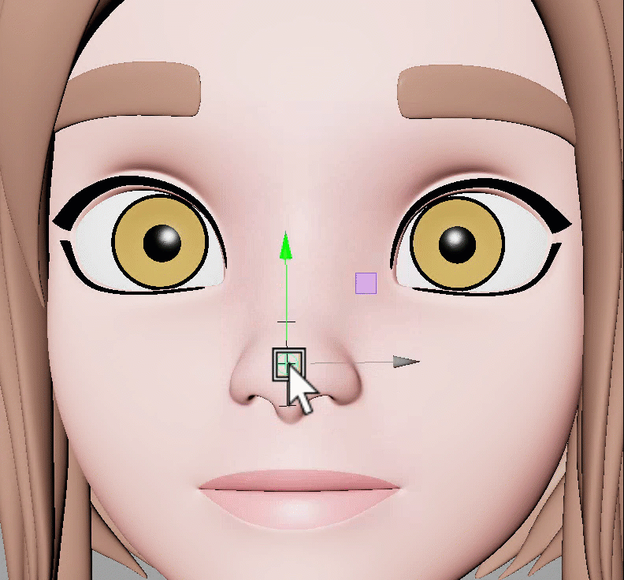
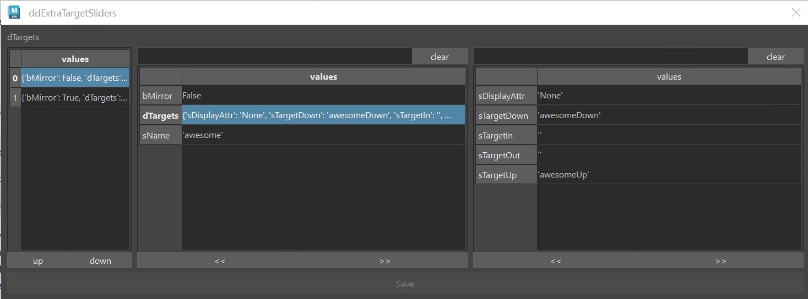
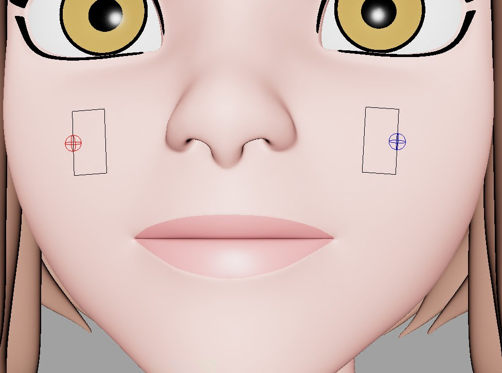
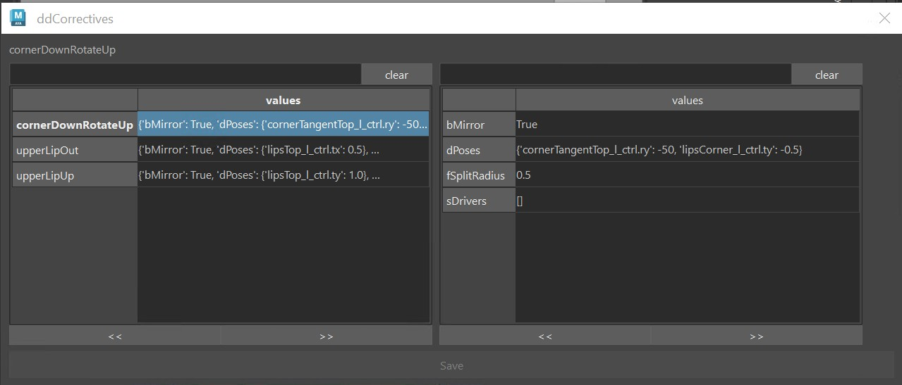

Face Rigging in Kangaroo has gotten very powerful in version 5. It's got many different setups to choose
from for each part - mouth, brows, eyelids, etc and it's got some general squash/stretch ctrls.

Most of the time you have the option of doing spline setups or blendShapes. You can also mix.

The first thing to do when you do Face Rig is add the python file **facePro_v18.py** (right click on the Python Files
in the builder -> **Add File** -> **+default** -> **facePro** -> **facePro_v18.py**


## Puppet Limbs
For things like Tongue (*Spine*), teeth (*SingleTransform* or *Belt*) we can use the puppet limbs that we also use for the body.
You can also use [Tweaker Ctrls](../puppet/tweakerCtrls.md) if you want to give animators some extra modifiers. But make sure
to first read through [Face Tweaker Ctrls](faceTweakerCtrls.md) in here, since those might already give you better options for many cases.  


## BlendShapes vs Splines
Most parts of the face (mouth, eyes, ..) come with two options - *BlendShapes* and *Splines*.  
There are pros and cons to both approaches.
Which one you choose depends on a lot of factors, not only the type of character.

But generally, **use blendShapes if..**

- you are doing a realistic character, or
- you have a model team that has the capacity to sculpt blendShapes (not every modeler can model blendShapes!)

**Use Spline rigs, if..**

- you have talented riggers (setting up splines requires technical **and** artistic skills)
- you feel that blendShapes would appear a bit to static since they are just turning on/off shapes

Keep in mind that you can always use the blendShapes on top of the splines as correctives! 


## *blendShapesAndSliders()*
For setting up blendShape Ctrls you need to sculpt the shapes with the [Shape Editor](shapeEditor.md). And make sure
that the blendShape file you create with the *Shape Editor* gets imported and baked in the *importBlendShapeFile()* function.  
Then *blendShapesAndSliders()* is the function that takes all those baked target meshes and assigns them as blendShapes.  

It's probably the most complex function inside the whole Kangaroo tool. It knows about a huge list of shapes, and can even do some additional shapes defined in the 
attributes *ddTargetsAsAttributes*, *ddExtraTargetSliders* and *ddCorrectives*.   
It does all this: 

- inverts some against the skinCluster
- splits the targets (mostly left/right, but also others like lip ctrls, brow spline ctrls and upper/lower eyelids)
- creates and connects all the Combo Targets   
- creates many slider ctrls  

Below you can find an overview of what Targets it accepts.   
### Eyes, Brows and Mouth
For eyelids and mouth the ctrls are pretty much the same when you use the blendShape setup or spline setup. Therefore you can
use the same blendShapes targets. The only difference is that for the spline rig those blendShape targets act more like correctives:  
[Eyelids](eyes.md#eyelid-blendshapes)  
[Mouth](mouth.md#blendshapes)    
For the brows the ctrls are different between the blendShape setup and spline setup. That's why we have different sets of targets:  
[Brows (BlendShape Setup)](brows.md#blendshapes)  
[Brows (Splines Setup)](brows.md#brow-splines-correctives)  

### Some more..
```
squint
cheekRaiser
cheekIn
cheekOut
puffFront
mentalis
chinRaiser
lipStretch
neckStretch
```

### Define your own Targets
But likely you'll hit a point where you want to add a target that you can't find in any of the list. For that case
we have 3 extra attributes on the *blendShapesAndSliders()* function: *ddTargetsAsAttributes*, *ddExtraTargetSliders* and *ddCorrectives*.
!!! note 
    Before reading those, make sure you know about the [JSON Editor](../builder/jsonEditor.md), since adjusting those
    attributes directly would be a nightmare!

!!! note
    This section doesn't explain how to sculpt the targets, it only shows how to specify them in the builder function. For more info
    about actually sculpting them, check the [Shape Editor](shapeEditor.md#adding-more-main-targets)


#### ddTargetsAsAttributes
See how we have some extra phoneme attributes *F*, *O* and *U* on an already existing ctrl?  
   
You can create as many as you like, define pretty much any ctrls that is there. And if you define a left ctrl, it automatically
splits the shape and puts it onto the left/right ctrls using the *fSplitRadius*. 


Under *sTarget* you specify be the name that you define in the *Shape Editor* (*O* in the picture above). 
As the attribute goes to 1.0, the target will be activated.
You can also add *sTargetNeg*, which then would get activated as the attribute goes to -1.0.

#### ddExtraTargetSliders
With the *ddExtraTargetSliders* attribute you can create new slider ctrls, like this one:  
   
We've specified it as bMirror=False, and only added the sTargetUp and sTargetDown shapes:
  

Here's another one, where we've set bMirror=True, and also assigned the sTargetIn:  
  

!!! info
    You'll see that the *blendShapesAndSliders()* function creates all the ctrl positions, orientations and scale by guessing based
    on the direction and distance of the targets. But very often you'll want to adjust that. And it's easy - all explained in the
    following chapter [SliderBlueprints](#sliderblueprints). 

#### ddCorrectives

The *ddCorrectives* attribute lets you specify some corrective targets. Here the target names are the keys on the left of
the JSON Editor (*CornerDownRotateUp*, *upperLipUp*, *upperLipIn*):  
    
In the picture above we just specified some ctrls that are already coming from the face. But it doesn't have to be from the face functions.
It can also be a ctrl from the puppet.  
Here we created a corrective for when the trunk was down. We actually left the main target (*trunkDown*) as the default,
but added Combos. 
    
Check the [Shape Editor](shapeEditor.md#grab-targets-for-corrective-sculpting) for how to add shape from the rig.


 


## SliderBlueprints
Slider Blueprints are NOT the *blueprints* in the puppet tool. Instead they
are just some simple joints for the Face Setups. There's no centralized place where you manage them. Instead every 
function just creates them and puts them into the *__sliderBlueprints* group. and when you export them, you export them all together.


### Mirror
While you could theoretically mirror them with the *mirror* shelf button, usually we mirror them by just not exporting the 
right side ones, and then the functions create them using the left side ones.
To specify which ones get exported and which ones not you can switch the **doExport** attribute on each sliderBlueprint joint

### Export 
Exporting works with the button **-export \*Slider\* BPs-**. You'll find this button on many functions such as *BASELidCtrls()*,
*blendShapesAndSliders()*, *parallelAttachTransforms()*. And it'll do the same thing on each function, it exports
ALL the sliderBlueprints, not just the ones of the current function.


### Placing them
*Kangaroo* tries to estimate the position/orientation/scale according to the actual blendShapes. This doesn't always
look good by default, so you have the option to adjust it manually.  
Most of the time it's best to build until before *parallelAttachTransforms()*, and then adjust their locations and scale.
This way you can test right away if they work well with the blendShape they are driving.  


Unfortunately whenever they are driving spline rigs such as the lips spline rig, the live connection from the sliderBlueprints already gets broken
in the function where they are created. In those cases you just have to guess when giving them good scale values, and rebuild.
  

## DEFAULT ATTRS 
On many functions you'll see that **=== DEFAULT ATTRS ===** button. It's attributes that are usually on the passers of the 
ctrls that can be used to finetune the setup.  

But sometimes also pose locators. 

The button lets you mainly **Mirror** or **Fill** the attributes. Filling means putting their values into the functino attribute. 

!!! warning
    While it often does pose locators, it's not always the case. Check if that function has an extra button for filling 
    the Pose Locator. Or if still unclear, click the *Info* or *Select* option in the *Default Attrs* menu.

!!! tip
    If you want to update values after you've filled them, the The [JSON Editor](../builder/jsonEditor.md) can help you with this. 

!!! tip
    This *Default Attrs* button with so many menus is actually relatively easy to script in case you
    want to create a similar button for your own tools. Just check out the [Python](../python.md) section


## Deformer Order
The order how deformers are applied to the meshes is very important. The functions to add influences that you find on all the
setup functions usually take care of it, but there's many things that can reshuffle the order in a bad way.  
So you'll have to check here and there if the order is still correct:  
  
Basically blendShape first, then the main skincluster (the one without a suffix), __TWEAKERS, eye lattices, __BEND and in the end __BENDTOP.
