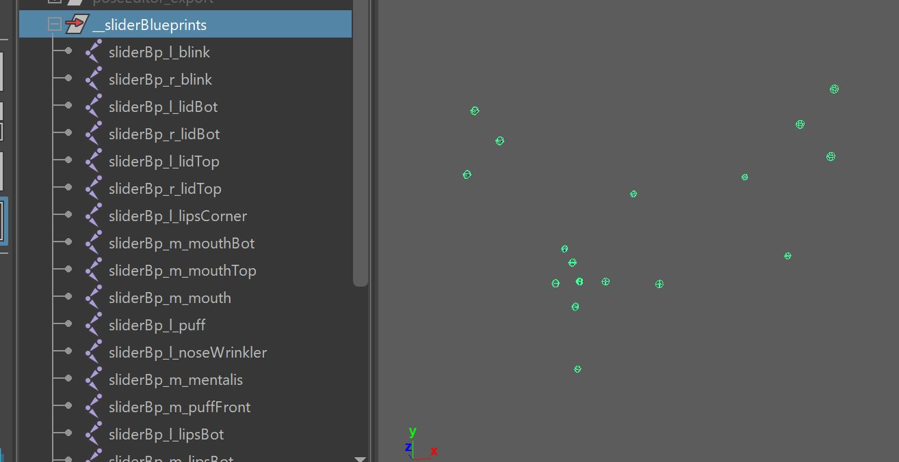

Face Rigging in Kangaroo has gotten very powerful in version 5. It's got many different setups to choose
from for each part - mouth, brows, eyelids, etc and it's got some general squash/stretch ctrls.

Most of the time you have the option of doing spline setups or blendShapes. You can also mix.

The first thing to do when you do Face Rig is add the python file **facePro_v16.py** (right click on the Python Files
in the builder -> **Add File** -> **+default** -> **facePro** -> **facePro_v16.py**

## Puppet Limbs
For things like Tongue (*Spine*), teeth (*SingleTransform* or *Belt*) we can use the puppet limbs that we also use for the body.
You can also use Tweaker Ctrls if you want to give animators some extra modifiers. But make sure
to first read through Face Tweaker Ctrls in here, since those might already give you better options for many cases.  

## BlendShapes vs Splines
Most parts of the face (mouth, eyes, ..) come with two options - *BlendShapes* and *Splines*.  
There are pros and cons to both approaches.
Which one you choose depends on a lot of factors, not only the type of character.

But generally, **use blendShapes if..**

- you are doing a realistic character, or
- you have a model team that has the capacity to sculpt blendShapes (not every modeler can model blendShapes!)

**Use Spline rigs, if..**

- you have talented riggers (setting up splines requires technical **and** artistic skills)
- you feel that blendShapes would appear a bit to static since they are just turning on/off shapes

Keep in mind that you can always use the blendShapes on top of the splines as correctives! 

## Shape Editor
Shape Editor is where you can sculpt and manage the sculpted shapes. You'll use it heavily on blendShape setups. But
it can also be handy for spline rigs, when it's all looking great but you want to add a corrective to adjust
the shape a bit more.

This video shows how it works:
<iframe width="560" height="315"
src="https://www.youtube.com/embed/cEBJ-tPLMuU"
title="YouTube video player" frameborder="0"
allow="accelerometer; autoplay; clipboard-write; encrypted-media; gyroscope; picture-in-picture"
allowfullscreen></iframe>

Basically you just create a blendShape file such as *blendShapes.ma* that you import and manage in the *importBlendShapeFile()*
And later the function *blendShapesAndSliders()* is grabbing those baked meshes and putting them into the rig as blendShapes.

## *blendShapesAndSliders()*
*blendShapesAndSliders()* is the function that applies all the blendShapes created in the Shape Editor.  
This function basically knows about a huge list of shapes, and can even do some additional shapes defined in the 
attributes **ddTargetsAsAttributes**, **ddExtraTargetSliders**, **ddCorrectives**
Here's an overview of what shapes it can do:  
[Eyelids](eyes.md#eyelid-blendshapes)  
[Brows](brows.md#blendshapes)  
[Brows Splines](brows.md#brow-splines-correctives)  
[Mouth](mouth.md#blendshapes)  

*Would you like to adjust the placement of the sliders it creates?* Check the following chapter *SliderBlueprints* 

 

## SliderBlueprints
Slider Blueprints are NOT the *blueprints* in the puppet tool. Instead they
are just some simple joints for the Face Setups. There's no centralized place where you manage them. Instead every 
function just creates them and puts them into the *__sliderBlueprints* group. and when you export them, you export them all together.

### Mirror
While you could theoretically mirror them with the *mirror* shelf button, usually we mirror them by just not exporting the 
right side ones, and then the functions create them using the left side ones.
To specify which ones get exported and which ones not you can switch the **doExport** attribute on each sliderBlueprint joint

### Export 
Exporting works with the button **-export \*Slider\* BPs-**. You'll find this button on many functions such as *BASELidCtrls()*,
*blendShapesAndSliders()*, *parallelAttachTransforms()*. And it'll do the same thing on each function, it exports
ALL the sliderBlueprints, not just the ones of the current function.

### Placing them
*Kangaroo* tries to estimate the position/orientation/scale according to the actual blendShapes. This doesn't always
look good by default, so you have the option to adjust it manually.  
Most of the time it's best to build until before *parallelAttachTransforms()*, and then adjust their locations and scale.
This way you can test right away if they work well with the blendShape they are driving.  

Unfortunately whenever they are driving spline rigs such as the lips spline rig, the live connection from the sliderBlueprints already gets broken
in the function where they are created. In those cases you just have to guess when giving them good scale values, and rebuild.
  

## DEFAULT ATTRS 
On many functions you'll see that **=== DEFAULT ATTRS ===** button. It's attributes that are usually on the passers of the 
ctrls that can be used to finetune the setup.  

But sometimes also pose locators. 

The button lets you mainly **Mirror** or **Fill** the attributes. Filling means putting their values into the functino attribute. 

!!! warning
    While it often does pose locators, it's not always the case. Check if that function has an extra button for filling 
    the Pose Locator. Or if still unclear, click the *Info* or *Select* option in the *Default Attrs* menu.

!!! tip
    If you want to update values after you've filled them, the The [JSON Editor](../builder/jsonEditor.md) can help you with this. 

!!! tip
    This *Default Attrs* button with so many menus is actually relatively easy to script in case you
    want to create a similar button for your own tools. Just check out the [Python](../python.md) section

## Deformer Order
The order how deformers are applied to the meshes is very important. The functions to add influences that you find on all the
setup functions usually take care of it, but there's many things that can reshuffle the order in a bad way.  
So you'll have to check here and there if the order is still correct:  
  
Basically blendShape first, then the main skincluster (the one without a suffix), __TWEAKERS, eye lattices, __BEND and in the end __BENDTOP.
