For mouth you also have option between blendShapes and splines.  
But what's different to the other setups is that on the mouth both ways happen with the same function: *BASEMouthCtrls()*

## Blueprints
Creating the blueprints also happen with the buttons on the side:  
    
When you are doing blendShape rig, you don't need to do the *Corner Sliding Plane*, but the other 3 things you need.


### Blueprints - Inner and Outer Curves
First select the closest (or smallest) loop of vertices, and press **Create Inner Curves and Locators**
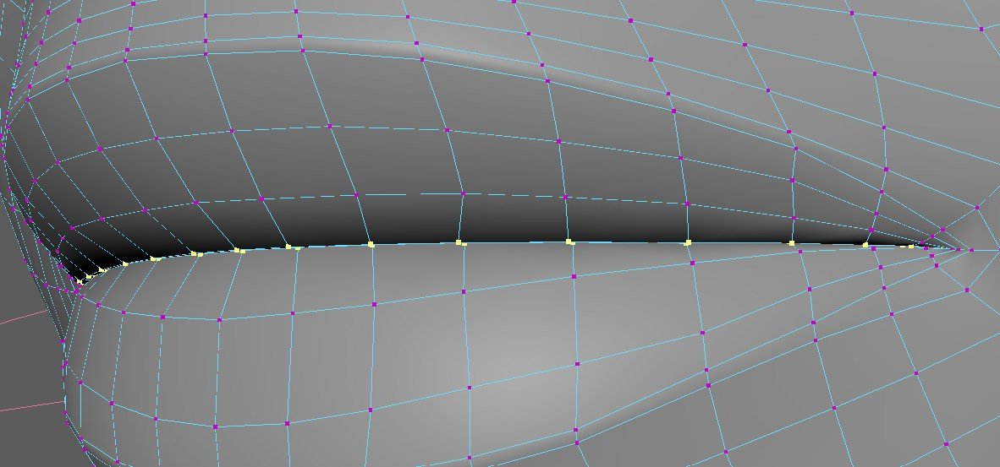    
This gives you this blueprint curve with locators. Make sure the locators are at the outer corners, since those
are separating the top and the bottom.  
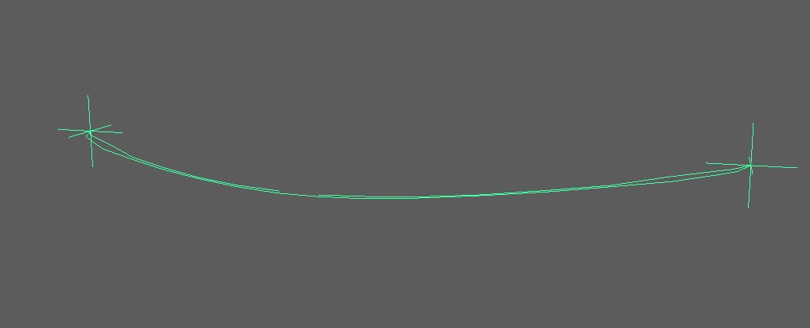    
Now there's a very important and easy to miss attribute - **bFlipInnerMouthCurves**. On many characters the lips
are so close together, that some upper vertices are lower than the lower vertices. If this is the case,
then you'll need to set that attribute to *True*. Otherwise False.    
    
!!! warning "Don't forget!"
    Make sure to doublecheck the *bFlipInnerMouthCurves*. You might not notice if it's wrong until the very end. And
    even though there are tools to fix the skinning if it was flipped, it's still better to have it correct from the start.

Next select the loop of the outer corner of the lips, and press **Create Outer Curves and Locators**
  

### Blueprints - Mouth Pivot
Then click **Create Mouth Pivot**. When the mouth moves left/right in a sperical motion, the *bp_m_mouthPivot* is where the center is. 

It's important that the X axis is pointing up, Y axis is pointing back, and the Z axis is pointing to the right.  
*Why is not not closer to worldspace?* That's because it's closer to how the head joint is. 
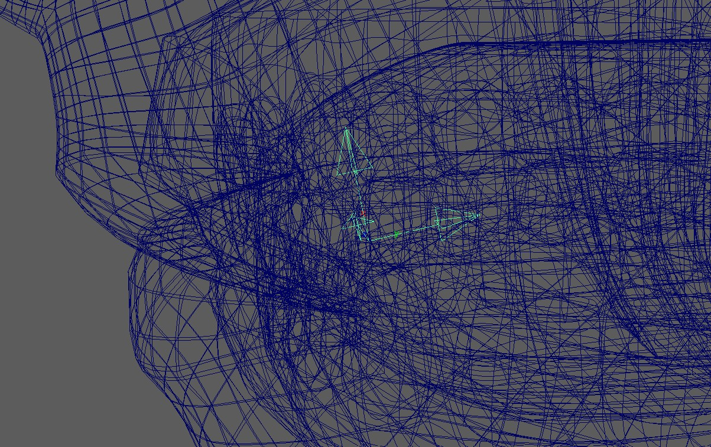  

!!! warning "Watch out"
    If when translating the mouth_ctrl up/down/left/right things are moving in wrong directions, check the orientation of this blueprint. 
    If the lip ctrls are not translating up/down in Y, it could also be the fault of this mouth pivot blueprint.     

### Blueprints - Slide Surfaces
This is only for spline rigs. If you leave the *bSPLINE* attribute as False, you can skip this.   
But for splines, this is the surface that the controls slide along. In most cases this is better to represent the shape
of the teeth, instead of the shape of the skin.  
For now just shape it roughly, but very likely you'll be revisiting this later and adjust the shape.
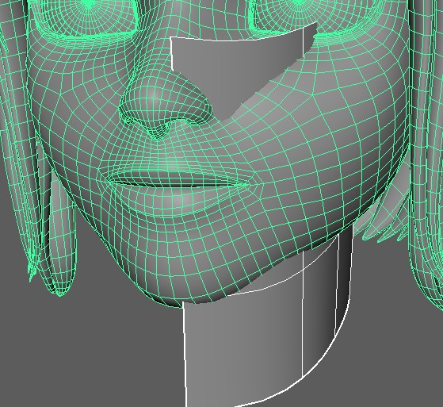  

!!! warning "Watch Out"
    Make sure that this spans from as far back as the lip ctrls can go, **to the symmetry line and further**.  
    If later you see that the lip ctrls or the corner ctrls are doing some very bad jumps or generally some unstable motions, 
    this surface is often not placed well.

## Upper and Lower Ctrls
### Count/Positions
The Lip Ctrls (Upper and Lower Lips Ctrls) are the only ones where you can decide how many you want.  
And you do that with the **fLeftLipParamPercs**:   
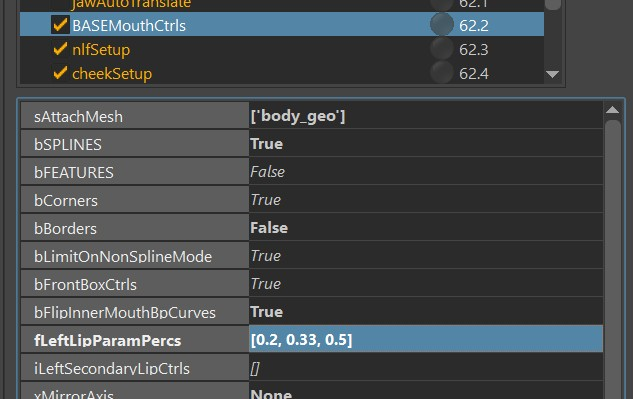  
It might look a little *"technical"* at first glance, so here's the explanation:    
If you set the attribute to *[0.20, 0.33, 0.5]*, you'll get this many lip ctrls:  
  
*Is it too many?* Yes, for a human most likely. But for dogs thave have long mouths, this could be the right amount.  
For humans you might want to set it to *[0.33, 0.5]*, which means one in the middle (yellow) and one on each side.
Or if you don't want the middle, just set it to *[0.33]*
!!! note
    You see how we don't specify parameters higher than 0.5? That's because as the name already says it, we only specify 
    the left ones, and the right ones are mirrored. 

### Orientation
The orientation of those ctrls happens with the slider blueprints (*sliderBp_l_lipsBot1*, *sliderBp_l_lipsBot0*, ..). 
Keep in mind that unlike the other (simpler) slider blueprints, the ones for the lips are not live!  
So you have to adjust before running the *BASEMouthCtrls()*, export those and rebuild to see the result.


## BlendShapes
Here you can see a list of blendShapes. Those can all be used with or without the *bSPLINES* attribute.  
If you set *bSPLINES* to True, then the blendShapes will act as correctives.  

Corners (*lipsCorner_\[lr\]_ctrl*):
```
    cornerIn
    cornerOut
    cornerUp
    cornerDown
    cornerOutUp (diagonal)
    cornerOutDown (diagonal)
    cornerInUp (diagonal)
    cornerInDown (diagonal)
```    
If you are using the diagonal ones, you need to set **bCornerBarycentricCoords** in *blendShapesAndSliders()* to **True**.     
!!! note
    For simple rigs you'll likely get away with just the simple ones (*cornerIn, cornerOuot, cornerUp, cornerDown*). 
    You can even use the simple ones and add combos, such as *cornerOut_cornerUp* instead of *cornerOutUp*.    
    But for more high fidelity rigs you'll definitely get better blending between the poses if you use the diagonal ones.


Upper/Lower Lips - those are triggered from the [Upper and Lower Ctrls](#upper-and-lower-ctrls):
```
    upperUp (upper lip raiser)
    upperDown (opposite of upperUp)
    lowerDown (lower lip depressor)
    lowerUp (opposite of lowerDown)
```    
They are being split between all the lip ctrls. But how they are split depends on how many ctrls you have.

If it's just one at each side and no middle, it's using the split radien *fLowerLips* and *fUpperLips* defined in 
*dSplitRadienFactors* (edit it with the [JSON Editor](../builder/jsonEditor.md)):
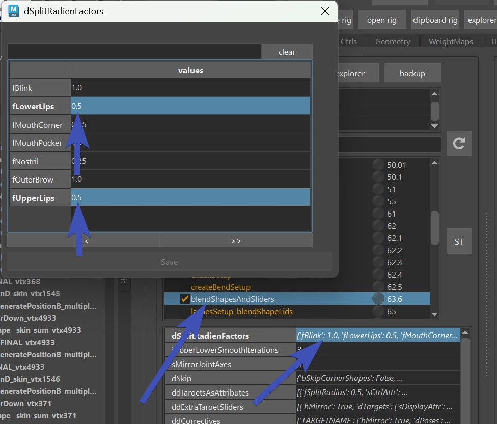  

But if there are more 
than 2 lip ctrls it's using a split-by-curve algorithm. It often gives great weights. But whenever it doesn't, 
you can adjust the weights with the skinClusters of meshes called something like *_body_geo_bpCurve_m_botLipInner_weightMesh_curveParamWeights_5*.
Basically the *blendShapesAndSliders()* function creates those. 
You can adjust the weights, export - and next time you build, it'll take those weights.  
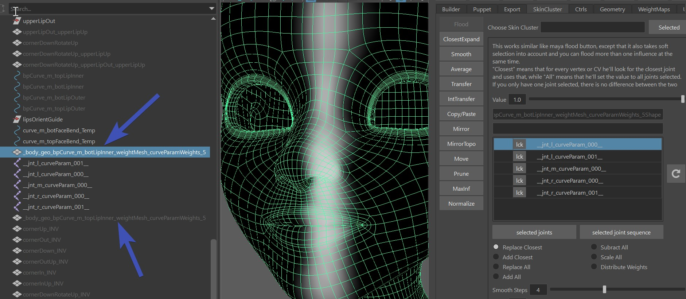  
!!! tip "Recommendation"
    Tweaking this splitting skinCluster works well for small fixes. But if you feel that you need to do bigger adjustments, it might be better to
    explore another way, such as [bSPLINES](#splines) or [Tweaker Lip Splines with bSplines](faceTweakerCtrls.md#tweaker_lips). 


mouth_ctrl:
```
    funnel
    lipPress
    mouthLeft
    mouthRight
    mouthUp
    mouthDown
```

Box Ctrls Translations (*mouthBot_ctrl*, *mouthTop_ctrl*):
```
    funnelBot
    funnelTop
    lipPressBot
    lipPressTop    
```

Box Ctrls Rotations:
```
    lowerRollIn
    lowerRollOut
    upperRollIn
    upperRollOut
```


!!! note
    For realistic humans it would be best to shape the **funnel** and **lipPress** according to their scientific representation 
    (one page to check about FACs is [facial-action-coding-system](https://imotions.com/blog/learning/research-fundamentals/facial-action-coding-system/)).  
    But if you are doing cartoony characters, many times animators prefer Box Ctrls and mouth_ctrl to just simply move
    the lips forward or back. 


## Rom
The button **Create Rom Animation** creates a ROM animation.   
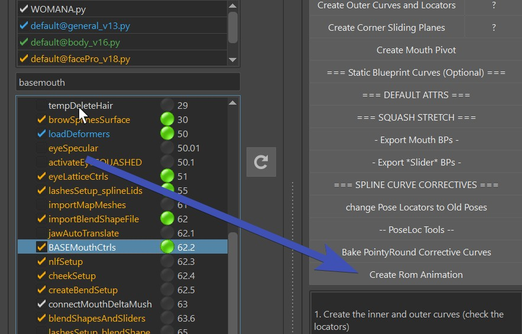   

## Mouth Directions
If you move the **mouth_ctrl** up/down/left/right or rotate it in rotateZ, (Frame 75-135 in the ROM), you can do this with the 
*mouthLeft/mouthRight/mouthUp/mouthDown* blendShapes (except the rotateZ).    

But you can also do that with skinning, which would also take care of the rotateZ. 
If you use the *bSPLINES* option explained very soon, please skip this section! Because the splines will take care of that. 
But without the *bSPLINES*, here's how to skin the lips so you get the influences for the mouth_ctrl:  

Click the shelf button 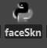 (faceSkn)
to get the Face Skinning UI. Then select the area around the mouth and click **Move Jaw/Head to frontPivots**:  
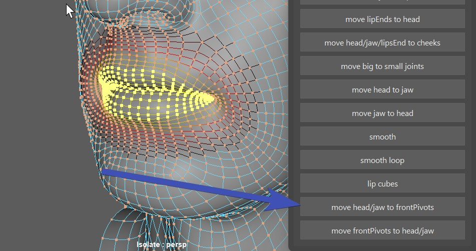  
This skins to the joints *jnt_m_mouthPivotFrontHead* and *jnt_m_mouthPivotFrontJaw*. 

!!! tip
    If you skinned too much to the front pivots, you can also go back by selecting vertices and clicking the button just below - 
    **Move frontPivots to Jaw/Head**. 

Remember the mouth pivot blueprint? It's rotating the mouth along that pivot. But if you don't like the motion, there's
not always the need to go back and adjust the blueprint - instead you can just adjust the passer values.   
On the passer of **mouth_ctrl**, you can find those values you can adjust:
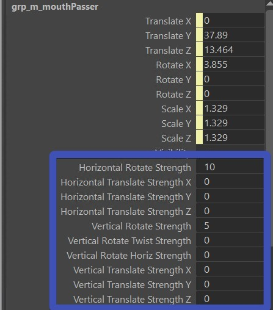   
And don't forget to save those values with the [** === DEFAULT ATTRS === **](faceGeneral.md#defaultattrs) button.

!!! tip "If you don't need it"
    If you feel like you want to do the mouth directions entirely with blendShapes because you are concerned that the joint movements
    are just working against you, just set all those attributes to 0.0.  
    Or if you also don't need the rotateZ, you can ignore this setup by just not skinning to the joints.

## Splines

On the Mouth Rig, the Splines are using the same controls as the blendShapes. This brings a few advantages:

- You can use all the blendShapes stated above also as correctives
- You can have some characters with blendShapes and some with splines, and animators will have the same sets of controls

To turn on the splines, set **bSPLINE** to *True*.  
And also set **bBorders** to *False*. The borders are useful for blendShapes, but not for Splines.  
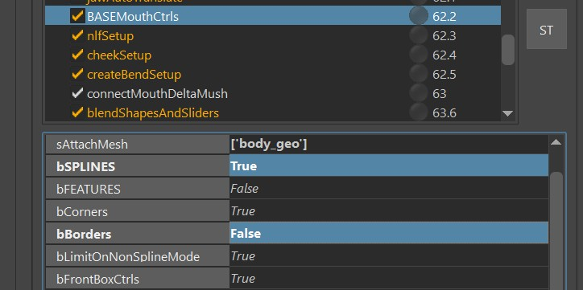    

Another attribute to be aware of is the **bSplineStaticCurves**. If you have that set to *True*, only the corner ctrls
will be sliding along the surface, and the lip ctrls will be sliding along static curves. This is the old behavior
from *facePro_v16* and below, and it was depricated for a while. However later it turned out that for simple human mouths 
it was still very useful since it's not so sensitive with the surface blueprint.


### Spline - The Joints
For the spline rig there are the Big Joints (**jnt_l_botMouthSplineBig_???**) and the Small Joints (**jnt_l_botMouthSplineSmall_???**). 
By default they are a joint at each vertex on the loop:
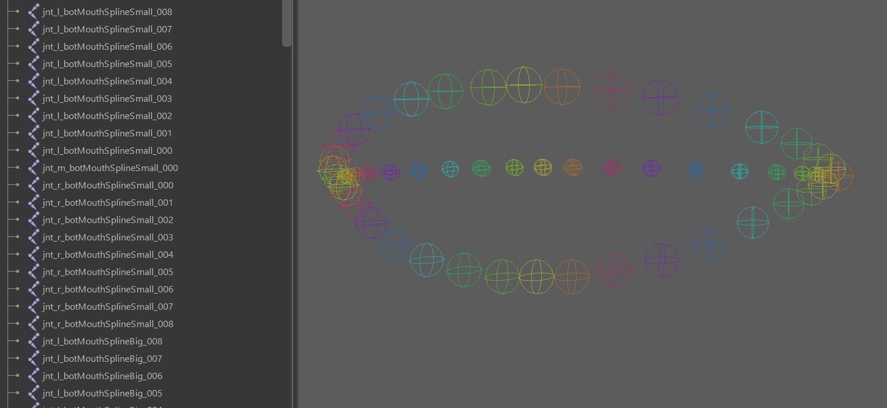    
  

!!! note 
    If you have a character with a very dense geometry so that a joint at every vertex would be too much, just set 
    the **iSkipSplineJoints** value to something higher than 0.
    For example if you set it to 1, it means it skips every other joint. If you set it to 2, it always skips 2 joints until the next
    one. Here we've set this attribute to 2:  
    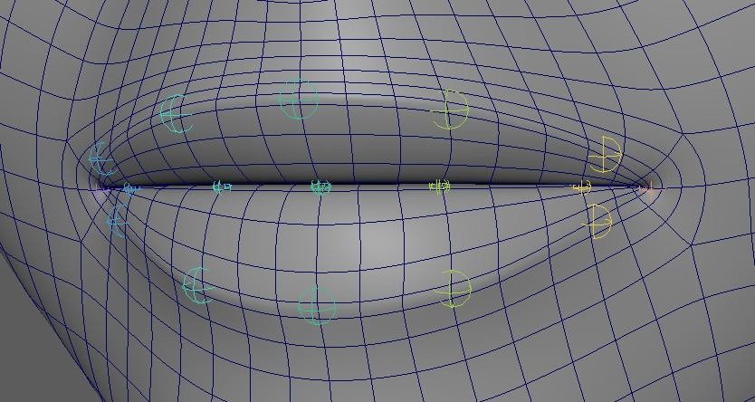  


*Why are they called Big and Small Joints?*  
That's because the bigger ones are bigger, and the smaller ones are smaller.  
But also because the bigger ones should have a wider range of influence. Basically the Small Joints should just affect the lips 
since they are taking more rotation from the ctrls.  
The Big Joints take less rotational movements from the Ctrls, and therefore are more stable to use for the area outside the lips.     

There's 2 more special joints, which are **jnt_l_lipsEnd** and **jnt_r_lipsEnd**. Those sit at the corner, and it's best to bind
the area left and right of the lips. Basically part of the cheeks.  
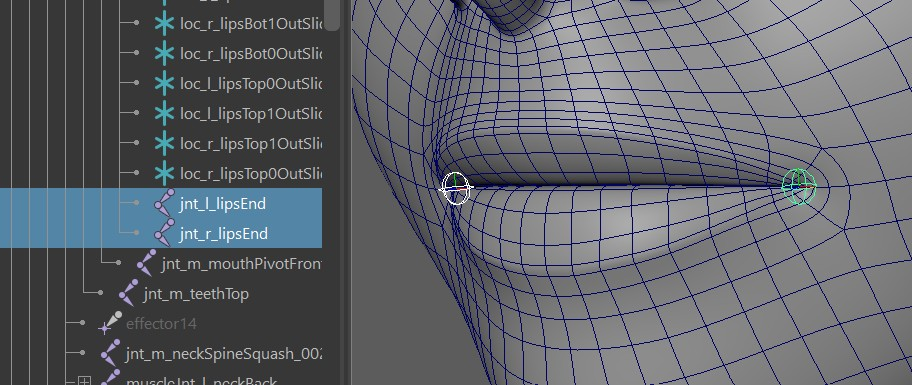    


### Splines - Skinning
At this point before skinning the Mouth Spline Joints, it helps if the jaw is already skinned nicely. But don't worry too much - 
if you do want to adjust the jaw weighting later, there's nice buttons that transfer skinning from spline joints to jaw/head and back.

!!! note
    While you are free to use your own skinning tools on the mouth splines, it's recommended that you follow this workflow, since it
    involves tools that are made specifically for this setup.  


To get the Mouth Spline Skinning tools, click this shelf button  (faceSkn).  

Which opens this UI:   
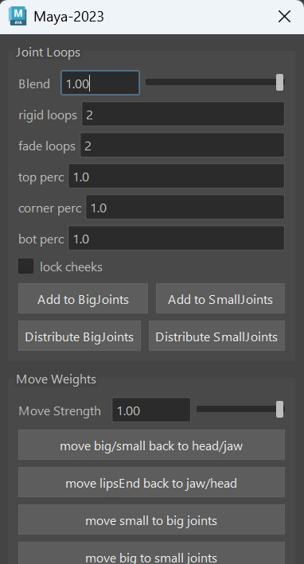

#### Big Joints
The best thing is to just start with the button **Add to Big Joints** when you have the whole head mesh selected. 
But first set the **Rigid Loops** and **Fade Loops** values.  
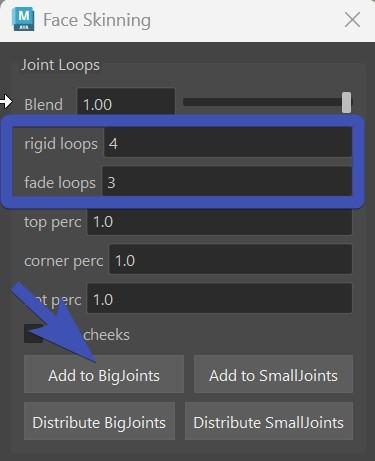    

It's using the [**ClosestExpand** tool](../tools/toolsSkinCluster.md#closestexpand) under the hood.

At this point it's best to load the [Rom Animation](#rom)

Now you can do a few combinations of:  

- clicking the *Add to Big Joints* on different vertex selections
- smoothing with just one iteration (there's a **Smooth** button at the bottom of the UI)
- add some weights to the lipsEnd Joints using the **Move head/jaw to LipsEnds** button further below.


!!! warning
    You might be tempted to use the smooth tool a lot. But please don't overdo this. And if you use the smooth in the skinning tools,
    make sure to NEVER do more than one iteration when it's about the face. Unless it's a very high resolution face.

At this point try to get it to look clean, but don't worry too much about the details yet. That part comes next.

#### Small Joints
Did you notice that at this point in the Rom between 60 and 75 it's just rotating the box ctrls, but nothing is happening?  
That's because the small joints are handling the lip rolls.  

You have 2 options:

- Set the *rigid loops* and *fade loops* smaller, and having the whole head selected click **Add to SmallJoints**
- Keep the *rigid loops* and *fade loops* big, and instead of selecting the whole head, just select lip vertices 
(with soft selection) before clicking **Add to SmallJoints** 

!!! question "What are the *perc* attributes??"
    If you want to for example fade out the upper part slower, you can give the *top perc* a lower value. 
    But it has shown that adjusting these types of things is easier by doing vertex (soft) selection.

#### Fixing Weights
If your weights got messy because you changed spline joint count (either by adjusting the curves or *iSkipSplineJoints* flag),
or if just used the smooth tool too much - here's a way to fix this:

In the FaceSkininng UI, click the “Distribute BigJoints” and “Distribute SmallJoints” buttons.  
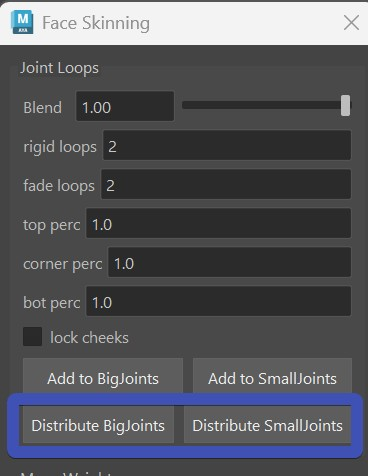    

This grabs the current weights of all the joints, sums them together per each vertex and then uses that as a mask 
while redoing the expand weights operation.


### Splines - Adjust Ctrl Behaviors
At some point when the skinning looks somewhat clean, it's best to start adjusting the behaviors of the ctrls some more.  
The following things (1-5) should be done roughly in the same order, but most likely you'll be jumping back and forward,
and even might go back to adjusting skinCluster here and there.   
The goal is to get the shapes and behaviors looking as good as possible without adding blendShapes. Even though you can still
add corrective blendShapes on top - the better the underlining setup, the more smooth the rig will be! 


#### 1. Slider Blueprints
Especially for the corners ctrls, try to find the right blueprint scale to get the best overall possible range.
They are *sliderBp_l_lipsCorner* and *sliderBp_r_lipsCorner*.

!!! note
    Unfortunately the slider blueprints don't affect the ctrls live. So you'll have to guess (or calculate) the scale,
    and rerun the *BASEMouthCtrls()* function.

You'll probably hit the limitation that for the outwards motion you want a different range than the inwards motion.
You can adjust that in the following section.

#### 2. Corner Multiply Values
The corner multiply values specify how much the joints should move based on the corner ctrl movements.  
They should be used only in cases that scaling the slider blueprints couldn't solve. Such as if the cornerOut should be stronger
than the cornerIn  
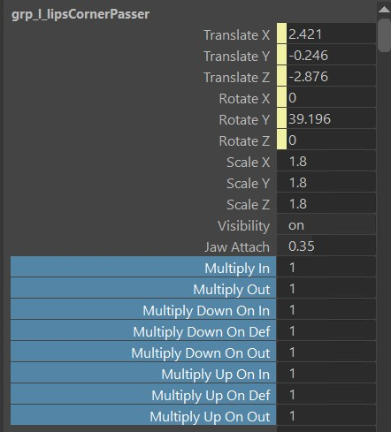


#### 3. Defining a different Corner Range
So far the poses happen on a unified range, where corner ctrls only go to 1.0 or -1.0. But in some cases you might 
want to specify a different value, for example the *cornerOut* being *corner_l_ctrl.tx* at 2.5 instead of 1.0. 

This can be done with the **ddPoseCtrlValues** attribute, using the [JSON Editor](../builder/jsonEditor.md):     
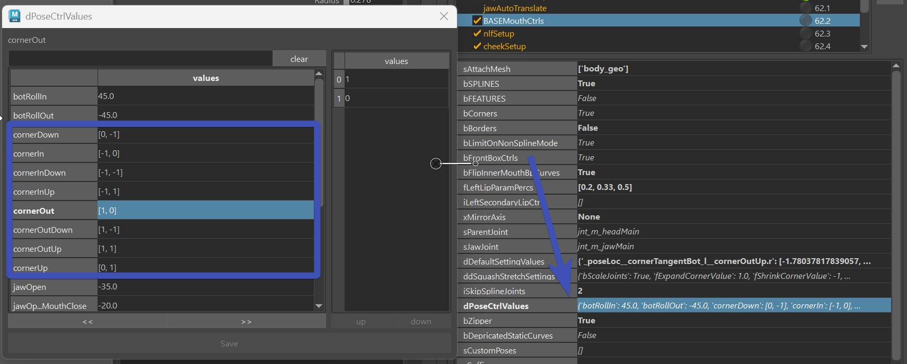

And it will affect Pose Locators, BlendShape Poses and even the *Create Rom Animation* button.

!!! warning
    While the kangaroo tools such as the Shape Editor support this, it can be cleaner to stay in a unified range. So it's best to try to solve things with 
    Slider Blueprints and Corner Multiply Values first. 


#### 4. Lip Ctrl Passer Values

The passers of the [Lip Ctrls](#upper-and-lower-ctrls) come with a few extra attributes:
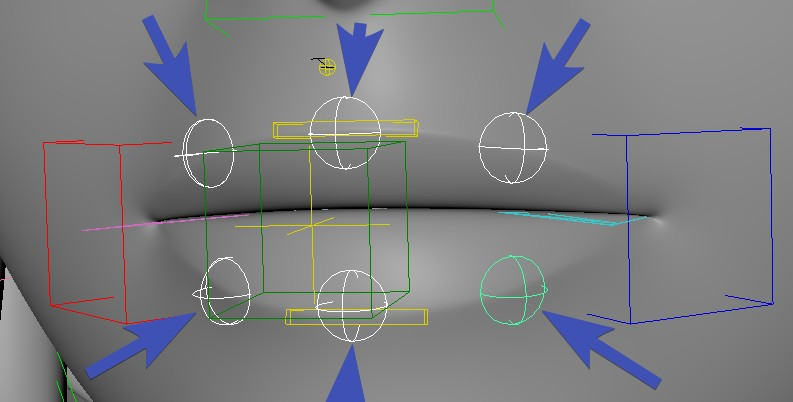 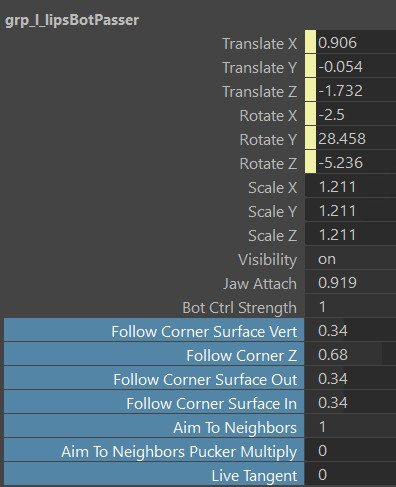


| Attributes                         | What they are doing                                                                   |
|------------------------------------|---------------------------------------------------------------------------------------
| *Follow Corner Surface Vert*       | When corners move up/down in Y, how much the lip ctrls should follow that motion      |
| *Follow Corner Z*                  | When corners move in/out in Z, how much the lip ctrls should follow that motion       |
| *Follow Corner Surface In*         | When corners in in X, how much the lip ctrls should follow that motion                |
| *Follow Corner Surface  Out*       | When corners out in X, how much the lip ctrls should follow that motion               |
| *Aim To Neighbors*                 | Creates a more smooth behavior by rotating the tangents based on the neighboring ctrls |
| *Aim To Neighbors Pucker Multiply* | On CornerIn the aiming is a bit unstable, with this multiplier you can turn it off    |
| *Live Tangent*                     | If this is 1.0, the joints get aimed along the spline                                 |

Saving those attributes happens with the [** === DEFAULT ATTRS === **](faceGeneral.md#defaultattrs) button.


#### 5. Pose Locators
Almost all ctrls come with lots of poseLocators that are used to define the ctrl behaviors even more. In *funnel* and *lipPress* 
(mouth_ctrl.tz) they are even used to define the whole pose.  
And all the pose locators are easily found by just selecting the ctrls, and in the outliner press **f**. You'll always see the currently
activated one as shown and the others are invisible:
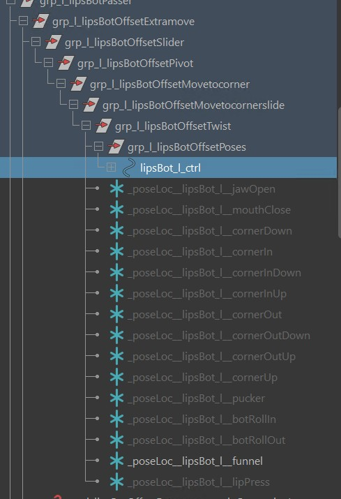

As you move around those locators, it's recommended to turn off the **lipPush** on all top ctrls - **lipsTop\*_ctrl**!
The next time you build it, it remembers the offset, and incorporates those into the lipPush setup.

!!! tip
    There's a lot of poseLocators in the *BASEMouthCtrls()* function, even for each detail ctrls. If you end up using them a lot, it's worth checking out the options under the
    button ** -- PoseLoc Tools -- **.  
    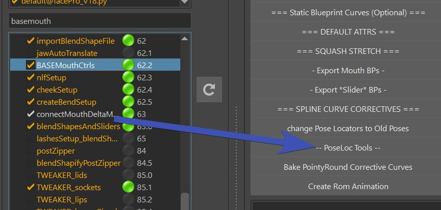


### Splines - Adjusting Pivots for Lip Rolls
In some characters you might be struggling with getting proper lip rolls (*mouthBot_ctrl.rx* and *mouthTop_ctrl.rx*) 
because they pivot around the joints while ideally they should pivot around the center of the lips.
But there's a solution - you can change the pivot using the offset groups ending with *Pivot*:
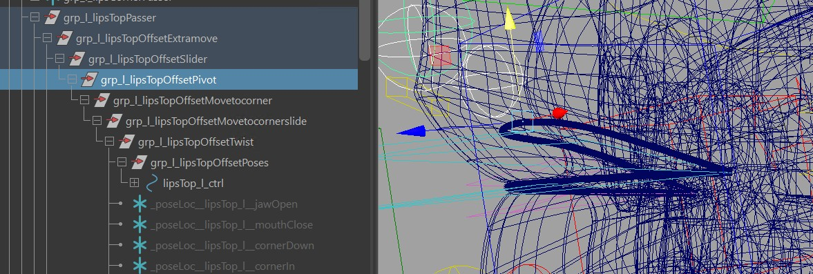

Adjusting those will move the joints, so it's best to turn off the skinCluster. And show the curve with *mouth_ctrl.curveVis*.

Then you save their values with the [**=== Default Attr === **](faceGeneral.md#defaultattrs) button, and **rebuild**. You should be able to get nicer Lip Rolls now.

!!! warning "A few Warnings"
    If you've placed pose locators already, likely you'll have to revise those after you changed it.      
    And this will mess with the zipper! So if you are adjusting the pivot groups, it's best to set **bZipper** to *False* and use the 
    [*postZipper()*](#post-lip-zipper) function if needed.  


### Splines - Detail Ctrls
Detail Ctrls are automatically there. Animators can turn them on with **mouth_ctrl.detailCtrlsVis**:
  
Each of them also comes with a set of [Pose Locators](#5-pose-locators), so you can use them to enhance some of your poses.  
*Do you think they are too many?*  
Well, they are just a ctrl for each small joint. If you want less, you can consider to set a higher value to *iSkipSplineJoints*.  
But honestly they shouldn't be animated too much, they are really just to fine tune things. 
     

## NLF Setup
*NLF* stands for *Nasolabial Fold*, and it's that line between the nose wing and the mouth corners. Some characters have it more prominent than others.
But the hardest ones to rig are those where you don't see the line in the model, but it's expected on the smile - such as many female characters.  
In any case the *createNlfSetup()* can be very useful for keeping that line stable. But this function only works if you have *createBASEMouth()* with *bSPLINE* attribute enabled.
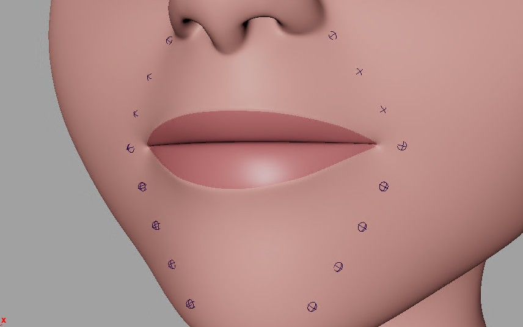

You can adjust how many ctrls you want, in the picture above it's the default - 2 at the top (*fTopCtrlPercs*) and one at the bottom (*fBotCtrlPercs*) 

Each ctrl comes with extra attributes to adjust the behavior, and they all come a Pose Locator Setup driven by the Corner Poses.

!!! note
    This function is optional. Since it requires more technical abilities to manage so many joints, some projects in the past opted for blendShape NLF lines instead of this. 

## Cheek Setup
The setup is very similar to NLF lines, except that those lines are a bit further outside. And it's used mainly to enhance the smile a bit more
by bulging out the cheeks
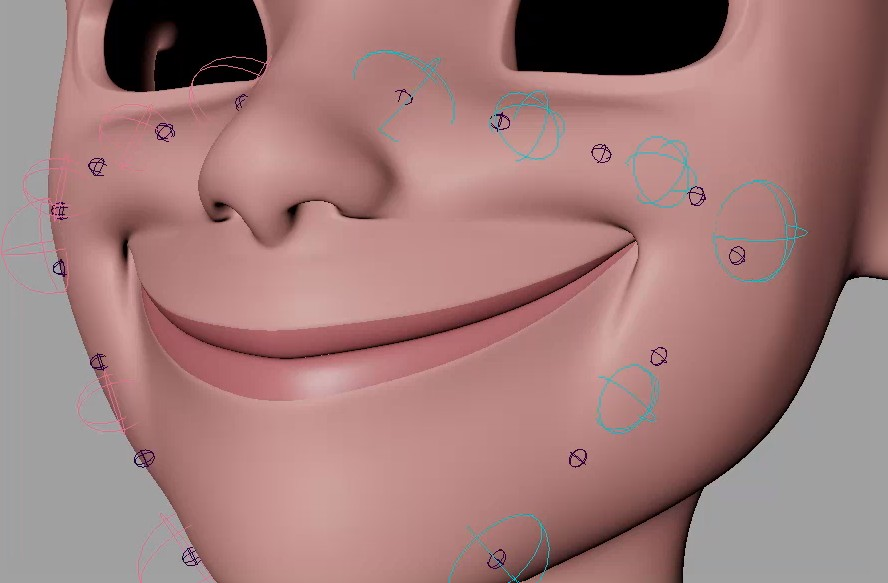

!!! note
    This function is optional. Since it requires more technical abilities to manage so many joints, some projects in the past opted for blendShapes instead of this Cheek Setup. 


## Post Lip Zipper
If you are not using spline, or you are using spline but offsetted the pivot groups, then you can use the *postZipper()* 
function to create a zipper using an extra skinCluster.

It's very easy to setup. Just set the sMesh attribute in the *postZipper()* to the main mesh  
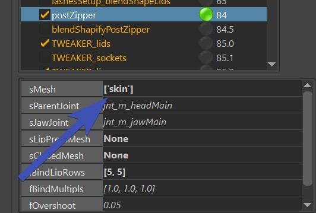  
and run the function.

Then having the mesh selected - click the *bind selected* button to
create the skinCluster with the **__ZIPPER** suffix.
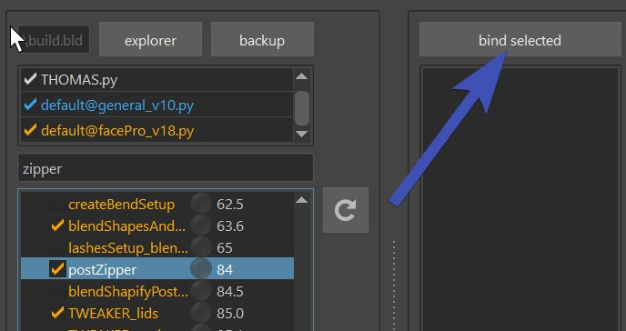

In the end you'll have this skinCluster that has those joints:  
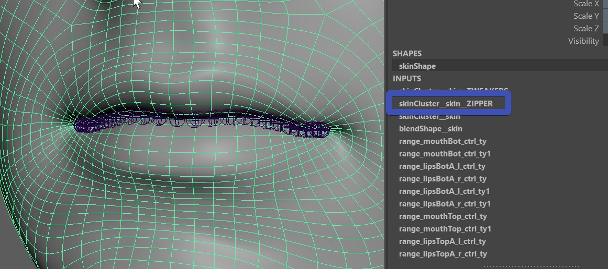  

But you don't have to look for the joints, they are already in the skinCluster, and from here you can just use 
the [ClosestExpand tool](../tools/toolsSkinCluster.md#closestexpand) to set the weights:
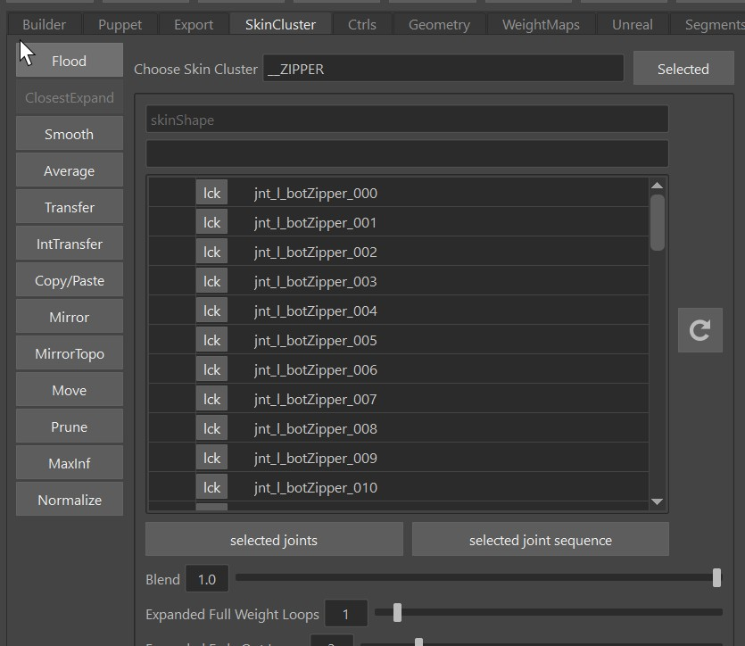  

!!! note 
    This is taking the blueprints from the *BASEMouthSetup()* function.


### Open Mouth in the Model
The zipper works much better if the mouth is closed in the model. But if it's open, you can still make it work.
In the attribute 


### Very tiny characters
If you are rigging a very small character, you have to be aware of the **fBlendShapeMinimumDistance** attribute. This is about
the joints following the blendShapes. If a blendShape target is making a vertex go less than that threshold value,
it will not be affected. So basically you just have to watch if you see any artefacts such as some joints not moving - try 
to set this value lower.


### Stick on LipPress
If you set the attribute **bStickOnLipPress** to *True*, and there's a *lipPress* mesh present - on mouth_ctrl.tz as -1.0
it will also use that setup to lock the mouth close.

