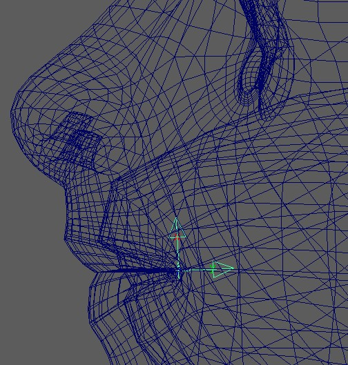

For lips you also have option between blendShapes and splines.  
But what's different to the other setups is that on the lips you do both ways with the same function: *BASEMouthCtrls()*

## Blueprints
The first part of the blueprints is the same between blendShapes and Splines

### Blueprints - Inner and Outer Curves
First select the closest (or smallest) loop of vertices, and press **Create Inner Curves and Locators**
    
This gives you this blueprint curve with locators. Make sure the locators are at the outer corners, since those
are separating the top and the bottom.  
    
Now there's a very important and easy to miss attribute - **bFlipInnerMouthCurves**. On many characters the lips
are so close together, that in the middle the upper vertices are lower than the lower vertices. If this is the case,
then you'll need to set that attribute to True. Otherwise False.    
    
!!! warning
    This gets forgetten easily! Make sure to check this on every character.
 

And then select the loop of the outer corner of the lips, and press **Create Outer Curves and Locators**
  

### Blueprints - Mouth Pivot
Then click **Create Mouth Pivot**. Imagine if the mouth moves left/right in a sperical motion, where should the center be?  
That's where you place the *bp_m_mouthPivot*

  

### Blueprints - Slide Surfaces
This is only for spline rigs. If you leave the *bSPLINE* attribute as False, you can skip this.   
But for splines, this is the surface that the controls slide along. In most cases this is better to represent the shape
of the teeth, instead of the shape of the skin.  
For now just shape it roughly, but very likely you'll be revisiting this later and adjust the shape.
  

## Upper and Lower Ctrls
The Lip Ctrls (Upper and Lower Lips Ctrls) are the only dynamic ones, where you can specify how many you'd like.  
And you do that with the **fLeftLipParamPercs**. Now thats's a bit technical and needs to be understood.
If you set the attribute to *[0.20, 0.33, 0.5]*, you'll get this many lip ctrls:  
  
*Is it too many?* Yes, for a human most likely. But for dogs thave have long mouths, this could be the right amount.  
For humans you might want to set it to *[0.33, 0.5]*, which means one in the middle (yellow) and one on each side.
Or if you don't want the middle, just set it to *[0.33]*
!!! note
    You see how we don't specify parameters after 0.5? That's because as the name already says it, we only specify 
    the left ones, and the right ones are mirrored. 


## BlendShapes
Here you can see a list of blendShapes. Those can all be used with or without the *bSPLINES* attribute.  
If you set *bSPLINES* to True, then the blendShapes will act as correctives.  

Corners (*lipsCorner_\[lr\]_ctrl*):
```
    cornerIn
    cornerOut
    cornerUp
    cornerDown
    cornerOutUp (diagonal)
    cornerOutDown (diagonal)
    cornerInUp (diagonal)
    cornerInDown (diagonal)
```    
If you are using the diagonal ones, you need to set **bbCornerBarycentricCoords** in *blendShapesAndSliders()* to **True**.     
!!! note
    For simple rigs you'll likely get away with just the simple ones (*cornerIn, cornerOuot, cornerUp, cornerDown*). 
    Or use the simple ones and add combos, such as *cornerOut_cornerUp* instead of *cornerOutUp*.  
    But for more high fidelity rigs you'll definitely get better blending between the poses if you use the diagonal ones.


Upper/Lower Lips (*lipsTop[0-9]_[lr]_ctrl*):
```
    upperUp (upper lip raiser)
    upperDown (opposite of upperUp)
    lowerDown (lower lip depressor)
    lowerUp (opposite of lowerDown)
```    


mouth_ctrl:
```
    funnel
    lipPress
    mouthLeft
    mouthRight
    mouthUp
    mouthDown
```

Box Ctrls Translations (*mouthBot_ctrl*, *mouthTop_ctrl*):
```
    funnelBot
    funnelTop
    lipPressBot
    lipPressTop    
```

Box Ctrls Rotations:
```
    lowerRollIn
    lowerRollOut
    upperRollIn
    upperRollOut
```


!!! note
    For realistic humans it would be best to shape the **funnel** and **lipPress** according to their scientific representation 
    (one page to check about FACs is [facial-action-coding-system](https://imotions.com/blog/learning/research-fundamentals/facial-action-coding-system/)).  
    But if you are doing cartoony characters, many times animators prefer Box Ctrls and mouth_ctrl to just simply move
    the lips forward or back. 


## Rom
At this point it's good to check out the Rom - by clicking the button **Create Rom Animation**. 

## Mouth Directions
If you move the mouth_ctrl up/down/left/right or rotate it in rotateZ, (Frame 75-135 in the ROM), you can do this with the 
*mouthLeft/mouthRight/mouthUp/mouthDown* blendShapes (except the rotateZ).    
But you can also do that with skinning. Select the area around the mouth, open the Face Skinning UI and click **Move Jaw/Head to frontPivots**

Remember the mouth pivot blueprint? It's rotating the mouth along that pivot. But if you don't like the motion, there's
not always the need to go back and adjust the blueprint - instead you can just adjust the passer values.   
On the passer of mouth_ctrl, you can find those values you can adjust:
  

!!! tip
    If you feel like you want to do the mouth directions entirely with blendShapes because you are concerned that the joint movements
    are just working against you, just set all those attributes to 0.0.  
    Or if you also don't need the rotateZ, you can ignore this setup by just not skinning the joints.

## Splines

Splines are using the same controls like the blendShapes. This brings a few advantages:

- You can use all the blendShapes stated above also as correctives
- You can have some characters with blendShapes and some with splines, and animators will have the same sets of controls

You'll get the splines when you set **bSPLINE** to *True*.  
And also set **bBorders** to *False*. The borders are useful for blendShapes, but not for Splines.

### Spline - The Joints
For the spline rig there are the Big Joints (**jnt_l_botMouthSplineBig_???**) and the Small Joints (**jnt_l_botMouthSplineSmall_???**). 
By default they are a joint at each vertex on the loop.
But if you have a character that has a ton of joints, then you can set the **iSkipSplineJoints** value to something higher than 0.
For example if you set it to 1, it means it skips every other joint. If you set it to 2, it always skips 2 joints until the next
one.  
    
*Why are they called Big and Small Joints?*  
That's becuase the bigger ones are bigger, ..  
But also because the bigger ones have (should have) a wider range of influence. Basically the Small Joints should just affect the lips 
since they are taking more rotation from the ctrls.  
The Big Joints take less rotational movements from the Ctrls, and therefore are more stable to use for the area around the lips.     

There's 2 more special joints, which are **jnt_l_lipsEnd** and **jnt_r_lipsEnd**. Those sit at the corner, and it's best to bind
the area left and right of the lips. Basically part of the cheekcs

### Splines - Skinning
At this point before skinning the Mouth Spline Joints, it helps a lot if the jaw is already skinned nicely. But don't worry - 
if you do want to adjust the jaw weighting later, there's nice buttons that transfer skinning from spline joints to jaw/head and back.

!!! note
    While you are free to use your own skinning tools on the mouth splines, it's recommended that you follow this workflow, since it
    involves tools that are made specifically for this setup.  


To get the Mouth Spline Skinning tools, click this shelf button:  
  
Which brings up this UI:   


#### Big Joints
The best thing is to just start with the button **Add to Big Joints** when you have the whole head selected. 
But first set the **Rigid Loops** and **Fade Loops** values.
It's using the **ClosestExpand** SkinCluster tool under the hood, therefore it's best to check that for reference.

!!! tip
    Make sure to use the *Grow Selection* (CTRL >) and *Shrink Selection* (CTRL <) Maya commands and Soft Selection!

At this point it's best to load the [Rom Animation](#rom)

Now you can do a few combinations of:  

- clicking the *Add to Big Joints* on different vertex selections
- smoothing with just one iteration (there's a **Smooth** button at the bottom of the UI)
- add some weights to the lipsEnd Joints using the **Move head/jaw to LipsEnds** button


!!! warning
    You might be tempted to use the smooth tool a lot. But please don't overdo this. And if you use the smooth in the skinning tools,
    make sure to NEVER do more than one iteration when it's about the face. Unless it's a very high resolution face.

At this point try to get it to look clean, but don't worry too much about the details yet. That part comes later.

#### Small Joints
Did you notice that at this point in the Rom between 60 and 75 it's just rotating the box ctrls, but nothing is happening?  
That's because the small joints are handling the lip rolls.  
Select the vertices of just the lips (or the whole face and lower the *Rigid/Fade Loops*), and click **Add To Small Joints**.  
To see the results, check the roll movements a bit later in the Rom that you applied before.


### Splines - Adjust Ctrl Behaviors
At some point when the skinning looks somewhat clean, it's best to start adjusting the behaviors of the ctrls some more.  
The following things (1-5) should be done roughly in the same order, but most likely you'll be jumping back and forward,
and even might adjust skinCluster here and there.   
The goal is to get the shapes and behaviors looking as good as possible without adding blendShapes (even though you can still
add corrective blendShapes on top - the better the underlining setup, the more smooth the rig will be) 


#### 1. Slider Blueprints
Especially for the corners ctrls, try to find the right blueprint scale to get the best overall possible range.  
!!! note
    Unfortunately the slider blueprints don't affect the ctrls live. So you'll have to guess (or calculate) the scale,
    and rerun the *BASEMouthCtrls()* function.


#### 2. Corner Multiply Values
The corner multiply values specify how much the joints should move based on the corner ctrl movements.  
They should be used only in cases that scaling the slider blueprints couldn't solve. Such as if the cornerOut should be stronger
than the cornerIn  


#### 3. Defining a different Corner Range
So far the poses happen on a unified range, where corner ctrls only go to 1.0s or -1.0s. But in some cases (especially cornerOut ones) you might 
want to specify for example the ctrl corner_l_ctrl.tx to be 2.5. 

This can be done with the **ddPoseCtrlValues** attribute.
And it will affect Pose Locators, BlendShape Poses and even the *Create Rom Animation* button.

!!! warning
    While the kangaroo tools such as pose editor support this, it can be cleaner to stay in a unified range. Therefor it's best to try to solve things with 
    Slider Blueprints and Corner Multiply Values first. 


#### 4. Lip Ctrl Passer Values
The lips attributes come with a few passer attributes that specify how the lip ctrls should react to the neighboring ones, and to the corner ctrls:  


#### 5. Pose Locators
Almost all ctrls come with lots of poseLocators that are used to define the ctrl behaviors even more. In *funnel* and *lipPress* they are even
used to define the whole pose.  
And all the pose locators are easily found by just selecting the ctrls, and in the outliner press **f**. You'll always see the the currently
activated one as shown and the others are invisible:


!!! tip
    There's a lot of poseLocators in the *BASEMouthCtrls()* function, even for each detail ctrls. If you end up using them a lot, it's worth checking out the options under the
    button ** -- PoseLoc Tools -- ** 

### Adjusting Pivots for Lip Rolls
In some characters you might be struggling with getting proper lip rolls because they pivot around the joints while ideally they should pivot
around the center of the lips.
But there's a solution - you can change the pivot using the offset groups ending with *Pivot*:


Adjusting those will move the joints, so it's best to turn off the skinCluster. And show the curve with *mouth_ctrl.curveVis*.

Then you save their values with the [**=== Default Attr === **](faceGeneral.md#default-attrs-) button, and rebuild. You should be able to get nicer Lip Rolls now.

!!! warning
    This will mess with the zipper! So if you are adjusting the pivot groups, it's best to set **bZipper* to *False* and use the 
    [*postZipper()*](#post-lip-zipper) function if needed


## NLF Setup
*NLF* stands for *Nasolabial Fold*, and it's that line between the nose wing and the mouth corners. Some characters have it more prominent than others.
But the hardest ones to rig are those where you don't see the line in the model, but it's expected on the smile - such as many female characters.  
In any case the *createNlfSetup()* can be very useful for keeping that line stable. But this function only works if you have *createBASEMouth()* with *bSLINE* attribute enabled.


You can adjust how many ctrls you want, in the picture above it's the default - 2 at the top (*fTopCtrlPercs*) and one at the bottom (*fBotCtrlPercs*) 

Each ctrl comes with extra attributes to adjust the behavior, and they all come a Pose Locator Setup driven by the Corner Poses.

## Cheek Setup
The setup is very similar to NLF lines, except that those lines are a bit further outside. And it's used mainly to enhance the smile a bit more
by bulging out the cheeks


!!! note
    This function is optional. Since it requires more technical abilities to manage so many joints, some projects in the past opted for blendShape NLF lines instead of this. 


# Post Lip Zipper
If you are not using spline (or you are using spline but offsetted the pivot groups), then the only way to do a zipper is
the *postZipper()* function.  
This creates another skinCluster with the **__ZIPPER** suffix.


