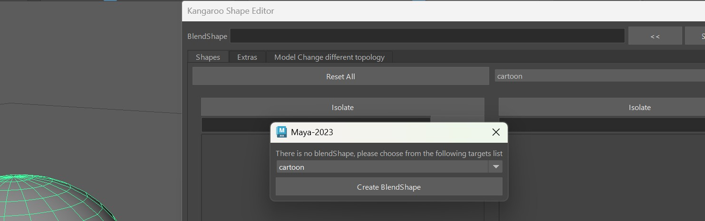

The Shape Editor is a tool for modeling Facial Shapes (targets).  

!!! info 
    If you prefer watching videos, on this one you can jump down to [Video](#video). But keep in mind that some menu options
    changed since the time of making that video.

You can open the *Shape Editor* with the shelf button  

     
On the left side of the UI you see all the Main Targets. And on the right side you see the Combo Targets.

## It's NOT the Pose Editor!
You might find a few similarities to the [Pose Editor](../body/poseEditor.md), but the architecture and how we
use it is quite different:   

- The *Pose Editor* runs on the actual rig, but the *Shape Editor* runs on another file that gets imported in the *importBlendShapeFile()*
and gets applied to the rig in the function *blendShapesAndSliders()*
- While the *Pose Editor* focuses on how shapes are driven and can add shapes on its own, the *Shape Editor* mainly just
about sculpting and managing the shapes.

## Getting Started
You can select any polygon mesh, and click the **<<** button:    
  
If that polygon mesh wasn't used with the *Shape Editor* yet, it'll ask you to choose a *Target List*.   
By default you just have *cartoon* and *general*. If you are creating a blendShape rig where you want to do most 
shapes including mouth, eyes, etc with blendShapes - choose *general*. But if you are doing a rig where you want
do do most tarets with splines, then *cartoon* is a better start, because it only lists the targets that doesn't 
have spline rigs.  
!!! note
    You are not limited to just *general* or *cartoon*! Later in [Adding More Main Targets](#adding-more-main-targets)
    you'll see how to either create your own custom lists or just add targets to your existing collection. 

     

## Adding more Main Targets
### Custom Targets
### Generating TargetList File

## Video
To see it in action, you can watch the video below. But keep in mind that some menu options changed a bit!
<iframe width="560" height="315"
src="https://www.youtube.com/embed/cEBJ-tPLMuU"
title="YouTube video player" frameborder="0"
allow="accelerometer; autoplay; clipboard-write; encrypted-media; gyroscope; picture-in-picture"
allowfullscreen></iframe>

