The Shape Editor is a tool for modeling Facial Shapes (targets).  

!!! info "Video" 
    If you prefer watching videos, on this one you can jump down to [Video](#video). But keep in mind that some menu options
    changed since the time of making that video.

You can open the *Shape Editor* with the shelf button  


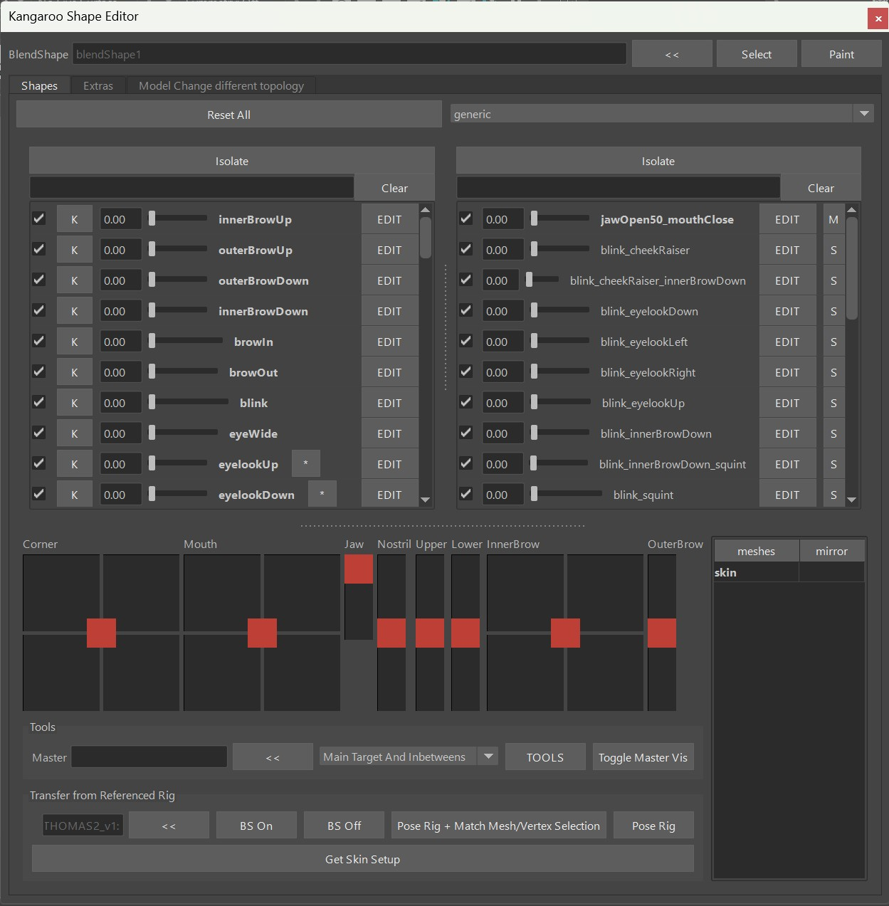     
On the left side of the UI you see all the Main Targets. And on the right side you see the Combo Targets.


## It's NOT the Pose Editor!
You might find a few similarities to the [Pose Editor](../body/poseEditor.md), but the architecture and how we
use it is quite different:   

- The *Pose Editor* runs on the actual rig, but the *Shape Editor* runs on another file that gets imported in the *importBlendShapeFile()*
and gets applied to the rig in the function *blendShapesAndSliders()*
- While the *Pose Editor* focuses on how shapes are driven and can add shapes on its own, the *Shape Editor* mainly (apart from combos) is just
about sculpting and managing the shapes.

## Getting Started
You can select any polygon mesh, and click the **<<** button:    
  
If that polygon mesh wasn't used with the *Shape Editor* yet, it'll ask you to choose a *Target List*.   
By default you just have *cartoon* and *general*. If you are creating a blendShape rig where you want to do most 
shapes including mouth, eyes, etc with blendShapes - choose *general*. But if you are doing a rig where you want
do do most tarets with splines, then *cartoon* is a better start, because it only lists the targets that doesn't 
have spline rigs.  

*What did he do under the hood?*  
He created a new blendShape node. And all the Targets that you see in the UI are basically blendShape Targets on 
the blendShape, just like you've already used before:    
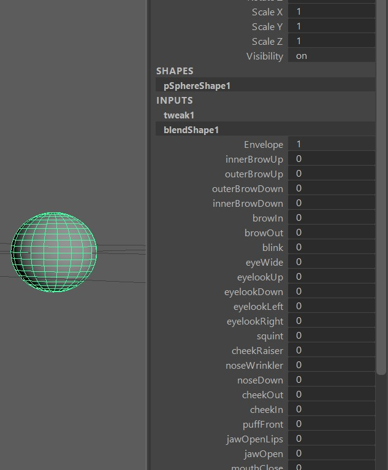  

!!! info "Kangaroo Tool Tip"
    While in the gif above I just selected vertices and moved them, you can do a lot more. For example you can use
    the sculpting tools (**Mesh Tools -> Sculpting Tools**) or use some Kangaroo Geometry Tools such as the **Match**
    or **Smooth Vertices** tools.

!!! note
    You are not limited to just *general* or *cartoon*! Later in [Adding More Main Targets](#adding-more-main-targets)
    you'll see how to either create your own custom lists or just add targets to your existing collection. 

Now to sculpt some main targets by clicking the *Edit* button and sculpt:
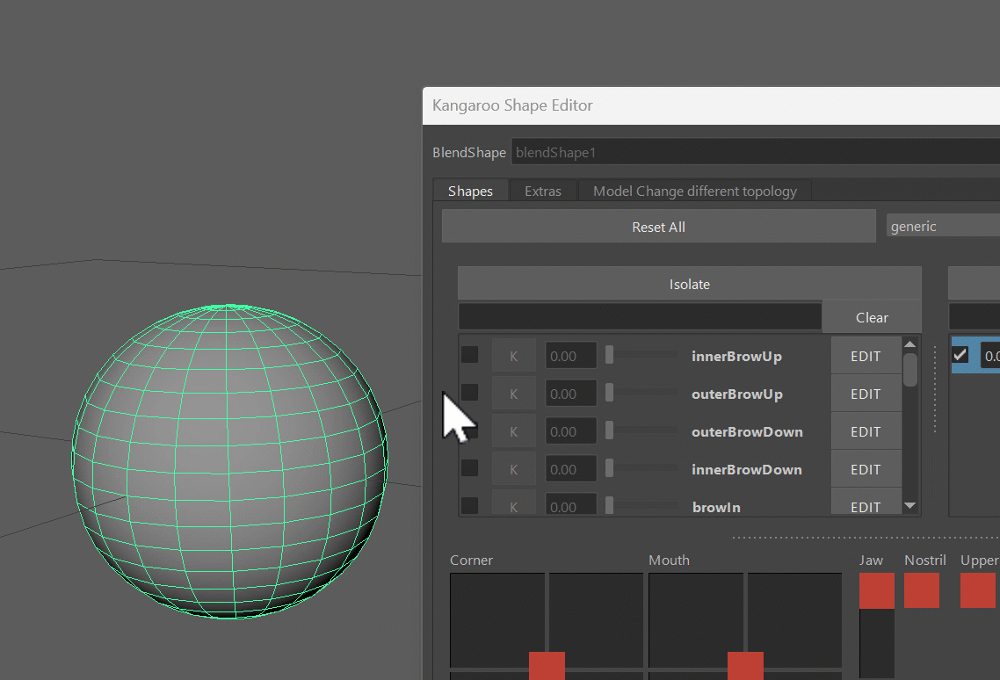  

!!! note
    Here we have a similarity to the *Pose Editor* but also a difference. While in the *Pose Editor* you also have those
    *EDIT* buttons that you use to sculpt the Targets, in the *Pose Editor* you have to select the meshes, while in the
    *Shape Editor* it just does it on all the meshes that are in the collection. 


## Combos
### Combos - Create Them
Combo targets is the Table on the right side. You can create any combination between 2, 3, 4, ... Main Targets. Most of the
time we create combination of just 2 targets. Sometimes 3, and very rarely 4.   
For a combination of 2 targets the combo would be called for example *cornerUp_upperUp*. A combination of 3 would be
*cornerUp_noseWrinkler_upperUp*. It's basically the main targets' names ordered alphabetically and separated by a single \_.
!!! note 
    You will never have to name them yourself, the tool takes care of it. You just need to be aware that whenever you create a *Main Target*
    yourself, it *cannot* have the \_ sign in there.

Creating them is easy, just select the main targets, right click -> **create combo Targets**:  
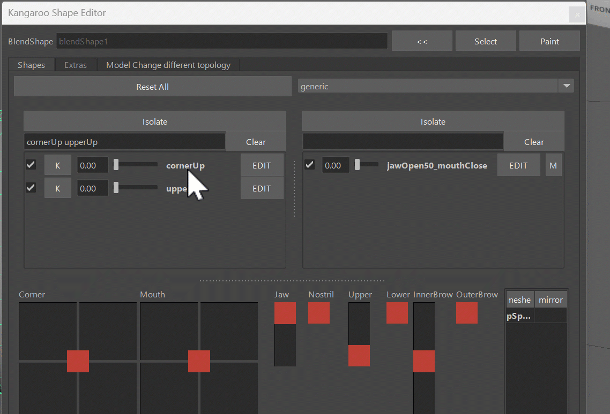
### Combos - Multiply/Minimum
In the gif above you can see that in the end we switch between the evaluation modes *Muliply* and *Minimum*.  
*Multiply* means that the main targets are just multiplied. So if *cornerUp* is activated 0.8 and *upperUp* is activated 0.5,
the combination will be 0.4 (0.8 * 0.5).  
And in *Minimum* in the same example it would be 0.5, because 0.5 is the smaller one between 0.8 and 0.5.  

Both modes have pros and cons. If you use *Multiply*, the result will be smoother but the issue is that the shape will not 
be driven linearly while all main targets are being activated the same time. For example if you have 2 main targets that are both 
activated as 0.5, the combo target will be 0.25. But ideally it should also be 0.5. Look at this example where we have
a combination of 3 Main Targets. See how it moves slower at smaller values, and then speeds up at higher values?
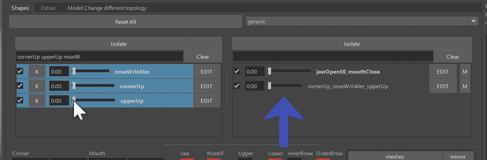  

If you need it to run linearly, you can switch to *Minimum*. If all main targets are 0.5, the combo target would be 0.5, too. But *Minimum* has
the ugly disadvantage that it's not as smooth as *Multiply*. In certain situations you'll find that as one main target is being 
activated slowly, the combo might suddenly change from getting activated to not reacting.  
Look at this example. See how it moves more linear, but if I move one alone it starts activating at one point? Animators hate that!
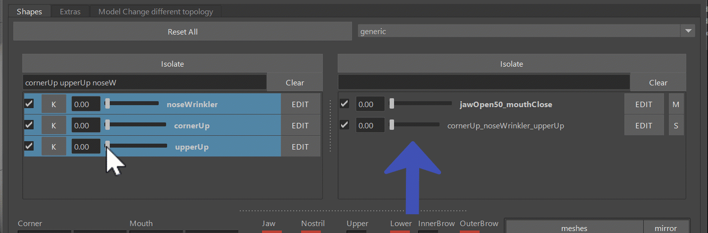  

!!! warning
    The disadvantages of both modes (*Multiply* and *Minimum*) are only getting worse the more Main Targets you use for the 
    combo. So keep it to a minimum! Any combination of more than 3 targets can get very nasty.

### Combos - add Percentage
When you open the blendShapes.ma on the *THOMAS* asset, you'll see a combo called jawOpen50_mouthClose. This just means
that the jawOpen will only go to 0.5 (50 %):  
   
Try it out! But don't overuse them. The art of sculpting shapes is making this work with the simplest logics. But if you
do need the extra complexity, it's there.  
Changing and adding percentages happens through the marking menu:  
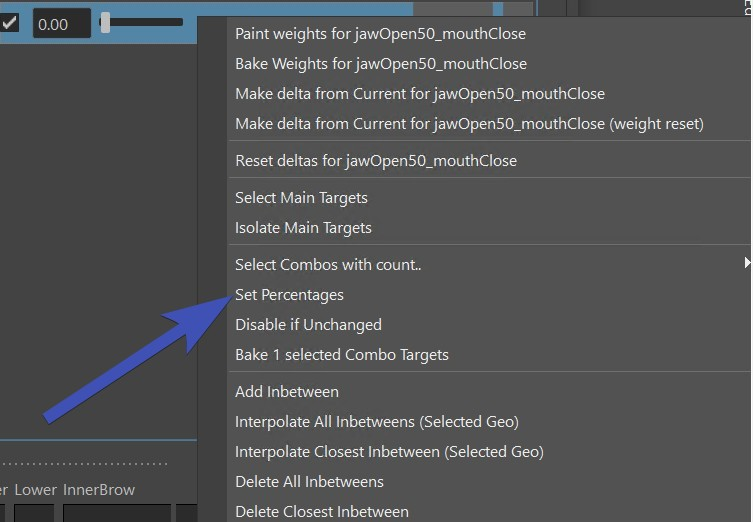   


## Extra Sliders
At the bottom you see a lot of sliders. Those are just representations of how the rig will later set them up. So they are basically
a great way to get a feeling of how they will work later.   
On each slider you could also isolate the targets with the right click menu, so you can see what targets are driven by them.   
Open the Shape Editor File from the templates asset *THOMAS*, and play around with the sliders:  
  


## Mirror
Mirroring contains 2 parts. *Creating Mirror* Table, and actually *Mirroring*
### Mirror Table 
Right click on the mesh in the *Mesh Table* at the bottom right:   
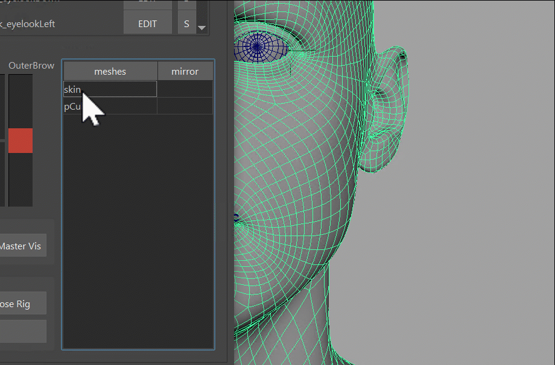   
You can choose between:

- middle mesh, edgeflow: maping vertices through the middle edge algorithm
- middle mesh, vertex positions, mapping through vertex positions
- middle mesh, face points: finds point on face, and does barycentric mapping
- side meshes, ids: needs 2 meshes with same vertex orders 
- side meshes, vertex positions: needs 2 meshes, maps by vertex positions
- side meshes, face points, needs 2 meshes, maps by point on face and barycentric coordinates

### Actually Mirroring
Mirroring also works on vertex selection. But you do need to right click on the actual mesh for the mirror.
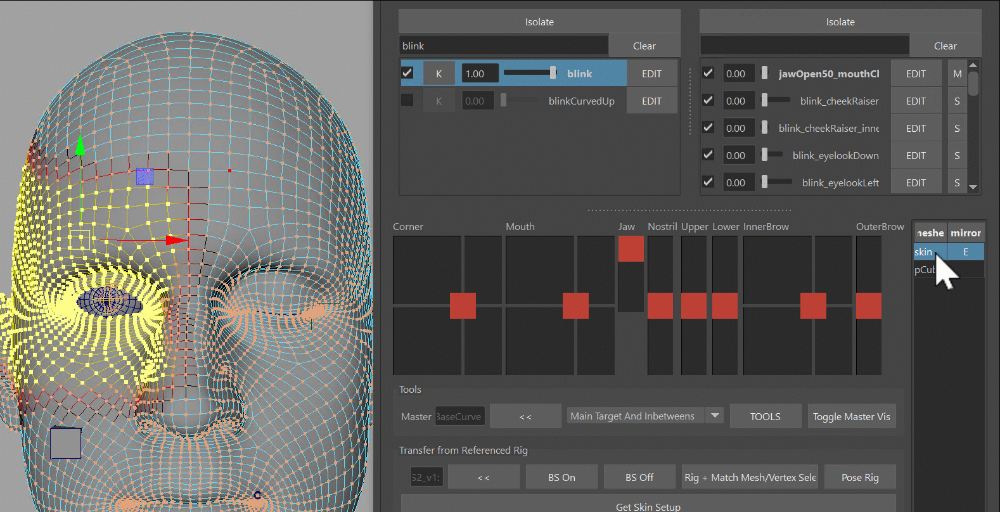    
!!! warning "Don't Forget"
    Do not forget to select the mesh in scene! Sometimes we assume that when we right click on the actual mesh in the UI it
    would do the mesh. But from the power of being able to select vertices comes the responsibility to also select the mesh in scene.


## Inbetweens
You can add inbetweens to any Target.
 

### Interpolate
Inbetweens are basically another shape stored in the node. It may not appear like this at first because when you apply the 
inbetween, it gives it a default shape which is the interpolated shape at the time of when you apply it.  
BUT if you change the Full Target, the inbetween will NOT change.  
But there's a solution to it - you can re-interpolate the inbetweens. You'll loose the shape that you sculpted on the inbetween, but
it'll follow again that the full shape does. You'll see the options on the right click menu:    
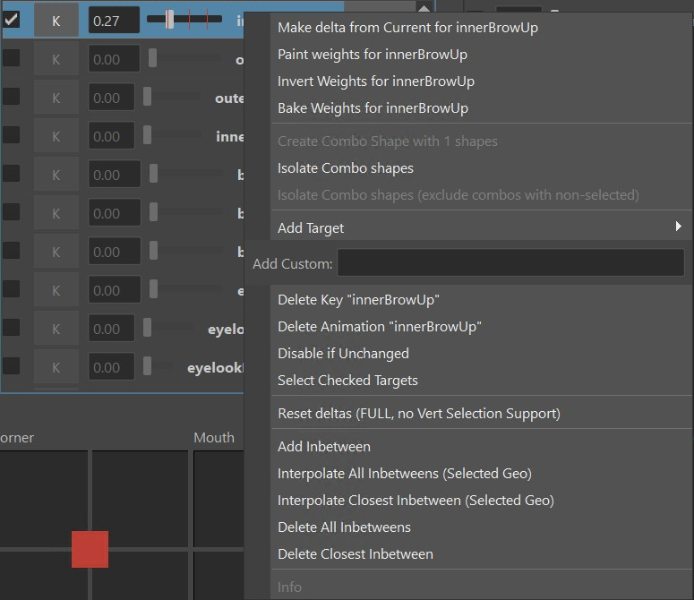   

!!! note
    You'll see the words *All Inbetweens* and *Closest Inbetwween* a lot in the *Shape Editor*. It's relevant when you 
    have more than one inbetween. So in the picture above where there are 3 inbetweens (red marks) the current weight
    is closer to the first one, therefore the *Closest Inbetween* would only touch the first one. 

!!! warning
    When the *blendShapesAndSliders()* adds the blendShapes, the logic of inbetweens is a bit complicated because of a few
    mathematical challenges on how those inbetweens work. This means in certain situations you might find things behaving a bit strange.   
    It's recommended to keep inbetweens to minimum. And if you do use them, watch out for the results carefully.


## Meshes
### Meshes - Add Secondary Meshes {#addsecondarymeshes}
Easy, just select them and add them with the right click menu:
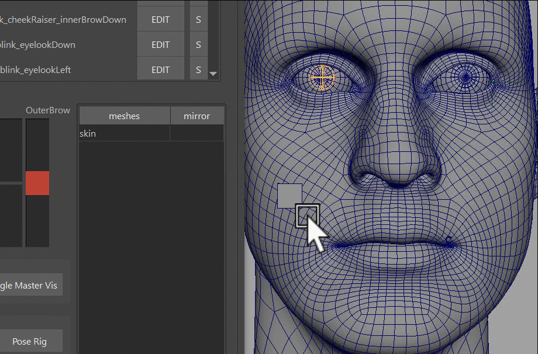   
!!! info "Kangaroo Tool Tip"
    By default they are just sitting there and not following the main skin. But you can make it follow the skin with
    the [Tools](#makemeshesfollow) explained below.

### Meshes - Main Mesh {#meshesmainmesh}
It's important to keep the Main Mesh (*skin* in this example) as the main mesh. It's usually always the case, unless
you start replacing a few meshes. But it's easily fixed with right click menu:  
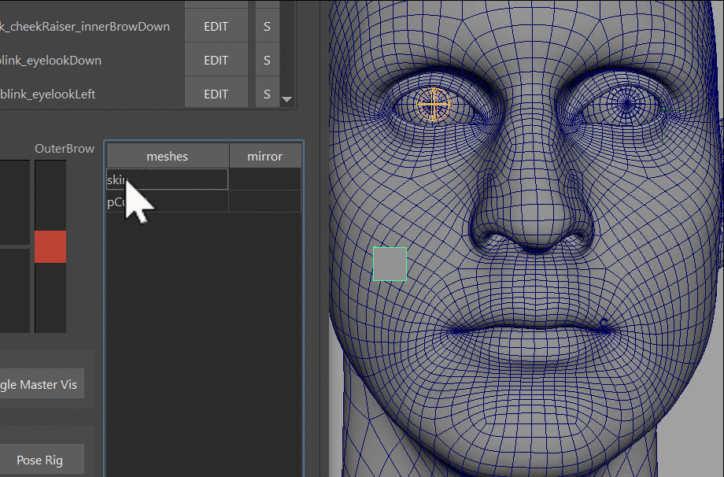   


### Meshes - Model Change
#### same topology
If the model changed in topology, it's easy. Just select the new mesh, and then with right click on the mesh that
you want to change -> **Model Change from "xxx" to "xxx"**
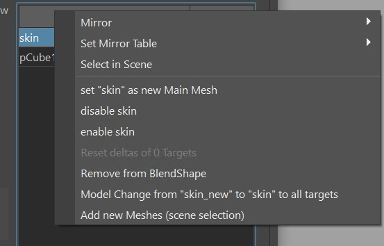   
#### different topology
If the overall shape is still the same and modeling just changed the topology a bit, it's a bit of a manual process,
but it's not difficult:  
1. rename the old mesh  
2. restart the shape editor  
3. [add the new mesh](#addsecondarymeshes) (with correct name!)  
4. [warp](#warp) the new mesh to the old mesh   
5. if the old mesh was the main mesh: set it as [Main Mesh](#meshesmainmesh)     
6. check the lips on open targets! Targets like *jawOpen*. *upperUp* or *lowerDown* can get screwed on warp. If they 
are screwed, either fix them manually or try the [Warp UVs](#warp-uvs)

#### different topology and different shape
If the topology is different AND the shape is entirely different, we are basically talking about making a new character.
Check [Transfer to New Character](#transfer-to-new-character) further below.


## Connecting the Rig
There's two main reason why we need to connect the rig into the blendShape Editor - getting jawOpen/eyeLook joints into
the *Shape Editor*, and getting certain poses into the *Shape Editor* so we can sculpt correctives.
### Loading the Rig
For both things you have to start by referencing the rig, using the *reference rig* button at the top of the Kangaroo UI.
!!! note
    If you are getting the rig with the *reference rig* button, you have to build/publish the rig before. If you don't want 
    to publish, you can also *hold scene* where you've built the rig, and then with the right click menu of the *pull scene*
    you can reference the rig in. More info on [hold/pull](../builder/workflowTricks.md#hold-pull)
Then just hide the top group of the rig, you won't have to directly do anything in it unless you are trying to debug something.  
Then having anything from it selected, click the **<<** button at the very bottom.
   

### Getting Jaw from the Rig
The benefit from having the jaw joint in the *Shape Editor* is that you can sculpt the jaw shape and also specify how 
the jaw joint should behave. Having those 2 things in different places would make it difficult to polish the deformations.  

To get the joints and skinning, select all the meshes and click the most bottom button *Get Skin Setup*. You should end up with joints that look like this:  
     
The skin weights are also taken from the rig, but it went through a few numpy operations to group the weights of the non-existing 
joints to either *jnt_m_headMain* or *jnt_m_jawMain*.
!!! note 
    If after clicking the *Get Skin Setup* the joints don't look like in the image above, delete the current joints you have and try again. 
    Sometimes if you have some joints in there already he tries to use them which may not always be helpful.  
Try to activate the *jawOpen* target. It might look like this: 
     
You may have to fix some skinning, especially if you also added the teeth (which we didn't do in this case).  
But more important, you'll have to fix the jaw motion. See how currently it's just rotating? Let's make it so it also
translates it a bit, and at the same time even make the rotation a bit less.  
This is happening with the **\*** button next to the *jawOpen*. That opens this UI, where you can adjust the rotateZ,
and add some translation values:  
     

!!! tip
    You probably just got a headache from those values because you don't know what space they should be, or how to even enter without seeing the result
    right away!   
    But don't worry, there's a trick:

    1. Select the jaw joint, break the connections and then translate/rotate the jaw joint into a good place:
    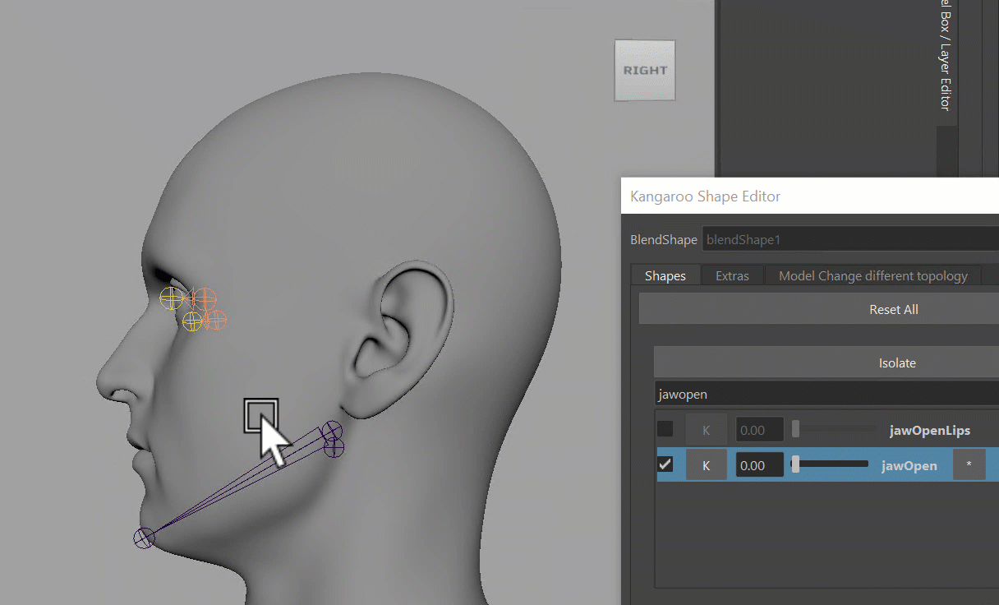
    2. Make a screenshot of the values on the jnt_m_jawMain (or write those values down)
    3. Click the **\*** button, enter the values in there. And when you click save, it'll restore the connections again  

!!! note
    The values in the **\*** button will also make it into the rig! Just make sure you have the *jawAutoTranslate()* function activated 
    without any overrides in the attributes. It will work in a way that as the animator rotates the jaw_ctrl.rotateZ 
    to what you have defined as rotateZ, it'll also translate the jaw ctrl the same way as the joint is being translated from the values you entered.

### Getting Eye Look from the rig
It all works the same as the jaw, but it's a little simpler because we are not sending back/forward values.
Just make sure the eyeballs are skinned to the eye joints, and the targets that have the extra are *eyelookUp*, *eyelookDown*,
*eyelooLeft*, *eyelookRight*.  
And if you are a skilled modeler, you can create some nice eyelook targets:   
     

### Grab targets for corrective sculpting
Especially for cartoony rig we want to use the *Shape Editor* to sculpt some correctives. Select any target and some mesh
(full mesh or vertex/soft selection), and click the button **Pose Rig and Match Mesh/Vertex Selection**. 
But before that with the **BS Off* or **BS On* buttons you should specify if you want to get the targets with or without 
the already applied blendShapes.
     
!!! note
    To know which target you need to specify here for which corrective, check 
    [*blendShapesAndSliders()*](faceGeneral.md#blendshapesandsliders). You might even want to 
    [define your own targets](faceGeneral.md#define-your-own-targets) for that.


## TOOLS
The *Shape Editor* comes with a lot of tools, and you won't use it efficiently unless you know about all the tools.
   
For every tool in there, select the *Targets* and the *Mesh*! And for the mesh selection you can also select vertices
and soft selection. 
### TOOLS - Multiply
The *Multiply* tool is probably the simplest but most important one. Ever had an animator tell you *Please make all
shapes 1.5 as strong as they are currently?*
Well, that's easy with the *Multiply* tool:    
     
But it doesn't stop there! Use the tool to multiply by a value smaller than 1.0 (like 0.35 or 0.8) if you want to lessen
the effect on a shape in certain regions. Or even multiply by 0.0 to erase some small moving vertices.  
Or multiply negative like -1.0 if you want to make a shape go the reverse direction!  
Just below the *Multiply* in the marking menu you have the *Multiply in Y*. Seems a bit arbitrary because it only does
it in Y, but we use it a lot for some tricks on the brow shapes.
#### TOOLS - Make Meshes Follow {#makemeshesfollow}
There are 3 types of tools you need to choose from depending on the situation: *Warp*, *Warp Rigid* and *Warp Wire*.  
We'll explain them here. But if you get confused, try to watch that part in the [Video](#video) from 4.08.
#### Warp
If you set the main skin as the Master, the warp will just make meshes follow, and it's using the wrap deformer under the hood:     

#### Warp Rigid
In the picture above you see that the cubes around the mouth are changing their shapes.  
To solve that we have the *Warp Rigid*. This one analyzes all the islands of the mesh separately and makes sure
their shape doesn't change:  
       
#### Blend Ids
This is if you want a target to have exactly the shape from another mesh

#### Warp UVs
*Warp UVs* has similar results as *Warp*. But - if the uvs between the meshes are the same - it might do a better 
job on the lips. But other areas might not be as nice as the wrap.
!!! tip
    Always try the *Warp* first. Try the *Warp UVs* only if the *Warp* is giving you issues that are hard to fix.

#### Warp Wire
The *Warp Wire* tool is used for eyelashes. The previous *warp* tools don't work well for eyelashes since they work 
with *closest point* logic. And with eyelashes usually sticking out so far the results aren't just working without
a lot of cleanups.  
So the *Warp Wire* is under the hood using the *Wire Deformer* to move the meshes by a curve.   
     
You just have a create the curve with the *Curve from selected vertices* button in the *Extras* tab, and use that
curve as the *Master*:  

## Adding more Main Targets
There's *Predefined Targets* and *Custom Targets*. Both can be added with the right click menu.  
!!! note
    And this point it would help to have an overview of what targets you can actually add. Check the
    [*blendShapesAndSliders()*](faceGeneral.md#blendshapesandsliders) function. 

### Predefined Targets
Under the Right click menu **Add Target** you'll see a lot of them:  
     
The ones that you see above the line are defined by the Kangaroo tool. If you add those in there, the *blendShapesAndSliders()* function
will just add, mirror and connect them.  
The ones below the line (in this image *A*, *B*, *EE*, ..) are the ones that you specified 
in the attributes **ddTargetsAsAttributes**, **ddExtraTargetSliders** or **ddCorrectives** of the *blendShapesAndSliders()* function.  
  
!!! note
    For those targets to appear in the menu it's important that you have the Kangaroo UI open and switched to the current character.
    Once you've added the targets, it doesn't matter anymore if the Kangaroo UI is open or not.

!!! info
    To see how you can set those attributes, check [Define your own Targets](faceGeneral.md#define-your-own-targets)

### Custom Targets
Custom targets are targets that you just put into that textfield on the right click menu:  
  
Most likely by putting them in there, they won't do anything in the *blendShapesAndSliders()* function. Unless you put them
into one of the attributes mentioned [above](#predefined-targets).

### TargetList File
If you are setting up things for a bigger project with more characters, you'll more likely want to predefine a list
of shapes, so artists don't have to add one by one target throught the right click menu.  
That's what Target lists are for, and you can switch between them in the combo box up there. 
   
!!! note
    You can also set them at the beginning when you open the Shape Editor on a mesh the first time! Which is actually more recommended.
Create a new empty folder and specify it with the environment variable **KANGAROO_TARGETLIST_PATH**.
!!! note
    To get started quickly, you can also do that with the *pathsEnv.mel* on the root folder of kangaroo installation directory.  

In that folder just add a text file with the prefix **.targetlist**, such as *dog.targetlist*:
``` bash title='dog.targetlist'
snarl True False
jawOpen True False
squint True False
blink True False
eyeWide True False
lipStretch True False
noseWrinkler True False
earsBack True False
```
The True/False next to the names are all about the checkboxes. If you want the artist to be able to switch on/off, 
make the first one True. And if you want that checkbox to be on by default, make the second one True, too.

!!! note
    To start with the *general* or *cartoon* one, grab those files from the installation folder *scripts\kangarooShapeEditor*

!!! info
    Do you want to share the blendShape file with another team, but you don't want to go through the stress of setting up
    the Environment variable plus targetlist file for them?  
    No problem, they don't need the targetlist file, since it also gets saved locally in the blendShape file.


## Bake/Fill
If you want to sculpt the shapes in an external tool such as *ZBrush*, that's also doable.
For creating meshes from the targets, click **Bake** under the *Extras* tab.    
Then you can export those, and re-import. To put the shapes of those meshes back into the targets,
select them and click the **Fill Selected Sculpts to Targets** button.  
  
!!! note
    The **Fill Selected Sculpts to Targets** button is also useful for other situations, for exapmle when you baked 
    shapes using another another python script.

## Setting a target from another Mesh
One way to do that is with the **Fill Selected Sculpts to Targets** button, if you just make sure that the selected mesh
has the correct target name.  
Another way is through the *TOOLS* button - [Blend Ids](#blend-ids)


## Workflow Tricks
### Create an Opposite Target
For some targets we don't want to do much sculpting, we just want to generate it from negating another one.
Best example is the *upperDown*, or *lowerUp*.  
For the upperDown: select *upperUp* and *upperDown* together (order matters!), right click **Copy Deltas of ...**  
And then use the multiply tool with -1.0:  
  


### Make Delta from Current
You can dial in a few targets, and then right click on one, *Make Delta from Current* puts the current shape
into the current target.  
Look at this example where we use the *upperUp* target to open the lips slightly on the *noseWrinkler*:  
  


## Transfer to New Character
Transfering to a new character is more advanced. It requires downloading Wrap3D (https://www.russian3dscanner.com/download/) 
and possibly even getting a license.  

At the time of writing this documention, you also have to specify the tool location in *kangarooShapeEditorUI.py* file:
``` python
kWrap3dExe = 'C:/Program Files/Faceform/Wrap 2023.11.4/WrapCmd.exe'
```

Once you have that all setup-ed, you'll have to create those relations between the 2 meshes.  
  

To see how that works in detail, watch the [Video](#video) below from 17:57


## Video
To see it in action, you can watch the video below. But keep in mind that some menu options changed a bit!
<iframe width="560" height="315"
src="https://www.youtube.com/embed/cEBJ-tPLMuU"
title="YouTube video player" frameborder="0"
allow="accelerometer; autoplay; clipboard-write; encrypted-media; gyroscope; picture-in-picture"
allowfullscreen></iframe>

