## Connecting the Rig
There's two main reason why we need to connect the rig into the blendShape Editor - getting *jawOpen* and *eyeLook* joints into
the Shape Editor, and getting certain poses into the Shape Editor so we can sculpt correctives.
### Loading the Rig
For both things you have to start by referencing the rig, using the *reference rig* button at the top of the Kangaroo UI.
!!! note
    If you are getting the rig with the *reference rig* button, you have to build/publish the rig before. If you don't want 
    to publish, you can also *hold scene* where you've built the rig, and then with the right click menu of the *pull scene*
    you can reference the rig in. More info on [hold/pull](../builder/workflowTricks.md#hold-pull)
Then just hide the top group of the rig, you won't have to directly do anything in it unless you are trying to debug something.  
Then having anything from it selected, click the **<<** button at the very bottom.
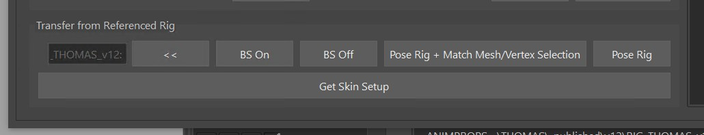   

### Getting Jaw from the Rig
The benefit from having the jaw joint in the *Shape Editor* is that you can sculpt the jaw shape and also specify how 
the jaw joint should behave. Having those 2 things in different places would make it difficult to polish the deformations.  

To get the joints and skinning, select all the meshes and click the most bottom button *Get Skin Setup*. 
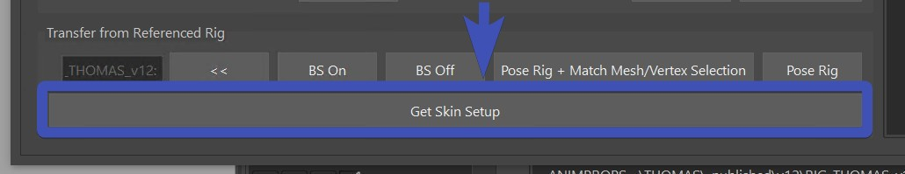   

You should end up with joints that look like this:  
     
The skin weights are also taken from the rig, but it went through a few numpy operations to group the weights of the non-existing 
joints to either *jnt_m_headMain* or *jnt_m_jawMain*.
!!! note 
    If after clicking the *Get Skin Setup* the joints don't look like in the image above, delete the current joints you have and try again. 
    Sometimes if you have some joints in there already he tries to use them which may not always be helpful.  
Try to activate the *jawOpen* target. It might look like this: 
     
You may have to fix some skinning, especially if you also added the teeth (which we didn't do in this case).  
But more important - you'll have to fix the jaw motion. See how currently it's just rotating? Let's make it so it also
translates it a bit, and at the same time even make the rotation a bit less.  
This is happening with the **\*** button next to the *jawOpen*. That opens this UI, where you can adjust the rotateZ,
and add some translation values:  
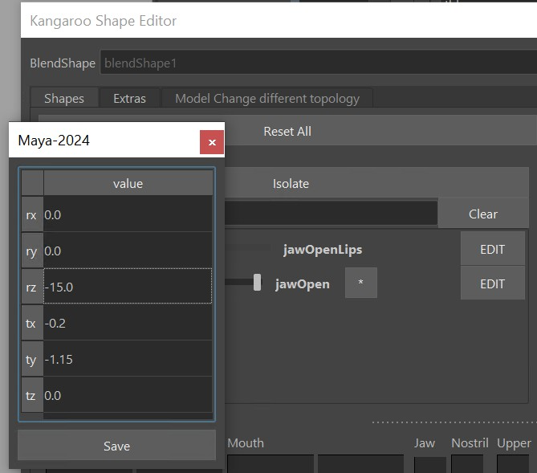     

!!! tip "Trick how to find the proper Jaw Values"
    You probably just got a headache from those values because you don't know what space they should be, or how to even enter without seeing the result
    right away!   
    But don't worry, there's a trick:

    1. Select the jaw joint, break the connections and then translate/rotate the jaw joint into a good place:
    <video controls width="1216">
    <source src="../../images/shapeEditor_jawJointBreakConnections.mp4" type="video/mp4">
    Your browser does not support the video tag.
    </video>
    2. Make a screenshot of the values on the jnt_m_jawMain (or write those values down)
    3. Click the **\*** button, enter the values in there. And when you click save, it'll restore the connections again  

!!! note
    The values in the **\*** button will also make it into the rig! Just make sure you have the *jawAutoTranslate()* function activated 
    without any overrides in the attributes. It will work in a way that as the animator rotates the jaw_ctrl.rotateZ 
    to what you have defined as rotateZ, it'll also translate the jaw ctrl the same way as the joint is being translated from the values you entered.  
    Check [Jaw - Auto Translate](faceGeneral.md#auto-translate) for more info.

### Getting Eye Look from the rig
It all works the same as the jaw, but it's a little simpler because we are not sending back and forward values.
Just make sure the eyeballs are skinned to the eye joints, and the targets that have the extra are *eyelookUp*, *eyelookDown*,
*eyelooLeft*, *eyelookRight*.  
And if you are a skilled modeler, you can create some nice eyelook targets:   
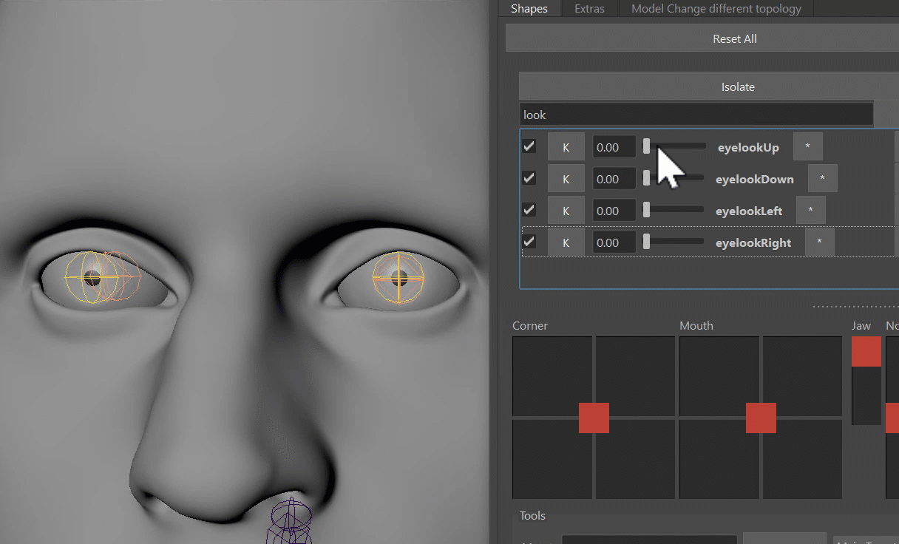     

### Grab targets for corrective sculpting
Especially for cartoony rig we want to use the *Shape Editor* to sculpt some correctives. Select any target and some mesh
(full mesh or vertex/soft selection), and click the button **Pose Rig and Match Mesh/Vertex Selection**. 
But before that with the **BS Off* or **BS On* buttons you should specify if you want to get the targets with or without 
the already applied blendShapes.
     
!!! question "Which targets do I choose?"
    To get an overview of which targets you need to specify here for which corrective, check 
    [*blendShapesAndSliders()*](faceGeneral.md#blendshapesandsliders). You might even want to 
    [define your own targets](faceGeneral.md#define-your-own-targets) for that.


## TOOLS
The *Shape Editor* comes with a lot of tools.
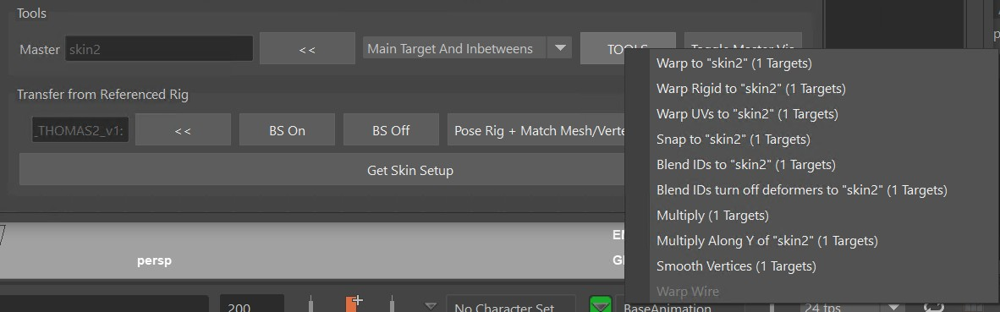   
For every tool in there, select the *Targets* in the Table and the *Mesh* in the scene! For the mesh selection you can also select vertices
and soft selection. 
### TOOLS - Multiply
The *Multiply* tool is probably the simplest but most important one. Ever had an animator tell you *"Please make all
shapes 1.5 as strong as they are currently"?*
Well, that's easy with the *Multiply* tool:    
     
But it doesn't stop there! Use the tool to multiply by a value smaller than 1.0 (like 0.35 or 0.8) if you want to lessen
the effect on a shape in certain regions. Or even multiply by 0.0 to erase some small moving vertices.  
Or multiply negative like -1.0 if you want to make a shape go the reverse direction!  

Just below the *Multiply* in the marking menu you have the *Multiply in Y*. Seems a bit arbitrary because it only does
it in Y, but we use it a lot for some tricks on the brow shapes.
### TOOLS - Make Meshes Follow {#makemeshesfollow}
There are 3 types of tools you need to choose from depending on the situation: *Warp*, *Warp Rigid* and *Warp Wire*.  

!!! video
    We'll explain all the objects right below. But you can also watch it in this 
    [video from Secondary Meshes](https://www.youtube.com/watch?v=cEBJ-tPLMuU&t=4m08s).
 
#### Warp
If you set the main skin as the Master, the warp will just make meshes follow, and it's using the wrap deformer under the hood:     
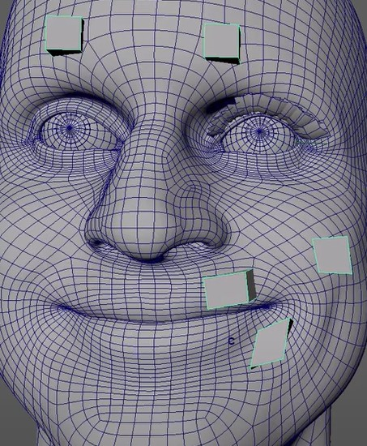
#### Warp Rigid
In the picture above you see that the cubes around the mouth are changing their shapes.  
To solve that we have the *Warp Rigid*. This one analyzes all the islands of the mesh separately and makes sure
their shape doesn't change:  
       
#### Blend Ids
This is if you want a target to have exactly the shape from another mesh

#### Warp UVs
*Warp UVs* has similar results as *Warp*. But - if the uvs between the meshes are the same - it might do a better 
job on the lips. But other areas might not be as nice as the wrap.
!!! tip
    Always try the *Warp* first. Try the *Warp UVs* only if the *Warp* is giving you issues that are hard to fix.

#### Warp Wire
The *Warp Wire* tool is used for eyelashes. The previous *warp* tools don't work well for eyelashes since they work 
with *closest point* logic. And with eyelashes usually sticking out so far the results aren't just working without
a lot of cleanups.  
So the *Warp Wire* is under the hood using the *Wire Deformer* to move the meshes by a curve.   
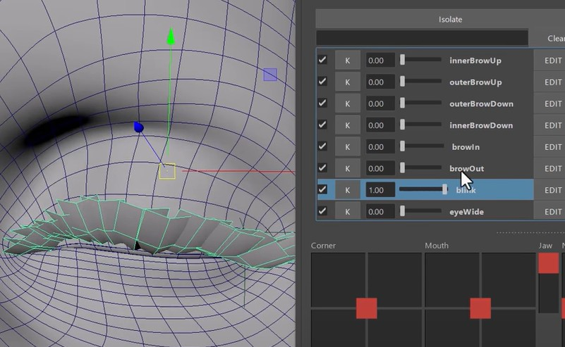     
You just have a create the curve with the *Curve from selected vertices* button in the *Extras* tab, and use that
curve as the *Master*:  
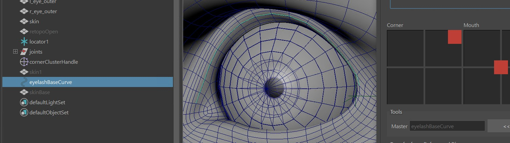
## Adding more Main Targets
There's *Predefined Targets* and *Custom Targets*. Both can be added with the right click menu.  

### Predefined Targets
Under the Right click menu **Add Target** you'll see a lot of them:  
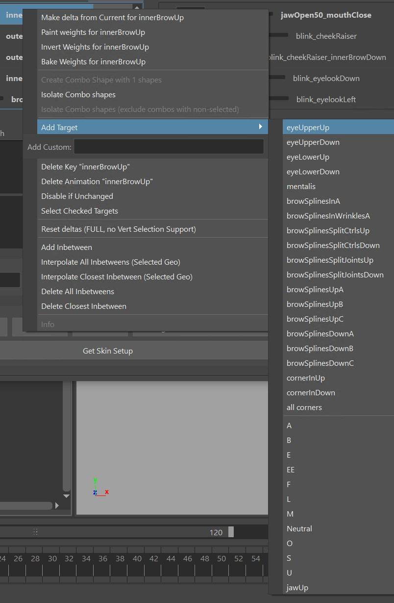     
The ones that you see above the line are defined by the Kangaroo tool. If you add those in there, the *blendShapesAndSliders()* function
will apply them.  
The ones below the line (in this image *A*, *B*, *EE*, ..) are the ones that you specified 
in the attributes **ddTargetsAsAttributes**, **ddExtraTargetSliders** or **ddCorrectives** of the *blendShapesAndSliders()* function.  
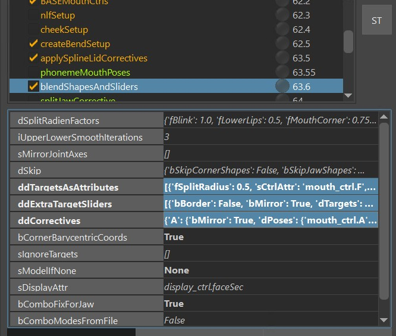  
!!! note
    For those targets to appear in the menu it's important that you have the Kangaroo UI open and switched to the current character.
    Once you've added the targets, it doesn't matter anymore if the Kangaroo UI is open or not.

!!! info
    To see how you can define those extra Targets, check [Define your own Targets](faceGeneral.md#define-your-own-targets)

### Custom Targets
Custom targets are targets that you just put into that textfield on the right click menu:  
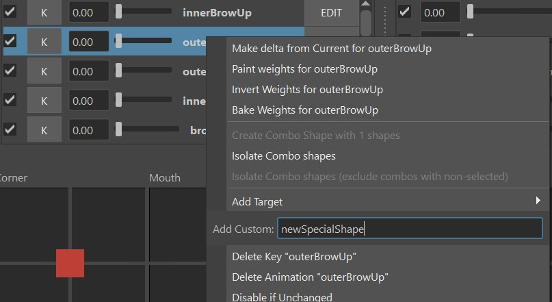  
Most likely by putting them in there, they won't do anything in the *blendShapesAndSliders()* function, unless you
specify them in there.

### TargetList File
If you are setting up things for a bigger project with more characters, you might want to predefine a list
of shapes, so artists don't have to add one by one target throught the right click menu.  
That's what Target lists are for, and you can switch between them in the combo box up there. 
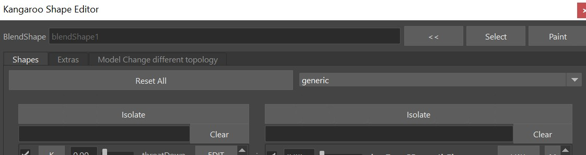   
!!! note
    You can also set them at the beginning when you open the Shape Editor on a mesh the first time! Which is actually more recommended.
Create a new empty folder and specify it with the environment variable **KANGAROO_TARGETLIST_PATH**.
!!! note
    To get started quickly, you can also do that with the *pathsEnv.mel* on the root folder of kangaroo installation directory.  

In that folder just add a text file with the prefix **.targetlist**, such as *dog.targetlist*:
``` bash title='dog.targetlist'
snarl True False
jawOpen True False
squint True False
blink True False
eyeWide True False
lipStretch True False
noseWrinkler True False
earsBack True False
```
The True/False next to the names are all about the checkboxes. If you want the artist to be able to switch on/off, 
make the first one True. And if you want that checkbox to be on by default, make the second one True, too.

!!! note
    To start with the *general* or *cartoon* one, grab those files from the installation folder *scripts\kangarooShapeEditor*

!!! info
    Do you need to share the *blendShape.ma* file with another team, but you don't want to go through the stress of setting up
    the Environment variable and targetlist file for them?  
    No problem, they don't need the targetlist file, since it also gets saved locally in the *blendShape.ma* file. When they open
    the *blendShape.ma* file, it'll look like this - basically *LOCAL* before the list name:    
    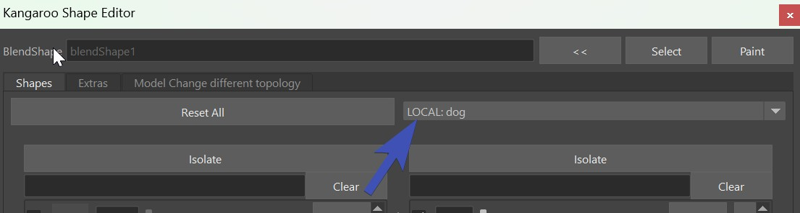   


## Bake/Fill
If you want to sculpt the shapes in an external tool such as *ZBrush*, that's also doable.
For creating meshes from the targets, click **Bake** under the *Extras* tab.    
Then you can export those, and re-import. To put the shapes of those meshes back into the targets,
select them and click the **Fill Selected Sculpts to Targets** button.  
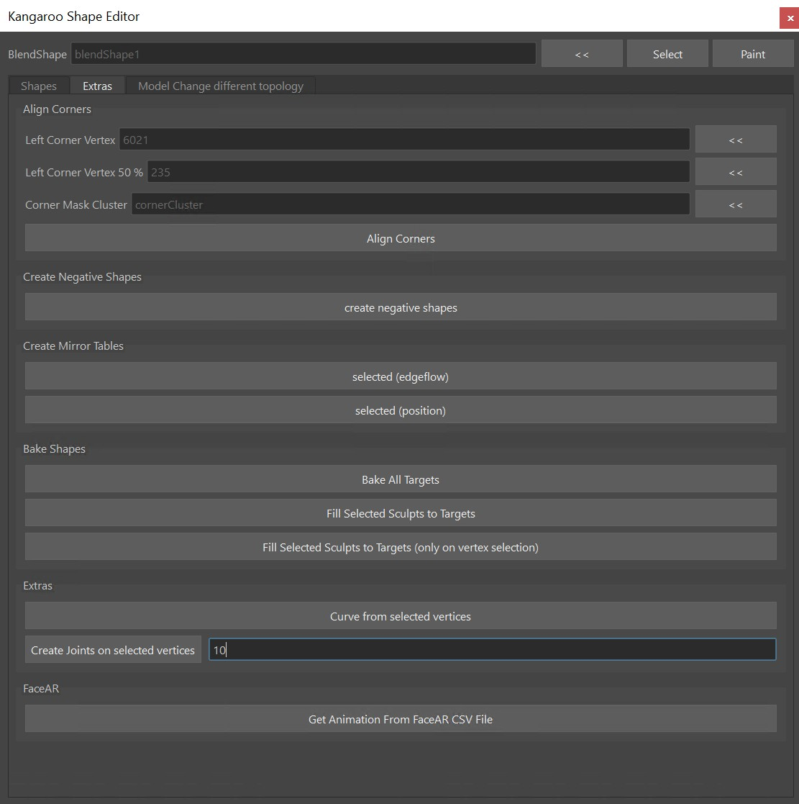  
!!! note
    The **Fill Selected Sculpts to Targets** button is also useful for other situations, for example when you baked 
    shapes using another python script.

!!! tip "Bake just Selected Targets"
    When baking you don't have to bake *all* the targets. You can just select some, and with right click bake only those:  
    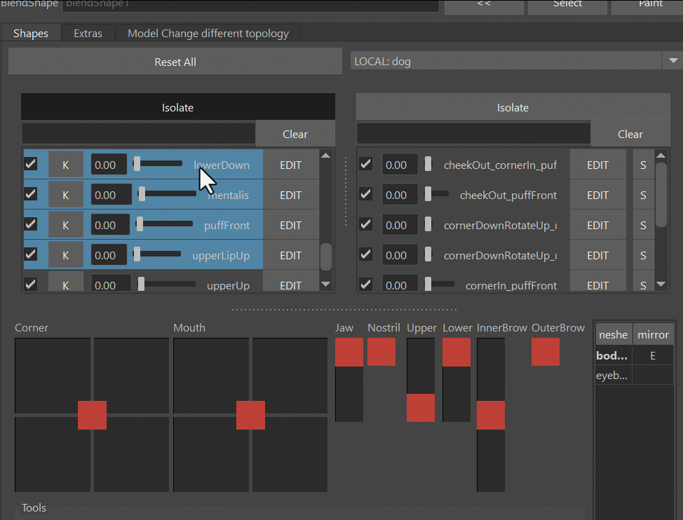  
    

## Setting a target from another Mesh
One way to do that is with the **Fill Selected Sculpts to Targets** button, if you just make sure that the selected mesh
has the correct target name.  
Another way is through the *TOOLS* button - [Blend Ids](#blend-ids)


## Workflow Tricks
### Create an Opposite Target
For some targets we don't want to do much sculpting, we just want to generate it from negating another one.
Best example is the *upperDown*, or *lowerUp*.  
For the upperDown: select *upperUp* and *upperDown* together (order matters!), right click **Copy Deltas of ...**  
And then use the multiply tool with -1.0:  

<video controls width="1300">
    <source src="../../images/shapeEditor_oppositeTarget.mp4" type="video/mp4">
    Your browser does not support the video tag.
</video>


### Make Delta from Current
You can dial in a few targets, and then right click on one, *Make Delta from Current* puts the current shape
into the current target.  
Look at this example where we use the *upperUp* target to open the lips slightly on the *noseWrinkler*:  
<video controls width="1164">
    <source src="../../images/shapeEditor_deltaFromCurrent.mp4" type="video/mp4">
    Your browser does not support the video tag.
</video>

## Transfer to New Character {#transfertonewcharacter}
Transfering to a new character is more advanced. It requires downloading Wrap3D (https://www.russian3dscanner.com/download/) 
and possibly even getting a license.  

At the time of this writing, you also have to specify the tool location in *kangarooShapeEditorUI.py* file:
``` python
kWrap3dExe = 'C:/Program Files/Faceform/Wrap 2023.11.4/WrapCmd.exe'
```

Once you have that all setup-ed, you'll have to create those relations between the 2 meshes.  
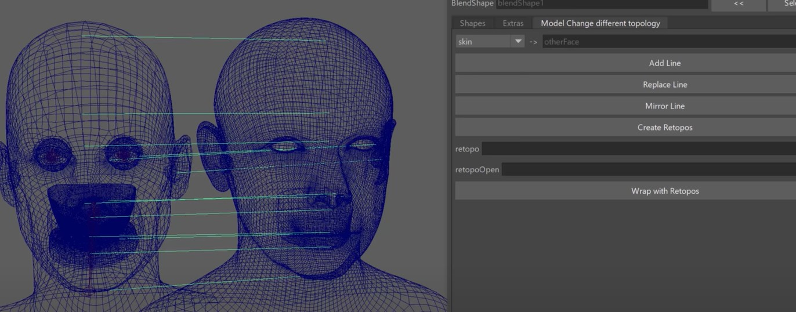  

!!! video
    To see how that works in detail, watch [this part of the Video](https://www.youtube.com/watch?v=cEBJ-tPLMuU&t=17m57s)


