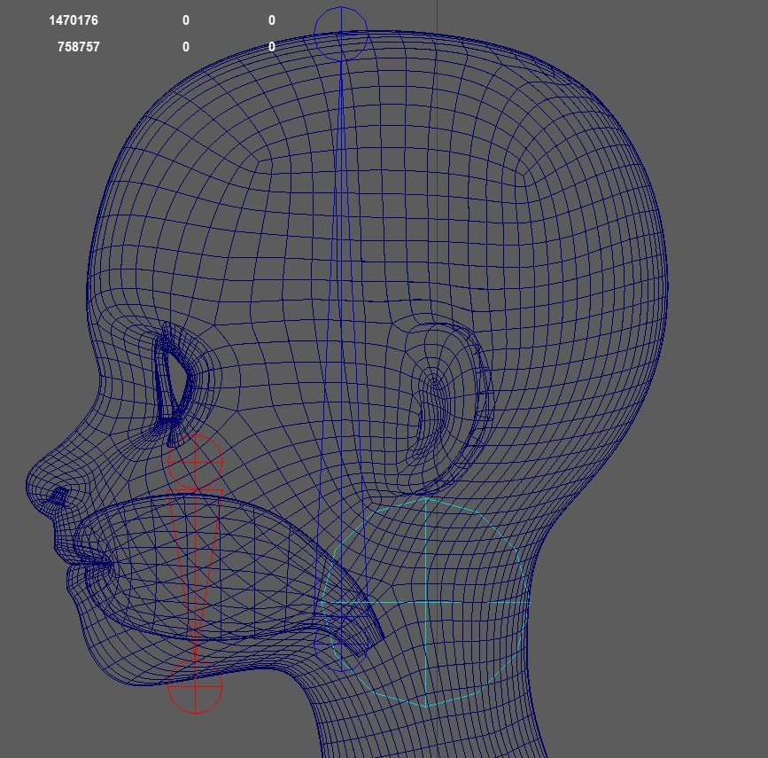

The *createBendSetup()* function is creating those ctrls. They are two additional skinClusters, suffixed by *__BEND* and *__BENDTOP*.

## Blueprints
When you click *Create BPs*, he just creates some colored joints that you need to lay out to the shape of the head

## Weights
1. To create the skinClusters, having the main mesh selected start by clicking the buttons **connect Influences (selectded Meshes)** and 
**connectInfluences TOP (selected meshes).

2. Then apply the rom animation by clicking the button **create rom anim**

3. Bind everything above the neck to the **jnt_m_faceBendMiddle**. This is the main cube ctrl - frame 0 - 30

4Then in the flood tool select the **jnt_m_botFaceBendSquash_???** joints and bind the bottom part of the face to it.