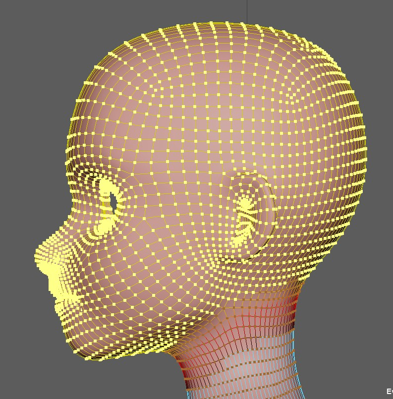
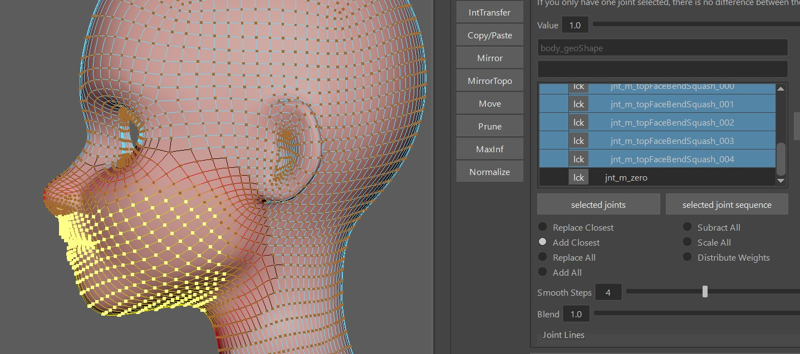
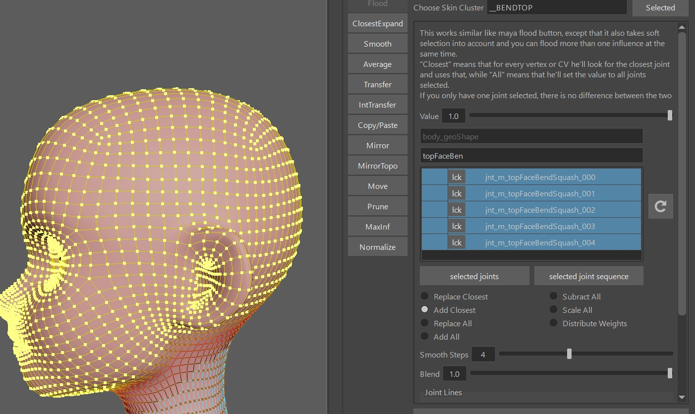

The *createBendSetup()* function is creating those ctrls. They are two additional skinClusters, suffixed by *__BEND* and *__BENDTOP*.

## Blueprints
When you click *Create BPs*, he just creates some colored joints that you need to lay out to the shape of the head

## Ctrls
After running the *createBendSetup()* function, move those ctrls to the right place, just be dragging their cvs:

- faceSquashStretch_ctrl (cube ctrl, move it to the back of the head)
- faceSquashStretchBot_ctrl (maybe move it lower so it's not buried inside the character)
- faceSquashStretchTop_ctrl (maybe move it higher so it's not buried inside the character)

And of course export the ctrls shapes.

## Weights
To create the skinClusters, having the main mesh selected start by clicking the buttons **connect Influences (selectded Meshes)** and 
**connectInfluences TOP (selected meshes).

Then apply the rom animation by clicking the button **create rom anim**

In the **Choose Skin Cluster** field, specify **__BEND**, and click the reload button.

Bind everything above the neck to the **jnt_m_faceBendMiddle**. This is the main cube ctrl - frame 0 - 30

Then in the flood tool select the **jnt_m_botFaceBendSquash_001** joint and bind the bottom part of the face to it.  
  
Even though there's more joints bot joints, the bottom part works better with just painted to one joint.

Next, the **Choose Skin Cluster** field, specify **__BENDTOP**, and click the reload button.
And bind the whole head to all the top influence joints

And then transfer the skinWeights to the other parts of face using the **skinCluster - Transfer** tool 
with the **auto create new skinCluster** option on

## Extra Attributes
The squash behavior might be a bit off at first. Try adjusting the attributes on the passers of the ctrls.  
Those get saved with the **DEFAULT ATTRS** button

## Only one skinCluster option
You probably saw that by default he added all the bottom joints also into the *__BENDTOP* skinCluster.  
If could theoretically solve it all with one skinCluster, but then you'd have to adjust the blueprints
so the lower and upper blueprints are not overlapping each other.
