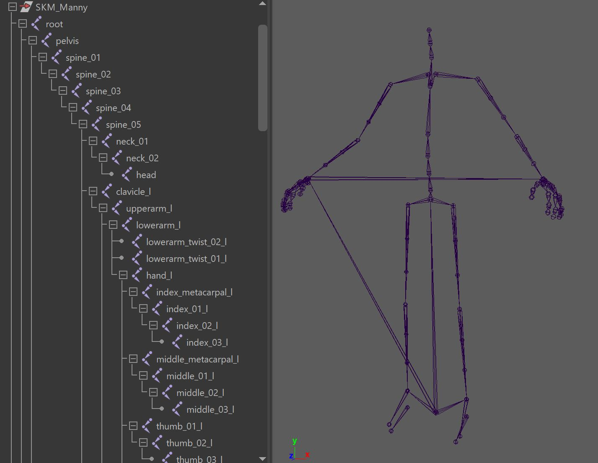

# GAMESKELETON
Game Engines usually just want a very simple rig that has only joints and skinCluster.  
To get that, turn on the function *create_GAMESKELETON()*  
After you run that function, you'll see a GAMESKELETON group that you can export as an FBX. 
You can even use the function button export FBX to do that for you.

# UnrealEngine Biped
If you want the Biped Rig from Unreal Engine, just turn on *bMetahumanJoints* in the *buildPuppet()* function.  
It'll use this rig for doing the GAMESKELETON later:    
  
Later when you import that character to UnrealEngine, it'll give
you a lot of things for free. For example you could just create the Biped Control Rig without much effort.

# Limitations
In the usual case Game Engines just want simple blendShapes and skinCluster. That means most of the face tools 
don't work in the Game Engine the same way as in Maya.  
So when you setup the face, best only stick with blendShapes.

There's a few setups that can get converted to blendShapes. It's still lower quality and can end up with a ton
of blendShapes. But in situations where you are creating cinematics or movies and you are using UnrealEngine just
as a Render Tool, those blendShape convertions might just be the right thing.   
## Zipper
If you create *postZipper()*, you can run the function *blendShapifyPostZipper()*, and that'll bake the setup into 
a lot of blendShapes.

## Tweakers
If you used the *TWEAKER_lips()* (without bSpline), *TWEAKER_lids()* or *TWEAKER_simpleBrows()*, you can get
those baked with the *blendShapifyTweakers()* function 

# Building Control Rigs
In older versions of Kangaroo there was a Control Rig Builder.  
Unfortunately that is no more in Kangaroo Version 5 due to lack of funding.    
If you are curious about what was there and might (!) come back in future, feel free to watch this video:  
<iframe width="560" height="315"
src="https://www.youtube.com/embed/2Y8xjbg475o"
title="YouTube video player" frameborder="0"
allow="accelerometer; autoplay; clipboard-write; encrypted-media; gyroscope; picture-in-picture"
allowfullscreen></iframe>
