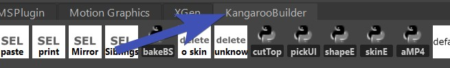
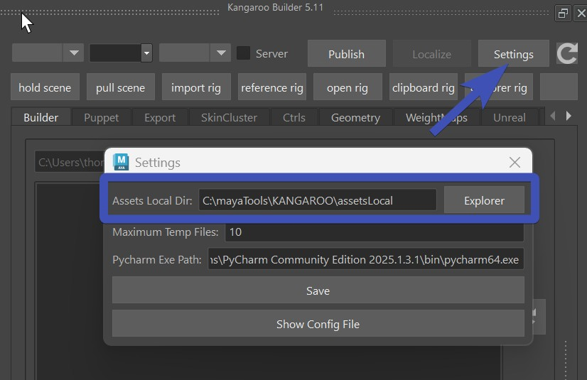
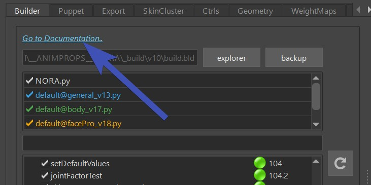
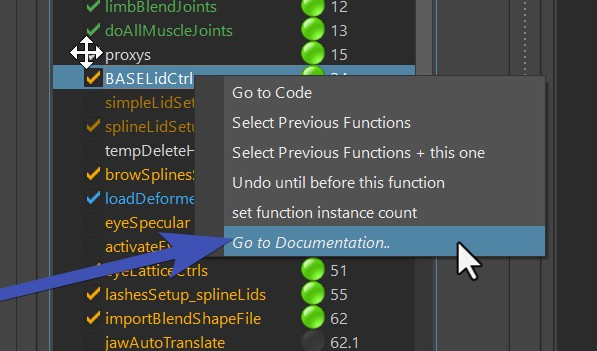
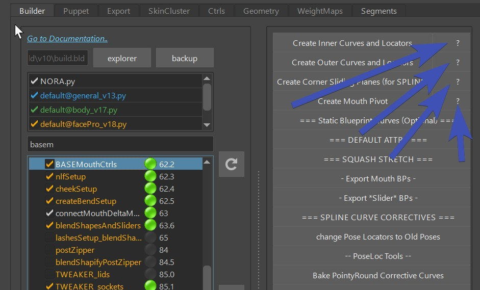
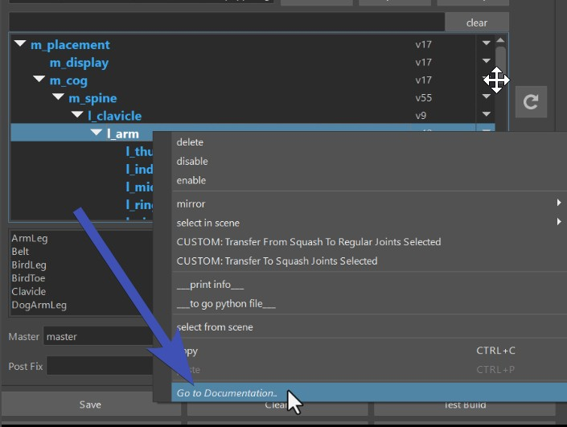
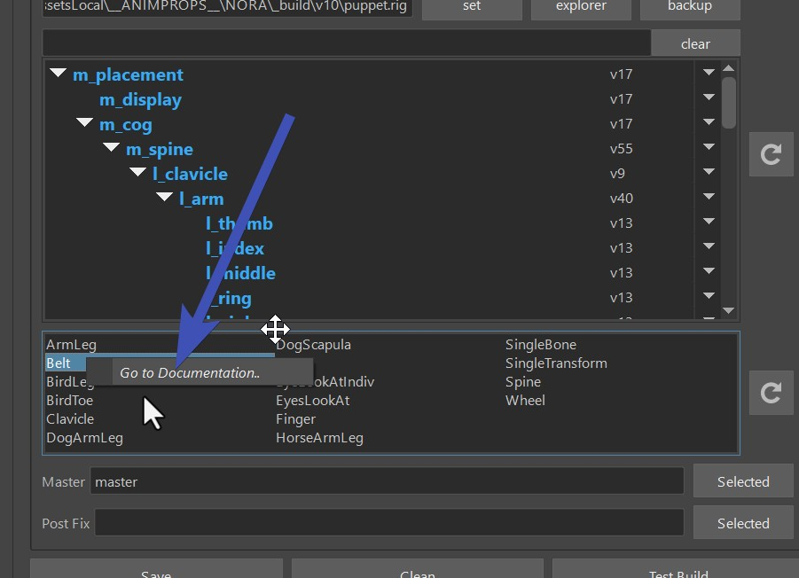
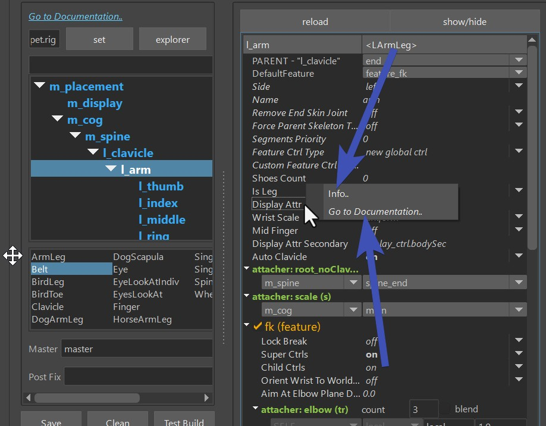

## Installation

1. Extract the zip file, and copy the content somewhere on disk.
2. Drag&Drop the **install.mel** file into Maya Scene View
3. You should see the new KangarooBuilder shelf already.
4. Restart Maya

This is the shelf that you should get (*KangarooBuilder*):  
  
If you don't have it by now, check in the script editor if you get any errors when dropping the *install.mel* file.   

Then to open the UI that has about 90 % of Kangaroo Tools, click  (UI)
on the very left of the *KangarooBuilder* shelf.

### Numpy
If you get an error that numpy is missing, you'll have to install numpy, too.
We do that with *pip install*.  

Here we'll explain how to do that in Windows. If you are on Linux or Mac it would be a bit different but similar.

Navigate to your maya installation folder, it will look something like this:
``` 
C:\Program Files\Autodesk\Maya2024\bin 
```
In there open a *Command Prompt* (either by right click, or type *cmd* in the address bar), and run
``` 
./mayapy.exe -m pip install ‐‐user numpy
```
!!! note
    If you get weird looking errors from *mayapy.exe*, try without the --user numpy flag

!!! info "video"
    If you are struggling with installing numpy, watch this video. In here we already have a Windows explorer open with
    the location of Maya:
    <video autoplay muted loop controls width="1170">
        <source src="../../images/gettingStarted_installNumpy.mp4" type="video/mp4">
        Your browser does not support the video tag.
    </video>

### Mac
If you are on a Mac, the mayapy location looks a bit more like this:
``` 
/Applications/Autodesk/maya2024/Maya.app/Contents/bin
```
And you run the mayapy without the *.exe*:
``` 
./mayapy -m pip install numpy
```

<!--
Another extra thing you have to do if you are on Mac is install **pyobjc**:
``` 
./mayapy -m pip install pyobjc
```
-->

### Linux

For some copy/paste options to work, you need to install *clip*:
``` 
sudo dnf install xclip
```


## The Directories

If you just want to use the SkinCluster/Geometry Tools or the Shape Editor or the Picker - you don't need to setup the directories.

But if you want to build characters, there's a little bit of more setup we have to do.

First of all you need to understand that Kangaroo is not just a Rigging Tool. It's a *Rigging Pipeline* that helps you also
increment/version your assets, and even backup and share with the team.    

!!! note
    If you work in a studio where they have their own studio pipeline, then Kangaroo is still another pipeline
    that runs parallel to the studio pipeline. You can set things up to connect to the studio pipeline
    at two points:

    1. grabbing the model from studio pipeline, and later
    2. publishing the actual rig into the studio pipeline

    For more detail see [Python - Connecting to Studio Pipeline](python/python2.md#connecting-to-studio-pipeline).

### AssetsLocal
First we need to create the AssetsLocal folder. It's the folder where you'll work. 
It can be anywhere on your disk drive and doesn't necessarily have to be shared with others. 
Just create an empty folder, and specify that by clicking on the **Settings** button, copy/paste it into
the *Assets Local Dir*, and click **Save**:  


**After changing the settings, Restart Maya.**

Then inside that new folder, let's create another empty folder for your project, and name it *\_\_MYPROJECT\_\_*
It's important that there are **2 underscores** before the name, and **2 underscores** after the name. 
And all has to be **UPPERCASE**.  
Without following those rules, Kangaroo won't recognize the folder as a project.

!!! note "Environment Variables"
    You could also specify the assestLocal path with the Environment Variable **KANGAROO_WORK_PATH**. This can be 
    useful if you are setting up kangaroo for a bigger rigging department

### Templates
To start creating characters, 99.95 % of the times you copy from an existing one and adjust.
And we usually grab one from the server. **Templates** is one server that comes with the tool, and has those assets:

- **BASEHUMAN**
- **BASEDOG** (digigrade quadruped - dogs, cats, ...)
- **BASEHORSE** (unguligrade quadruped - horses, deers, ..)
- **BASEMOUSE** (plantigrade quadruped - mouse, bears, ...)
- **BASEBIRD**
- **BASEPROP**
- **BASELEGOFIGURE**
- **THOMAS** (BlendShape driven Face Rig)

!!! note
    If you are rigging a bear, you may find that some types of bears are running on their front legs more like dogs 
    (digigrades). If you find that your bear is like this, you can replace the front legs with dogs leg. But before
    doing that, get familiar with the [Puppet Tool](puppet/puppetGeneral.md) first.

Let's go to the BASEHUMAN, and then in **Export -> NEW**, set the project and new asset name, and then click **Create**:

<video autoplay muted loop controls width="826">
    <source src="../../images/gettingStarted_createNewAsset.mp4" type="video/mp4">
    Your browser does not support the video tag.
</video>

!!! note "UPPERCASE/MixedCase"
    By default it's automatically converting the name to UPPERCASE. It's recommended that you keep it this way 
    since mixed casing can get ugly in one out of 100 times.
    Just imagine one person create *"MyCharacter"*, and one person creates *"myCharacter"*.  
    But if you need to match the name from a studio pipeline, you have the option to do the *dangerous* mixed cases name. 


### AssetsServer
At this point you could theoretically jump to the next tutorial and just start building characters.
But you have to setup the server at some point anyway, why not do it now.

You need a server location where you publish the characters to. And that is for one or two things:

1. Backup your work 
2. Sharing with the rigging team

The new server should be on another disk. It could be a folder setup-ed with Smartdrive from *Dropbox*, *Box* or *GoogleDrive*.
Or if you are working in a network, it can be a location on the network. 

!!! warning "Careful with Smart Drives"
    Smart Drives are trying to help you by keeping the file storage small - which makes the localizing unstable in some cases.
    Therefore If you use Smart Drives, it's best to manually make the version folder (e.g. *v3*) **available offline** before localizing. Otherwise
    he might not grab *all* the content without even telling you, and later you'll get confusing errors.   
    Or if you use *Box*, localizing might take a very long time without making it available offline first.
    Dropbox has been the most stable one so far. Actually with DropBox we don't usually do *available offline* before localizing, unless
    we've just added the folder to *synch* the last minutes.
    

If you don't have one yet, just create an empty folder again.
And after that, open the **pathEnv.mel** file with a text editor, and change the path after *default@* to be your server path.
Important: even in Windows, do not use **\\** for separating the folders, it all has to be **/**. 
```
putenv "KANGAROO_SERVER_PATH" "templates@./templates; default@C:/Users/thoma/Dropbox/assetsServer";
```
!!! note "Windows"
    If you copy/paste path in Windows, it'll do the wrong slash! So you have to replace all **\\** with **/**.

See how there's a *template* server defined? This is the template place where we copied character from before. Template is
another *server*.

!!! info "Environment Variables"
    The *pathEnv.mel* file is basically setting the Environment variable.
    If you are a Pipeline TD you might say this is dirty and messy. But no, this is just a simple way to get you started quickly.
    If you want to set the Environment Variables in a different way, just comment out those lines with //, and
    create the Environment variables wherever you prefer. There's even another file **example__Maya.env** where you can
    see how you would set it up in a *pipeline friendly* way


## Roadmap for First Character
Once you've setup-ed your directories and started the character with the **create NEW** tool (explained under [Templates](#templates) above), you are ready
to actually rig your character by following the points below!  

!!! note "Keep in Mind!"
    Always keep in mind that Kangaroo is a procedural tool where we don't 
    just work on a maya file and send that out when we are done.  
    Instead we work on the data that in the end creates the character with the *RunAll* button.

And generally don't get carried away with one maya scene for too long. Always just export and rebuild. And best regularly publish
your character so you can track things back easier whenever something's not working.

1. [Specify Your Model](builder/builderGeneral.md#importmodel)
2. [Place Blueprint Joints](puppet/puppetGeneral.md#change-the-guide-joint-locations)
3. Skin the Character, and [export weights](builder/builderGeneral.md#loaddeformers)
4. Shape the Ctrls, and [export them](builder/builderGeneral.md#loadctrlshapes)
5. When you click **RunAll** in the builder, you have your Rig.  

!!! success
    Congratulations, you finished your first Character! 

!!! question "But where's the Rig??"  
    After you've published, click the *Explorer Rig* button. 
       
    If you switch to the server with the *Server* checkbox, the *Explorer Rig* button would open the location
    on the server.


Keep in mind if you got until here, it means you still just scratched the surface of what you can do with Kangaroo. 
Best keep reading the documentation and see how you can improve your rig with what you've learend.


## You are not alone!
Whenever you get stuck, there's always the [Forum](https://kangaroobuilder.discourse.group/){target="_blank"}.

And there's the option of getting extra support - [info@kangaroobuilder.com](mailto:info@kangaroobuilder.com) 

Also - while working in Kangaroo, you'll see a lot of **"Go to Documentation.."** links, for example at the top 
of almost every tool:  
  

Many builder functions have it on right-click:  
  

Some builder buttons have those **?** buttons:  
    

When you right-click on the limbs:  
    

Even in the limbs library:  


And many puppet attributes have info on their right click:  
  

So yes, there's a lot to learn - but **you can do it!**


