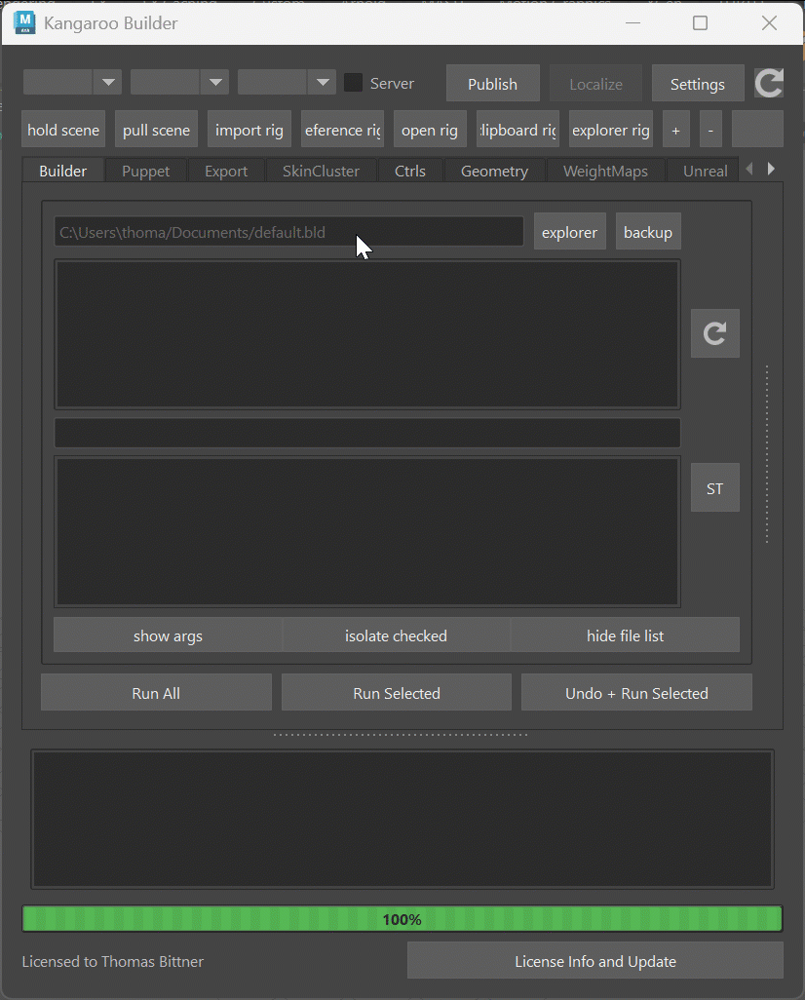

## Installation

1. Extract the zip file, and copy the content somewhere on disk.
2. Drag&Drop the **install.mel** file into Maya Scene View
3. You should see the new KangarooBuilder shelf already.
4. Restart Maya
`

If you get an error that numpy is missing, you'll have to install numpy, too.
We do that with *pip install*.  
Do the following thing in a CMD. You'll most likely have to  change the path on maya version or installation location)
And if you get weird looking errors, try without the --user numpy flag
```bash
cd C:\Program Files\Autodesk\Maya2024\bin 
mayapy.exe -m pip install ‐‐user numpy
```

If you just want to use the skinCluster/geometry tools or the shape editor - you are done at this point.


## The Directories

First of all you need to understand that Kangaroo is not just a Rigging Tool. It's a **Rigging Pipeline** that helps you also
increment/version your assets, and even backup and share with the team.    
If you work in a studio where they have they own pipeline, then Kangaroo is still its own pipeline
that runs parallel to the studio pipeline. Basically you can set things up to connect to the studio pipeline
at two points:

1. grabbing the model from studio pipeline, and later
2. publishing the actual rig into the studio pipeline

But how to do that is explained in **Python**

### AssetsLocal
First we need to create the AssetsLocal folder. It's the folder where you'll work. 
It can anywhere on your disk drive that don't don't necessarily share with others. Just create an empty folder, and specify that in the settings  

Then inside that new folder, let's create another empty folder for your project, and name it \_\_MYPROJECT\_\_
It's important that there are **2 underscores** before the name, and **2 underscores** after the name. 
And all has to be UPPERCASE.  
Without following those rules, Kangaroo won't recognize the folder as a project


### Templates
To start creating characters, 99.95 % of the times you copy from an existing one and adjust.
And we usually grab one from the server. **Templates** is one server that comes with the tool, and has those assets:

- BASEHUMAN
- BASEDOG (digigrade quadruped - dogs, cats, ...)
- BASEHORSE (unguligrade quadruped - horses, deers, ..)
- BASEMOUSE (plantigrade quadruped - mouse, bears, ...)
- BASEBIRD
- BASEPROP
- BASELEGOFIGURE

Let's go to the BASEHUMAN for example, and then in **Export -> NEW**, set the project and new asset name, and then click **Create**

By default it's doing UPPERCASE. It's recommended that you keep it this way since mixed casing can get uncomfortable in one out of 100 cases.
Just imagine two people create the same asset name but different casings ;-)
But if you need to match the name from a studio pipeline, you have the option to do the *dangerous* mixed cases name 


### AssetsServer
At this point you could theoretically jump to the next tutorial and just start building chaeracters.
But you have to setup the server at some point anyway, why not do it now.

You need a server location where you publish the characters to. And that is for one or two things:

1. Backup your work 
2. Sharing with the rigging team

The new server should be on another disk, that could be a folder setup-ed with Smartdrive from Dropbox, Box or GoogleDrive.
The most stable with previous tests has been Dropbox.
Or if you are working in a network, it can be a location on the network. 

If you don't have one yet, just create an empty folder again.
And after that, open the **pathEnv.mel** file with a text editor, and change the path after *default@* to be your server path.
Important: even in Windows, do not use **\\** for separating the folders, it all has to be **/**. If you
copy/paste path in Windows, it'll do the wrong one and you'll have to fix that.
```bash
putenv "KANGAROO_SERVER_PATH" "templates@./templates; default@C:/Users/thoma/Dropbox/assetsServer";
```
See how there's the *template* server before? Yes, you remember it correctly, the template place where we copied character from before
is another server!

Also - the *pathEnv.mel* is basically setting the Environment variable.
If you are a Pipeline TD you might say this is dirty and messy. But no, this is just a simple way to get you started quickly.
If you want to set the Environment Variables in a different way, just comment out those lines with //, and
create the Environment variables wherever you prefer. There's even another file **example__Maya.env** where you can
see how you would set it up in *the usual* way


## Roadmap for First Character
Once you've setup-ed your directories and started the character with the **create NEW** tool, it's best to just read
through the [Builder Basics](builder/builderBasics.md) and [Puppet Basics](puppet/puppetBasics.md) documentations. You can skip things under *Advanced* for now,
but the other content needs to be understood. Otherwise you'll either get stuck quickly or just won't be able to use the tool
efficiently.  
After you've read through those two pages you can follow this roadmap below. And after each step make sure to build the
whole character and see what you get. It needs to be understood that Kangaroo is a procedural tool where we don't 
just work on a maya file and send that out when we are done.  
Instead we work on the data that in the end creates the character with the *RunAll* button.

1. [Specify Your Model](builder/builderBasics.md#importmodel)
2. [Place Blueprint Joints](puppet/puppetBasics.md#change-the-guide-joint-locations)
3. Skin the Character, and [export weights](builder/builderBasics.md#loaddeformers)
4. Shape the Ctrls, and [export them](builder/builderBasics.md#loadctrlshapes)
5. When you click **RunAll** in the builder, you have your Rig.  

!!! success
    Congratulations! You finished your first Character :-) 

Keep in mind if you got until here, it means you still just scratched the surface of what you can do with Kangaroo. 
Best keep reading the documentation and see how you can improve your rig with what you've learend.
