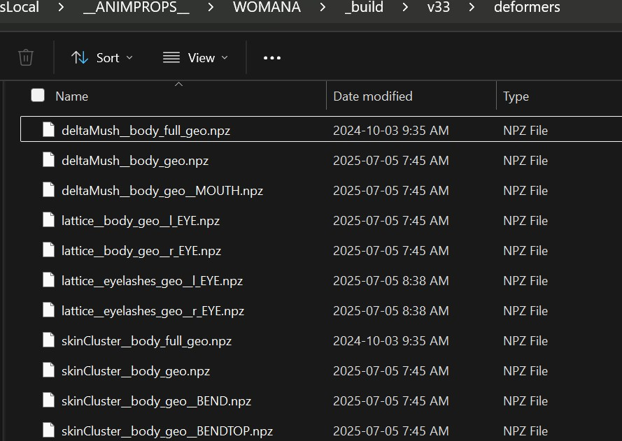
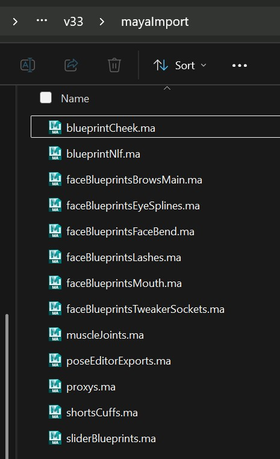

Kangaroo has lots of good tools for dealing with model changes. It's best to be familiar with all of them,
so that in every situation you can decide which ones to use.

## Same Topology - Different shape
When the topology and proportions are the same, things are relatively easy.

*LoadDeformer()* will load the files without issues since (by default) it's just loading by vertex order.     
But blendShapes, such as in ShapeEditor or PoseEditor need some attention.
### Same Topology - PoseEditor
See [Pose Editor Model Update](body/poseEditor.md#model-change)  
You might be able to use the *blendShape* option. But if not - the *warp* option should work just fine, too.
### Same Topology - Shape Editor model update
Select the mesh in the meshes table -> add model update
### Same Topology - Other Target geos 
Any other mesh you can just warp with the **Geometry -> Warp Pose**

## Topology change
### Topology change - loadDeformers()
In the *loadDeformers()* function, set the  *bWorldSpaceIfNotMatching* flag to *True*. This will check on each file
if the topology changed. And if it did, it'll load it by worldspace. It can do that because at the time it exported the weights,
it also added some geometry data into the weights file.  
After the function was running, it's best to re-export the weights. If unsure which meshes got worldspace transferred,
go to **Export -> Deformers -> Select Changed Meshes**.
!!! tip
    You can also leave this attribute at *True*. It'll only do worldSpace transfer if the topology changed. 
    In older Kangaroo versions it was inconvenient to leave it as *True*, because it was easy to overlook the model change.
    But in the latest version on some situations (like the *newScene()* function or puppet *clean* button) it'll remind you 
    that it transfered the weights by asking you if you want to save the weights.

### Topology change - PoseEditor
See [Pose Editor Model Update](body/poseEditor.md#model-change)  
The *warp* option will do the trick here. 
!!! note
    In some cases when meshes got split into more meshes, you may have to do a few different hacks such as using the
    [TOOLS -> wrap](body/poseEditor.md#useful-tools) option 

### Topology change - Shape Editor
This is a bit of a manual hack, but not too bad:  
Also explained: [Pose Editor Model Update](body/poseEditor.md#model-change)

### Topology change - Other Target geos 
Any other mesh you can just warp with the **Geometry -> Warp Pose**

### Topology change - Custom Attachers 
Custom attacher setups in the Puppet tool should be fine in most cases. Unless you specified a vertex.  
More infos on [Custom Attachers](puppet/puppetGeneral.md#attachers)
!!! warning
    It's easy to forget adjusting the vertex id! You'll know if later some ctrls suddenly fly around when you rotate some irrelevant ctrl.

## Different Mesh Names
### Different Mesh Names - change deformer files
Very often the fastest thing is to change the names of the files in the deformer folder. Because those files contain
the geometry name and the *loadDeformers()* function grabs the model from those names.

The names of the files consist of 2 or 3 parts, separated by double underscores (\_\_). And the second part is the mesh name.  
So for example if the mesh got changed from *body_geo* to *torso_geo*, the file *deltaMush__body_geo__MOUTH.npz* needs to be changed to
*deltaMush__torso_geo__MOUTH.npz*

!!! warning
    Don't confuse the double underscore (\_\_) with the single underscore (\_)! They might look the same at first glance, but 
    confusing them can lead to trobules quickly.

### Different Mesh Names - Load Best Fitting SkinClusters
If you have a character with a ton of different meshes, and suddenly all their names and topologies changed -> just use 
**Export -> DeformerImport -> Load Best Fitting SkinClusters**

### Different Mesh Names - Custom Attachers
If you've used the custom attachers in the puppet tool, that's also a bit more manual setup at this point. 
You could open the puppet.rig file and text/replace if you are careful.

### Different Mesh Names - Face Rig
If you have a face rig more manual setup inside the build folder functions, adjusting names etc.
So on a mesh that has the Face Rig, it's best to pray that modeling doesn't decide to change the name. 

## Different Proportions
### Different Proportions - warpXForms
For different proportions you'll need to adjust the blueprints in the **puppet** tool.  
If the topology is the same, you could additionally use the **geometry -> warpXforms** tool to just warp all the 
blueprints. This is useful if the whole character change quite a bit in proportions   
!!! tip
    This can also be a very useful tool if you are creating a new character with same topology but different proportions.
There's a short video on LinkedIn that demonstrates it:  
<a href="https://www.linkedin.com/posts/thomas-bittner-6bb6302_this-is-the-tool-i-use-for-warping-guide-activity-7221427670796910594-lcWI?utm_source=share&utm_medium=member_desktop&rcm=ACoAAABy3u8BK03tH_Bovh-T4-W99NGXldU3f_g" 
target="_blank">LinkedIn Post on warpXForms</a>

### Different Proportions - Shape Editor
More complex, it's like creating a new character - check [Shape Editor](face/shapeEditor.md#transfer-to-new-character)

### Different Proportions - Face
And then basically every blueprint group in the mayaImport folder needs to be warped to the new mesh.

## Maya Import Folder
It's also good practise to go through all the files in the *mayaImport* folder and check one by one to see which needs to get updated.  
Especially when you've created a Face Rig, you might have a few files in there!  

