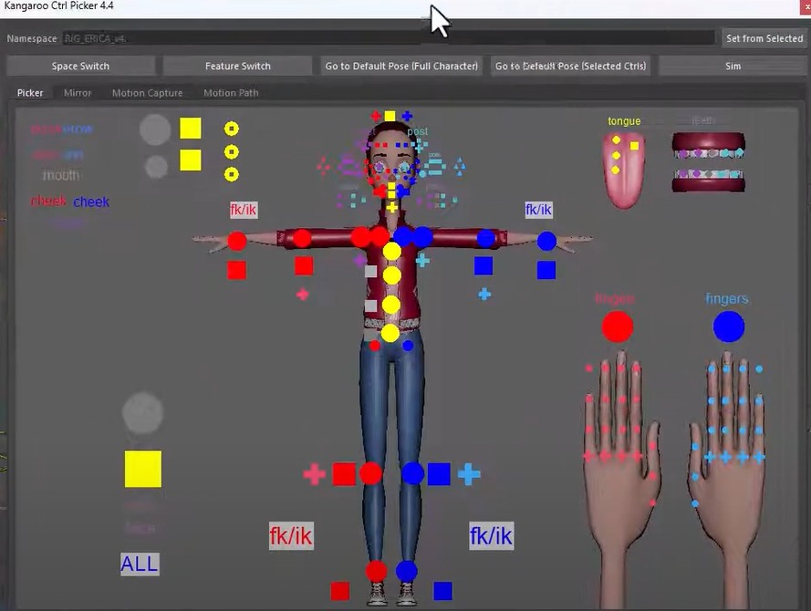
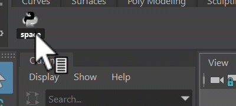
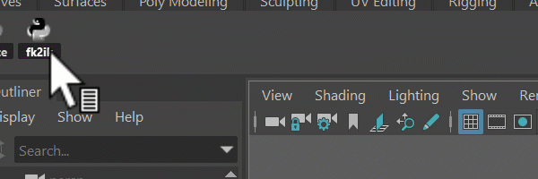

This is an animation tool that can do stuff like:

- select ctrls
- fk2ik switch
- space switch
- mirror ctrl poses/animations
- Biped Motion Capture
- Motion Path (experimental)

## For Animators..

  

!!! video
    The best way to see how it works is watching the first 1min 45seconds from this [video](https://www.youtube.com/watch?v=5W2JQYoyohQ)
    from the start.


### Fk2Ik Switch
!!! video
    Whatch it in the video from [here](https://www.youtube.com/watch?v=5W2JQYoyohQ&t=1m14s)
!!! note "Isolated Menu"
    If you just want this switch without the whole UI, that's possible and you can see [here](#isolated-menus) how it looks.


### Space Switch
The space switch button can help animators to switch between spaces. 
!!! video
    Whatch it in the video from [here](https://www.youtube.com/watch?v=5W2JQYoyohQ&t=1m18s)
!!! note "Isolated Menu"
    If you just want this switch without the whole UI, that's possible and you can see [here](#isolated-menus) how it looks.

### Mirror 
!!! video
    Watch how to mirror ctrl poses or animation [here](https://www.youtube.com/watch?v=5W2JQYoyohQ&t=1m32s)


## For Riggers..
Riggers mainly need to create the *elements* and *jpg* files.
Watch the video from [here](https://www.youtube.com/watch?v=5W2JQYoyohQ&t=1m47s) to see how to do that.


### Custom Picker File Location
In the video we are just putting the picker files into the tool directory. While that's totally valid, sometimes you might
want to put them into a different location.  
Use the Environment Variable **KANGAROO_PICKER_PATH** to specify a different path.


### More picker tabs per character
This feature was added recently, that's why it's not shown in the video yet.  
By default (as shown in the video) you just have 1 pair of files, such as:  
```
mainCharacter.elements
mainCharacter.jpg
```
But you can add an extra one, for example like this:
```
mainCharacter.elements
mainCharacter.jpg
mainCharacter_face.elements
mainCharacter_face.jpg
```
And then you'll have 2 picker tabs for that character.


### Isolated Menus
Sometimes animators don't want the whole UI, but they just want some menus. Below are some python codes that you can 
for example add to a shelf button. I'll then open small switch menus from those buttons.

**Switching Spaces:**   
To get this menu, run the python lines below:  

```python 
import kangarooAnimation.KangarooMatchTools as KangarooMatchTools; 
KangarooMatchTools.spaceSwitchMenu()
``` 

**Switching between Fk and Ik:**  
  
Run those lines to get that menu:  
```python 
import kangarooAnimation.KangarooMatchTools as KangarooMatchTools; 
KangarooMatchTools.humanLimbsSwitchMenu()
```

### Tool Installation
The tool is installed by default if you've installed Kangaroo-Builder as shown in the [Getting Started](installation.md) page
(The first part is enough - no need to setup things like assetsLocal or servers).
Animators can just open it from the same install that you have.  

But in case they don't have access to it, all you need to give them is the **kangarooAnimation** folder.  

This folder is isolated and is not linking to any other libraries.

If animators have that folder sourced, they can open the UI with those Python lines:
```python
import kangarooAnimation.KangarooAnimTool as KangarooAnimTool; 
KangarooAnimTool.showUI(False)
```
Or they can run the lines shown in [Isolated Menus](#isolated-menus) 


