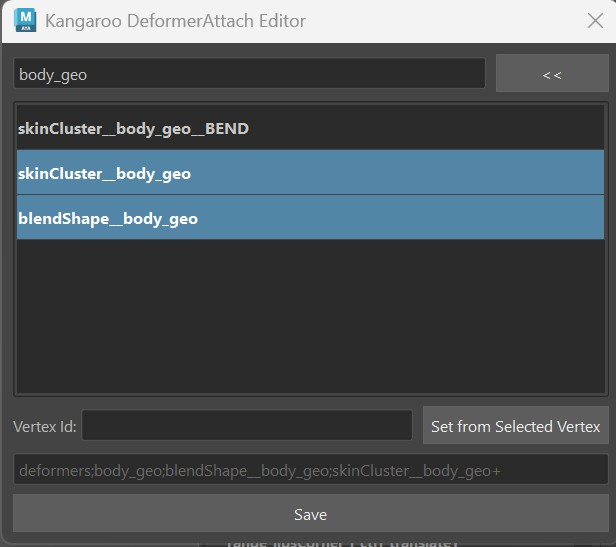
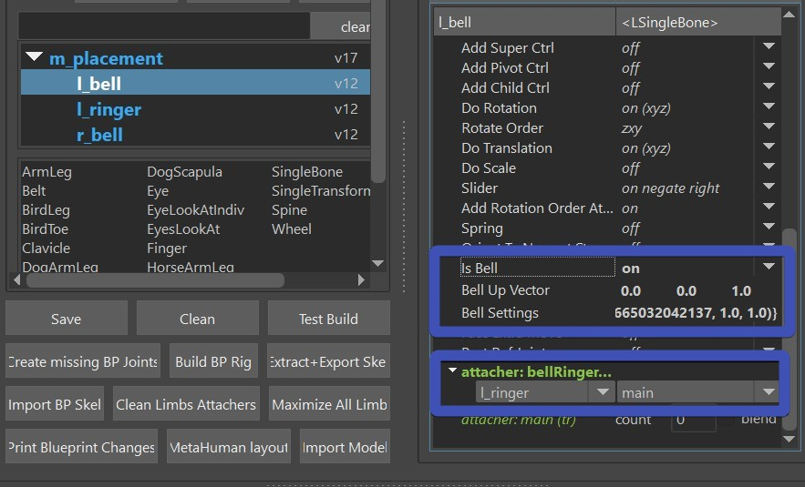
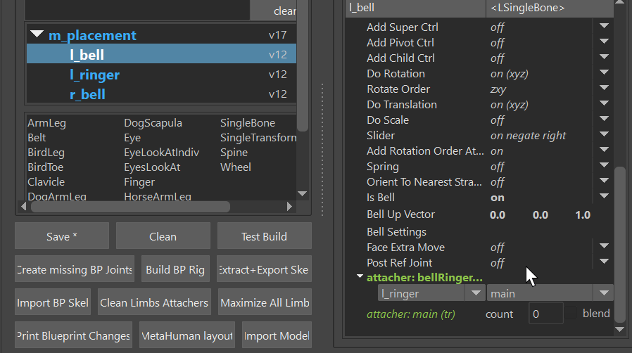

# Puppet

Puppet is the second most important tool for building characters. It defines the main
ctrls of the character, such as spine logics, arm/leg FK/IK, Auto Clavicle, etc.
The puppet generates the blueprints.ma file (guide joints) and the puppet.rig - which then the builder uses to build the rig.

Let's look at all the cool elements in the UI:

The first table shows the **Limbs**, and below is the **Library**. You can just drag a limb from the 
library into the Limbs. And whatever limb you have selected, you can adjust the limb attributes on the right side

# Change the Guide Joint Locations
To change the Locations, click in this order:  
1. Clean  
2. Import BP Skeleton    
3. Build BP Rig  

You'll do those things a million times, so I just did a GIF for you to show it :-)

Basically the **BP Skeleton** is a file with simple joints. And the **BP Rig** is a small rig
build on top of those Skeleton that helps you place it. 

Once you have the BP Rig built, place the joints using the ctrls. 

When you are done, click the button **Extract+Export Skel**.  
Theoretically it also lets you export without building the BP Rig.
**But never export without building the BP Rig!**  
**And also never open the previous BP Rig and export from there!**  
I can talk for an hour to explain why those are bad things, but here I'll keep it simple: Don't Do It!

You can however move around the joint roots inbetween importing BP Skeleton and building BP Rig. 

Now let's look at some of the important Limbs. Below you'll see a lot of videos. 
Keep in mind those videos are from 2022, but 95 % of those workflows is still the same today
Just make sure to read the text here to see what changed.

# The Limbs

## Spines, Cables, Tails, Straps, Pony Tails...
We use the **Spine Limb** for all of these things. 
<iframe width="560" height="315"
src="https://www.youtube.com/embed/kEA6R8v1gDk"
title="YouTube video player" frameborder="0"
allow="accelerometer; autoplay; clipboard-write; encrypted-media; gyroscope; picture-in-picture"
allowfullscreen></iframe>

## ArmLeg Limb
<iframe width="560" height="315"
src="https://www.youtube.com/embed/BLg9ajB2rzU"
title="YouTube video player" frameborder="0"
allow="accelerometer; autoplay; clipboard-write; encrypted-media; gyroscope; picture-in-picture"
allowfullscreen></iframe>
update 0: Round Elbow got removed  
update 1: For placing the pivot blueprints (legPrintLFT_ctrl, legOutBLFT_ctrl, legToesLFT_ctrl,…) 
it’s easier to do that in the blueprint skeleton and and build the blueprint rig on top

## Attachers
Attachers are all about spaces. Something like Hand IK follow the COG or the Spine. And it comes 
with a few different options. Like you can either have a switch or a blend. Or you can choose to
have just orientation, orientation+translation, or orientation and translation separately.
And there's an animation tool that lets the animators switch between the spaces (attachers) easily without changing the pose.

<iframe width="560" height="315"
src="https://www.youtube.com/embed/8mK2lHDqR7c"
title="YouTube video player" frameborder="0"
allow="accelerometer; autoplay; clipboard-write; encrypted-media; gyroscope; picture-in-picture"
allowfullscreen></iframe>
update 0: To specify deformers/meshes for custom attachers, click the “Attach Deformers UI” 
option on the same marking menu. And make sure you exclude deformers that are driven by this limb 

In this UI you can even specify a Vertex Id of where it should get attached. It's better to 
leave it empty at first and let it find the closest vertex by itself. But in 1 out of 20 
cases it doesn't find a nice vertex, then you can set one.
Also, keep in mind that when you test build the character, it won't attach it yet, the actual attachment
is happening later in the *puppetCustomAttachment()* function

## Single Limbs
<iframe width="560" height="315"
src="https://www.youtube.com/embed/8g4ZYgOeuzg"
title="YouTube video player" frameborder="0"
allow="accelerometer; autoplay; clipboard-write; encrypted-media; gyroscope; picture-in-picture"
allowfullscreen></iframe>

## Belt Limb
<iframe width="560" height="315"
src="https://www.youtube.com/embed/1BAzckDbrBE"
title="YouTube video player" frameborder="0"
allow="accelerometer; autoplay; clipboard-write; encrypted-media; gyroscope; picture-in-picture"
allowfullscreen></iframe>

# Advanced
## Bell Collider
The **singleBone** limb comes with a Bell Collider. Bell Collider looks like dynamics but it's really just
interactive angle calculations. It works great for short pants. 
  
While it looks great in the video, it does
come with the disadvantage that he can only handle cylinders. Those can be scaled, and translated and rotated though.
And with some multiply attributes you can specify it to be weaker in either front, back or on the sides.

It's quick to setup. Just add a singleBone limb, declare it as a bell with the **isBell** attribute, and
define the **ringer** in the attacher below. The ringer in this case is another *singleBone* limb that is 
located close to the bell. And the ringer itself doesn't need any extra settings. Actually it doesn't even know that 
it's a ringer. We just named it ringer.  
  
The **Bell Up Vector** is an important attribute to know about. Keep it at default (0,1,0) at first, but if it's flipping 
strangely as you rotate the limb up 90 degrees, try setting it to (0,0,1) instead  
The **Bell Settings** is the translate/rotate/scale/multiply attributes on the cylinders. But those are being
set automatically when right-clicking on the limb: **Custom: Store Bell Settings**   

TIP: Sometimes you might feel like the bell joint jumps a bit too quickly as the ringer touches it. 
To fix that it can help a lot to setup the bell's attacher to move slightly with the ringer by around 50 % .

## Dynamics
These Limbs come with a Spring attribute.

 * singleBone    
 * singleTransform    
 * spine (fk)    

## Tweaker Ctrls
Tweaker Ctrls are ctrls that follow your current setup, and then deform the mesh with an additional skinCluster.  

This is with the **postRefJoints** attributes.

##display_ctrl
All template charcacters have that display_ctrl, which animators can use to turn on/off ctrls from all the limbs.
To specify which limbs belongs to which tag, just set the displayAttr attribute that every limb has.
Some like the ArmLeg even come with an extra displayAttrSecondary one.
Tip: When you do the face later, in the face functions you can see the sDisplayAttr atttribute on many of the 
face setup functions
