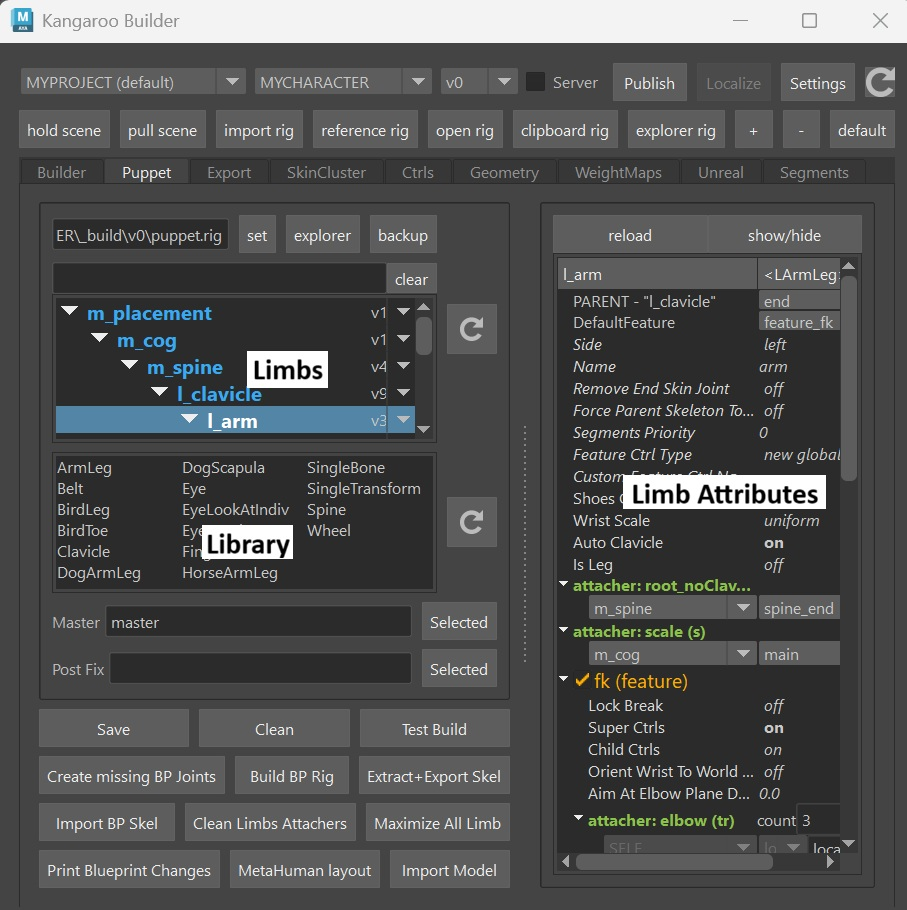
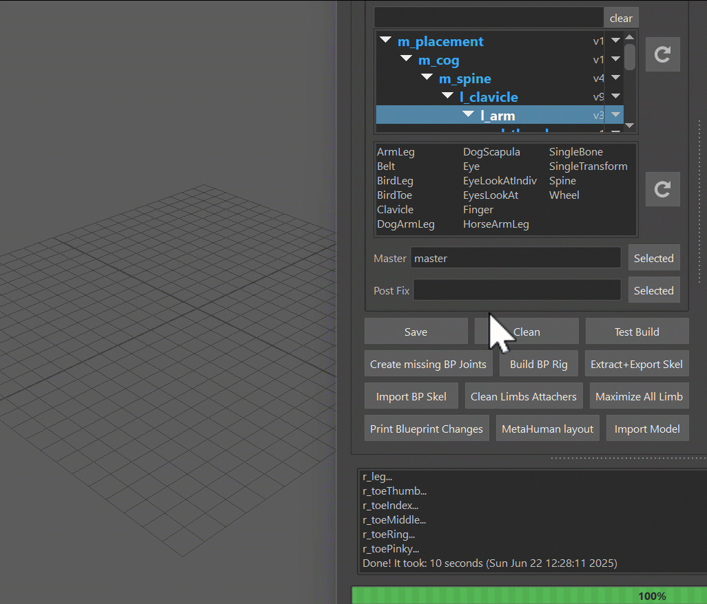

# Puppet

Puppet is the second most important tool for building characters. It defines the main
ctrls of the character, such as spine logics, arm/leg FK/IK, Auto Clavicle, etc.
The puppet generates the blueprints.ma file (guide joints) and the puppet.rig - which then the builder uses to build the rig.

Let's look at all the cool elements in the UI:

The first table shows the **Limbs**, and below is the **Library**. You can just drag a limb from the 
library into the Limbs. And whatever limb you have selected, you can adjust the limb attributes on the right side

## Change the Guide Joint Locations
To change the Locations, click in this order:  
1. Clean  
2. Import BP Skeleton    
3. Build BP Rig  

You'll do thoes things a million times, so I just did a GIF for you to show it :-)

Basically the **BP Skeleton** is a file with simple joints. And the **BP Rig** is a small rig
build on top of those Skeleton that helps you place it. 

Once you have the BP Rig built, place the joints using the ctrls. 

When you are done, click the button **Extract+Export Skel**.  
Theoretically it also lets you export without building the BP Rig.
**But never export without building the BP Rig!**  
**And also never open the previous BP Rig and export from there!**  
I can talk for an hour to explain why those are bad things, but here I'll keep it simple: Don't Do It!

You can however move around the joint roots inbetween importing BP Skeleton and building BP Rig. 

Now let's look at some of the important Limbs. Below you'll see a lot of videos. 
Keep in mind those videos are from 2022, but 95 % of those workflows is still the same today
Just make sure to read the text here to see what changed.

## Spines, Cables, Tails, Straps, Pony Tails...
We use the **Spine Limb** for all of these things. 
<iframe width="560" height="315"
src="https://www.youtube.com/embed/kEA6R8v1gDk"
title="YouTube video player" frameborder="0"
allow="accelerometer; autoplay; clipboard-write; encrypted-media; gyroscope; picture-in-picture"
allowfullscreen></iframe>

## ArmLeg Limb
<iframe width="560" height="315"
src="https://www.youtube.com/embed/BLg9ajB2rzU"
title="YouTube video player" frameborder="0"
allow="accelerometer; autoplay; clipboard-write; encrypted-media; gyroscope; picture-in-picture"
allowfullscreen></iframe>
update 0: Round Elbow got removed  
update 1: For placing the pivot blueprints (legPrintLFT_ctrl, legOutBLFT_ctrl, legToesLFT_ctrl,…) 
it’s easier to do that in the blueprint skeleton and and build the blueprint rig on top

## Attachers
Attachers are all about spaces. Something like Hand IK follow the COG or the Spine. And it comes 
with a ton of options. Like you can either have a switch or a blend. And there's an animation tool
that lets the animators switch between the spaces (attachers) easily without changing the pose.

<iframe width="560" height="315"
src="https://www.youtube.com/embed/8mK2lHDqR7c"
title="YouTube video player" frameborder="0"
allow="accelerometer; autoplay; clipboard-write; encrypted-media; gyroscope; picture-in-picture"
allowfullscreen></iframe>
update 0: To specify deformers/meshes for custom attachers, click the “Attach Deformers UI” 
option on the same marking menu. And make sure you exclude deformers that are driven by this limb
