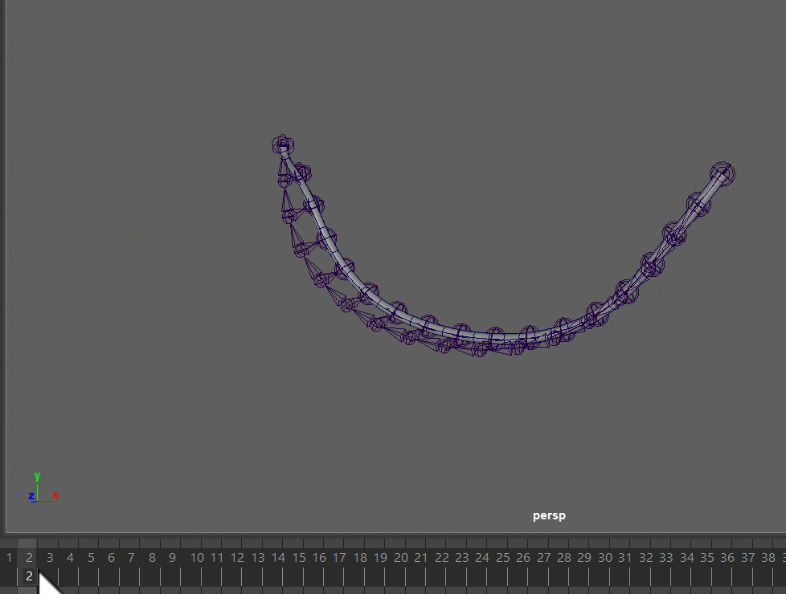

# <!-- dummy title to prevent auto-generated one-->

There's 2 options - **Springs** and **Dynamics**.

| Springs                                                               | Dynamics                                                                |
|-----------------------------------------------------------------------|-------------------------------------------------------------------------
| Expressions                                                           | hairSystem                                                              |
| SingleBone, SingleTransform and Spine (fk, fkSpline)                  | only Spine (Advanced section)                                           |
| Controls top groups of the Ctrls                                      | Is running at the end, before the Squash Joints                         |
| Easier to tweak with stiffness and damping                            | Has a ton of attributes that are tricky to tweak for specific behaviors |
| Only FKs                                                              | Can do Spine FK and IK, can even have the end point locked              |


## Springs
The following limbs come with a **Spring** attribute:

 * singleBone    
 * singleTransform    
 * spine (fk, fkSpline)

They work with a very basic spring equation done with Expressions:
```
Acceleration = (Target - Position) * STIFFNESS - Velocity * DAMPING
Velocity += Acceleration
```
*STIFFNESS* and *DAMPING* are the attributes that are exposed and can be tweaked, even by animators.   
For tweaking those values, it's best to first keep them the same value, and try variations from 0-1.   
*STIFFNESS* is how fast it comes back (stronger values = coming back quicker)  
*DAMPING* is how loose it is (weaker values = looser)  

## Dynamics {#spine-dynamics}
The Spine limb also has Dynamics attribute in the **advanced** section, which is using **hairSystem** under the hood.  
Can give great results, too. But trickier to tweak the behavior. 

!!! tip
    You can still tweak that behavior, but it's more advanced. You'll have to find the hairSystem node and in there
    you can find all the attributes. You could even setup collisions for that.

Here we attach both end points. 
  

