This document gives you an overview about all the limbs that are there.

## SingleTransform/SingleBone
The most simple limbs are the **SingleTransform** and **SingleBone**. They are really just simple one ctrl limbs. Here's a few examples we use them for:  

- placement_ctrl (*SingleTransform*)
- cog_ctrl (*SingleTransform*)
- head_ctrl (*SingleBone*)
- jaw_ctrl (*SingleBone*)

You have a quite a lot of options about how much translation, rotation and scale values you want to expose. And also if you want pivot ctrls or super ctrls.

!!! warning
    Be careful with the Scale options. If this limb has child limbs, it's not good to expose all or some scale axes, since 
    scaling things non-uniformely will not pass well onto the other child limbs.  
    So whenever you have child limbs, either switch between **off** or **uniform**. And if you do need to expose all
    or some scale axes, make sure that limb doesn't have any child limbs.

They also have some more advanced features of *singleTransform/singleBone*, but those are discussed in other documents: 
[Bell Collider](bellCollider.md), [Springs](dynamics.md#springs), [Feature Ctrls](tweakerCtrls.md)  

## Spine

The **Spine Limb** is probably the most multifunctional limb.
While we use it - as the name suggests - we also use it every time we have a simple FK chain.

<!--, Cables, Tails, Straps, Pony Tails... -->

*Fk* and *fkSpline* come with some dynamic options. But those are discussed in [Dynamics](dynamics.md).

### Blueprint Attributes
There's 2 attributes - the *blueprint joint count* and the *blueprint joint count*.   
It's best to start with setting them the same value, so you can control where which joint is.
But there's 2 situations where you'd want to make the blueprint count lower:  

- Your spine joint count is very high (> 8) and you just don't want to take care of so many blueprint joints  
- You want to quickly add more spine joints without having to go into the blueprints

### Blueprint Curve
For the blueprints we usually do joints. But the *Spine* has the option of doing a curve instead of joints.
Just switch the **Blueprints Curve** attribute to **on**. When you create the blueprint skeleton and the curve 
is created, the cv count will be the *Blueprint Count*.  
This will give you 2 curves. One for the joint locations, and the other one for the up vectors.
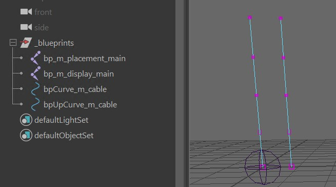
!!! warning
    Do not neglect the Up Curve! Is this is not laid out around the main curve in a clean way, you'll get twist issues.

!!! tip
    If you have long cables, don't don't lay out the curves manually since it'd take you a long time. Instead try this
    trick first:  
    

### fk
Let's start with the simplest case. Just some completely unfancy fk ctrls.  
It's actually the default. Just leave all other features (in orange) unchecked, and only 
the *fk (feature)* activated:  
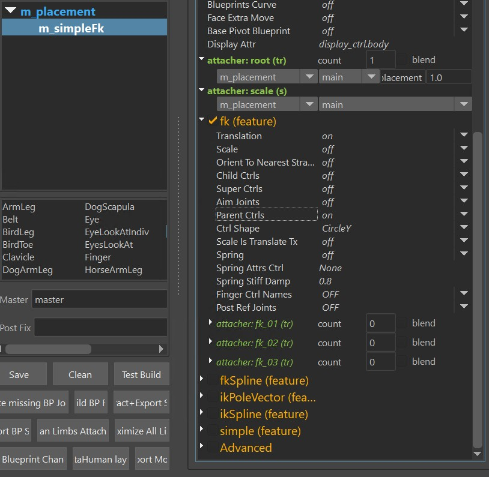  

It gives you those ctrls:  
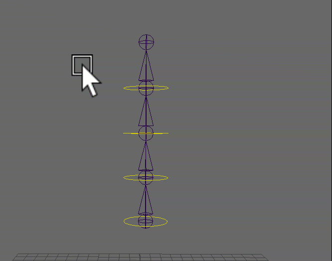  

!!! tip
    For the simple fk, it's recommended to keep *blueprint joint count* and *blueprint joint count* as
    the same number, so you can specify exactly where the joints and ctrls should be. 

### fkSpline
Many times we want to have more joints for better deformations, but keep the ctrl count low. Then it would 
make sense to switch to fkSpline:    
  

#### fkSpline - Add Remove Ctrls {#fksplineaddremovectrls}
Adding/Removing ctrls and changing their locations works with the **ctrl percs** attribute. To add more
you first have to resize the attribute. First thing after that you'll notice that it's just adding 0s at
the end. But you can fix that by just right click again and *interpolate*
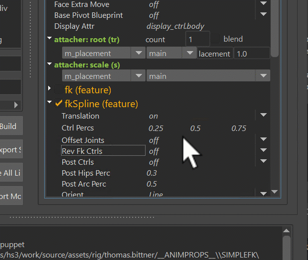  
!!! note
    There's always one ctrl at 0.0, which is not shown in the list. So if the list shows 3 ctrls, it's building
    4 ctrls because of the additional one at the beginning.
!!! tip
    Make sure to also try the **interpolate, more on end (square)** option on the right click menu. 
    This places more ctrls towards the end. Very often animators want more ctrls towards the tip of 
    the tongue or tail for example.    
    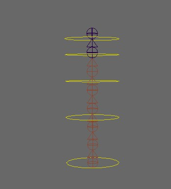  

#### fkSpline - Rev Ctrls
Animators sometimes want this on the torso:  
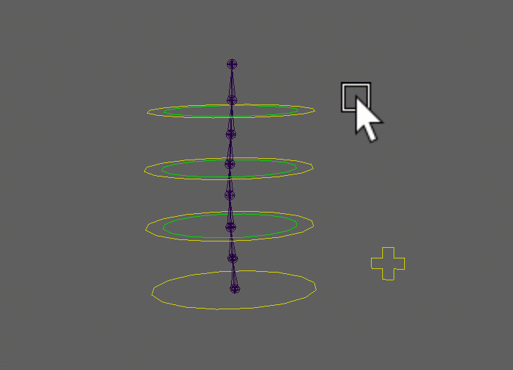  

#### fkSpline - Tweaker Ctrls
!!! note 
    This is NOT [Puppet Tweaker Ctrls](tweakerCtrls.md) or [Face Tweaker Ctrls](../face/faceTweakerCtrls.md). The only common
    thing it has with those is that it runs on top of another setup.
Those ctrls run on top of main ctrls and rev ctrls. 
  
!!! tip
    The bottom square ctrl can be used for the hips especially in cartoony characters. But not always! 
    In many cases it's better to add the hips as a separate *singleTransform* or *singleBone* limb at the bottom.  
    

#### fkSpline - stretchMode {#fksplinestretchmode}
The *stretchMode* attribute specifies how the joints should be aligned onto the curve.  
The options are:  

- spline ik
- curveInfo nodes (soft twist)
- curveInfo nodes (rigid twist)
- motionPath nodes (soft twist)
- motionPath nodes (rigid twist)

*Spline ik* is using the maya spline ik, which comes with extra *minStretch* and *maxStretch* values. This is very important 
for realistic creatures where you need to have the torsos keep their lengths:  
   
!!! warning
    *Spline Ik* does NOT have stable twist values! When you use that mode, you'll have to turn on the *Ctrl Twist* in the 
    [*Advanced*](#advanced) section

**CurveInfo nodes** is using the *pointOnCurveInfo* nodes, and the **motionPath nodes** are using the *motionPath* nodes. CurveInfo nodes
is faster and should be used in 95 % of the cases. But motionPath gives better distribution in some cases.
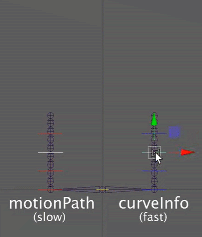  

The difference between **soft twist** and **rigid twist** is that for *soft* it's creating a curve for the twisting, while for the rigid twist
it's just finding the upvector points by interpolating some offset vectors.  
Rule of thumb is always use *rigid twist* first. And if it's giving you weird behavior, try *soft twist*

!!! note
    In 99 % of the cases the twisting should be ok with either soft or rigid. If you hit that one percent where the twist is still 
    behaving strangly, try switching the *up axis* from [0,1,0] to [0,0,1]

#### fkSpline - preIk
PreIk is creating some ctrls that are manipulating the FK Ctrls.  
    
!!! tip
    This is mainly for speed optimizations on Biped Torsos. The torso in general is a bottle neck because not much can get calculated at the same time.
    If on Bipeds animators want IK spine, in the past we would have always added ikSpline feature. And it would still be a valid approach, 
    but creating the preIk spine has better performance since instead of creating extra blendable joint splines it's just manipulating the
    root ctrls (fkSpline main ctrls).  
    Other bonus you get from this is that animators can still utilize the *rev ctrls*.
    

### ikSpline
*ikSpline* has some similarities to the *fkSpline*, with the main difference that it's ik   
    

!!! tip
    As mentioned above - if you are creating a torso rig, consider just sticking with fkSpline and *preIk*, since in many cases that would be better for performance. 

#### ikSpline - add/remove ctrls
Adding/removing and positioning of ctrls is happening with the *Ctrl Percs* attribute.  
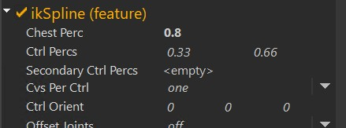
You can adjust it the same way as the *Ctrl Percs* [fkSpline](#fksplineaddremovectrls)

#### Chest
If *Chest Perc* is at 1.0, there's no chest, and the top ctrl is called *spineTopIk_ctrl*. If you give chest a lower value, 
for example 0.8 - the top ctrl is then called *spineChestIk_ctrl*, and the lower ctrls are compressed between 0 and 0.8:  
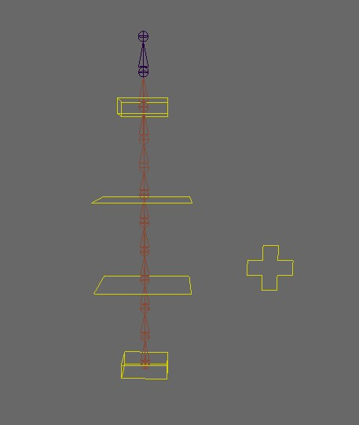     

#### ikSpline - stretchMode
*stretchMode* behaves the same as on [fkSplines](#fksplinestretchmode)

### Advanced
If you turn on the *Advanced* checkbox at the bottom, you'll get those extra squash joints:   
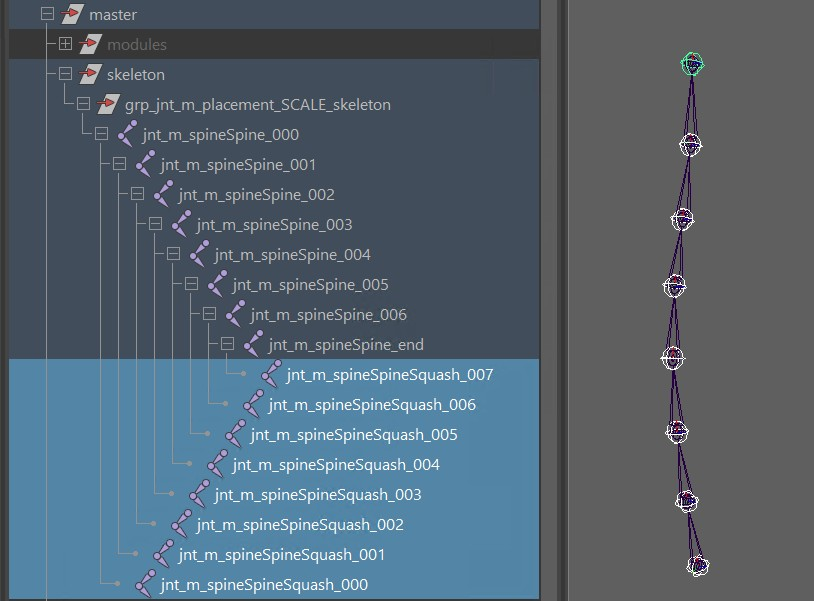    
This give you a few more options:  

- adjust the **orientation mode** (if you used *spline Ik* as *stretch mode*)
- give animators the power to **scale the joints with the ctrls**
- add some extra [**Dynamics**](dynamics.md#spine-dynamics) that run after the animation 
- **distribute the orientations** of the joints to behave more stable on fat characters

Most of it should be self explanatory, except **distribute orientations** deserves a bit more attention.

#### distribute orientations for fat characters
See how how on the side the cubes of the spine are crashing with each others? It's because the joints
are just orientating based on the ctrls around them. And the wider the bellies are in relation to their heights,
the stronger the crashing will be.  
The solution is *distribute orientations*, which assigns a new orientation to those joints that is blending between
bottom and top ctrls of the spine:  
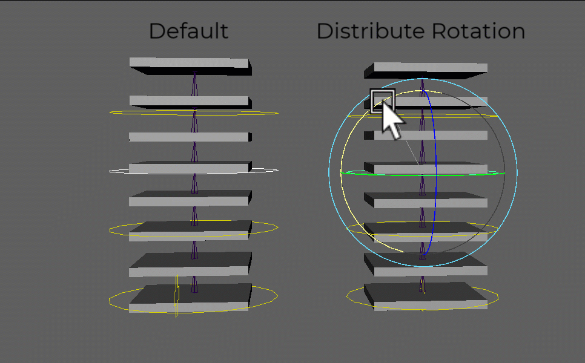
!!! tip
    You have two attributes on each squash joint to fine tune that behavior:  
    

#### skinning the squash joints 
If you already skinned the character, and you turned on the *Advanced* checkbox later, you can easily transfer the 
skinning to those squash joints by selecting the meshes and right click option:  
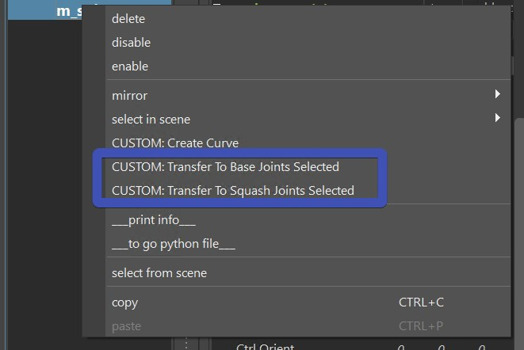

The Kangaroo Skinning Tools (*Flood*, *Move*, ..) come with another extra feature that other skinning tools don't give you:  
Have you ever noticed how generally binding to closest doesn't find the closest point per distance to the actual joint, but instead 
to the *bone*, which is the line between the joint and the child? And you might assume that you won't get that feature here
because those squash joints don't have child joints?  
Well, no - those squash joints have a hidden attribute (*"skinParent"*) that make sure that the kangaroo skinning tools
treat them as the main joints that have proper child joints.

## ArmLeg

## Belt

## *Custom Limbs*
Yes, you can define Custom Limbs. It's rare that we need to do that since the existing ones have a lot of options,
and additional features might be easier to handle by just adding additional functions.  
But if you do want to go into detail and make your own limb, you can find how to do that [here](../python.md#custom-limbs)

!!! warning
    A decent Python level is required for creating Custom Limbs! Before writing your own custom limb it's recommended to see if you can 
    solve it with simple [Python Functions](../python.md#simple-way-of-adding-a-function)