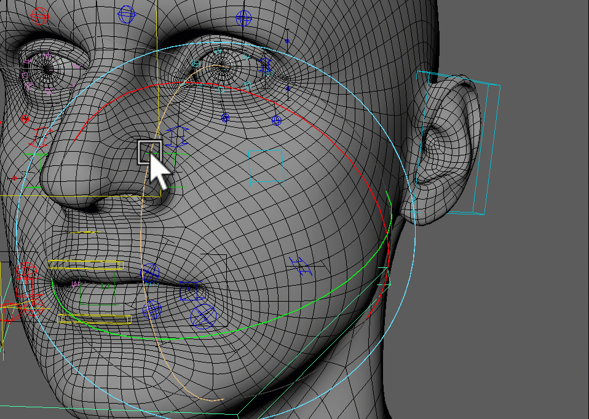
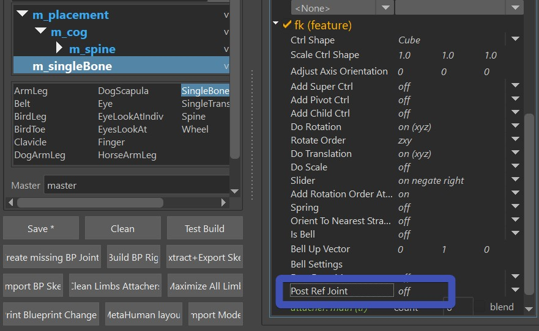
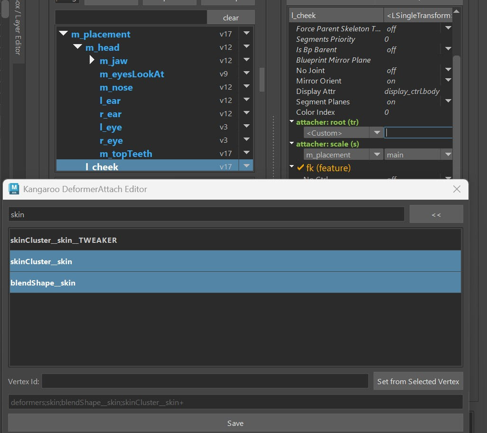
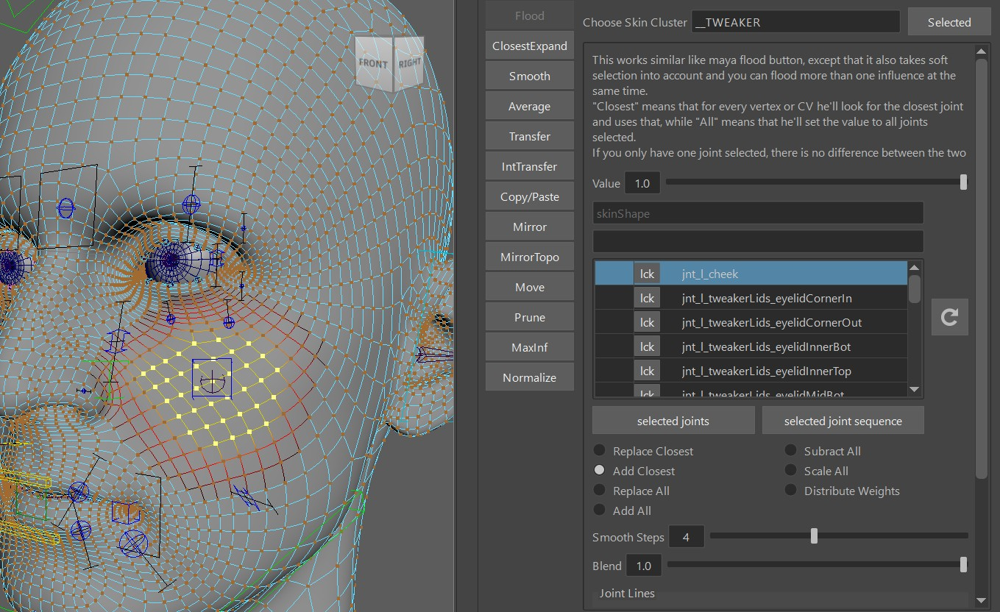
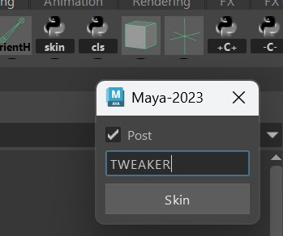
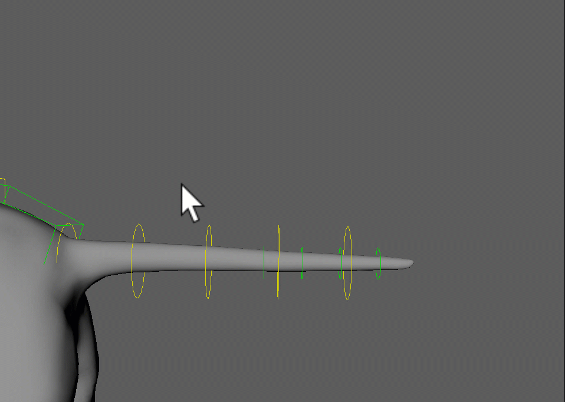
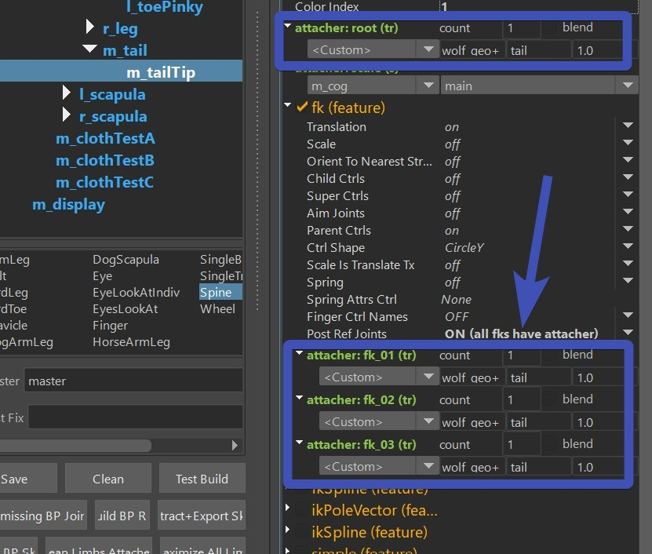

Tweaker Ctrls are ctrls that follow your current setup, and then deform the mesh with an additional skinCluster.  
In this example the Cube Ctrl is a tweaker, that follows the previous skinCluster and blendShape setup, but
on top of that deforms the mesh with an additional skinCluster.
   

!!! Info
    Later in the Face you'll learn about [Face Tweaker Ctrls](../face/faceTweakerCtrls.md), those are similar logic like this. So if you are planning
    to set some up for the face, it's recommended to check if those are already taken care in the Face Tweaker Ctrls

## How to set it up

### Add the limb

The following limbs can work as Tweaker Limbs:

 * singleBone    
 * singleTransform    
 * belt
 * spine (fk, ikSpline, simple)

The first thing is to activate the **postRefJoints** attribute. In all limbs it's under the feature, 
usually located at the bottom:  
   

### Custom Attacher
Then we have to setup the *Attachers*, usually with the 
[Custom](puppetGeneral.md#custom-attachers) option.
   
The deformers you select there are crucial. Select all the deformers that the tweaker ctrl should follow.  
But absolutely do NOT select the skinCluster that the tweaker ctrl will be driving, otherwise you'd get a 
cycle!

And don't forget the blueprints.

### SkinCluster
After you've built everything - for skinning you need to bind it with an additional skinCluster that has
a suffix, in this example we use the TWEAKER skinCluster:   
     
If you don't have an additional skinCluster with a suffix yet, create one by selecting the mesh and clicking
the **skin** shelf button. In that UI make sure you activate *Post*:    
     

## Advanced - Stacking them {#advancedstackingthem}
In our example the cheeks are not following anything in the TWEAKER skinCluster. But in some cases you want
the Tweaker Ctrl to follow some other Tweaker Ctrls that are already there.  
To solve that, we add more tweaker skinClusters and stack them:   
Basically for the first skinCluster, in the *Attach DeformerUI* you only specify the blendShape and main Skincluster.
Then in the second one you add the main skinCluster plus the first tweaker skinCluster etc.
 
!!! warning
    It's very easy to run into cycles here. But it's also easy to avoid that, just be aware that the tweaker joints
    MUST NOT drive any skinCluster that is specified in the attacher. Even just small weights cause a cycle
    and make the whole rig unstable.

!!! note 
    On some complex characters you might end up with five or even more stacked skinClusters:  
          

!!! tip
    Keep in mind you can always group some tweakers into one skinCluster to keep the number of skinClusters low. You just
    have to be aware that tweakers inside a skinCluster can't affect each others.

## Advanced - Spine Tweakers
With the spine you can also do some tweaker fk setup that runs on top of another setup:  
  
It works with the **fk**.  
And you have to set the custom attachers on *ALL* (*root*, *fk_xx*), and for the *PostRefJoints* option you specify
**ON (all fks have attacher)**

!!! note
    This can also work well on the face for cartoony dog noses. But since you'll have a few more deformers there already, you'll
    have to be very confident with how to [stack them](#advancedstackingthem)

